# 管理后台

<cite>
**本文引用的文件**
- [apps/server/src/index.ts](file://apps/server/src/index.ts)
- [apps/server/src/db/schema.ts](file://apps/server/src/db/schema.ts)
- [apps/server/src/middleware/auth.ts](file://apps/server/src/middleware/auth.ts)
- [apps/server/src/routes/admin.ts](file://apps/server/src/routes/admin.ts)
- [apps/server/src/routes/upload.ts](file://apps/server/src/routes/upload.ts)
- [apps/web/src/App.tsx](file://apps/web/src/App.tsx)
- [apps/web/src/layouts/AdminLayout.tsx](file://apps/web/src/layouts/AdminLayout.tsx)
- [apps/web/src/pages/admin/Dashboard.tsx](file://apps/web/src/pages/admin/Dashboard.tsx)
- [apps/web/src/pages/admin/SoftwareCategories.tsx](file://apps/web/src/pages/admin/SoftwareCategories.tsx)
- [apps/web/src/pages/admin/SoftwareItems.tsx](file://apps/web/src/pages/admin/SoftwareItems.tsx)
- [apps/web/src/pages/admin/HelpCategories.tsx](file://apps/web/src/pages/admin/HelpCategories.tsx)
- [apps/web/src/pages/admin/HelpDocuments.tsx](file://apps/web/src/pages/admin/HelpDocuments.tsx)
- [apps/web/src/pages/admin/Users.tsx](file://apps/web/src/pages/admin/Users.tsx)
- [apps/web/src/lib/auth.tsx](file://apps/web/src/lib/auth.tsx)
- [apps/web/src/lib/api.ts](file://apps/web/src/lib/api.ts)
</cite>

## 目录
1. [简介](#简介)
2. [项目结构](#项目结构)
3. [核心组件](#核心组件)
4. [架构总览](#架构总览)
5. [详细组件分析](#详细组件分析)
6. [依赖关系分析](#依赖关系分析)
7. [性能考量](#性能考量)
8. [故障排查指南](#故障排查指南)
9. [结论](#结论)
10. [附录](#附录)

## 简介
本文件为 ZBH2 管理后台的综合功能文档，面向管理员与技术读者，系统性阐述登录后可使用的功能模块：系统管理、内容管理、用户管理、软件与文档管理、激活码与发放、工单与审计、资产与云服务、运维监控等。文档同时解释管理仪表板设计理念与数据可视化方案，详述软件分类与条目的 CRUD 操作、排序与发布状态管理、版本控制思路；说明帮助文档的分类管理与生命周期（发布/回收）；提供用户管理的完整流程（创建、角色分配、启用/禁用、密码重置）；解释文件上传管理的实现、存储策略与安全考虑；并给出权限控制机制与最佳实践。

## 项目结构
管理后台采用前后端分离架构：
- 前端 Web 应用基于 React + Ant Design，路由通过 AdminLayout 统一导航，页面组件覆盖各类管理功能。
- 后端服务基于 Fastify，注册认证、静态资源、限流、CORS、Helmet 等插件，并按模块划分路由（admin、upload、auth 等）。
- 数据层使用 Drizzle ORM + SQLite，定义了用户、会话、软件、文档、激活码、工单、资产、SaaS、监控、审计等表结构。

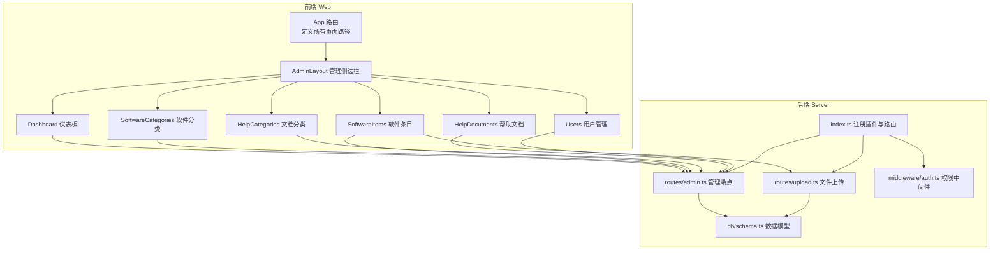

图表来源
- [apps/web/src/App.tsx:38-79](file://apps/web/src/App.tsx#L38-L79)
- [apps/web/src/layouts/AdminLayout.tsx:88-127](file://apps/web/src/layouts/AdminLayout.tsx#L88-L127)
- [apps/server/src/index.ts:29-49](file://apps/server/src/index.ts#L29-L49)
- [apps/server/src/routes/admin.ts:15-279](file://apps/server/src/routes/admin.ts#L15-L279)
- [apps/server/src/routes/upload.ts:14-63](file://apps/server/src/routes/upload.ts#L14-L63)
- [apps/server/src/db/schema.ts:1-330](file://apps/server/src/db/schema.ts#L1-L330)

章节来源
- [apps/web/src/App.tsx:38-79](file://apps/web/src/App.tsx#L38-L79)
- [apps/server/src/index.ts:29-49](file://apps/server/src/index.ts#L29-L49)

## 核心组件
- 权限中间件与会话加载：负责从 Cookie 中读取会话 ID，校验过期与用户状态，注入当前用户信息到请求上下文，并提供 requireAdmin 针对管理端点进行鉴权。
- 管理端路由：统一挂载 preHandler 为 requireAdmin，提供软件分类/条目、帮助分类/文档、激活产品/码、用户、文件列表等管理接口。
- 文件上传路由：仅管理员可上传文件，写入本地存储目录，计算哈希，记录文件元数据至数据库。
- 前端布局与导航：AdminLayout 提供菜单分组与权限跳转，Dashboard 展示关键指标卡片。
- 页面组件：分别实现软件分类/条目、帮助分类/文档、用户管理的增删改查与状态切换。

章节来源
- [apps/server/src/middleware/auth.ts:17-56](file://apps/server/src/middleware/auth.ts#L17-L56)
- [apps/server/src/routes/admin.ts:15-279](file://apps/server/src/routes/admin.ts#L15-L279)
- [apps/server/src/routes/upload.ts:14-63](file://apps/server/src/routes/upload.ts#L14-L63)
- [apps/web/src/layouts/AdminLayout.tsx:88-127](file://apps/web/src/layouts/AdminLayout.tsx#L88-L127)
- [apps/web/src/pages/admin/Dashboard.tsx:8-47](file://apps/web/src/pages/admin/Dashboard.tsx#L8-L47)

## 架构总览
管理后台遵循“前端路由 + 后端 API”的清晰边界：
- 前端通过 axios 发送带凭据的请求，后端通过中间件拦截并注入会话用户，再根据路由处理业务逻辑。
- 所有管理端点均受 requireAdmin 保护，非管理员无法访问。
- 文件上传采用流式写入与哈希校验，结合数据库记录，便于后续去重与溯源。

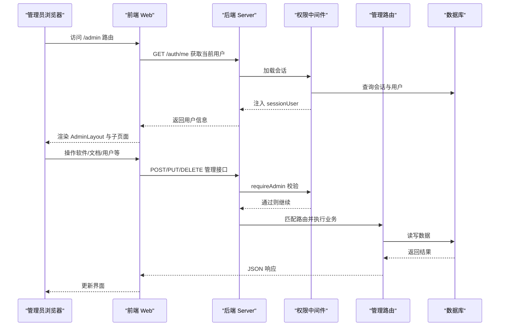

图表来源
- [apps/web/src/lib/auth.tsx:24-33](file://apps/web/src/lib/auth.tsx#L24-L33)
- [apps/web/src/lib/api.ts:3-16](file://apps/web/src/lib/api.ts#L3-L16)
- [apps/server/src/middleware/auth.ts:17-56](file://apps/server/src/middleware/auth.ts#L17-L56)
- [apps/server/src/routes/admin.ts:15-279](file://apps/server/src/routes/admin.ts#L15-L279)

## 详细组件分析

### 管理仪表板（Dashboard）
- 设计理念：以卡片统计展示关键指标，快速掌握系统运行态势。
- 数据可视化：通过并行请求聚合软件数量、文档数量、激活码总量、用户数量，渲染为统计卡片。
- 交互：首次进入自动拉取数据，无分页与筛选，适合概览。

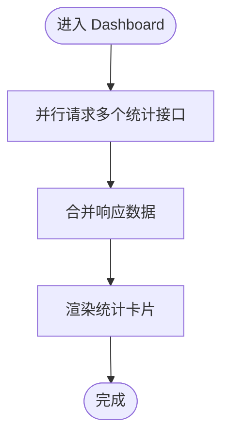

图表来源
- [apps/web/src/pages/admin/Dashboard.tsx:11-25](file://apps/web/src/pages/admin/Dashboard.tsx#L11-L25)

章节来源
- [apps/web/src/pages/admin/Dashboard.tsx:8-47](file://apps/web/src/pages/admin/Dashboard.tsx#L8-L47)

### 软件分类管理（SoftwareCategories）
- 功能：CRUD 操作，支持排序字段控制显示顺序。
- 表单：名称必填，排序默认 0，支持编辑与删除。
- 列表：展示 ID、名称、排序，提供编辑与删除按钮。

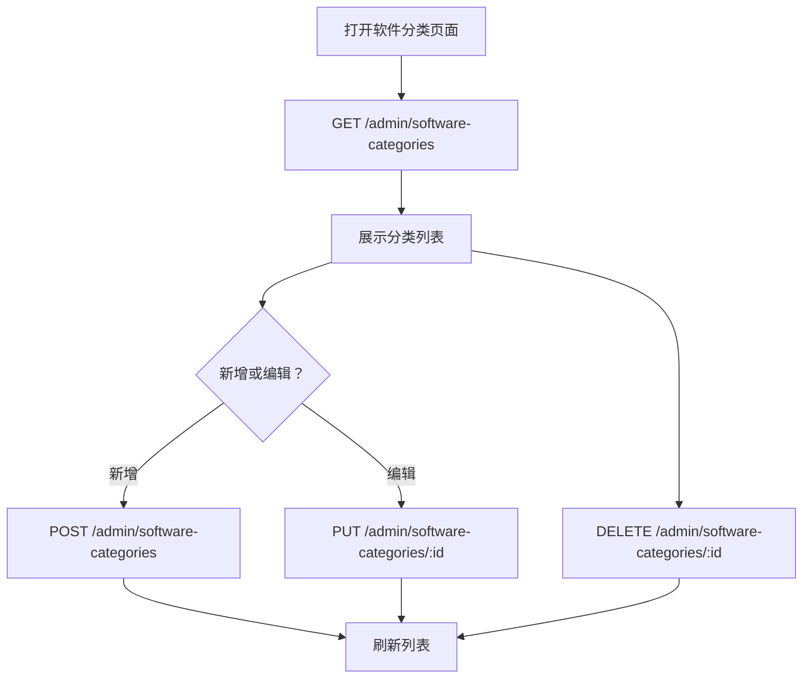

图表来源
- [apps/web/src/pages/admin/SoftwareCategories.tsx:12-34](file://apps/web/src/pages/admin/SoftwareCategories.tsx#L12-L34)
- [apps/server/src/routes/admin.ts:18-43](file://apps/server/src/routes/admin.ts#L18-L43)

章节来源
- [apps/web/src/pages/admin/SoftwareCategories.tsx:6-70](file://apps/web/src/pages/admin/SoftwareCategories.tsx#L6-L70)
- [apps/server/src/routes/admin.ts:18-43](file://apps/server/src/routes/admin.ts#L18-L43)

### 软件条目管理（SoftwareItems）
- 功能：CRUD、排序、发布状态、版本号、图标与安装包关联。
- 文件上传：通过自定义上传处理器调用 /admin/upload，返回文件记录后回填到条目。
- 列表：展示标题、分类、版本、排序、状态（草稿/已发布），提供编辑与删除。
- 状态管理：草稿可发布，已发布可回收为草稿。

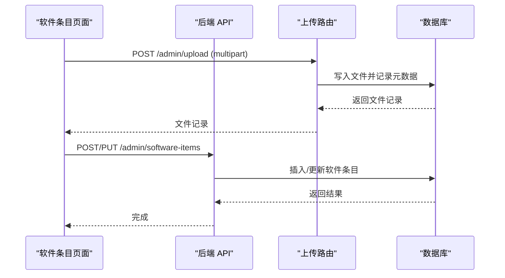

图表来源
- [apps/web/src/pages/admin/SoftwareItems.tsx:25-53](file://apps/web/src/pages/admin/SoftwareItems.tsx#L25-L53)
- [apps/server/src/routes/upload.ts:14-49](file://apps/server/src/routes/upload.ts#L14-L49)
- [apps/server/src/routes/admin.ts:45-73](file://apps/server/src/routes/admin.ts#L45-L73)

章节来源
- [apps/web/src/pages/admin/SoftwareItems.tsx:6-118](file://apps/web/src/pages/admin/SoftwareItems.tsx#L6-L118)
- [apps/server/src/routes/admin.ts:45-73](file://apps/server/src/routes/admin.ts#L45-L73)
- [apps/server/src/routes/upload.ts:14-49](file://apps/server/src/routes/upload.ts#L14-L49)

### 帮助文档分类管理（HelpCategories）
- 功能：CRUD、排序。
- 表单：名称必填，排序默认 0。
- 列表：展示 ID、名称、排序，提供编辑与删除。

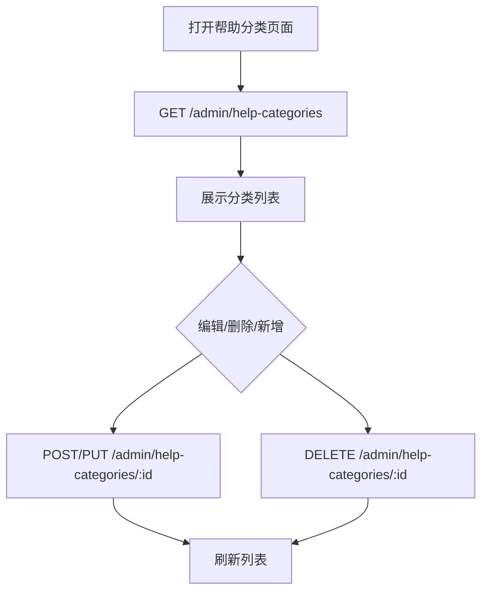

图表来源
- [apps/web/src/pages/admin/HelpCategories.tsx:12-34](file://apps/web/src/pages/admin/HelpCategories.tsx#L12-L34)
- [apps/server/src/routes/admin.ts:75-100](file://apps/server/src/routes/admin.ts#L75-L100)

章节来源
- [apps/web/src/pages/admin/HelpCategories.tsx:6-70](file://apps/web/src/pages/admin/HelpCategories.tsx#L6-L70)
- [apps/server/src/routes/admin.ts:75-100](file://apps/server/src/routes/admin.ts#L75-L100)

### 帮助文档管理（HelpDocuments）
- 生命周期：草稿 → 发布（记录发布时间） → 回收（记录归档时间）。
- 状态切换：在界面上直接发布/回收/恢复草稿。
- 列表：展示标题、分类、排序、状态标签，提供编辑与删除。

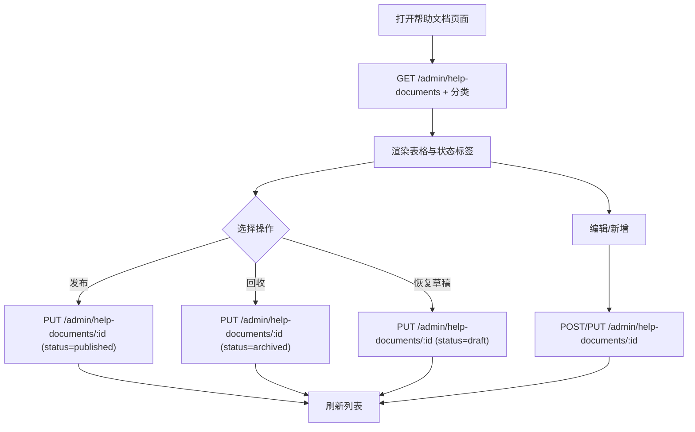

图表来源
- [apps/web/src/pages/admin/HelpDocuments.tsx:19-53](file://apps/web/src/pages/admin/HelpDocuments.tsx#L19-L53)
- [apps/server/src/routes/admin.ts:102-134](file://apps/server/src/routes/admin.ts#L102-L134)

章节来源
- [apps/web/src/pages/admin/HelpDocuments.tsx:12-112](file://apps/web/src/pages/admin/HelpDocuments.tsx#L12-L112)
- [apps/server/src/routes/admin.ts:102-134](file://apps/server/src/routes/admin.ts#L102-L134)

### 用户管理（Users）
- 功能：创建用户（用户名唯一）、编辑角色/状态/密码、删除用户（不可删除自身）。
- 密码：新增时要求最小长度；编辑时留空表示不修改。
- 列表：展示用户名、角色、状态、创建时间，提供编辑与删除。

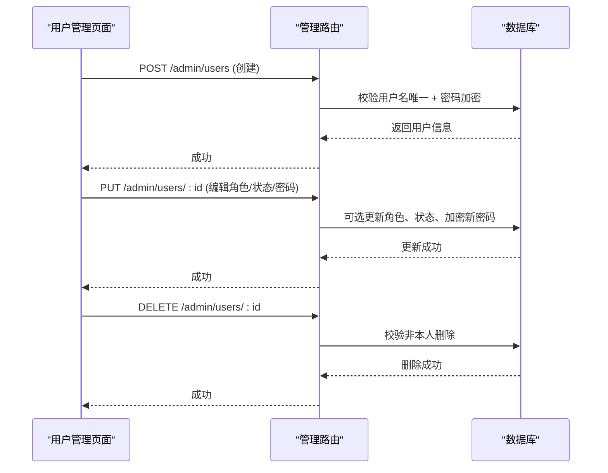

图表来源
- [apps/web/src/pages/admin/Users.tsx:18-42](file://apps/web/src/pages/admin/Users.tsx#L18-L42)
- [apps/server/src/routes/admin.ts:221-271](file://apps/server/src/routes/admin.ts#L221-L271)

章节来源
- [apps/web/src/pages/admin/Users.tsx:6-90](file://apps/web/src/pages/admin/Users.tsx#L6-L90)
- [apps/server/src/routes/admin.ts:221-271](file://apps/server/src/routes/admin.ts#L221-L271)

### 文件上传管理（Upload）
- 存储策略：服务端固定上传目录，文件名使用随机 ID，保留原扩展名；同时计算 SHA-256 哈希用于重复检测与完整性校验。
- 安全考虑：仅管理员可上传；上传接口限制大小；下载接口通过数据库记录的原始文件名与 MIME 类型设置响应头。
- 流程：接收流式数据，写入磁盘，入库记录，返回文件 ID 供其他实体引用。

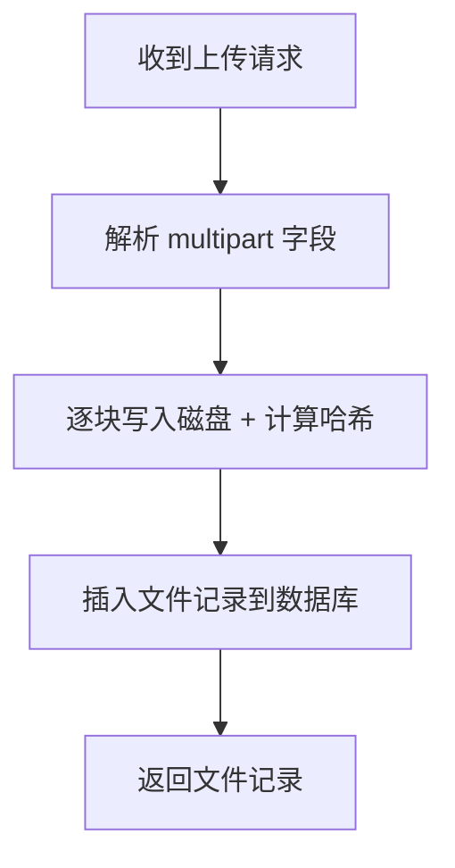

图表来源
- [apps/server/src/routes/upload.ts:14-49](file://apps/server/src/routes/upload.ts#L14-L49)

章节来源
- [apps/server/src/routes/upload.ts:14-63](file://apps/server/src/routes/upload.ts#L14-L63)

### 权限控制机制
- 会话加载：从 Cookie 读取 sid，查询有效且未过期的会话，匹配状态为“启用”的用户，注入到请求上下文。
- 管理端点：统一在路由层挂载 requireAdmin，若非管理员则返回 403。
- 前端导航：AdminLayout 在加载时校验用户角色，非管理员自动跳转登录页并携带重定向地址。

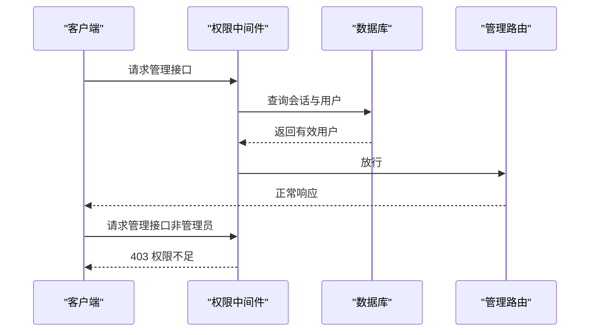

图表来源
- [apps/server/src/middleware/auth.ts:17-56](file://apps/server/src/middleware/auth.ts#L17-L56)
- [apps/server/src/routes/admin.ts:15-16](file://apps/server/src/routes/admin.ts#L15-L16)
- [apps/web/src/layouts/AdminLayout.tsx:93-97](file://apps/web/src/layouts/AdminLayout.tsx#L93-L97)

章节来源
- [apps/server/src/middleware/auth.ts:17-56](file://apps/server/src/middleware/auth.ts#L17-L56)
- [apps/web/src/layouts/AdminLayout.tsx:93-97](file://apps/web/src/layouts/AdminLayout.tsx#L93-L97)

## 依赖关系分析
- 前端依赖：React 路由、Ant Design UI、Axios 发起请求；AdminLayout 依赖 useAuth 提供的用户信息；各页面组件依赖 api 封装的 baseURL 与凭据。
- 后端依赖：Fastify 插件链（CORS、Helmet、Cookie、Multipart、RateLimit、Static）；Drizzle ORM 访问 SQLite；共享模式校验（shared）。
- 数据模型：users/sessions 作为认证基础；softwareCategories/softwareItems、helpCategories/helpDocuments、files 等构成内容管理主干。

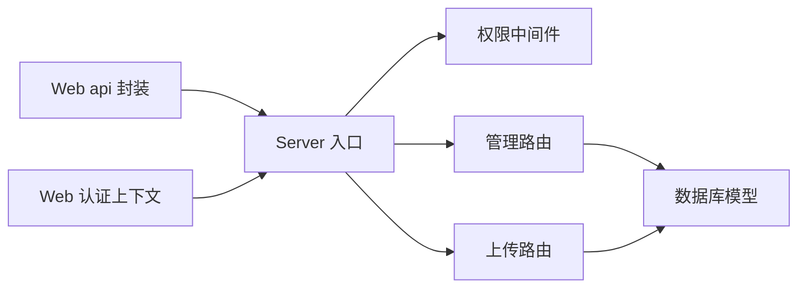

图表来源
- [apps/web/src/lib/api.ts:3-16](file://apps/web/src/lib/api.ts#L3-L16)
- [apps/web/src/lib/auth.tsx:24-33](file://apps/web/src/lib/auth.tsx#L24-L33)
- [apps/server/src/index.ts:29-49](file://apps/server/src/index.ts#L29-L49)
- [apps/server/src/middleware/auth.ts:17-56](file://apps/server/src/middleware/auth.ts#L17-L56)
- [apps/server/src/routes/admin.ts:15-279](file://apps/server/src/routes/admin.ts#L15-L279)
- [apps/server/src/routes/upload.ts:14-63](file://apps/server/src/routes/upload.ts#L14-L63)
- [apps/server/src/db/schema.ts:1-330](file://apps/server/src/db/schema.ts#L1-L330)

章节来源
- [apps/web/src/lib/api.ts:3-16](file://apps/web/src/lib/api.ts#L3-L16)
- [apps/web/src/lib/auth.tsx:24-33](file://apps/web/src/lib/auth.tsx#L24-L33)
- [apps/server/src/db/schema.ts:1-330](file://apps/server/src/db/schema.ts#L1-L330)

## 性能考量
- 上传性能：流式写入与哈希计算，避免一次性内存占用过大；建议对大文件分片上传（当前实现为单流）。
- 查询优化：管理端常用列表接口已按排序或时间倒序，建议在高频字段上建立索引（如 sort、createdAt）。
- 缓存策略：前端可对静态配置类数据做本地缓存；对频繁访问的统计接口可增加短期缓存。
- 并发控制：服务端已启用限流中间件，建议针对不同端点细化规则。

## 故障排查指南
- 登录后无法进入管理页
  - 检查会话是否正确写入 Cookie，确认 /auth/me 能返回用户信息。
  - 若返回 401 或 403，检查权限中间件与 AdminLayout 的角色判断。
- 上传失败
  - 确认上传目录存在且可写；检查文件大小限制；查看上传接口返回错误。
- 删除用户报错
  - 确认不是删除自身；后端会拒绝该操作并返回错误信息。
- 文档状态切换无效
  - 确认传入的状态值符合枚举；后端会在发布/回收时写入对应时间戳。

章节来源
- [apps/web/src/lib/auth.tsx:24-33](file://apps/web/src/lib/auth.tsx#L24-L33)
- [apps/web/src/layouts/AdminLayout.tsx:93-97](file://apps/web/src/layouts/AdminLayout.tsx#L93-L97)
- [apps/server/src/routes/upload.ts:14-49](file://apps/server/src/routes/upload.ts#L14-L49)
- [apps/server/src/routes/admin.ts:264-271](file://apps/server/src/routes/admin.ts#L264-L271)
- [apps/web/src/pages/admin/HelpDocuments.tsx:49-53](file://apps/web/src/pages/admin/HelpDocuments.tsx#L49-L53)

## 结论
本管理后台以清晰的前后端分层、严格的权限控制与完善的 CRUD 能力，覆盖软件与文档管理、用户管理、文件上传、激活码与发放、工单与审计、资产与云服务、运维监控等核心场景。通过仪表板实现关键指标可视化，配合状态与排序机制，满足日常运营与维护需求。建议在后续迭代中引入更细粒度的权限位、分页与搜索、上传分片与断点续传、以及监控与日志完善。

## 附录
- 最佳实践
  - 严格区分管理员与普通用户权限，避免越权访问。
  - 对敏感操作（删除、状态变更）增加二次确认与审计记录。
  - 上传文件建议开启白名单与类型校验，结合哈希去重。
  - 列表查询支持分页与过滤，提升大数据量下的体验。
  - 对高并发场景优化数据库索引与缓存策略。