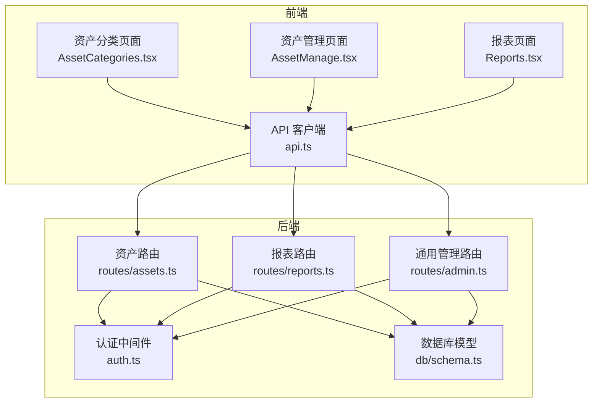
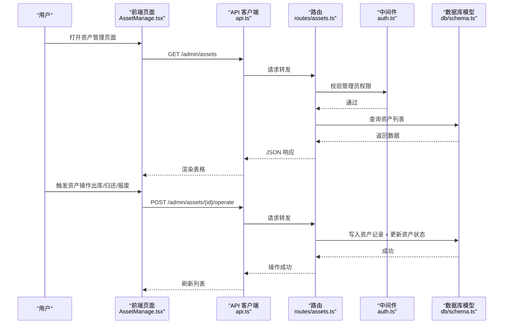
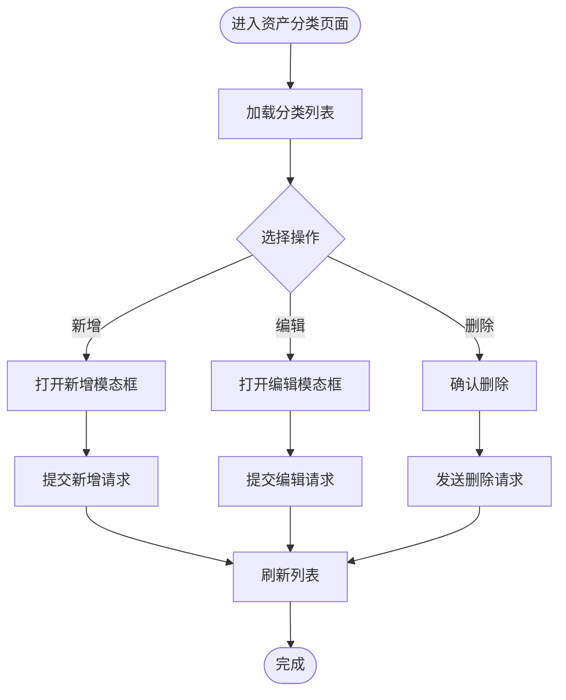
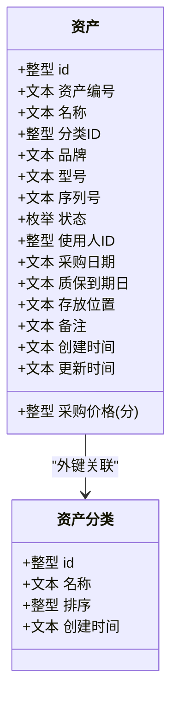
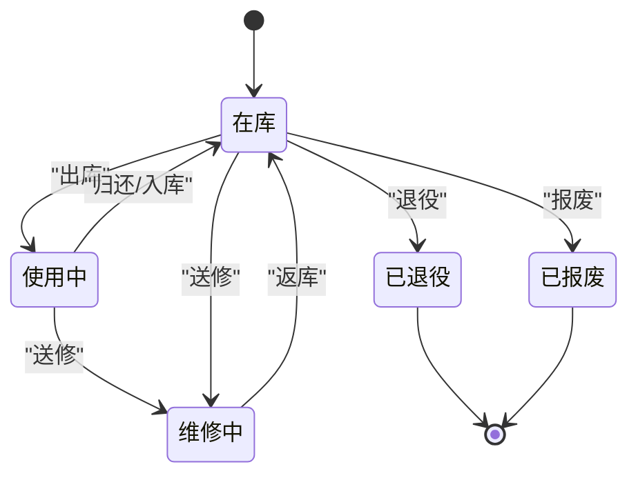
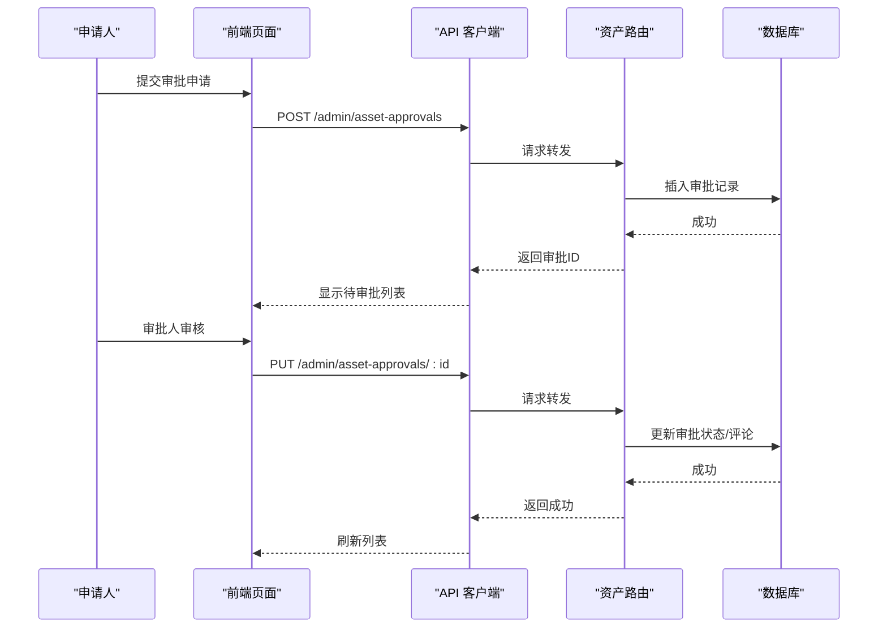
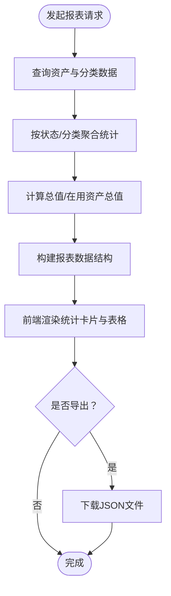
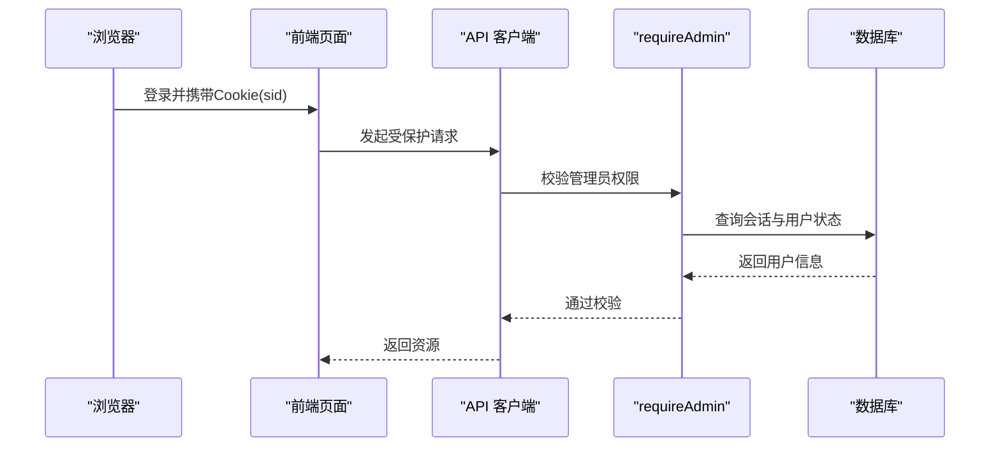
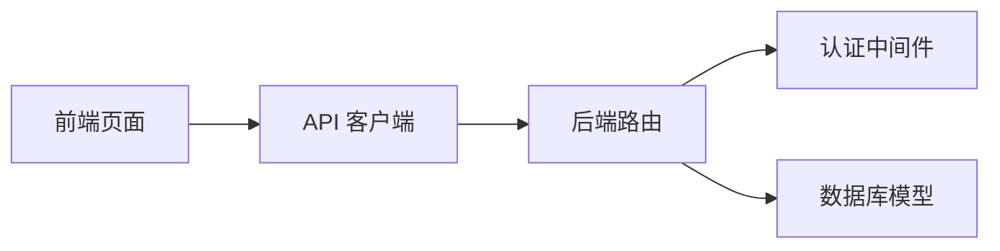

# 资产管理

<cite>
**本文引用的文件**
- [apps/server/src/routes/assets.ts](file://apps/server/src/routes/assets.ts)
- [apps/server/src/db/schema.ts](file://apps/server/src/db/schema.ts)
- [apps/web/src/pages/admin/AssetCategories.tsx](file://apps/web/src/pages/admin/AssetCategories.tsx)
- [apps/web/src/pages/admin/AssetManage.tsx](file://apps/web/src/pages/admin/AssetManage.tsx)
- [apps/server/src/middleware/auth.ts](file://apps/server/src/middleware/auth.ts)
- [apps/server/src/routes/reports.ts](file://apps/server/src/routes/reports.ts)
- [apps/web/src/pages/admin/Reports.tsx](file://apps/web/src/pages/admin/Reports.tsx)
- [apps/server/src/routes/admin.ts](file://apps/server/src/routes/admin.ts)
- [apps/web/src/lib/api.ts](file://apps/web/src/lib/api.ts)
- [apps/server/src/db/seed.ts](file://apps/server/src/db/seed.ts)
</cite>

## 目录
1. [简介](#简介)
2. [项目结构](#项目结构)
3. [核心组件](#核心组件)
4. [架构总览](#架构总览)
5. [详细组件分析](#详细组件分析)
6. [依赖关系分析](#依赖关系分析)
7. [性能考量](#性能考量)
8. [故障排查指南](#故障排查指南)
9. [结论](#结论)
10. [附录](#附录)

## 简介
本文件系统性阐述资产管理功能的设计与实现，覆盖资产分类管理、资产条目管理、状态管理与流转、审批流程、盘点与统计、以及合规与最佳实践。系统采用前后端分离架构：前端基于 Ant Design 的 React 页面负责展示与交互；后端基于 Fastify + Drizzle ORM + SQLite，提供 REST 接口与数据持久化。

## 项目结构
- 前端页面位于 apps/web/src/pages/admin，包含资产分类与资产管理页面，以及报表页面。
- 后端路由位于 apps/server/src/routes，包含资产、报表、审批等接口。
- 数据模型位于 apps/server/src/db/schema.ts，定义资产、分类、记录、审批等表结构。
- 权限中间件位于 apps/server/src/middleware/auth.ts，限制仅管理员可访问资产相关接口。
- API 客户端封装于 apps/web/src/lib/api.ts，统一处理基础路径与凭证传递。
- 示例数据种子位于 apps/server/src/db/seed.ts，包含资产分类示例。

图表来源
- [apps/web/src/pages/admin/AssetCategories.tsx](file://apps/web/src/pages/admin/AssetCategories.tsx)
- [apps/web/src/pages/admin/AssetManage.tsx](file://apps/web/src/pages/admin/AssetManage.tsx)
- [apps/web/src/pages/admin/Reports.tsx](file://apps/web/src/pages/admin/Reports.tsx)
- [apps/web/src/lib/api.ts](file://apps/web/src/lib/api.ts)
- [apps/server/src/routes/assets.ts](file://apps/server/src/routes/assets.ts)
- [apps/server/src/routes/reports.ts](file://apps/server/src/routes/reports.ts)
- [apps/server/src/routes/admin.ts](file://apps/server/src/routes/admin.ts)
- [apps/server/src/middleware/auth.ts](file://apps/server/src/middleware/auth.ts)
- [apps/server/src/db/schema.ts](file://apps/server/src/db/schema.ts)

章节来源
- [apps/web/src/pages/admin/AssetCategories.tsx](file://apps/web/src/pages/admin/AssetCategories.tsx)
- [apps/web/src/pages/admin/AssetManage.tsx](file://apps/web/src/pages/admin/AssetManage.tsx)
- [apps/web/src/pages/admin/Reports.tsx](file://apps/web/src/pages/admin/Reports.tsx)
- [apps/web/src/lib/api.ts](file://apps/web/src/lib/api.ts)
- [apps/server/src/routes/assets.ts](file://apps/server/src/routes/assets.ts)
- [apps/server/src/routes/reports.ts](file://apps/server/src/routes/reports.ts)
- [apps/server/src/routes/admin.ts](file://apps/server/src/routes/admin.ts)
- [apps/server/src/middleware/auth.ts](file://apps/server/src/middleware/auth.ts)
- [apps/server/src/db/schema.ts](file://apps/server/src/db/schema.ts)

## 核心组件
- 资产分类管理：支持分类的增删改查，包含名称与排序字段，用于对资产进行层级化组织。
- 资产条目管理：支持资产信息的录入、更新、删除与批量查询，包含品牌、型号、序列号、采购日期、价格、质保期、存放位置、备注等。
- 资产状态管理：内置状态枚举，涵盖在库、使用中、维修中、退役、报废等；通过“操作”接口实现状态转换与流转记录生成。
- 审批流程：支持出库、归还、报废等类型的审批申请与审批结果记录，便于合规审计。
- 统计与报表：提供资产总数、按状态与分类统计、资产总值与在用资产总值等指标，并支持导出完整报表。
- 权限控制：所有资产相关接口均受管理员权限保护，防止非授权访问。

章节来源
- [apps/server/src/routes/assets.ts](file://apps/server/src/routes/assets.ts)
- [apps/server/src/db/schema.ts](file://apps/server/src/db/schema.ts)
- [apps/web/src/pages/admin/AssetCategories.tsx](file://apps/web/src/pages/admin/AssetCategories.tsx)
- [apps/web/src/pages/admin/AssetManage.tsx](file://apps/web/src/pages/admin/AssetManage.tsx)
- [apps/server/src/middleware/auth.ts](file://apps/server/src/middleware/auth.ts)
- [apps/server/src/routes/reports.ts](file://apps/server/src/routes/reports.ts)
- [apps/web/src/pages/admin/Reports.tsx](file://apps/web/src/pages/admin/Reports.tsx)

## 架构总览
系统采用三层架构：
- 表现层：React 页面负责数据展示与用户交互。
- 接口层：Fastify 路由处理请求，执行权限校验与业务逻辑。
- 数据层：Drizzle ORM + SQLite 存储资产、分类、记录、审批等实体。

图表来源
- [apps/web/src/pages/admin/AssetManage.tsx](file://apps/web/src/pages/admin/AssetManage.tsx)
- [apps/web/src/lib/api.ts](file://apps/web/src/lib/api.ts)
- [apps/server/src/routes/assets.ts](file://apps/server/src/routes/assets.ts)
- [apps/server/src/middleware/auth.ts](file://apps/server/src/middleware/auth.ts)
- [apps/server/src/db/schema.ts](file://apps/server/src/db/schema.ts)

## 详细组件分析

### 资产分类管理
- 功能要点
  - 分类列表查询、新增、修改、删除。
  - 支持排序字段，便于在前端按序展示。
- 前端实现
  - 使用 Ant Design 表格与模态框，支持新增与编辑分类。
- 后端实现
  - 提供 REST 接口，使用 Drizzle ORM 持久化到 assetCategories 表。
- 数据模型
  - 字段包含 id、name、sort、createdAt。

图表来源
- [apps/web/src/pages/admin/AssetCategories.tsx](file://apps/web/src/pages/admin/AssetCategories.tsx)
- [apps/server/src/routes/assets.ts](file://apps/server/src/routes/assets.ts)
- [apps/server/src/db/schema.ts](file://apps/server/src/db/schema.ts)

章节来源
- [apps/web/src/pages/admin/AssetCategories.tsx](file://apps/web/src/pages/admin/AssetCategories.tsx)
- [apps/server/src/routes/assets.ts](file://apps/server/src/routes/assets.ts)
- [apps/server/src/db/schema.ts](file://apps/server/src/db/schema.ts)

### 资产条目管理
- 功能要点
  - 资产信息录入：资产编号、名称、分类、品牌/型号/序列号、采购日期/价格、质保期、存放位置、备注等。
  - 资产更新：按需更新字段，自动更新时间戳。
  - 资产删除：软/硬删除策略取决于业务需求，当前实现为物理删除。
- 前端实现
  - 使用 Ant Design 表单与表格，支持日期格式化、下拉选择、标签渲染状态与使用人。
- 后端实现
  - 提供资产 CRUD 接口，使用 Drizzle ORM 持久化到 assets 表。

图表来源
- [apps/server/src/db/schema.ts](file://apps/server/src/db/schema.ts)

章节来源
- [apps/web/src/pages/admin/AssetManage.tsx](file://apps/web/src/pages/admin/AssetManage.tsx)
- [apps/server/src/routes/assets.ts](file://apps/server/src/routes/assets.ts)
- [apps/server/src/db/schema.ts](file://apps/server/src/db/schema.ts)

### 资产状态管理与流转
- 状态定义
  - in_stock：在库
  - in_use：使用中
  - maintenance：维修中
  - retired：已退役
  - scrapped：已报废
- 流转规则
  - 出库（check_out）→ in_use；同时记录使用人 assigneeId。
  - 归还/入库（check_in、return）→ in_stock；清除使用人。
  - 送修（maintenance）→ maintenance。
  - 退役（retire）→ retired。
  - 报废（scrap）→ scrapped。
- 记录机制
  - 每次操作写入资产记录表 assetRecords，包含操作类型、操作人、目标用户、备注等。
- 前端呈现
  - 状态以标签形式展示，颜色区分不同状态。

图表来源
- [apps/server/src/routes/assets.ts](file://apps/server/src/routes/assets.ts)
- [apps/server/src/db/schema.ts](file://apps/server/src/db/schema.ts)

章节来源
- [apps/server/src/routes/assets.ts](file://apps/server/src/routes/assets.ts)
- [apps/server/src/db/schema.ts](file://apps/server/src/db/schema.ts)
- [apps/web/src/pages/admin/AssetManage.tsx](file://apps/web/src/pages/admin/AssetManage.tsx)

### 资产审批流程
- 类型
  - 出库申请（check_out）
  - 归还申请（return）
  - 报废申请（scrap）
- 流程
  - 申请人提交申请，记录类型与原因。
  - 审批人审核，更新审批状态、评论与时间戳。
  - 审批通过后，方可执行相应资产操作。
- 数据模型
  - assetApprovals 包含资产ID、申请人、审批人、状态、类型、原因、评论等。

图表来源
- [apps/server/src/routes/assets.ts](file://apps/server/src/routes/assets.ts)
- [apps/server/src/db/schema.ts](file://apps/server/src/db/schema.ts)

章节来源
- [apps/server/src/routes/assets.ts](file://apps/server/src/routes/assets.ts)
- [apps/server/src/db/schema.ts](file://apps/server/src/db/schema.ts)

### 资产盘点与统计
- 统计维度
  - 总数、按状态分布、按分类分布、资产总值、在用资产总值。
- 实现方式
  - 后端聚合资产数据，返回结构化统计结果。
  - 前端报表页面展示统计卡片与表格，并支持导出完整报表。
- 报表接口
  - /api/admin/reports/digital-assets：数字资产统计。
  - /api/admin/reports/export：导出软件资产、激活发放、数字资产等完整数据。

图表来源
- [apps/server/src/routes/reports.ts](file://apps/server/src/routes/reports.ts)
- [apps/web/src/pages/admin/Reports.tsx](file://apps/web/src/pages/admin/Reports.tsx)

章节来源
- [apps/server/src/routes/reports.ts](file://apps/server/src/routes/reports.ts)
- [apps/web/src/pages/admin/Reports.tsx](file://apps/web/src/pages/admin/Reports.tsx)

### 权限与安全
- 管理员权限
  - 所有资产相关接口均通过 requireAdmin 中间件保护，非管理员不可访问。
- 会话与认证
  - 通过 cookies 中的 sid 获取会话，校验过期与用户状态，注入 sessionUser。
- 前端 API
  - axios 实例设置 withCredentials，保证跨域场景下的 Cookie 传递。

图表来源
- [apps/server/src/middleware/auth.ts](file://apps/server/src/middleware/auth.ts)
- [apps/web/src/lib/api.ts](file://apps/web/src/lib/api.ts)

章节来源
- [apps/server/src/middleware/auth.ts](file://apps/server/src/middleware/auth.ts)
- [apps/web/src/lib/api.ts](file://apps/web/src/lib/api.ts)

## 依赖关系分析
- 组件耦合
  - 前端页面依赖 API 客户端；API 客户端依赖后端路由；路由依赖中间件与数据库模型。
- 外部依赖
  - 前端：Ant Design、Axios。
  - 后端：Fastify、Drizzle ORM、SQLite。
- 数据一致性
  - 资产状态与记录表保持一致，审批通过后才允许执行状态变更。

图表来源
- [apps/web/src/lib/api.ts](file://apps/web/src/lib/api.ts)
- [apps/server/src/routes/assets.ts](file://apps/server/src/routes/assets.ts)
- [apps/server/src/middleware/auth.ts](file://apps/server/src/middleware/auth.ts)
- [apps/server/src/db/schema.ts](file://apps/server/src/db/schema.ts)

章节来源
- [apps/web/src/lib/api.ts](file://apps/web/src/lib/api.ts)
- [apps/server/src/routes/assets.ts](file://apps/server/src/routes/assets.ts)
- [apps/server/src/middleware/auth.ts](file://apps/server/src/middleware/auth.ts)
- [apps/server/src/db/schema.ts](file://apps/server/src/db/schema.ts)

## 性能考量
- 查询优化
  - 对资产列表按创建时间倒序查询，避免全表扫描；必要时可在高频字段建立索引。
- 写入优化
  - 批量导入激活码时建议分批处理，避免单次事务过大。
- 前端渲染
  - 资产列表启用分页与固定列，减少大表格渲染压力。
- 统计计算
  - 报表接口在内存中聚合统计，数据量大时建议引入物化视图或缓存。

## 故障排查指南
- 无权限访问
  - 现象：返回 401 或 403。
  - 排查：确认登录状态与角色；检查 cookies 中 sid 是否有效。
- 资产不存在
  - 现象：操作接口返回“资产不存在”。
  - 排查：确认资产 ID 是否正确；检查数据库是否存在该记录。
- 无效操作
  - 现象：操作接口返回“无效操作”。
  - 排查：确认 action 是否属于允许的操作集合。
- 审批状态异常
  - 现象：审批通过后仍无法执行资产操作。
  - 排查：确认审批状态为“已批准”，再执行相应操作。

章节来源
- [apps/server/src/routes/assets.ts](file://apps/server/src/routes/assets.ts)
- [apps/server/src/middleware/auth.ts](file://apps/server/src/middleware/auth.ts)

## 结论
本系统提供了完整的资产管理能力：清晰的分类体系、完善的资产条目管理、严谨的状态流转与审批流程、丰富的统计与报表能力，并通过严格的管理员权限控制保障安全性。建议在生产环境中进一步完善审计日志、缓存策略与索引设计，以提升性能与可观测性。

## 附录
- 示例数据
  - 种子脚本包含资产分类示例，便于快速初始化演示环境。
- 最佳实践
  - 强制使用审批流程处理高风险操作（出库、报废）。
  - 定期导出报表并归档，满足合规审计需求。
  - 对关键字段（资产编号、序列号）进行唯一性约束与校验。

章节来源
- [apps/server/src/db/seed.ts](file://apps/server/src/db/seed.ts)