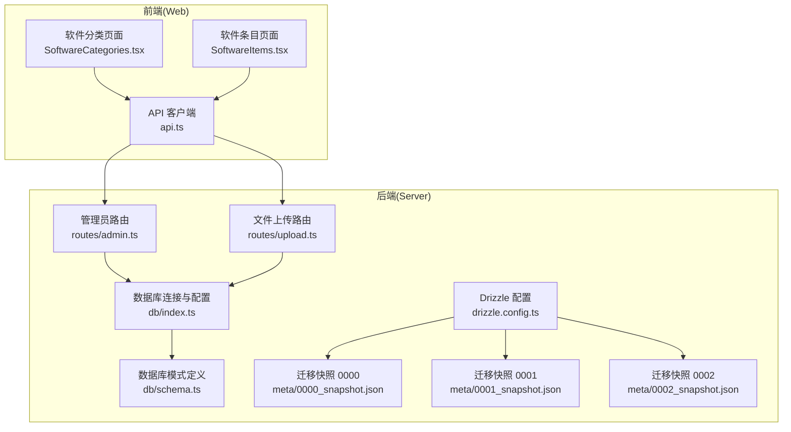
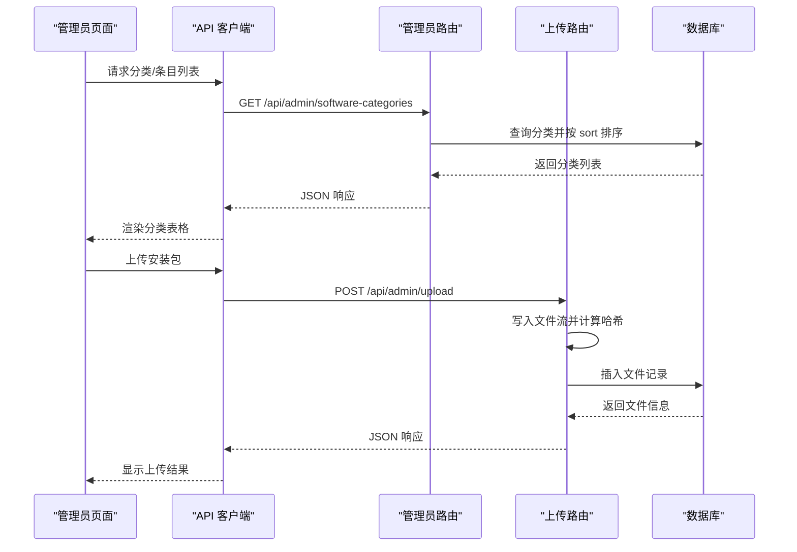
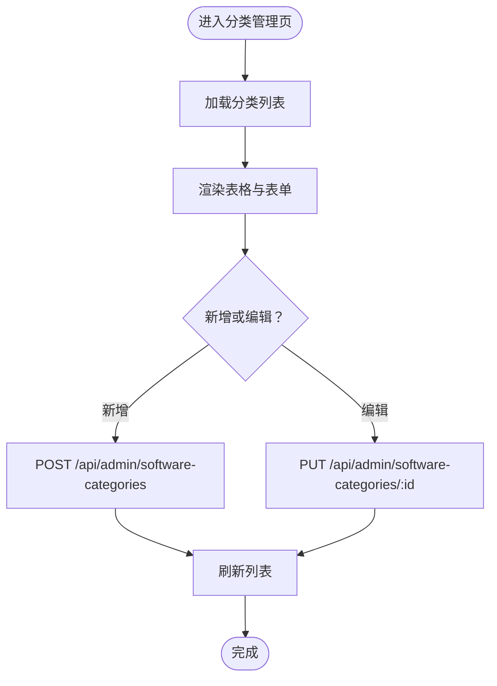
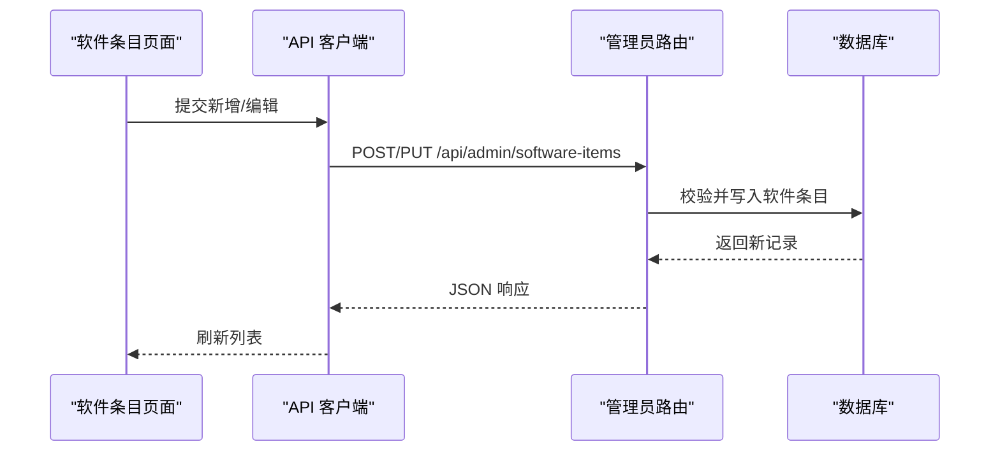
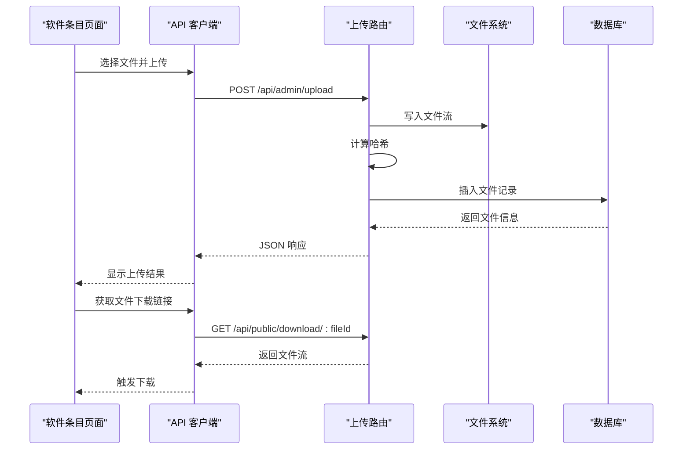
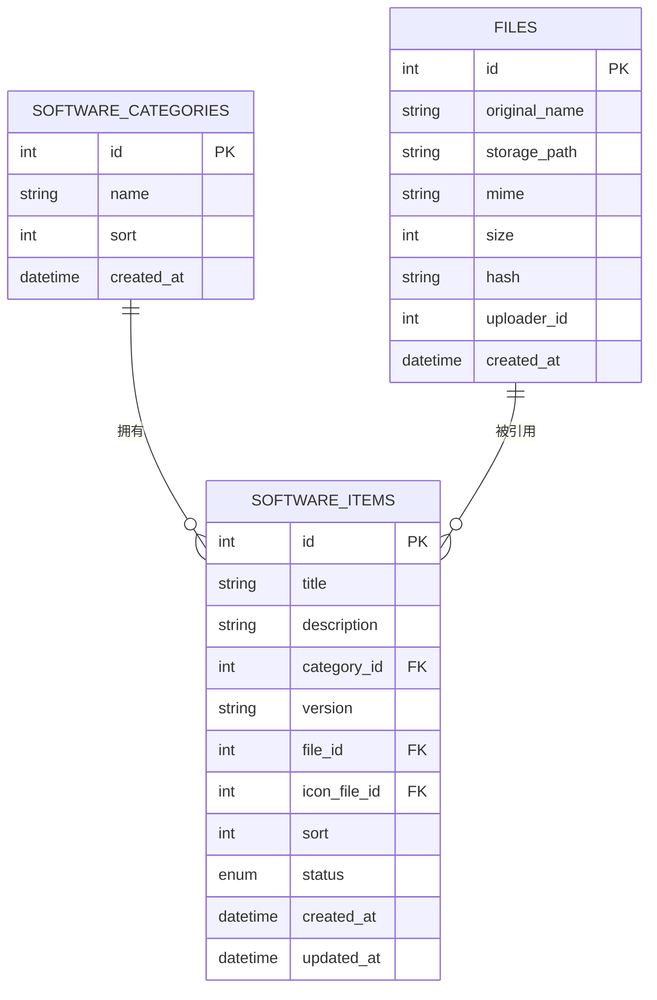

# 软件管理

<cite>
**本文引用的文件**
- [apps/server/src/db/schema.ts](file://apps/server/src/db/schema.ts)
- [apps/server/src/routes/admin.ts](file://apps/server/src/routes/admin.ts)
- [apps/server/src/routes/upload.ts](file://apps/server/src/routes/upload.ts)
- [apps/server/src/db/index.ts](file://apps/server/src/db/index.ts)
- [apps/web/src/pages/admin/SoftwareCategories.tsx](file://apps/web/src/pages/admin/SoftwareCategories.tsx)
- [apps/web/src/pages/admin/SoftwareItems.tsx](file://apps/web/src/pages/admin/SoftwareItems.tsx)
- [apps/web/src/lib/api.ts](file://apps/web/src/lib/api.ts)
- [apps/server/drizzle.config.ts](file://apps/server/drizzle.config.ts)
- [apps/server/drizzle/meta/0000_snapshot.json](file://apps/server/drizzle/meta/0000_snapshot.json)
- [apps/server/drizzle/meta/0001_snapshot.json](file://apps/server/drizzle/meta/0001_snapshot.json)
- [apps/server/drizzle/meta/0002_snapshot.json](file://apps/server/drizzle/meta/0002_snapshot.json)
</cite>

## 目录
1. [简介](#简介)
2. [项目结构](#项目结构)
3. [核心组件](#核心组件)
4. [架构总览](#架构总览)
5. [详细组件分析](#详细组件分析)
6. [依赖关系分析](#依赖关系分析)
7. [性能考量](#性能考量)
8. [故障排查指南](#故障排查指南)
9. [结论](#结论)
10. [附录](#附录)

## 简介
本文件面向“软件管理”功能，围绕以下目标展开：  
- 软件分类管理：分类层级结构、排序与关联软件数量统计  
- 软件条目 CRUD：信息编辑、版本管理、发布状态控制  
- 文件上传与管理：存储策略、版本对比与历史回滚思路  
- 发布流程：预览、审核、发布、下架等状态管理  
- 搜索与筛选：多维过滤与排序选项  
- 最佳实践与性能优化建议  

本项目采用前后端分离：前端基于 Ant Design + React 的管理页面，后端基于 Fastify + Drizzle ORM + Better-SQLite3 的数据访问层。

## 项目结构
- 后端服务位于 apps/server，包含路由、中间件、数据库模式与迁移元数据
- 前端管理页面位于 apps/web，包含软件分类与软件条目管理页面
- 数据库采用 SQLite（Better-SQLite3），通过 Drizzle ORM 管理 Schema 与迁移

图表来源
- [apps/web/src/pages/admin/SoftwareCategories.tsx:1-70](file://apps/web/src/pages/admin/SoftwareCategories.tsx#L1-L70)
- [apps/web/src/pages/admin/SoftwareItems.tsx:1-118](file://apps/web/src/pages/admin/SoftwareItems.tsx#L1-L118)
- [apps/web/src/lib/api.ts:1-16](file://apps/web/src/lib/api.ts#L1-L16)
- [apps/server/src/routes/admin.ts:1-279](file://apps/server/src/routes/admin.ts#L1-L279)
- [apps/server/src/routes/upload.ts:1-63](file://apps/server/src/routes/upload.ts#L1-L63)
- [apps/server/src/db/index.ts:1-16](file://apps/server/src/db/index.ts#L1-L16)
- [apps/server/src/db/schema.ts:1-330](file://apps/server/src/db/schema.ts#L1-L330)
- [apps/server/drizzle.config.ts:1-11](file://apps/server/drizzle.config.ts#L1-L11)
- [apps/server/drizzle/meta/0000_snapshot.json:1-757](file://apps/server/drizzle/meta/0000_snapshot.json#L1-L757)
- [apps/server/drizzle/meta/0001_snapshot.json:1-800](file://apps/server/drizzle/meta/0001_snapshot.json#L1-L800)
- [apps/server/drizzle/meta/0002_snapshot.json:1-800](file://apps/server/drizzle/meta/0002_snapshot.json#L1-L800)

章节来源
- [apps/server/src/db/schema.ts:19-49](file://apps/server/src/db/schema.ts#L19-L49)
- [apps/server/src/routes/admin.ts:18-73](file://apps/server/src/routes/admin.ts#L18-L73)
- [apps/server/src/routes/upload.ts:14-61](file://apps/server/src/routes/upload.ts#L14-L61)
- [apps/web/src/pages/admin/SoftwareCategories.tsx:1-70](file://apps/web/src/pages/admin/SoftwareCategories.tsx#L1-L70)
- [apps/web/src/pages/admin/SoftwareItems.tsx:1-118](file://apps/web/src/pages/admin/SoftwareItems.tsx#L1-L118)

## 核心组件
- 数据模型
  - 软件分类表：包含名称与排序字段，支持按 sort 升序展示
  - 软件条目表：包含标题、描述、分类外键、版本、文件外键、图标文件外键、排序、状态、创建/更新时间
  - 文件表：记录原始文件名、存储路径、MIME 类型、大小、哈希、上传者与创建时间
- 后端接口
  - 分类管理：GET/POST/PUT/DELETE /api/admin/software-categories
  - 软件条目管理：GET/POST/PUT/DELETE /api/admin/software-items
  - 文件上传：POST /api/admin/upload（仅管理员）
  - 公共下载：GET /api/public/download/:fileId
- 前端页面
  - 软件分类管理页：增删改查、排序字段编辑
  - 软件条目管理页：标题/分类/版本/描述/排序/状态、文件上传与选择

章节来源
- [apps/server/src/db/schema.ts:19-49](file://apps/server/src/db/schema.ts#L19-L49)
- [apps/server/src/routes/admin.ts:18-73](file://apps/server/src/routes/admin.ts#L18-L73)
- [apps/server/src/routes/upload.ts:14-61](file://apps/server/src/routes/upload.ts#L14-L61)
- [apps/web/src/pages/admin/SoftwareCategories.tsx:12-34](file://apps/web/src/pages/admin/SoftwareCategories.tsx#L12-L34)
- [apps/web/src/pages/admin/SoftwareItems.tsx:13-22](file://apps/web/src/pages/admin/SoftwareItems.tsx#L13-L22)

## 架构总览
后端采用轻量级路由组织，管理员权限中间件保护敏感接口；数据库通过 Drizzle ORM 访问 SQLite，迁移元数据由 Drizzle Kit 维护。

图表来源
- [apps/web/src/lib/api.ts:1-16](file://apps/web/src/lib/api.ts#L1-L16)
- [apps/server/src/routes/admin.ts:18-73](file://apps/server/src/routes/admin.ts#L18-L73)
- [apps/server/src/routes/upload.ts:14-61](file://apps/server/src/routes/upload.ts#L14-L61)
- [apps/server/src/db/index.ts:1-16](file://apps/server/src/db/index.ts#L1-L16)

## 详细组件分析

### 软件分类管理
- 功能要点
  - 列表查询：按 sort 升序返回
  - 新增/修改：使用统一的分类 Schema 校验
  - 删除：直接删除，无软删除
- 前端交互
  - 表格列含 ID、名称、排序；支持新增、编辑、删除弹窗
  - 排序字段为数值输入，便于调整层级顺序

图表来源
- [apps/web/src/pages/admin/SoftwareCategories.tsx:12-34](file://apps/web/src/pages/admin/SoftwareCategories.tsx#L12-L34)
- [apps/server/src/routes/admin.ts:18-43](file://apps/server/src/routes/admin.ts#L18-L43)

章节来源
- [apps/server/src/db/schema.ts:19-24](file://apps/server/src/db/schema.ts#L19-L24)
- [apps/server/src/routes/admin.ts:18-43](file://apps/server/src/routes/admin.ts#L18-L43)
- [apps/web/src/pages/admin/SoftwareCategories.tsx:12-34](file://apps/web/src/pages/admin/SoftwareCategories.tsx#L12-L34)

### 软件条目管理（CRUD）
- 功能要点
  - 列表查询：按 sort 升序返回
  - 新增/修改：动态组装更新字段，自动更新 updatedAt
  - 删除：直接删除
  - 关联字段：categoryId、fileId、iconFileId
  - 状态字段：draft/published
- 前端交互
  - 表格列含标题、分类、版本、排序、状态；支持编辑与删除
  - 新增/编辑表单包含标题、分类、版本、描述、排序、状态、文件上传

图表来源
- [apps/web/src/pages/admin/SoftwareItems.tsx:38-53](file://apps/web/src/pages/admin/SoftwareItems.tsx#L38-L53)
- [apps/server/src/routes/admin.ts:45-73](file://apps/server/src/routes/admin.ts#L45-L73)

章节来源
- [apps/server/src/db/schema.ts:37-49](file://apps/server/src/db/schema.ts#L37-L49)
- [apps/server/src/routes/admin.ts:45-73](file://apps/server/src/routes/admin.ts#L45-L73)
- [apps/web/src/pages/admin/SoftwareItems.tsx:38-53](file://apps/web/src/pages/admin/SoftwareItems.tsx#L38-L53)

### 文件上传与管理
- 存储策略
  - 服务端接收文件流，写入本地目录，同时计算 SHA-256 哈希
  - 文件记录包含原始名、存储名、MIME、大小、哈希、上传者
- 版本对比与历史回滚
  - 当前实现未提供多版本文件管理与回滚接口
  - 可扩展方向：引入文件版本表、保留历史版本并支持回滚
- 下载
  - 公共下载接口根据 fileId 返回对应文件

图表来源
- [apps/web/src/pages/admin/SoftwareItems.tsx:25-36](file://apps/web/src/pages/admin/SoftwareItems.tsx#L25-L36)
- [apps/server/src/routes/upload.ts:14-61](file://apps/server/src/routes/upload.ts#L14-L61)
- [apps/server/src/db/schema.ts:26-35](file://apps/server/src/db/schema.ts#L26-L35)

章节来源
- [apps/server/src/routes/upload.ts:14-61](file://apps/server/src/routes/upload.ts#L14-L61)
- [apps/server/src/db/schema.ts:26-35](file://apps/server/src/db/schema.ts#L26-L35)

### 发布流程（预览/审核/发布/下架）
- 状态模型
  - 软件条目状态：draft（草稿）、published（已发布）
  - 文档状态：draft/published/archived（用于帮助文档）
- 实现现状
  - 软件条目支持 draft/published 状态切换
  - 未见专门的“审核”流程或“预览”接口
- 建议扩展
  - 引入审核状态与审批流程
  - 提供预览接口以在发布前查看内容
  - 支持“下架”状态以便撤回发布

章节来源
- [apps/server/src/db/schema.ts:46-49](file://apps/server/src/db/schema.ts#L46-L49)
- [apps/server/src/routes/admin.ts:58-66](file://apps/server/src/routes/admin.ts#L58-L66)

### 搜索与筛选（多维过滤与排序）
- 当前实现
  - 分类与条目列表均按 sort 字段排序
  - 条目列表支持按分类过滤（前端可扩展）
- 建议增强
  - 增加标题/版本/状态等多维过滤参数
  - 支持更多排序维度（如创建时间、更新时间）

章节来源
- [apps/server/src/routes/admin.ts:18-22](file://apps/server/src/routes/admin.ts#L18-L22)
- [apps/server/src/routes/admin.ts:46-49](file://apps/server/src/routes/admin.ts#L46-L49)

## 依赖关系分析
- 数据库模式
  - software_categories：被 software_items.category_id 外键引用
  - files：被 software_items.file_id 与 icon_file_id 外键引用
- 路由依赖
  - /api/admin/software-items 依赖 /api/admin/upload 上传文件
  - /api/public/download 依赖 files 表
- 前端依赖
  - 页面通过 api.ts 统一发起请求，依赖后端接口契约

图表来源
- [apps/server/src/db/schema.ts:19-49](file://apps/server/src/db/schema.ts#L19-L49)

章节来源
- [apps/server/src/db/schema.ts:19-49](file://apps/server/src/db/schema.ts#L19-L49)

## 性能考量
- 数据库
  - 使用 WAL 模式与外键开启，提升并发与一致性
  - 建议为 frequently-filtered 字段（如 categoryId、status）建立索引
- 文件上传
  - 流式写入避免内存峰值；可考虑分块校验与断点续传
  - 对大文件建议异步处理与进度反馈
- 前端
  - 列表分页与懒加载，减少一次性渲染压力
  - 表单提交前进行必要校验，降低无效请求

章节来源
- [apps/server/src/db/index.ts:10-12](file://apps/server/src/db/index.ts#L10-L12)

## 故障排查指南
- 401 未授权
  - 管理员接口需登录态；检查会话与认证中间件
- 400 参数错误
  - 分类/条目新增/编辑时，Schema 校验失败
- 404 文件不存在
  - 下载接口需确保 fileId 存在且文件仍存在于存储路径
- 上传失败
  - 检查上传目录权限、磁盘空间与文件大小限制

章节来源
- [apps/web/src/lib/api.ts:5-12](file://apps/web/src/lib/api.ts#L5-L12)
- [apps/server/src/routes/admin.ts:24-28](file://apps/server/src/routes/admin.ts#L24-L28)
- [apps/server/src/routes/upload.ts:51-61](file://apps/server/src/routes/upload.ts#L51-L61)

## 结论
本项目提供了完整的软件分类与条目管理基础能力，配合文件上传与下载，满足基本的软件发布与分发需求。当前版本未包含复杂的审核流程与版本回滚机制，后续可在不改变现有接口契约的前提下，逐步引入更完善的发布治理与版本管理能力。

## 附录
- 数据库迁移
  - 使用 Drizzle Kit 管理迁移，快照文件记录了各版本的表结构变化
  - 开发环境可通过配置文件指定数据库路径

章节来源
- [apps/server/drizzle.config.ts:1-11](file://apps/server/drizzle.config.ts#L1-L11)
- [apps/server/drizzle/meta/0000_snapshot.json:1-757](file://apps/server/drizzle/meta/0000_snapshot.json#L1-L757)
- [apps/server/drizzle/meta/0001_snapshot.json:1-800](file://apps/server/drizzle/meta/0001_snapshot.json#L1-L800)
- [apps/server/drizzle/meta/0002_snapshot.json:1-800](file://apps/server/drizzle/meta/0002_snapshot.json#L1-L800)