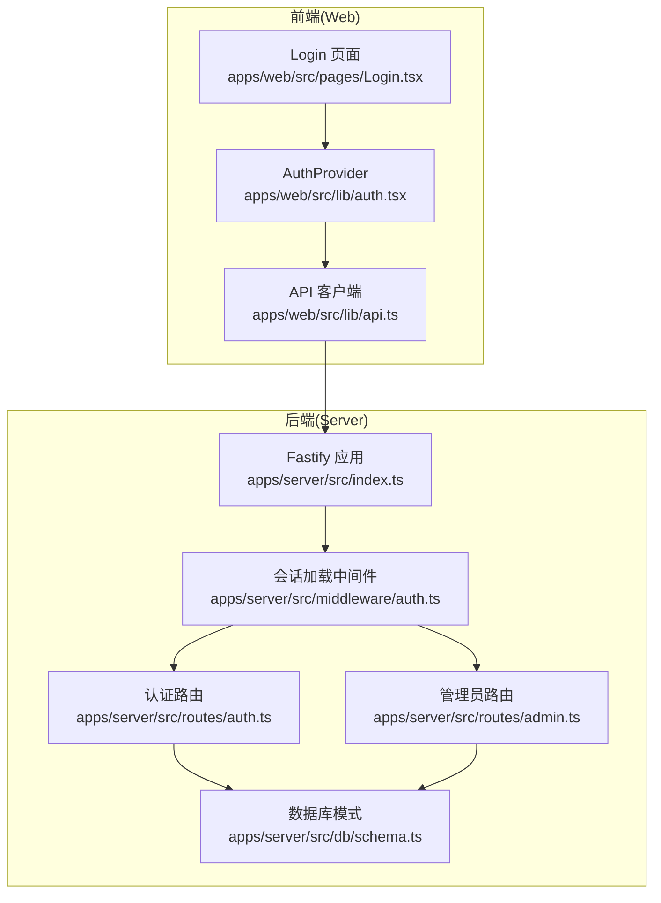
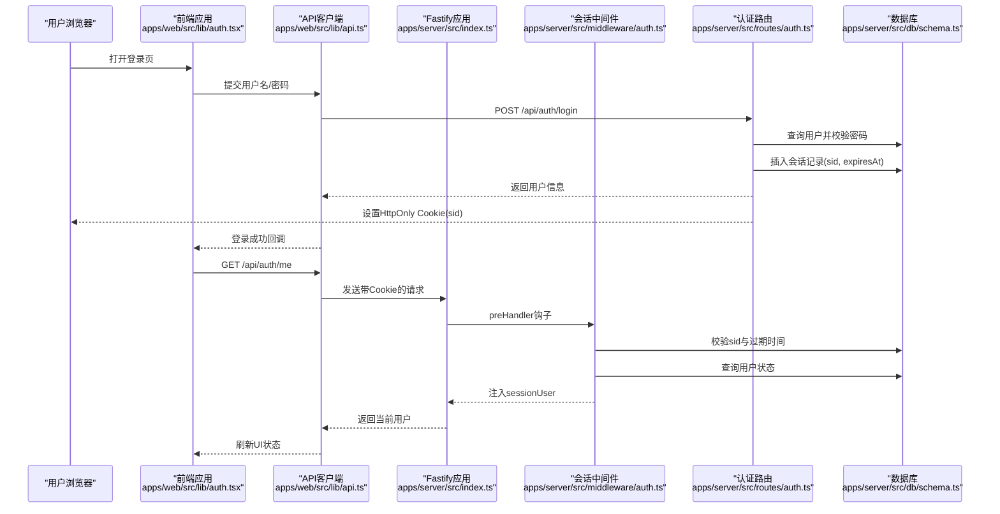
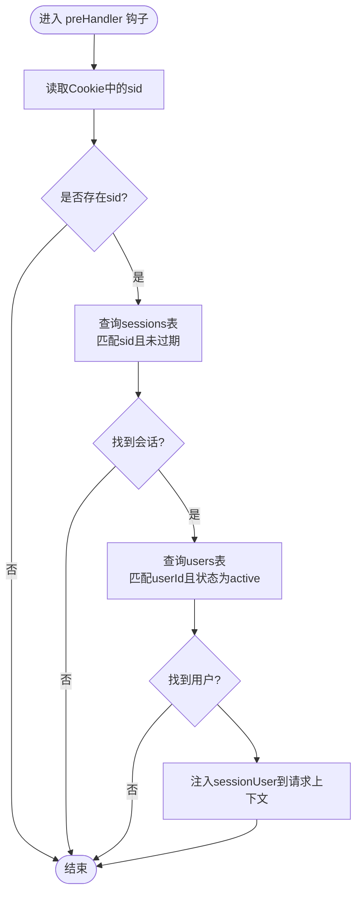
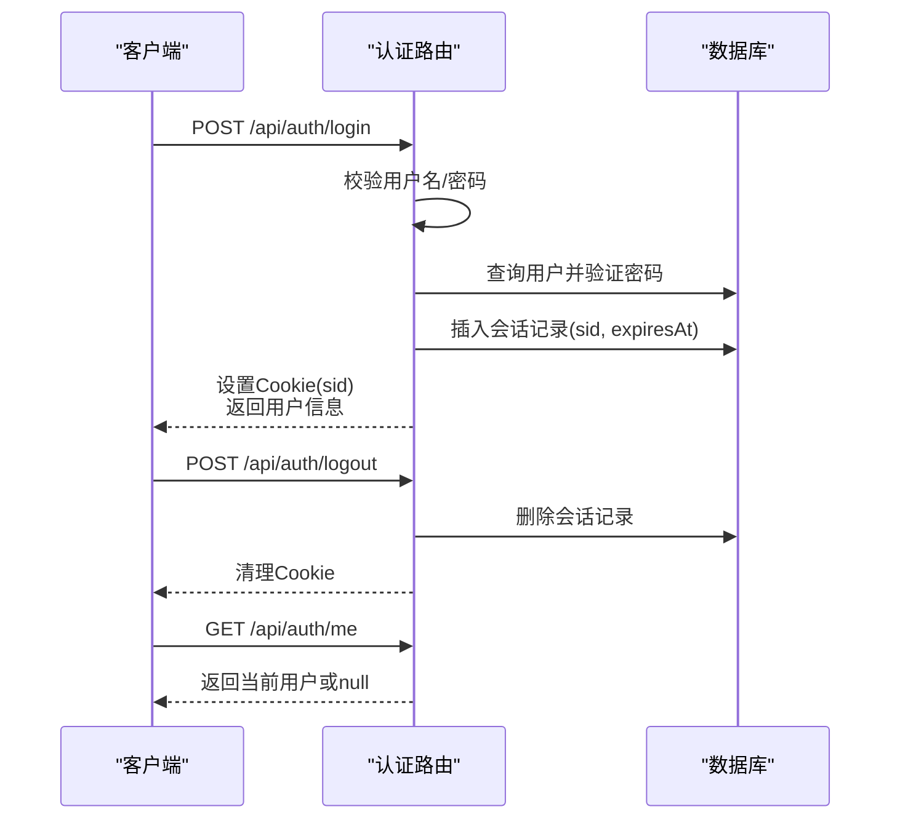
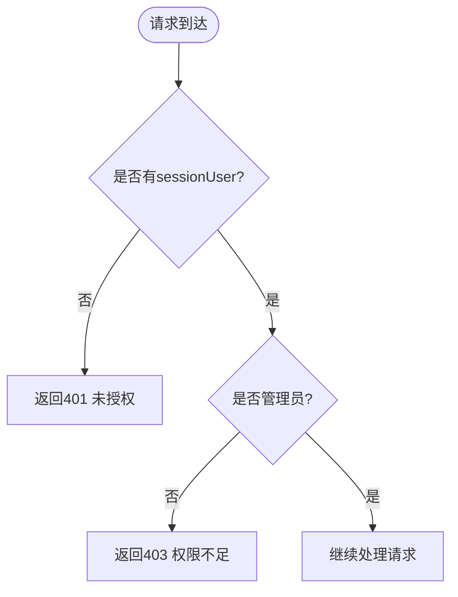
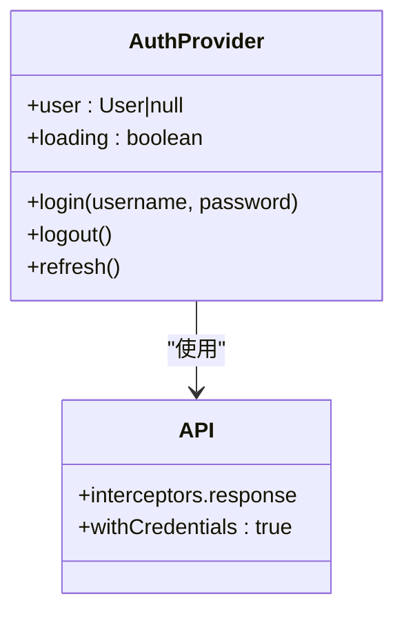
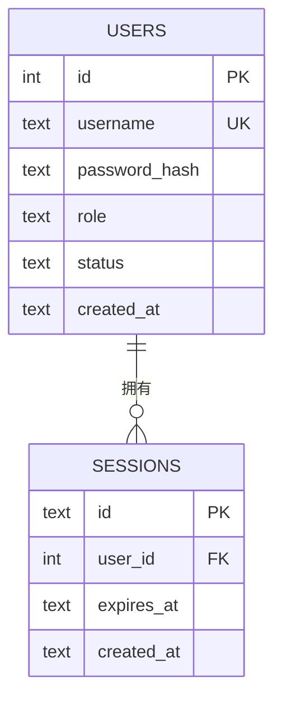
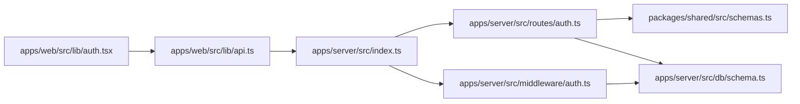

# JWT认证机制

<cite>
**本文档引用的文件**
- [apps/server/src/index.ts](file://apps/server/src/index.ts)
- [apps/server/src/middleware/auth.ts](file://apps/server/src/middleware/auth.ts)
- [apps/server/src/routes/auth.ts](file://apps/server/src/routes/auth.ts)
- [apps/server/src/db/schema.ts](file://apps/server/src/db/schema.ts)
- [apps/web/src/lib/auth.tsx](file://apps/web/src/lib/auth.tsx)
- [apps/web/src/lib/api.ts](file://apps/web/src/lib/api.ts)
- [apps/web/src/pages/Login.tsx](file://apps/web/src/pages/Login.tsx)
- [apps/server/src/routes/admin.ts](file://apps/server/src/routes/admin.ts)
- [packages/shared/src/schemas.ts](file://packages/shared/src/schemas.ts)
- [apps/server/drizzle.config.ts](file://apps/server/drizzle.config.ts)
- [apps/server/src/db/migrate.ts](file://apps/server/src/db/migrate.ts)
</cite>

## 目录
1. [简介](#简介)
2. [项目结构](#项目结构)
3. [核心组件](#核心组件)
4. [架构总览](#架构总览)
5. [详细组件分析](#详细组件分析)
6. [依赖关系分析](#依赖关系分析)
7. [性能考虑](#性能考虑)
8. [故障排除指南](#故障排除指南)
9. [结论](#结论)
10. [附录](#附录)

## 简介
本文件面向ZBH2平台的认证与会话管理，系统性阐述当前实现的“基于会话ID（sid）+HttpOnly Cookie”的认证机制。根据仓库代码，平台并未采用JWT令牌，而是通过服务端数据库维护会话记录，并在请求前加载会话信息，实现用户身份识别与权限控制。

- 平台当前未使用JWT，而是采用服务端会话（sid）+Cookie的方式进行认证。
- 会话有效期为7天，采用HttpOnly Cookie保障传输安全。
- 前端通过Axios拦截器统一处理认证状态，后端通过中间件在每个请求前加载会话并注入到请求上下文。

本文件将围绕以下主题展开：
- 认证流程与数据流
- 会话生命周期与Cookie策略
- 前端存储、发送与更新机制
- 安全策略与异常处理
- 调试工具与常见问题

## 项目结构
ZBH2采用前后端分离架构，认证相关的关键位置如下：
- 服务端：Fastify应用注册中间件与路由，会话加载与权限校验在中间件中完成；认证路由负责登录、登出与当前用户查询。
- 数据层：Drizzle ORM + SQLite，会话与用户表结构定义明确。
- 前端：React应用通过自定义AuthProvider与API封装，统一处理登录、登出与用户信息刷新。

**图表来源**
- [apps/server/src/index.ts:29-50](file://apps/server/src/index.ts#L29-L50)
- [apps/server/src/middleware/auth.ts:17-40](file://apps/server/src/middleware/auth.ts#L17-L40)
- [apps/server/src/routes/auth.ts:8-50](file://apps/server/src/routes/auth.ts#L8-L50)
- [apps/server/src/db/schema.ts:3-17](file://apps/server/src/db/schema.ts#L3-L17)
- [apps/web/src/lib/auth.tsx:20-52](file://apps/web/src/lib/auth.tsx#L20-L52)
- [apps/web/src/lib/api.ts:1-16](file://apps/web/src/lib/api.ts#L1-L16)
- [apps/web/src/pages/Login.tsx:7-24](file://apps/web/src/pages/Login.tsx#L7-L24)

**章节来源**
- [apps/server/src/index.ts:29-50](file://apps/server/src/index.ts#L29-L50)
- [apps/server/src/middleware/auth.ts:17-40](file://apps/server/src/middleware/auth.ts#L17-L40)
- [apps/server/src/routes/auth.ts:8-50](file://apps/server/src/routes/auth.ts#L8-L50)
- [apps/server/src/db/schema.ts:3-17](file://apps/server/src/db/schema.ts#L3-L17)
- [apps/web/src/lib/auth.tsx:20-52](file://apps/web/src/lib/auth.tsx#L20-L52)
- [apps/web/src/lib/api.ts:1-16](file://apps/web/src/lib/api.ts#L1-L16)
- [apps/web/src/pages/Login.tsx:7-24](file://apps/web/src/pages/Login.tsx#L7-L24)

## 核心组件
- 会话加载中间件：从Cookie读取sid，查询数据库会话与用户，注入到请求上下文，供后续路由使用。
- 认证路由：登录时校验凭据，创建会话记录，设置HttpOnly Cookie；登出时删除会话并清理Cookie；查询当前用户。
- 权限中间件：要求登录与管理员权限。
- 前端认证上下文：统一处理登录、登出与用户信息刷新，依赖Axios withCredentials与响应拦截器。
- 数据库模式：users与sessions表，定义字段与约束。

**章节来源**
- [apps/server/src/middleware/auth.ts:17-40](file://apps/server/src/middleware/auth.ts#L17-L40)
- [apps/server/src/routes/auth.ts:8-50](file://apps/server/src/routes/auth.ts#L8-L50)
- [apps/server/src/routes/admin.ts:15-16](file://apps/server/src/routes/admin.ts#L15-L16)
- [apps/web/src/lib/auth.tsx:20-52](file://apps/web/src/lib/auth.tsx#L20-L52)
- [apps/server/src/db/schema.ts:3-17](file://apps/server/src/db/schema.ts#L3-L17)

## 架构总览
下图展示了从用户登录到请求携带会话的完整流程，以及后端如何在每次请求前加载会话并进行权限校验。

**图表来源**
- [apps/web/src/lib/auth.tsx:24-45](file://apps/web/src/lib/auth.tsx#L24-L45)
- [apps/web/src/lib/api.ts:3](file://apps/web/src/lib/api.ts#L3)
- [apps/server/src/index.ts:37](file://apps/server/src/index.ts#L37)
- [apps/server/src/middleware/auth.ts:17-40](file://apps/server/src/middleware/auth.ts#L17-L40)
- [apps/server/src/routes/auth.ts:9-32](file://apps/server/src/routes/auth.ts#L9-L32)
- [apps/server/src/db/schema.ts:3-17](file://apps/server/src/db/schema.ts#L3-L17)

## 详细组件分析

### 会话加载中间件（loadSession）
- 功能：从Cookie读取sid，查询sessions表与users表，校验会话是否过期且用户状态有效，将用户信息注入到请求上下文。
- 关键点：
  - 会话过期检查：比较expiresAt与当前时间。
  - 用户状态检查：仅当用户状态为active时才允许访问。
  - 注入类型：Fastify扩展了请求类型，新增sessionUser属性。

**图表来源**
- [apps/server/src/middleware/auth.ts:17-40](file://apps/server/src/middleware/auth.ts#L17-L40)
- [apps/server/src/db/schema.ts:3-17](file://apps/server/src/db/schema.ts#L3-L17)

**章节来源**
- [apps/server/src/middleware/auth.ts:17-40](file://apps/server/src/middleware/auth.ts#L17-L40)
- [apps/server/src/db/schema.ts:3-17](file://apps/server/src/db/schema.ts#L3-L17)

### 认证路由（登录/登出/当前用户）
- 登录：
  - 参数校验：使用共享schema对用户名与密码进行校验。
  - 凭据校验：通过argon2验证密码哈希。
  - 会话创建：生成sid，写入数据库，设置HttpOnly Cookie（7天有效期）。
- 登出：
  - 删除对应会话记录，清理Cookie。
- 当前用户：
  - 若无sessionUser返回null，否则返回用户信息。

**图表来源**
- [apps/server/src/routes/auth.ts:9-32](file://apps/server/src/routes/auth.ts#L9-L32)
- [apps/server/src/routes/auth.ts:35-42](file://apps/server/src/routes/auth.ts#L35-L42)
- [apps/server/src/routes/auth.ts:44-49](file://apps/server/src/routes/auth.ts#L44-L49)
- [packages/shared/src/schemas.ts:3-6](file://packages/shared/src/schemas.ts#L3-L6)

**章节来源**
- [apps/server/src/routes/auth.ts:9-32](file://apps/server/src/routes/auth.ts#L9-L32)
- [apps/server/src/routes/auth.ts:35-42](file://apps/server/src/routes/auth.ts#L35-L42)
- [apps/server/src/routes/auth.ts:44-49](file://apps/server/src/routes/auth.ts#L44-L49)
- [packages/shared/src/schemas.ts:3-6](file://packages/shared/src/schemas.ts#L3-L6)

### 权限中间件（requireAuth / requireAdmin）
- requireAuth：若无sessionUser则返回401。
- requireAdmin：除requireAuth外，还要求角色为admin，否则返回403。
- 在管理员路由上通过addHook全局启用。

**图表来源**
- [apps/server/src/middleware/auth.ts:42-55](file://apps/server/src/middleware/auth.ts#L42-L55)
- [apps/server/src/routes/admin.ts:15-16](file://apps/server/src/routes/admin.ts#L15-L16)

**章节来源**
- [apps/server/src/middleware/auth.ts:42-55](file://apps/server/src/middleware/auth.ts#L42-L55)
- [apps/server/src/routes/admin.ts:15-16](file://apps/server/src/routes/admin.ts#L15-L16)

### 前端认证上下文与API封装
- AuthProvider：
  - 登录：调用POST /api/auth/login，成功后设置用户状态。
  - 登出：调用POST /api/auth/logout，清除用户状态。
  - 刷新：GET /api/auth/me，用于初始化时恢复登录态。
- API客户端：
  - withCredentials: true，确保Cookie随请求发送。
  - 响应拦截器：捕获401错误，避免非登录页面重定向。

**图表来源**
- [apps/web/src/lib/auth.tsx:20-52](file://apps/web/src/lib/auth.tsx#L20-L52)
- [apps/web/src/lib/api.ts:3-13](file://apps/web/src/lib/api.ts#L3-L13)

**章节来源**
- [apps/web/src/lib/auth.tsx:20-52](file://apps/web/src/lib/auth.tsx#L20-L52)
- [apps/web/src/lib/api.ts:3-13](file://apps/web/src/lib/api.ts#L3-L13)

### 数据模型（users与sessions）
- users：包含id、username、passwordHash、role、status等字段。
- sessions：包含id（sid）、userId、expiresAt等字段，与users建立外键关联。

**图表来源**
- [apps/server/src/db/schema.ts:3-17](file://apps/server/src/db/schema.ts#L3-L17)

**章节来源**
- [apps/server/src/db/schema.ts:3-17](file://apps/server/src/db/schema.ts#L3-L17)

## 依赖关系分析
- 中间件依赖数据库模式：会话加载中间件依赖sessions与users表结构。
- 路由依赖共享schema：登录接口使用共享的登录schema进行参数校验。
- 前端依赖后端API：前端通过统一API客户端与后端交互，依赖Cookie传递会话。
- 应用启动依赖：Fastify在启动时注册中间件与路由，并开启Cookie解析。

**图表来源**
- [apps/server/src/routes/auth.ts:6](file://apps/server/src/routes/auth.ts#L6)
- [packages/shared/src/schemas.ts:3-6](file://packages/shared/src/schemas.ts#L3-L6)
- [apps/server/src/db/schema.ts:3-17](file://apps/server/src/db/schema.ts#L3-L17)
- [apps/server/src/index.ts:11-12](file://apps/server/src/index.ts#L11-L12)
- [apps/web/src/lib/auth.tsx:2](file://apps/web/src/lib/auth.tsx#L2)
- [apps/web/src/lib/api.ts:3](file://apps/web/src/lib/api.ts#L3)

**章节来源**
- [apps/server/src/routes/auth.ts:6](file://apps/server/src/routes/auth.ts#L6)
- [packages/shared/src/schemas.ts:3-6](file://packages/shared/src/schemas.ts#L3-L6)
- [apps/server/src/db/schema.ts:3-17](file://apps/server/src/db/schema.ts#L3-L17)
- [apps/server/src/index.ts:11-12](file://apps/server/src/index.ts#L11-L12)
- [apps/web/src/lib/auth.tsx:2](file://apps/web/src/lib/auth.tsx#L2)
- [apps/web/src/lib/api.ts:3](file://apps/web/src/lib/api.ts#L3)

## 性能考虑
- 会话查询：每次请求均需查询sessions与users表，建议在sid与expiresAt、userId上建立索引以优化查询性能。
- Cookie大小：当前使用HttpOnly Cookie存储sid，体积小，网络开销低。
- 密码校验：登录时使用argon2进行哈希验证，属于CPU密集型操作，建议结合速率限制与缓存策略。
- 前端刷新：初始化时调用一次/me接口恢复登录态，避免频繁刷新。

[本节为通用指导，不直接分析具体文件]

## 故障排除指南
- 登录失败：
  - 检查用户名/密码是否符合共享schema规则。
  - 确认用户状态为active。
  - 查看后端日志与401/400响应。
- 无法保持登录：
  - 确认浏览器支持Cookie且未被拦截。
  - 确认withCredentials: true生效。
  - 检查Cookie是否被设置为HttpOnly且SameSite策略正确。
- 权限不足：
  - 确认用户角色为admin。
  - 检查管理员路由是否正确挂载preHandler。
- 会话过期：
  - 会话默认7天，到期后需重新登录。
  - 后端会在加载会话时检查expiresAt，过期则不会注入sessionUser。

**章节来源**
- [apps/server/src/routes/auth.ts:9-32](file://apps/server/src/routes/auth.ts#L9-L32)
- [apps/server/src/middleware/auth.ts:17-40](file://apps/server/src/middleware/auth.ts#L17-L40)
- [apps/web/src/lib/api.ts:3](file://apps/web/src/lib/api.ts#L3)

## 结论
ZBH2平台当前采用“服务端会话+HttpOnly Cookie”的认证方案，具备较好的安全性与可维护性。若未来需要跨域、微服务或移动端直连场景，可考虑引入JWT并配套密钥轮换与撤销机制。当前实现已满足基本认证需求，建议优先完善数据库索引与日志审计，提升稳定性与可观测性。

[本节为总结性内容，不直接分析具体文件]

## 附录

### 会话生命周期与Cookie策略
- 会话有效期：7天（登录时设置expiresAt为当前时间+7天）。
- Cookie属性：HttpOnly、SameSite=Lax、maxAge=7天、path=/。
- 登出：删除会话记录并清理Cookie。

**章节来源**
- [apps/server/src/routes/auth.ts:23-31](file://apps/server/src/routes/auth.ts#L23-L31)
- [apps/server/src/routes/auth.ts:35-41](file://apps/server/src/routes/auth.ts#L35-L41)

### 数据库迁移与配置
- Drizzle配置：指定schema路径与SQLite数据库URL。
- 迁移脚本：初始化数据库并应用迁移。

**章节来源**
- [apps/server/drizzle.config.ts:1-11](file://apps/server/drizzle.config.ts#L1-L11)
- [apps/server/src/db/migrate.ts:1-18](file://apps/server/src/db/migrate.ts#L1-L18)