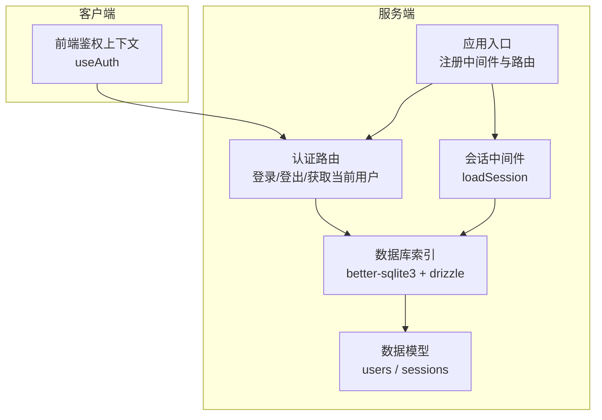
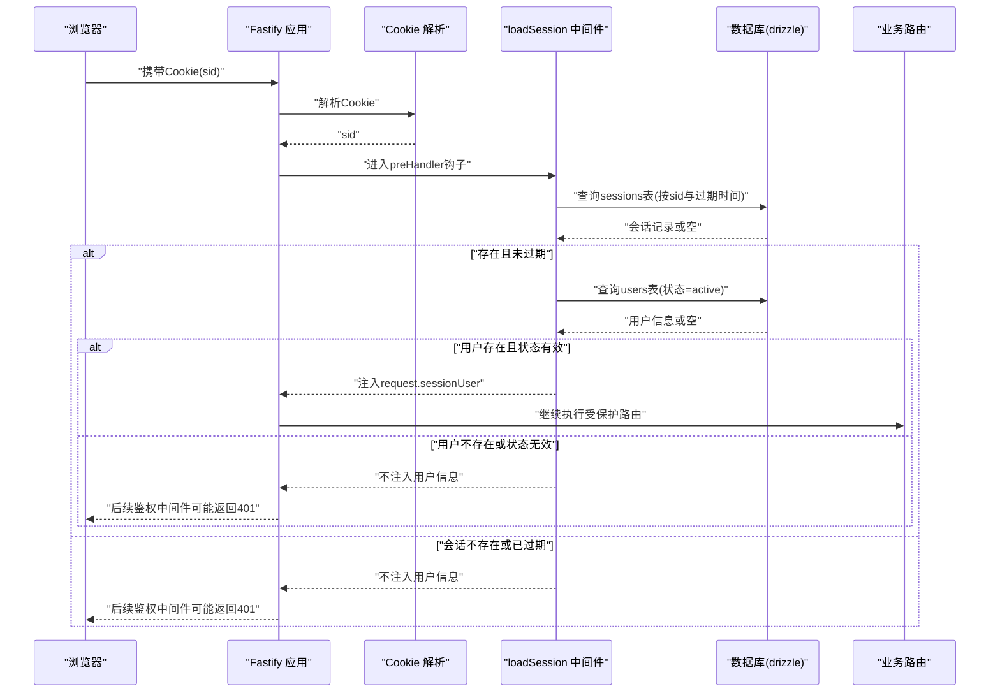
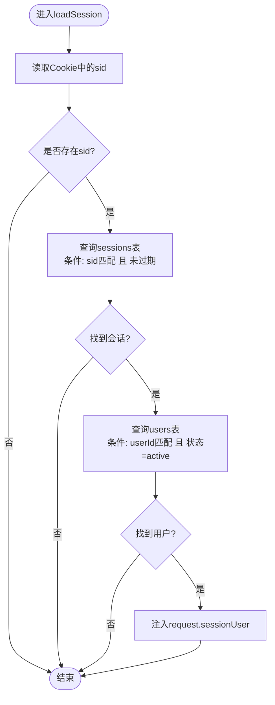
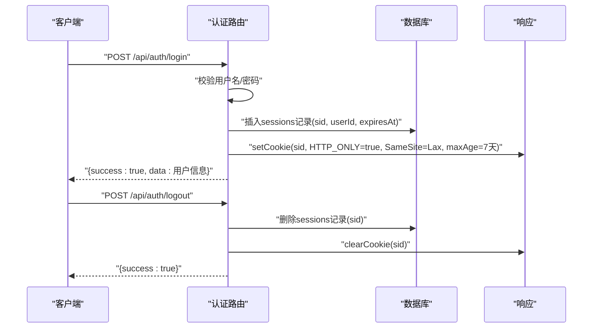
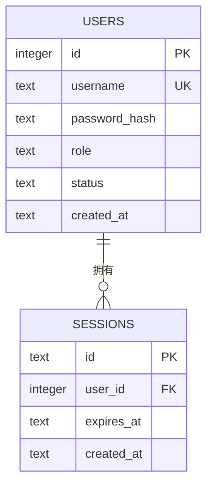
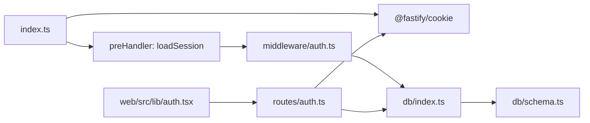

# 会话管理

<cite>
**本文引用的文件**
- [apps/server/src/index.ts](file://apps/server/src/index.ts)
- [apps/server/src/middleware/auth.ts](file://apps/server/src/middleware/auth.ts)
- [apps/server/src/routes/auth.ts](file://apps/server/src/routes/auth.ts)
- [apps/server/src/db/schema.ts](file://apps/server/src/db/schema.ts)
- [apps/server/src/db/index.ts](file://apps/server/src/db/index.ts)
- [apps/server/src/routes/activation.ts](file://apps/server/src/routes/activation.ts)
- [apps/server/src/routes/admin.ts](file://apps/server/src/routes/admin.ts)
- [apps/server/src/middleware/audit.ts](file://apps/server/src/middleware/audit.ts)
- [apps/web/src/lib/auth.tsx](file://apps/web/src/lib/auth.tsx)
</cite>

## 目录
1. [简介](#简介)
2. [项目结构](#项目结构)
3. [核心组件](#核心组件)
4. [架构总览](#架构总览)
5. [详细组件分析](#详细组件分析)
6. [依赖关系分析](#依赖关系分析)
7. [性能考量](#性能考量)
8. [故障排除指南](#故障排除指南)
9. [结论](#结论)
10. [附录](#附录)

## 简介
本文件面向ZBH2平台的会话管理系统，聚焦于基于HTTP-only Cookie的会话机制实现与最佳实践。内容涵盖：
- sid（会话标识）的生成、存储与验证流程
- 会话数据结构与生命周期（过期时间与清理）
- loadSession中间件从Cookie解析到用户信息装载的完整工作流
- 安全特性：XSS与CSRF防护要点
- 会话状态检查、用户状态验证与会话续期策略
- 最佳实践与常见问题排查

## 项目结构
会话管理相关代码主要分布在以下模块：
- 应用入口与中间件注册：在应用启动时注册Cookie解析与全局会话加载中间件
- 会话中间件：负责从请求Cookie中读取sid，校验有效期，并将用户信息注入请求上下文
- 认证路由：处理登录/登出，生成并设置sid Cookie，写入会话记录
- 数据模型：定义users与sessions表结构
- 前端鉴权上下文：通过API刷新当前用户状态

图表来源
- [apps/server/src/index.ts:29-50](file://apps/server/src/index.ts#L29-L50)
- [apps/server/src/middleware/auth.ts:17-40](file://apps/server/src/middleware/auth.ts#L17-L40)
- [apps/server/src/routes/auth.ts:9-50](file://apps/server/src/routes/auth.ts#L9-L50)
- [apps/server/src/db/index.ts:10-15](file://apps/server/src/db/index.ts#L10-L15)
- [apps/server/src/db/schema.ts:3-17](file://apps/server/src/db/schema.ts#L3-L17)
- [apps/web/src/lib/auth.tsx:20-52](file://apps/web/src/lib/auth.tsx#L20-L52)

章节来源
- [apps/server/src/index.ts:29-50](file://apps/server/src/index.ts#L29-L50)
- [apps/server/src/db/schema.ts:3-17](file://apps/server/src/db/schema.ts#L3-L17)

## 核心组件
- 会话用户类型与请求扩展
  - 在Fastify请求类型中扩展了可选的会话用户字段，用于在后续处理器中直接访问已认证用户信息
- 会话中间件
  - 从Cookie读取sid
  - 查询会话表并校验过期时间
  - 查询用户表并校验状态为“active”
  - 将用户信息注入到请求对象，供后续路由使用
- 认证路由
  - 登录：校验凭据，生成sid，写入会话表，设置HTTP-only Cookie
  - 登出：删除对应会话记录，清除Cookie
  - 获取当前用户：返回当前会话绑定的用户信息
- 数据模型
  - users：用户基本信息、角色、状态
  - sessions：会话主键为sid，关联用户ID，带过期时间与创建时间

章节来源
- [apps/server/src/middleware/auth.ts:5-15](file://apps/server/src/middleware/auth.ts#L5-L15)
- [apps/server/src/middleware/auth.ts:17-40](file://apps/server/src/middleware/auth.ts#L17-L40)
- [apps/server/src/routes/auth.ts:9-50](file://apps/server/src/routes/auth.ts#L9-L50)
- [apps/server/src/db/schema.ts:3-17](file://apps/server/src/db/schema.ts#L3-L17)

## 架构总览
下图展示了从浏览器发起请求到服务端完成会话加载与鉴权的整体流程。

图表来源
- [apps/server/src/index.ts:37](file://apps/server/src/index.ts#L37)
- [apps/server/src/middleware/auth.ts:17-40](file://apps/server/src/middleware/auth.ts#L17-L40)
- [apps/server/src/db/schema.ts:12-17](file://apps/server/src/db/schema.ts#L12-L17)

## 详细组件分析

### 会话中间件：loadSession
- 输入：Fastify请求对象（包含Cookie）
- 处理逻辑：
  - 读取sid
  - 查询sessions表，条件为sid匹配且未过期
  - 若存在会话，再查询users表，条件为用户ID匹配且状态为“active”
  - 将用户信息注入到请求对象，供后续路由使用
- 输出：无直接返回值，通过修改请求上下文影响后续处理

图表来源
- [apps/server/src/middleware/auth.ts:17-40](file://apps/server/src/middleware/auth.ts#L17-L40)

章节来源
- [apps/server/src/middleware/auth.ts:17-40](file://apps/server/src/middleware/auth.ts#L17-L40)

### 认证路由：登录/登出/获取当前用户
- 登录
  - 校验用户名与密码
  - 生成sid（长度32）
  - 写入sessions表（设置过期时间为7天后）
  - 设置HTTP-only Cookie（路径/，SameSite=Lax，maxAge=7天）
  - 返回用户信息
- 登出
  - 读取sid并删除对应会话记录
  - 清除sid Cookie
- 获取当前用户
  - 若存在会话用户则返回，否则返回null

图表来源
- [apps/server/src/routes/auth.ts:9-50](file://apps/server/src/routes/auth.ts#L9-L50)

章节来源
- [apps/server/src/routes/auth.ts:9-50](file://apps/server/src/routes/auth.ts#L9-L50)

### 数据模型：users 与 sessions
- users
  - 字段：id、username（唯一）、passwordHash、role、status、createdAt
  - 约束：role枚举为admin或user；status枚举为active或disabled
- sessions
  - 字段：id（sid为主键）、userId（外键，级联删除）、expiresAt、createdAt
  - 约束：expiresAt为过期时间

图表来源
- [apps/server/src/db/schema.ts:3-17](file://apps/server/src/db/schema.ts#L3-L17)

章节来源
- [apps/server/src/db/schema.ts:3-17](file://apps/server/src/db/schema.ts#L3-L17)

### 前端鉴权上下文：useAuth
- 提供登录、登出、刷新当前用户状态的能力
- 刷新逻辑：调用GET /api/auth/me，根据返回值更新本地用户状态
- 登录成功后设置用户状态；登出后清空用户状态

章节来源
- [apps/web/src/lib/auth.tsx:20-52](file://apps/web/src/lib/auth.tsx#L20-L52)

### 鉴权中间件：requireAuth 与 requireAdmin
- requireAuth：若请求未注入sessionUser，则返回401
- requireAdmin：在requireAuth基础上进一步校验角色是否为admin，否则返回403

章节来源
- [apps/server/src/middleware/auth.ts:42-55](file://apps/server/src/middleware/auth.ts#L42-L55)

### 使用会话的受保护路由示例
- 激活码申领与查询：在路由上挂载requireAuth，直接从request.sessionUser读取用户ID
- 管理员路由：在路由组上挂载requireAdmin，进行管理员权限校验

章节来源
- [apps/server/src/routes/activation.ts:8-93](file://apps/server/src/routes/activation.ts#L8-L93)
- [apps/server/src/routes/admin.ts:16](file://apps/server/src/routes/admin.ts#L16)

## 依赖关系分析
- 应用入口
  - 注册@fastify/cookie以启用Cookie解析
  - 注册loadSession为preHandler钩子，作用于所有路由
  - 注册认证与业务路由
- 会话中间件
  - 依赖数据库连接与schema定义
  - 依赖请求Cookie中的sid
- 认证路由
  - 依赖users与sessions表
  - 依赖Cookie插件设置/清除sid
- 前端
  - 通过API与后端交互，间接依赖会话机制

图表来源
- [apps/server/src/index.ts:29-50](file://apps/server/src/index.ts#L29-L50)
- [apps/server/src/middleware/auth.ts:17-40](file://apps/server/src/middleware/auth.ts#L17-L40)
- [apps/server/src/routes/auth.ts:9-50](file://apps/server/src/routes/auth.ts#L9-L50)
- [apps/server/src/db/index.ts:10-15](file://apps/server/src/db/index.ts#L10-L15)
- [apps/server/src/db/schema.ts:3-17](file://apps/server/src/db/schema.ts#L3-L17)
- [apps/web/src/lib/auth.tsx:20-52](file://apps/web/src/lib/auth.tsx#L20-L52)

章节来源
- [apps/server/src/index.ts:29-50](file://apps/server/src/index.ts#L29-L50)

## 性能考量
- 会话查询
  - sessions表按id(sids)查询，建议确保id列有索引（由主键保证）
  - 查询时同时比较expiresAt，建议在expiresAt上建立索引以提升筛选效率
- 用户查询
  - 通过userId关联users表，users表的id为主键，查询开销较低
- Cookie策略
  - 使用HTTP-only Cookie避免XSS读取sid
  - SameSite=Lax在大多数场景下可降低CSRF风险，但非绝对防护
- 并发与锁
  - 使用WAL模式与外键开启，有助于并发读写与一致性
- 建议
  - 对高频访问的受保护接口，可在网关层增加缓存（如Redis）短期缓存用户状态，减少数据库压力
  - 定期清理过期会话（见“自动清理机制”）

## 故障排除指南
- 无法登录或登录后立即掉线
  - 检查Cookie是否正确设置为HTTP-only且SameSite=Lax
  - 检查sessions表是否成功插入sid与过期时间
  - 检查浏览器是否允许第三方Cookie（跨域场景）
- 401未授权
  - 确认loadSession中间件是否生效（preHandler钩子）
  - 确认Cookie中sid是否存在且未过期
  - 确认用户状态为active
- 403权限不足
  - 确认用户角色为admin
- 登出后仍显示已登录
  - 确认登出接口是否删除了sessions记录并清除了Cookie
- 前端显示“未登录”
  - 确认前端refresh调用GET /api/auth/me是否成功
  - 确认CORS与跨域配置允许凭证传递

章节来源
- [apps/server/src/middleware/auth.ts:42-55](file://apps/server/src/middleware/auth.ts#L42-L55)
- [apps/server/src/routes/auth.ts:35-49](file://apps/server/src/routes/auth.ts#L35-L49)
- [apps/web/src/lib/auth.tsx:24-33](file://apps/web/src/lib/auth.tsx#L24-L33)

## 结论
ZBH2平台采用HTTP-only Cookie承载sid，结合数据库会话表实现轻量可靠的会话管理。通过全局preHandler钩子统一加载会话，配合requireAuth/requireAdmin中间件实现细粒度权限控制。整体设计简洁、安全边界清晰，适合中小型项目的会话需求。建议在生产环境中配合定期清理、索引优化与缓存策略，进一步提升性能与稳定性。

## 附录

### 会话生命周期与自动清理机制
- 生命周期
  - 登录生成sid并写入sessions表，设置7天后过期
  - 请求到达时，中间件校验过期时间，过期则视为无效
- 自动清理
  - 当前实现未包含定时任务清理过期会话
  - 建议在运维层面添加计划任务，定期删除过期会话记录，释放空间并保持查询效率

章节来源
- [apps/server/src/routes/auth.ts:23-25](file://apps/server/src/routes/auth.ts#L23-L25)
- [apps/server/src/middleware/auth.ts:23-28](file://apps/server/src/middleware/auth.ts#L23-L28)

### 安全特性与建议
- XSS防护
  - 使用HTTP-only Cookie，阻止JavaScript读取sid
  - Helmet禁用默认CSP以适配开发环境，生产环境建议启用CSP
- CSRF防护
  - SameSite=Lax在多数场景下可降低CSRF风险
  - 对关键操作（如登出、变更密码）建议引入CSRF Token
- 审计与监控
  - 可在登录/登出等关键动作记录审计日志，便于追踪异常行为

章节来源
- [apps/server/src/routes/auth.ts:26-31](file://apps/server/src/routes/auth.ts#L26-L31)
- [apps/server/src/index.ts:30](file://apps/server/src/index.ts#L30)
- [apps/server/src/middleware/audit.ts:14-27](file://apps/server/src/middleware/audit.ts#L14-L27)