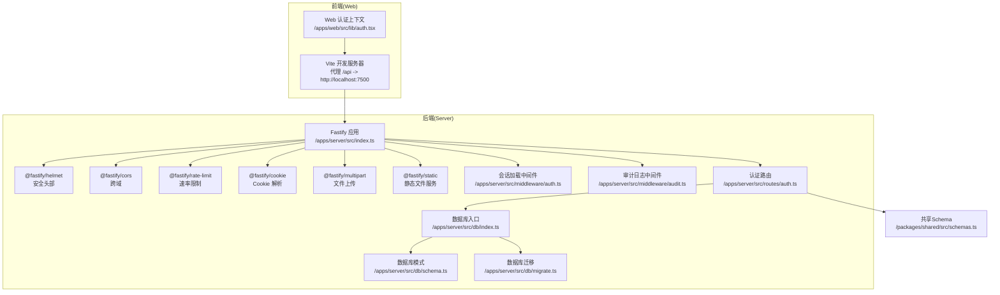
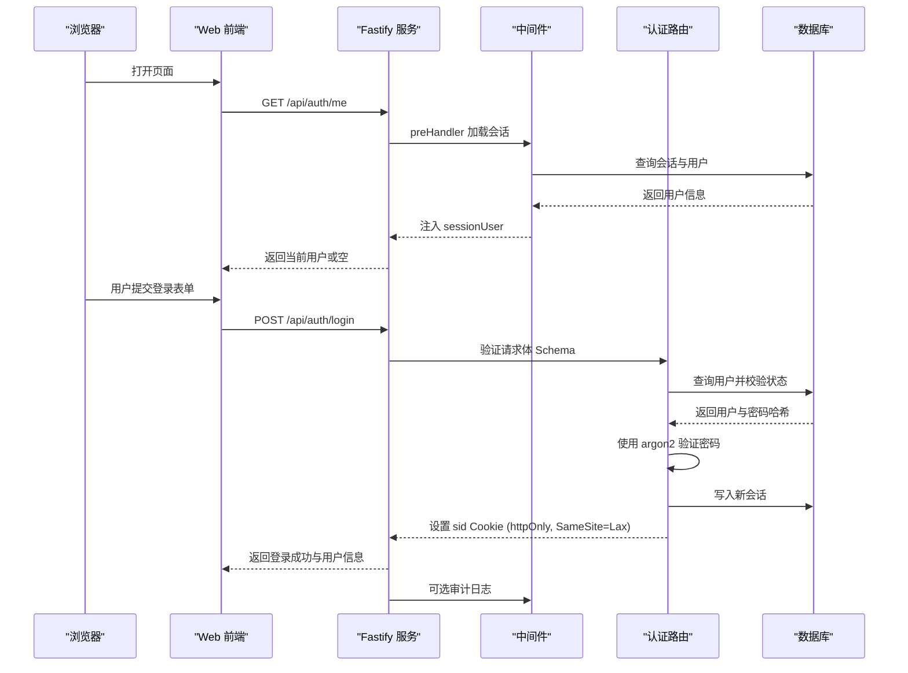
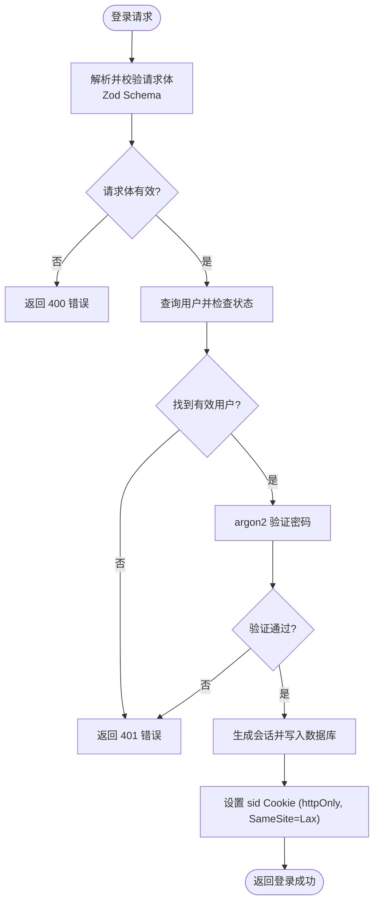
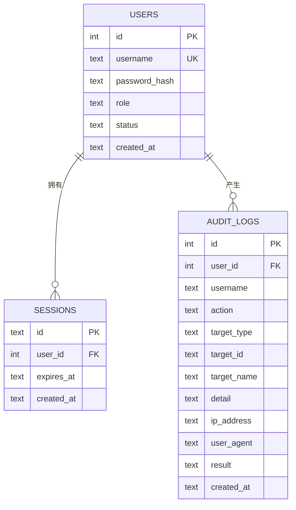
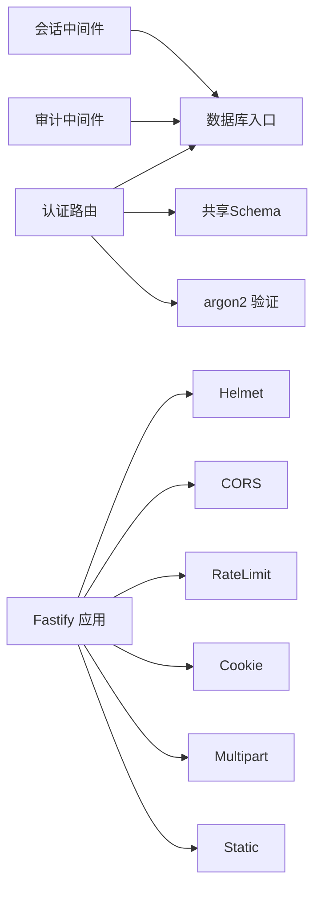

# 安全机制

<cite>
**本文引用的文件**
- [apps/server/src/index.ts](file://apps/server/src/index.ts)
- [apps/server/src/middleware/auth.ts](file://apps/server/src/middleware/auth.ts)
- [apps/server/src/middleware/audit.ts](file://apps/server/src/middleware/audit.ts)
- [apps/server/src/routes/auth.ts](file://apps/server/src/routes/auth.ts)
- [apps/server/src/db/schema.ts](file://apps/server/src/db/schema.ts)
- [apps/server/src/db/index.ts](file://apps/server/src/db/index.ts)
- [apps/server/src/db/migrate.ts](file://apps/server/src/db/migrate.ts)
- [apps/web/src/lib/auth.tsx](file://apps/web/src/lib/auth.tsx)
- [apps/web/vite.config.ts](file://apps/web/vite.config.ts)
- [packages/shared/src/schemas.ts](file://packages/shared/src/schemas.ts)
</cite>

## 目录
1. [简介](#简介)
2. [项目结构](#项目结构)
3. [核心组件](#核心组件)
4. [架构总览](#架构总览)
5. [详细组件分析](#详细组件分析)
6. [依赖关系分析](#依赖关系分析)
7. [性能考量](#性能考量)
8. [故障排查指南](#故障排查指南)
9. [结论](#结论)
10. [附录](#附录)

## 简介
本文件面向ZBH2平台的安全机制，围绕认证与会话、密码哈希算法（argon2id）、输入验证与CSP、CSRF防护、SQL注入与命令注入防护、安全中间件与头部、HTTPS与静态资源安全、审计与威胁检测、以及安全扫描与渗透测试实践进行系统化说明。文档在技术深度与可读性之间取得平衡，既适合安全工程师也适合开发与运维人员。

## 项目结构
后端基于Fastify，采用中间件加载会话、注册CORS/Helmet/RateLimit等安全插件，并通过路由模块化组织业务接口；前端使用Vite代理到后端API；共享包提供Zod输入校验Schema；数据库采用SQLite并通过Drizzle ORM管理迁移与模式。

图表来源
- [apps/server/src/index.ts:27-54](file://apps/server/src/index.ts#L27-L54)
- [apps/server/src/middleware/auth.ts:17-40](file://apps/server/src/middleware/auth.ts#L17-L40)
- [apps/server/src/middleware/audit.ts:3-27](file://apps/server/src/middleware/audit.ts#L3-L27)
- [apps/server/src/routes/auth.ts:8-50](file://apps/server/src/routes/auth.ts#L8-L50)
- [apps/server/src/db/index.ts:1-16](file://apps/server/src/db/index.ts#L1-L16)
- [apps/server/src/db/schema.ts:3-330](file://apps/server/src/db/schema.ts#L3-L330)
- [apps/server/src/db/migrate.ts:1-17](file://apps/server/src/db/migrate.ts#L1-L17)
- [apps/web/src/lib/auth.tsx:20-55](file://apps/web/src/lib/auth.tsx#L20-L55)
- [apps/web/vite.config.ts:4-12](file://apps/web/vite.config.ts#L4-L12)
- [packages/shared/src/schemas.ts:3-6](file://packages/shared/src/schemas.ts#L3-L6)

章节来源
- [apps/server/src/index.ts:27-54](file://apps/server/src/index.ts#L27-L54)
- [apps/web/vite.config.ts:4-12](file://apps/web/vite.config.ts#L4-L12)

## 核心组件
- 认证与会话：基于Cookie的sid会话，服务端存储会话并校验有效期与用户状态。
- 密码哈希：使用argon2（verify/hash），结合Zod输入校验与严格字段长度约束。
- 输入验证：共享Schema统一校验请求体，减少脏数据进入数据库。
- 审计日志：集中记录用户行为、目标类型、结果、IP与UA等。
- 安全中间件：Helmet/CORS/RateLimit/Cookie/Multipart/静态文件服务。
- 数据库：SQLite + Drizzle ORM，启用外键与WAL模式，迁移脚本管理结构演进。

章节来源
- [apps/server/src/middleware/auth.ts:17-55](file://apps/server/src/middleware/auth.ts#L17-L55)
- [apps/server/src/routes/auth.ts:8-50](file://apps/server/src/routes/auth.ts#L8-L50)
- [packages/shared/src/schemas.ts:3-6](file://packages/shared/src/schemas.ts#L3-L6)
- [apps/server/src/middleware/audit.ts:3-27](file://apps/server/src/middleware/audit.ts#L3-L27)
- [apps/server/src/index.ts:27-54](file://apps/server/src/index.ts#L27-L54)
- [apps/server/src/db/schema.ts:3-330](file://apps/server/src/db/schema.ts#L3-L330)
- [apps/server/src/db/index.ts:1-16](file://apps/server/src/db/index.ts#L1-L16)
- [apps/server/src/db/migrate.ts:1-17](file://apps/server/src/db/migrate.ts#L1-L17)

## 架构总览
下图展示从浏览器到后端的典型认证流程与安全控制点，包括CORS、速率限制、会话加载、Cookie设置、密码哈希验证与审计记录。

图表来源
- [apps/server/src/index.ts:29-37](file://apps/server/src/index.ts#L29-L37)
- [apps/server/src/middleware/auth.ts:17-40](file://apps/server/src/middleware/auth.ts#L17-L40)
- [apps/server/src/routes/auth.ts:8-50](file://apps/server/src/routes/auth.ts#L8-L50)
- [apps/server/src/middleware/audit.ts:3-27](file://apps/server/src/middleware/audit.ts#L3-L27)
- [packages/shared/src/schemas.ts:3-6](file://packages/shared/src/schemas.ts#L3-L6)

## 详细组件分析

### 密码哈希与选择理由（argon2id）
- 选择理由
  - argon2（特别是argon2id）是当前推荐的密码哈希算法，具备抗GPU/ASIC暴力破解能力、内存硬函数特性与可调参数（成本、并行度、时间）。
  - 在ZBH2中，登录时对客户端明文密码与数据库中的passwordHash进行验证，确保即使数据库泄露，也无法直接还原明文密码。
- 实现要点
  - 登录接口使用Zod Schema校验请求体，限定用户名与密码长度范围，避免异常输入。
  - 通过argon2的verify函数完成密码验证；成功后生成会话并写入数据库，随后设置sid Cookie。
  - 参数未在代码中显式配置，建议在生产环境通过argon2配置文件或环境变量控制内存与时间成本，以平衡安全与性能。
- 性能优化建议
  - 合理设置内存与时间成本，结合硬件能力评估；在高并发场景下，可考虑连接池与异步处理。
  - 对频繁登录失败的IP/账号实施更严格的速率限制与账户锁定策略。

图表来源
- [apps/server/src/routes/auth.ts:8-50](file://apps/server/src/routes/auth.ts#L8-L50)
- [packages/shared/src/schemas.ts:3-6](file://packages/shared/src/schemas.ts#L3-L6)

章节来源
- [apps/server/src/routes/auth.ts:8-50](file://apps/server/src/routes/auth.ts#L8-L50)
- [packages/shared/src/schemas.ts:3-6](file://packages/shared/src/schemas.ts#L3-L6)

### XSS 防护与输入验证
- 输入验证
  - 共享Schema对用户名与密码长度进行约束，防止过长或格式异常的数据进入后端。
  - 建议在渲染侧对输出进行HTML实体编码，避免将未经转义的内容直接插入DOM。
- 内容安全策略（CSP）
  - 当前禁用了默认CSP（contentSecurityPolicy: false），建议在生产环境启用并最小化许可源，仅允许必要的内联与外部资源。
- 前端安全
  - Web端通过React组件与受控表单收集输入，建议配合前端校验与防XSS库（如DOMPurify）进行二次清理。

章节来源
- [packages/shared/src/schemas.ts:3-6](file://packages/shared/src/schemas.ts#L3-L6)
- [apps/server/src/index.ts:29-30](file://apps/server/src/index.ts#L29-L30)
- [apps/web/src/lib/auth.tsx:20-55](file://apps/web/src/lib/auth.tsx#L20-L55)

### CSRF 防护
- 当前实现
  - Cookie设置为httpOnly且SameSite=Lax，有助于降低CSRF风险。
  - 未见专用CSRF Token验证逻辑。
- 建议增强
  - 引入CSRF Token（如SameSite=None + Secure + CSRF Token）并在关键写操作中校验。
  - 对于SPA，可在登录时下发CSRF Token并随请求携带。

章节来源
- [apps/server/src/routes/auth.ts:23-32](file://apps/server/src/routes/auth.ts#L23-L32)

### SQL 注入防护
- ORM与参数绑定
  - 使用Drizzle ORM进行查询与写入，所有动态值通过参数绑定，避免字符串拼接引发SQL注入。
- 模式与约束
  - 数据库模式定义了字段类型与约束，配合Schema校验，进一步降低非法数据入库风险。
- 迁移与版本控制
  - 通过迁移脚本管理数据库结构变更，避免手写DDL导致的疏漏。

图表来源
- [apps/server/src/db/schema.ts:3-330](file://apps/server/src/db/schema.ts#L3-L330)

章节来源
- [apps/server/src/db/schema.ts:3-330](file://apps/server/src/db/schema.ts#L3-L330)
- [apps/server/src/db/index.ts:1-16](file://apps/server/src/db/index.ts#L1-L16)
- [apps/server/src/db/migrate.ts:1-17](file://apps/server/src/db/migrate.ts#L1-L17)

### 命令注入防护
- 文件上传与执行
  - 服务端启用了multipart上传，最大500MB；建议对上传文件类型、大小与路径进行严格白名单与沙箱隔离。
  - 严禁将用户上传内容作为命令参数直接拼接到系统命令中；若需执行外部程序，应使用参数化与受限环境。
- 静态资源
  - 通过@fastify/static提供受控前缀的静态文件访问，避免目录穿越与越权访问。

章节来源
- [apps/server/src/index.ts:33-35](file://apps/server/src/index.ts#L33-L35)

### 安全中间件与头部
- 中间件注册
  - Helmet：提供安全头部（当前禁用CSP），建议启用并定制策略。
  - CORS：允许凭证跨域，注意origin白名单与预检缓存。
  - RateLimit：全局每分钟最多200次请求，建议按路由细化。
  - Cookie：启用解析，用于sid会话。
  - Multipart：限制上传大小。
  - Static：提供受控前缀的静态文件服务。
- 自定义扩展
  - 可在preHandler钩子中增加IP黑名单、User-Agent白名单、请求体签名校验等。
  - 对敏感路由（如管理端）单独注册更严格的RateLimit与CORS策略。

章节来源
- [apps/server/src/index.ts:29-54](file://apps/server/src/index.ts#L29-L54)

### HTTPS 强制跳转与安全头
- 当前状态
  - 开发环境通过Vite本地代理；生产环境未见强制HTTPS跳转与Strict-Transport-Security等头部。
- 建议
  - 在反向代理或应用层添加HSTS头部与301重定向至HTTPS。
  - 同源策略与安全Cookie（Secure/SameSite）配合使用，确保传输层加密与跨站请求安全。

章节来源
- [apps/web/vite.config.ts:4-12](file://apps/web/vite.config.ts#L4-L12)
- [apps/server/src/index.ts:29-30](file://apps/server/src/index.ts#L29-L30)

### 敏感信息过滤
- 日志与审计
  - 审计日志记录detail字段为JSON序列化，建议对敏感字段（如密码、密钥）在入库前脱敏或不记录。
- Cookie与响应
  - sid使用httpOnly与SameSite=Lax，避免XSS窃取；建议在生产环境增加Secure标志。

章节来源
- [apps/server/src/middleware/audit.ts:15-26](file://apps/server/src/middleware/audit.ts#L15-L26)
- [apps/server/src/routes/auth.ts:23-32](file://apps/server/src/routes/auth.ts#L23-L32)

### 安全审计日志与威胁检测
- 审计日志
  - 统一记录用户、动作、目标类型/ID/名称、详情、IP与UA、结果等，便于回溯与取证。
- 威胁检测
  - 建议对异常登录（多IP、失败率突增）、高频写操作、管理端异常访问等建立规则与告警。
  - 结合日志聚合与SIEM工具进行关联分析。

章节来源
- [apps/server/src/middleware/audit.ts:3-27](file://apps/server/src/middleware/audit.ts#L3-L27)
- [apps/server/src/db/schema.ts:301-314](file://apps/server/src/db/schema.ts#L301-L314)

### 安全漏洞扫描与渗透测试指南
- 扫描清单
  - 依赖漏洞：定期运行pnpm audit与第三方依赖扫描。
  - 配置审计：检查CORS/RateLimit/HSTS/Content-Security-Policy等配置。
  - 业务逻辑：重点测试认证绕过、越权访问、文件上传、SQL注入、命令注入、XSS/CSRF等。
- 渗透测试步骤
  - 被动信息收集：域名、子域、证书、历史DNS记录。
  - 主动探测：端口扫描、服务识别、目录爆破、参数注入测试。
  - 权限提升：尝试弱口令、越权、会话劫持、CSRF。
  - 报告与修复：形成修复优先级清单并回归验证。

[本节为通用指导，无需特定文件引用]

## 依赖关系分析
- 组件耦合
  - 认证路由依赖数据库与共享Schema；会话加载中间件贯穿所有路由；审计中间件可按需启用。
- 外部依赖
  - @fastify/helmet、@fastify/cors、@fastify/rate-limit、@fastify/cookie、@fastify/multipart、@fastify/static。
- 潜在风险
  - 未启用CSP可能引入XSS；未启用HSTS与Secure Cookie可能导致中间人攻击与会话泄露。

图表来源
- [apps/server/src/routes/auth.ts:8-50](file://apps/server/src/routes/auth.ts#L8-L50)
- [apps/server/src/middleware/auth.ts:17-40](file://apps/server/src/middleware/auth.ts#L17-L40)
- [apps/server/src/middleware/audit.ts:3-27](file://apps/server/src/middleware/audit.ts#L3-L27)
- [apps/server/src/db/index.ts:1-16](file://apps/server/src/db/index.ts#L1-L16)
- [packages/shared/src/schemas.ts:3-6](file://packages/shared/src/schemas.ts#L3-L6)
- [apps/server/src/index.ts:29-54](file://apps/server/src/index.ts#L29-L54)

章节来源
- [apps/server/src/index.ts:29-54](file://apps/server/src/index.ts#L29-L54)

## 性能考量
- 密码验证
  - 合理设置argon2成本参数，避免在高并发场景造成延迟放大。
- 速率限制
  - 全局RateLimit已启用，建议按路由细化（如登录接口单独更严）。
- 数据库
  - SQLite+WAL+外键已开启；建议对热点查询建立索引并分页处理。
- 上传与静态资源
  - 限制上传大小并启用流式处理；静态资源前缀化，避免目录遍历。

[本节提供一般性建议，无需特定文件引用]

## 故障排查指南
- 登录失败
  - 检查请求体是否符合Schema；确认用户状态为active；核对passwordHash是否正确。
- 会话无效
  - 检查sid Cookie是否存在且未过期；确认会话表中存在对应记录。
- 审计日志缺失
  - 确认审计中间件是否注册；检查数据库连接与表结构。
- CORS/跨域问题
  - 检查CORS配置与预检请求；确保凭证跨域开启。
- 上传失败
  - 检查multipart大小限制与文件类型白名单；确认静态服务前缀配置。

章节来源
- [apps/server/src/routes/auth.ts:8-50](file://apps/server/src/routes/auth.ts#L8-L50)
- [apps/server/src/middleware/auth.ts:17-40](file://apps/server/src/middleware/auth.ts#L17-L40)
- [apps/server/src/middleware/audit.ts:3-27](file://apps/server/src/middleware/audit.ts#L3-L27)
- [apps/server/src/index.ts:29-54](file://apps/server/src/index.ts#L29-L54)

## 结论
ZBH2平台在认证、输入验证、会话管理与审计方面具备良好基础，但在CSP启用、CSRF Token、HSTS与敏感信息脱敏等方面仍有改进空间。建议尽快补齐安全头部与策略，强化CSRF防护与HTTPS强制跳转，并完善漏洞扫描与渗透测试流程，持续提升整体安全水平。

[本节为总结，无需特定文件引用]

## 附录
- 关键实现位置参考
  - 认证与会话：[apps/server/src/middleware/auth.ts:17-40](file://apps/server/src/middleware/auth.ts#L17-L40)
  - 登录流程与Cookie设置：[apps/server/src/routes/auth.ts:8-50](file://apps/server/src/routes/auth.ts#L8-L50)
  - 审计日志：[apps/server/src/middleware/audit.ts:3-27](file://apps/server/src/middleware/audit.ts#L3-L27)
  - 安全中间件注册：[apps/server/src/index.ts:29-54](file://apps/server/src/index.ts#L29-L54)
  - 数据库模式与入口：[apps/server/src/db/schema.ts:3-330](file://apps/server/src/db/schema.ts#L3-L330), [apps/server/src/db/index.ts:1-16](file://apps/server/src/db/index.ts#L1-L16)
  - 前端认证上下文：[apps/web/src/lib/auth.tsx:20-55](file://apps/web/src/lib/auth.tsx#L20-L55)
  - 开发代理配置：[apps/web/vite.config.ts:4-12](file://apps/web/vite.config.ts#L4-L12)

[本节为补充索引，无需特定文件引用]