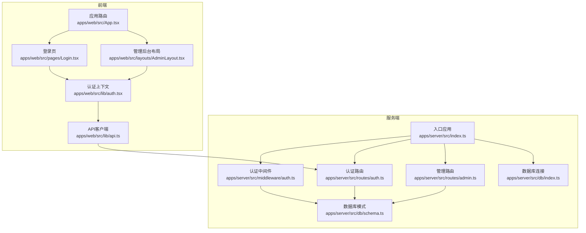
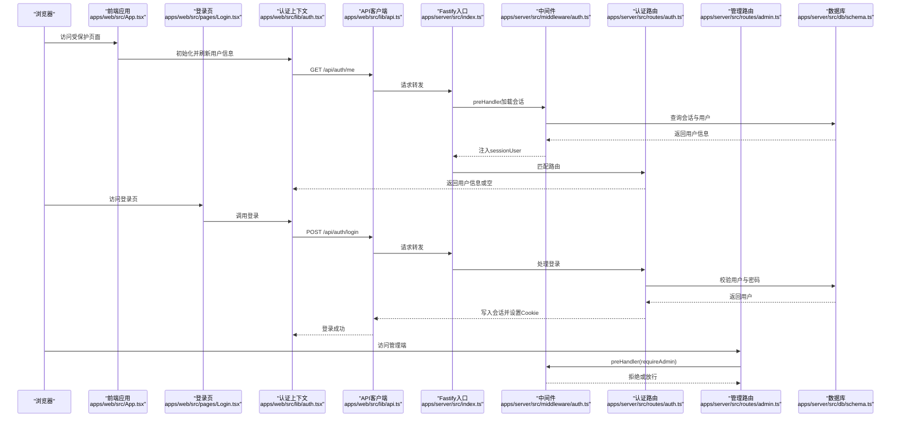
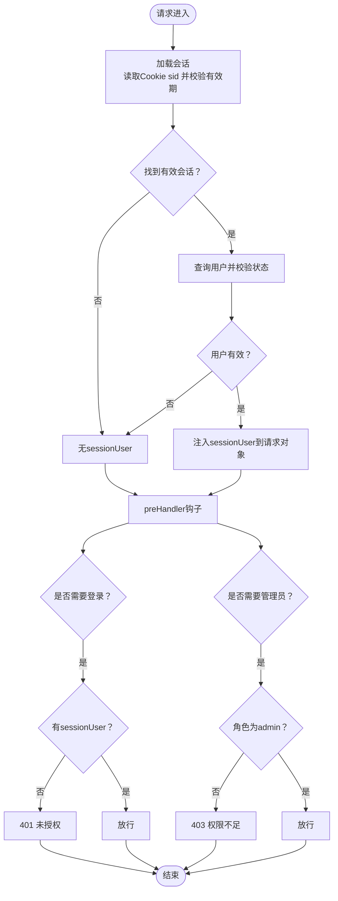
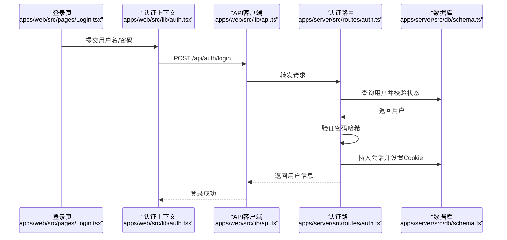
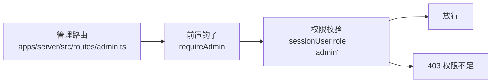
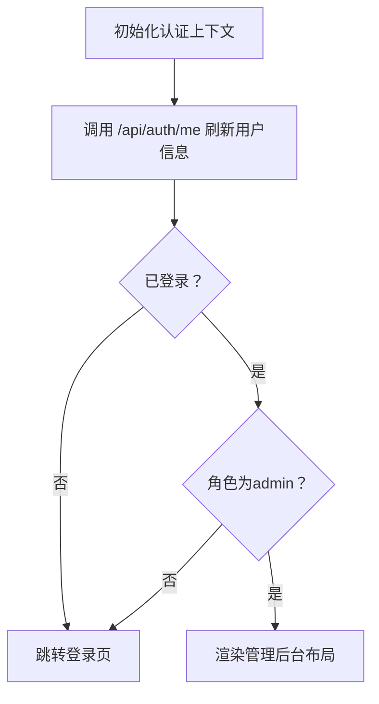
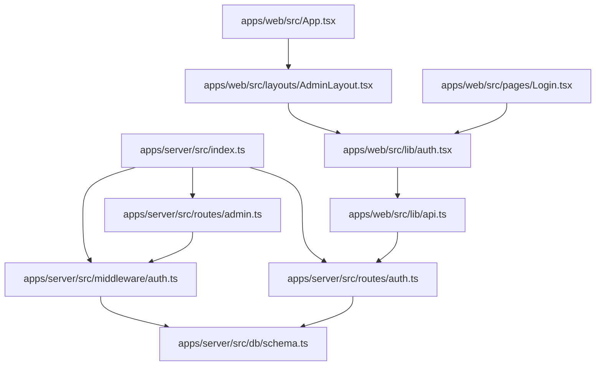

# 权限控制

<cite>
**本文引用的文件**
- [apps/server/src/middleware/auth.ts](file://apps/server/src/middleware/auth.ts)
- [apps/server/src/db/schema.ts](file://apps/server/src/db/schema.ts)
- [apps/server/src/routes/admin.ts](file://apps/server/src/routes/admin.ts)
- [apps/server/src/routes/auth.ts](file://apps/server/src/routes/auth.ts)
- [apps/server/src/db/index.ts](file://apps/server/src/db/index.ts)
- [apps/server/src/index.ts](file://apps/server/src/index.ts)
- [apps/web/src/lib/auth.tsx](file://apps/web/src/lib/auth.tsx)
- [apps/web/src/lib/api.ts](file://apps/web/src/lib/api.ts)
- [packages/shared/src/types.ts](file://packages/shared/src/types.ts)
- [packages/shared/src/schemas.ts](file://packages/shared/src/schemas.ts)
- [apps/web/src/pages/Login.tsx](file://apps/web/src/pages/Login.tsx)
- [apps/web/src/layouts/AdminLayout.tsx](file://apps/web/src/layouts/AdminLayout.tsx)
- [apps/web/src/App.tsx](file://apps/web/src/App.tsx)
</cite>

## 目录
1. [简介](#简介)
2. [项目结构](#项目结构)
3. [核心组件](#核心组件)
4. [架构总览](#架构总览)
5. [详细组件分析](#详细组件分析)
6. [依赖关系分析](#依赖关系分析)
7. [性能考虑](#性能考虑)
8. [故障排查指南](#故障排查指南)
9. [结论](#结论)
10. [附录](#附录)

## 简介
本文件面向ZBH2平台的权限控制系统，围绕基于角色的访问控制（RBAC）模型进行系统化说明。文档覆盖以下要点：
- 角色定义：管理员与普通用户的职责边界与默认角色策略
- 中间件实现：requireAuth与requireAdmin的原理与使用方式
- 权限验证流程：从请求拦截到权限检查的完整链路
- 权限矩阵与访问控制清单：不同角色可访问的功能模块
- 权限扩展方案：权限继承、组合与动态控制思路
- 路由级访问控制：API端点的权限配置与前端路由守卫
- 权限调试与问题排查：常见问题定位与修复建议

## 项目结构
ZBH2采用前后端分离架构，权限控制贯穿服务端中间件、数据库模式、路由层以及前端上下文与布局守卫：
- 服务端
  - 中间件：会话加载与权限校验
  - 数据库：用户、会话、审计等核心表
  - 路由：按功能域划分，部分路由挂载管理员前置钩子
- 前端
  - 认证上下文：统一的登录/登出/刷新逻辑
  - API客户端：携带凭据的HTTP封装
  - 路由与布局：基于角色的导航与页面守卫

图表来源
- [apps/server/src/index.ts:1-60](file://apps/server/src/index.ts#L1-L60)
- [apps/server/src/middleware/auth.ts:1-56](file://apps/server/src/middleware/auth.ts#L1-L56)
- [apps/server/src/routes/auth.ts:1-51](file://apps/server/src/routes/auth.ts#L1-L51)
- [apps/server/src/routes/admin.ts:1-279](file://apps/server/src/routes/admin.ts#L1-L279)
- [apps/server/src/db/schema.ts:1-330](file://apps/server/src/db/schema.ts#L1-L330)
- [apps/server/src/db/index.ts:1-16](file://apps/server/src/db/index.ts#L1-L16)
- [apps/web/src/App.tsx:1-80](file://apps/web/src/App.tsx#L1-L80)
- [apps/web/src/pages/Login.tsx:1-47](file://apps/web/src/pages/Login.tsx#L1-L47)
- [apps/web/src/layouts/AdminLayout.tsx:1-127](file://apps/web/src/layouts/AdminLayout.tsx#L1-L127)
- [apps/web/src/lib/auth.tsx:1-55](file://apps/web/src/lib/auth.tsx#L1-L55)
- [apps/web/src/lib/api.ts:1-16](file://apps/web/src/lib/api.ts#L1-L16)

章节来源
- [apps/server/src/index.ts:1-60](file://apps/server/src/index.ts#L1-L60)
- [apps/server/src/db/schema.ts:1-330](file://apps/server/src/db/schema.ts#L1-L330)

## 核心组件
- 会话与角色模型
  - 服务端通过会话加载中间件将当前用户注入请求对象，并以“admin”或“user”角色标识区分权限等级
  - 用户状态与角色存储于数据库users表，会话信息存储于sessions表
- 认证中间件
  - requireAuth：要求已登录
  - requireAdmin：要求管理员角色
- 路由级权限
  - 管理端路由在注册时挂载requireAdmin前置钩子，确保仅管理员可访问
- 前端认证上下文
  - 统一处理登录、登出、用户信息刷新；管理后台布局对非管理员进行重定向

章节来源
- [apps/server/src/middleware/auth.ts:1-56](file://apps/server/src/middleware/auth.ts#L1-L56)
- [apps/server/src/db/schema.ts:3-17](file://apps/server/src/db/schema.ts#L3-L17)
- [apps/server/src/routes/admin.ts:15-16](file://apps/server/src/routes/admin.ts#L15-L16)
- [apps/web/src/lib/auth.tsx:1-55](file://apps/web/src/lib/auth.tsx#L1-L55)
- [apps/web/src/layouts/AdminLayout.tsx:88-97](file://apps/web/src/layouts/AdminLayout.tsx#L88-L97)

## 架构总览
下图展示从请求进入服务端到权限判定的完整链路，以及前端侧的认证与路由守卫。

图表来源
- [apps/server/src/index.ts:29-50](file://apps/server/src/index.ts#L29-L50)
- [apps/server/src/middleware/auth.ts:17-55](file://apps/server/src/middleware/auth.ts#L17-L55)
- [apps/server/src/routes/auth.ts:9-49](file://apps/server/src/routes/auth.ts#L9-L49)
- [apps/server/src/routes/admin.ts:15-16](file://apps/server/src/routes/admin.ts#L15-L16)
- [apps/web/src/lib/auth.tsx:20-52](file://apps/web/src/lib/auth.tsx#L20-L52)
- [apps/web/src/pages/Login.tsx:13-24](file://apps/web/src/pages/Login.tsx#L13-L24)
- [apps/web/src/lib/api.ts:1-16](file://apps/web/src/lib/api.ts#L1-L16)

## 详细组件分析

### 会话加载与权限中间件
- 会话加载
  - 从Cookie读取sid，查询未过期且用户状态为“active”的会话，将用户信息注入请求对象
- 权限中间件
  - requireAuth：若无sessionUser则返回未授权
  - requireAdmin：除requireAuth外，还校验角色必须为“admin”，否则返回权限不足

图表来源
- [apps/server/src/middleware/auth.ts:17-55](file://apps/server/src/middleware/auth.ts#L17-L55)
- [apps/server/src/db/schema.ts:3-17](file://apps/server/src/db/schema.ts#L3-L17)

章节来源
- [apps/server/src/middleware/auth.ts:17-55](file://apps/server/src/middleware/auth.ts#L17-L55)
- [apps/server/src/db/schema.ts:3-17](file://apps/server/src/db/schema.ts#L3-L17)

### 认证流程与会话管理
- 登录
  - 校验输入参数，查询用户并校验状态
  - 验证密码哈希，生成会话ID与过期时间，写入会话表并设置Cookie
- 登出
  - 删除对应会话并清除Cookie
- 当前用户
  - 未登录返回空，已登录返回用户简要信息

图表来源
- [apps/web/src/pages/Login.tsx:13-24](file://apps/web/src/pages/Login.tsx#L13-L24)
- [apps/web/src/lib/auth.tsx:37-45](file://apps/web/src/lib/auth.tsx#L37-L45)
- [apps/web/src/lib/api.ts:3](file://apps/web/src/lib/api.ts#L3)
- [apps/server/src/routes/auth.ts:9-42](file://apps/server/src/routes/auth.ts#L9-L42)
- [apps/server/src/db/schema.ts:3-17](file://apps/server/src/db/schema.ts#L3-L17)

章节来源
- [apps/server/src/routes/auth.ts:9-49](file://apps/server/src/routes/auth.ts#L9-L49)
- [apps/web/src/lib/auth.tsx:20-52](file://apps/web/src/lib/auth.tsx#L20-L52)

### 管理端路由与管理员权限
- 管理端路由在注册时挂载requireAdmin前置钩子，确保仅管理员可访问
- 管理端涵盖软件、文档、激活、资产、工单、云服务、AI知识库、监控、报表、审计等多个模块

图表来源
- [apps/server/src/routes/admin.ts:15-16](file://apps/server/src/routes/admin.ts#L15-L16)
- [apps/server/src/middleware/auth.ts:48-55](file://apps/server/src/middleware/auth.ts#L48-L55)

章节来源
- [apps/server/src/routes/admin.ts:15-16](file://apps/server/src/routes/admin.ts#L15-L16)

### 前端认证上下文与路由守卫
- 认证上下文负责登录、登出、用户信息刷新
- 管理后台布局在渲染时检测用户角色，非管理员自动跳转至登录页并携带重定向参数

图表来源
- [apps/web/src/lib/auth.tsx:20-35](file://apps/web/src/lib/auth.tsx#L20-L35)
- [apps/web/src/layouts/AdminLayout.tsx:88-97](file://apps/web/src/layouts/AdminLayout.tsx#L88-L97)

章节来源
- [apps/web/src/lib/auth.tsx:1-55](file://apps/web/src/lib/auth.tsx#L1-L55)
- [apps/web/src/layouts/AdminLayout.tsx:88-97](file://apps/web/src/layouts/AdminLayout.tsx#L88-L97)

## 依赖关系分析
- 服务端
  - 入口应用注册中间件与各路由模块
  - 中间件依赖数据库schema进行会话与用户查询
  - 管理路由依赖中间件进行权限前置校验
- 前端
  - 认证上下文依赖API客户端发起HTTP请求
  - 管理后台布局依赖认证上下文判断角色并进行路由跳转

图表来源
- [apps/server/src/index.ts:29-50](file://apps/server/src/index.ts#L29-L50)
- [apps/server/src/middleware/auth.ts:17-55](file://apps/server/src/middleware/auth.ts#L17-L55)
- [apps/server/src/routes/admin.ts:15-16](file://apps/server/src/routes/admin.ts#L15-L16)
- [apps/server/src/routes/auth.ts:9-49](file://apps/server/src/routes/auth.ts#L9-L49)
- [apps/web/src/App.tsx:38-79](file://apps/web/src/App.tsx#L38-L79)
- [apps/web/src/layouts/AdminLayout.tsx:88-97](file://apps/web/src/layouts/AdminLayout.tsx#L88-L97)
- [apps/web/src/lib/auth.tsx:20-52](file://apps/web/src/lib/auth.tsx#L20-L52)
- [apps/web/src/lib/api.ts:3](file://apps/web/src/lib/api.ts#L3)

章节来源
- [apps/server/src/index.ts:29-50](file://apps/server/src/index.ts#L29-L50)
- [apps/web/src/App.tsx:38-79](file://apps/web/src/App.tsx#L38-L79)

## 性能考虑
- 会话查询与用户状态校验均为O(1)数据库操作，建议保持索引与合理字段选择
- 会话有效期与Cookie安全属性已在服务端设置，避免跨站脚本与劫持风险
- 建议对高频接口启用缓存与分页，减少不必要的全量数据传输
- 前端在认证上下文中统一处理401响应，避免重复请求与闪烁

## 故障排查指南
- 401 未授权
  - 现象：访问受保护资源返回未授权
  - 排查：确认Cookie中sid是否存在且未过期；检查会话表记录与用户状态
  - 参考路径
    - [apps/server/src/middleware/auth.ts:42-46](file://apps/server/src/middleware/auth.ts#L42-L46)
    - [apps/server/src/routes/auth.ts:35-42](file://apps/server/src/routes/auth.ts#L35-L42)
- 403 权限不足
  - 现象：管理员端返回权限不足
  - 排查：确认sessionUser角色是否为admin；检查用户表role字段
  - 参考路径
    - [apps/server/src/middleware/auth.ts:48-55](file://apps/server/src/middleware/auth.ts#L48-L55)
    - [apps/server/src/db/schema.ts:7](file://apps/server/src/db/schema.ts#L7)
- 登录失败
  - 现象：用户名或密码错误
  - 排查：确认用户名存在且状态为active；核对密码哈希验证
  - 参考路径
    - [apps/server/src/routes/auth.ts:14-22](file://apps/server/src/routes/auth.ts#L14-L22)
- 前端无法进入管理后台
  - 现象：非管理员被重定向至登录页
  - 排查：确认后端返回的sessionUser角色；检查前端路由守卫逻辑
  - 参考路径
    - [apps/web/src/layouts/AdminLayout.tsx:88-97](file://apps/web/src/layouts/AdminLayout.tsx#L88-L97)

章节来源
- [apps/server/src/middleware/auth.ts:42-55](file://apps/server/src/middleware/auth.ts#L42-L55)
- [apps/server/src/routes/auth.ts:14-22](file://apps/server/src/routes/auth.ts#L14-L22)
- [apps/web/src/layouts/AdminLayout.tsx:88-97](file://apps/web/src/layouts/AdminLayout.tsx#L88-L97)

## 结论
ZBH2平台的权限控制以“会话+角色”为核心，通过服务端中间件与路由前置钩子实现统一的权限拦截，前端配合认证上下文与路由守卫强化用户体验与安全性。当前实现满足基础RBAC需求，后续可在权限粒度细化、动态权限与审计追踪方面进一步扩展。

## 附录

### 角色与默认策略
- 角色
  - admin：管理员
  - user：普通用户
- 默认策略
  - 新建用户默认为user
  - 管理端路由默认仅admin可访问

章节来源
- [packages/shared/src/types.ts:1-2](file://packages/shared/src/types.ts#L1-L2)
- [apps/server/src/db/schema.ts:7](file://apps/server/src/db/schema.ts#L7)
- [apps/server/src/routes/admin.ts:15-16](file://apps/server/src/routes/admin.ts#L15-L16)

### 权限矩阵（示例）
- 认证与会话
  - 登录/登出/当前用户：任意已登录用户可用
- 管理端模块（需管理员）
  - 软件分类/软件条目/文档分类/文档条目/激活产品/激活码/发放记录/用户管理/文件列表/资产/工单/云服务/报表/FAQ/监控/审计
- 公共模块（无需登录）
  - 首页/软件/帮助/激活/我的激活码/工单/云服务/AI聊天

章节来源
- [apps/server/src/routes/admin.ts:18-278](file://apps/server/src/routes/admin.ts#L18-L278)
- [apps/web/src/App.tsx:40-79](file://apps/web/src/App.tsx#L40-L79)

### 动态权限与扩展建议
- 权限继承与组合
  - 在用户表引入角色组/标签，结合权限白名单/黑名单实现更细粒度控制
- 动态权限控制
  - 引入权限声明与运行时校验，支持按用户/租户/组织维度动态下发权限
- 审计与追踪
  - 扩展审计日志表，记录权限变更与访问行为，便于合规与排错

[本节为概念性建议，不直接分析具体文件]