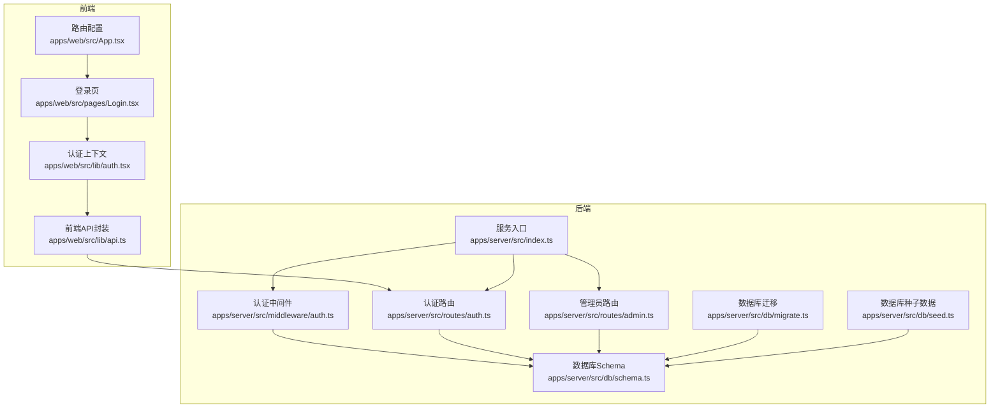
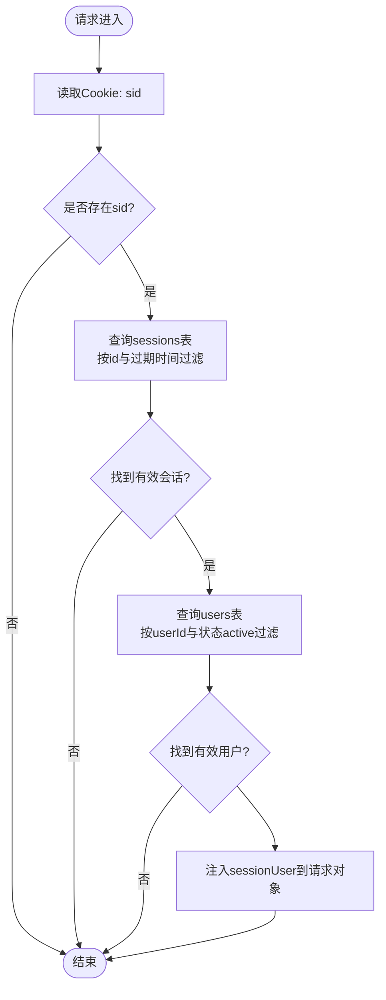
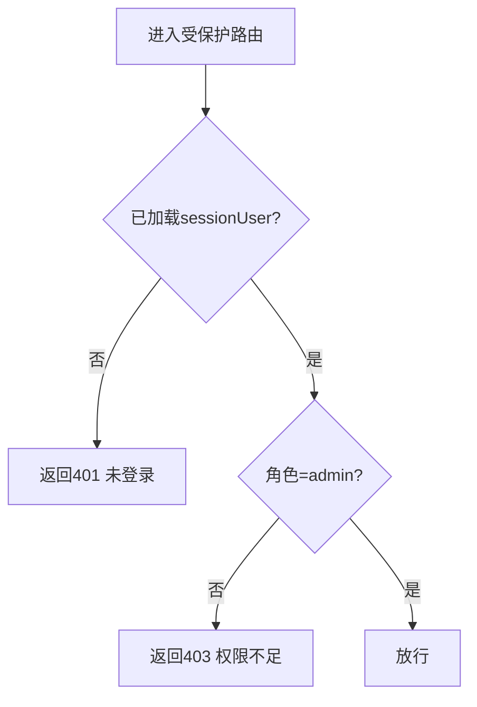
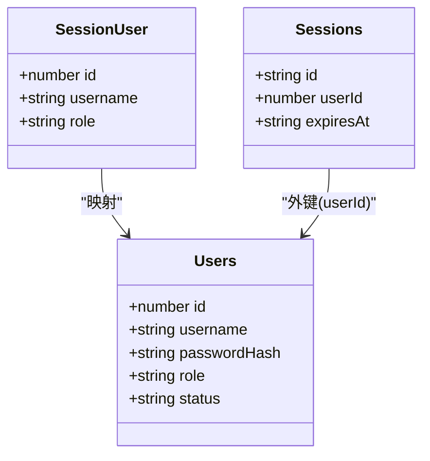
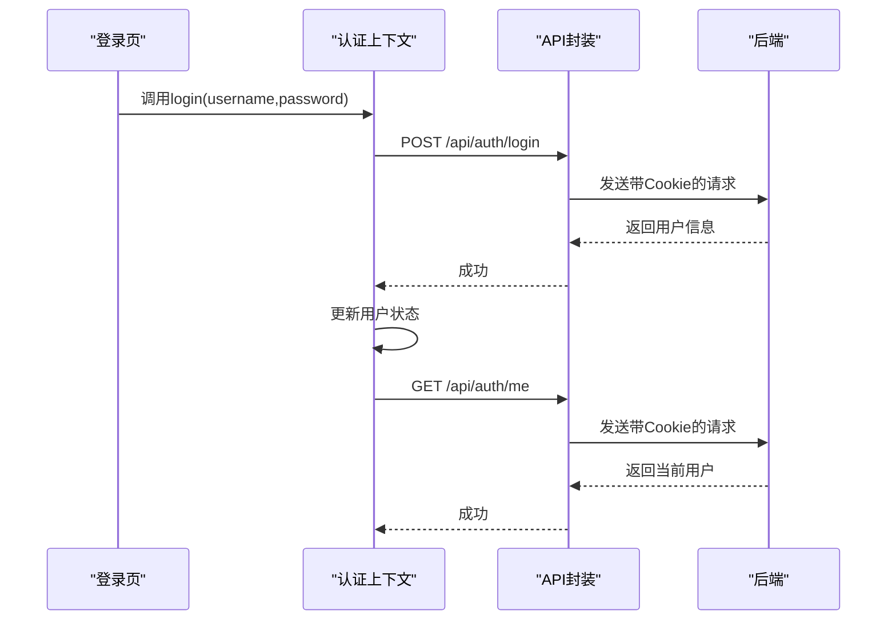
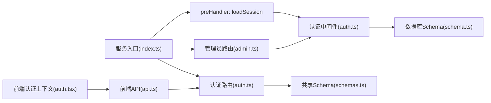

# 认证与授权

<cite>
**本文引用的文件**
- [apps/server/src/index.ts](file://apps/server/src/index.ts)
- [apps/server/src/middleware/auth.ts](file://apps/server/src/middleware/auth.ts)
- [apps/server/src/routes/auth.ts](file://apps/server/src/routes/auth.ts)
- [apps/server/src/routes/admin.ts](file://apps/server/src/routes/admin.ts)
- [apps/server/src/db/schema.ts](file://apps/server/src/db/schema.ts)
- [apps/server/src/db/migrate.ts](file://apps/server/src/db/migrate.ts)
- [apps/server/src/db/seed.ts](file://apps/server/src/db/seed.ts)
- [apps/web/src/lib/auth.tsx](file://apps/web/src/lib/auth.tsx)
- [apps/web/src/lib/api.ts](file://apps/web/src/lib/api.ts)
- [apps/web/src/pages/Login.tsx](file://apps/web/src/pages/Login.tsx)
- [apps/web/src/App.tsx](file://apps/web/src/App.tsx)
- [packages/shared/src/schemas.ts](file://packages/shared/src/schemas.ts)
</cite>

## 目录
1. [简介](#简介)
2. [项目结构](#项目结构)
3. [核心组件](#核心组件)
4. [架构总览](#架构总览)
5. [详细组件分析](#详细组件分析)
6. [依赖关系分析](#依赖关系分析)
7. [性能考量](#性能考量)
8. [故障排查指南](#故障排查指南)
9. [结论](#结论)
10. [附录](#附录)

## 简介
本文件面向ZBH2平台的认证与授权系统，围绕基于HTTP Cookie的会话认证机制进行深入解析，涵盖：
- JWT风格的会话令牌（sid）生成、验证与过期策略
- httpOnly Cookie的安全特性与XSS防护
- 用户角色与权限模型（管理员与普通用户）
- 完整认证流程图（从登录到会话维持）
- 密码哈希算法（argon2id）的选择理由与实现细节
- 中间件拦截机制与权限验证逻辑
- API端点的认证要求与错误处理策略
- 安全最佳实践、常见攻击防护与调试技巧

## 项目结构
认证与授权相关的核心位置如下：
- 后端服务入口与中间件注册：apps/server/src/index.ts
- 认证中间件与权限校验：apps/server/src/middleware/auth.ts
- 认证路由（登录/登出/当前用户）：apps/server/src/routes/auth.ts
- 管理员路由（全局requireAdmin钩子）：apps/server/src/routes/admin.ts
- 数据库表结构（users/sessions）：apps/server/src/db/schema.ts
- 数据库迁移与初始化：apps/server/src/db/migrate.ts、apps/server/src/db/seed.ts
- 前端认证上下文与API封装：apps/web/src/lib/auth.tsx、apps/web/src/lib/api.ts
- 登录页与路由配置：apps/web/src/pages/Login.tsx、apps/web/src/App.tsx
- 共享Schema（登录参数校验）：packages/shared/src/schemas.ts



图表来源
- [apps/server/src/index.ts:1-60](file://apps/server/src/index.ts#L1-L60)
- [apps/server/src/middleware/auth.ts:1-56](file://apps/server/src/middleware/auth.ts#L1-L56)
- [apps/server/src/routes/auth.ts:1-51](file://apps/server/src/routes/auth.ts#L1-L51)
- [apps/server/src/routes/admin.ts:1-279](file://apps/server/src/routes/admin.ts#L1-L279)
- [apps/server/src/db/schema.ts:1-330](file://apps/server/src/db/schema.ts#L1-L330)
- [apps/server/src/db/migrate.ts:1-18](file://apps/server/src/db/migrate.ts#L1-L18)
- [apps/server/src/db/seed.ts:1-98](file://apps/server/src/db/seed.ts#L1-L98)
- [apps/web/src/lib/api.ts:1-16](file://apps/web/src/lib/api.ts#L1-L16)
- [apps/web/src/lib/auth.tsx:1-55](file://apps/web/src/lib/auth.tsx#L1-L55)
- [apps/web/src/pages/Login.tsx:1-47](file://apps/web/src/pages/Login.tsx#L1-L47)
- [apps/web/src/App.tsx:1-80](file://apps/web/src/App.tsx#L1-L80)

章节来源
- [apps/server/src/index.ts:1-60](file://apps/server/src/index.ts#L1-L60)
- [apps/server/src/db/schema.ts:1-330](file://apps/server/src/db/schema.ts#L1-L330)

## 核心组件
- 会话加载中间件：从Cookie读取sid，查询有效会话与用户状态，注入到请求对象
- 权限校验中间件：requireAuth（登录态校验）、requireAdmin（管理员校验）
- 认证路由：登录（生成sid并写入httpOnly Cookie）、登出（清理会话与Cookie）、获取当前用户
- 管理员路由：通过全局preHandler绑定requireAdmin，实现统一权限控制
- 数据模型：users（用户名、密码哈希、角色、状态）、sessions（sid、userId、过期时间）
- 前端认证上下文：登录/登出/刷新用户信息，与后端API交互
- 共享Schema：登录参数的Zod校验定义

章节来源
- [apps/server/src/middleware/auth.ts:17-55](file://apps/server/src/middleware/auth.ts#L17-L55)
- [apps/server/src/routes/auth.ts:8-50](file://apps/server/src/routes/auth.ts#L8-L50)
- [apps/server/src/routes/admin.ts:15-16](file://apps/server/src/routes/admin.ts#L15-L16)
- [apps/server/src/db/schema.ts:3-17](file://apps/server/src/db/schema.ts#L3-L17)
- [apps/web/src/lib/auth.tsx:20-54](file://apps/web/src/lib/auth.tsx#L20-L54)
- [packages/shared/src/schemas.ts:3-6](file://packages/shared/src/schemas.ts#L3-L6)

## 架构总览
认证与授权采用“Cookie会话”而非JWT令牌存储于Header的方案。核心要点：
- 会话令牌为sid（字符串），存储于httpOnly Cookie中，避免XSS直接读取
- 服务端维护sessions表，记录sid、关联用户ID与过期时间
- 中间件在每个请求前加载会话，校验有效性并注入用户信息
- 管理员路由通过全局preHandler强制requireAdmin
- 前端通过withCredentials携带Cookie，实现跨域同源场景下的会话保持

```mermaid
sequenceDiagram
participant Browser as "浏览器"
participant Front as "前端应用"
participant API as "后端API"
participant DB as "数据库"
Browser->>Front : 打开登录页
Front->>API : POST /api/auth/login {username,password}
API->>DB : 查询用户并校验密码哈希
DB-->>API : 用户信息(含密码哈希)
API->>DB : 写入新会话(sessions)
API-->>Browser : Set-Cookie : sid=httpOnly; SameSite=Lax
API-->>Front : 返回用户信息
Front->>API : GET /api/auth/me
API->>DB : 校验sid与过期时间
DB-->>API : 有效会话与用户
API-->>Front : 返回当前用户
Browser->>API : 后续请求携带Cookie
API->>DB : 校验会话有效性
DB-->>API : 通过
API-->>Browser : 正常响应
```

图表来源
- [apps/server/src/routes/auth.ts:9-32](file://apps/server/src/routes/auth.ts#L9-L32)
- [apps/server/src/middleware/auth.ts:17-40](file://apps/server/src/middleware/auth.ts#L17-L40)
- [apps/web/src/lib/api.ts:3](file://apps/web/src/lib/api.ts#L3)
- [apps/web/src/lib/auth.tsx:24-45](file://apps/web/src/lib/auth.tsx#L24-L45)

## 详细组件分析

### 会话加载中间件（loadSession）
职责：
- 从Cookie读取sid
- 查询sessions表，检查是否过期
- 关联users表，校验用户状态为active
- 将用户信息注入到Fastify请求对象，供后续路由使用

复杂度与性能：
- 单次查询users/sessions，时间复杂度O(1)，索引覆盖主键与过期时间字段
- 无循环或递归，线性执行

安全要点：
- 仅依赖Cookie中的sid，不解析任何Header中的令牌
- 会话过期时间严格校验，避免使用过期会话



图表来源
- [apps/server/src/middleware/auth.ts:17-40](file://apps/server/src/middleware/auth.ts#L17-L40)

章节来源
- [apps/server/src/middleware/auth.ts:17-40](file://apps/server/src/middleware/auth.ts#L17-L40)

### 权限校验中间件（requireAuth / requireAdmin）
职责：
- requireAuth：若无sessionUser，返回401
- requireAdmin：若非admin角色，返回403

适用范围：
- 通过全局preHandler绑定到管理员路由模块，实现统一权限控制



图表来源
- [apps/server/src/middleware/auth.ts:42-55](file://apps/server/src/middleware/auth.ts#L42-L55)
- [apps/server/src/routes/admin.ts:16](file://apps/server/src/routes/admin.ts#L16)

章节来源
- [apps/server/src/middleware/auth.ts:42-55](file://apps/server/src/middleware/auth.ts#L42-L55)
- [apps/server/src/routes/admin.ts:16](file://apps/server/src/routes/admin.ts#L16)

### 认证路由（登录/登出/当前用户）
登录流程：
- 参数校验（用户名长度、密码长度）
- 查询用户并校验状态为active
- 使用argon2验证密码哈希
- 生成sid（随机字符串），插入sessions表
- 设置httpOnly Cookie（sid），有效期7天

登出路由：
- 删除当前sid对应的会话
- 清除Cookie

当前用户：
- 若无sessionUser返回null，否则返回用户信息

```mermaid
sequenceDiagram
participant Client as "客户端"
participant Auth as "认证路由"
participant DB as "数据库"
Client->>Auth : POST /api/auth/login
Auth->>Auth : 校验输入参数
Auth->>DB : 查询用户(按用户名)
DB-->>Auth : 用户(含密码哈希)
Auth->>Auth : 验证密码哈希
Auth->>DB : 插入新会话(sessions)
Auth-->>Client : Set-Cookie : sid=httpOnly; SameSite=Lax
Client->>Auth : GET /api/auth/me
Auth-->>Client : 返回当前用户
Client->>Auth : POST /api/auth/logout
Auth->>DB : 删除会话
Auth-->>Client : 清除Cookie
```

图表来源
- [apps/server/src/routes/auth.ts:9-49](file://apps/server/src/routes/auth.ts#L9-L49)

章节来源
- [apps/server/src/routes/auth.ts:9-49](file://apps/server/src/routes/auth.ts#L9-L49)

### 管理员路由与权限模型
- 管理员路由模块通过全局preHandler绑定requireAdmin，所有该模块下的端点均需管理员权限
- 用户角色枚举为admin/user，默认user；状态枚举为active/disabled
- 管理员可进行用户管理、内容管理、系统配置等操作



图表来源
- [apps/server/src/db/schema.ts:3-17](file://apps/server/src/db/schema.ts#L3-L17)
- [apps/server/src/middleware/auth.ts:5-9](file://apps/server/src/middleware/auth.ts#L5-L9)

章节来源
- [apps/server/src/routes/admin.ts:15-279](file://apps/server/src/routes/admin.ts#L15-L279)
- [apps/server/src/db/schema.ts:3-17](file://apps/server/src/db/schema.ts#L3-L17)

### 前端认证上下文与API封装
- 前端通过withCredentials发送Cookie，确保跨域场景下会话保持
- 登录成功后更新用户状态，登出时清空用户状态
- 刷新用户信息在应用启动时执行一次，保证会话有效性



图表来源
- [apps/web/src/lib/auth.tsx:24-45](file://apps/web/src/lib/auth.tsx#L24-L45)
- [apps/web/src/lib/api.ts:3](file://apps/web/src/lib/api.ts#L3)
- [apps/web/src/pages/Login.tsx:13-24](file://apps/web/src/pages/Login.tsx#L13-L24)

章节来源
- [apps/web/src/lib/auth.tsx:20-54](file://apps/web/src/lib/auth.tsx#L20-L54)
- [apps/web/src/lib/api.ts:1-16](file://apps/web/src/lib/api.ts#L1-L16)
- [apps/web/src/pages/Login.tsx:1-47](file://apps/web/src/pages/Login.tsx#L1-L47)

### 密码哈希算法（argon2id）选择与实现
选择理由：
- argon2id是当前推荐的密码哈希算法，兼顾内存占用与CPU成本，抗暴力破解能力强
- 在服务端使用argon2进行密码验证与新密码哈希生成

实现细节：
- 登录时使用verify对比用户密码哈希
- 新建用户或修改密码时使用hash生成新哈希
- 种子数据中使用默认密码生成哈希并写入数据库

章节来源
- [apps/server/src/routes/auth.ts:19](file://apps/server/src/routes/auth.ts#L19)
- [apps/server/src/routes/admin.ts:242](file://apps/server/src/routes/admin.ts#L242)
- [apps/server/src/db/seed.ts:8](file://apps/server/src/db/seed.ts#L8)

## 依赖关系分析
- 服务入口注册中间件与路由，preHandler阶段执行会话加载
- 认证路由依赖共享Schema进行输入校验
- 中间件依赖数据库schema进行会话与用户查询
- 管理员路由依赖中间件进行权限拦截
- 前端API封装依赖withCredentials与后端路由



图表来源
- [apps/server/src/index.ts:37](file://apps/server/src/index.ts#L37)
- [apps/server/src/middleware/auth.ts:17-40](file://apps/server/src/middleware/auth.ts#L17-L40)
- [apps/server/src/routes/auth.ts:6](file://apps/server/src/routes/auth.ts#L6)
- [apps/server/src/routes/admin.ts:2](file://apps/server/src/routes/admin.ts#L2)
- [apps/web/src/lib/api.ts:3](file://apps/web/src/lib/api.ts#L3)
- [apps/web/src/lib/auth.tsx:20-54](file://apps/web/src/lib/auth.tsx#L20-L54)

章节来源
- [apps/server/src/index.ts:29-50](file://apps/server/src/index.ts#L29-L50)
- [packages/shared/src/schemas.ts:3-6](file://packages/shared/src/schemas.ts#L3-L6)

## 性能考量
- 会话查询为单表主键查询，O(1)复杂度
- sessions表包含过期时间字段，查询时可利用索引快速过滤
- 建议定期清理过期会话，减少无效数据增长
- 前端刷新用户信息仅在应用启动时执行一次，避免频繁请求

[本节为通用建议，无需特定文件来源]

## 故障排查指南
常见问题与定位思路：
- 登录失败（401）：检查用户名是否存在且状态为active；确认密码哈希验证通过
- 会话无效（401）：确认Cookie中sid存在且未过期；检查会话表是否被清理
- 权限不足（403）：确认用户角色为admin；检查是否正确绑定requireAdmin
- CORS/跨域问题：确认withCredentials启用，后端CORS允许凭证
- Cookie未携带：确认SameSite/Lax设置与前端withCredentials一致

章节来源
- [apps/server/src/routes/auth.ts:16-22](file://apps/server/src/routes/auth.ts#L16-L22)
- [apps/server/src/middleware/auth.ts:42-55](file://apps/server/src/middleware/auth.ts#L42-L55)
- [apps/web/src/lib/api.ts:3](file://apps/web/src/lib/api.ts#L3)

## 结论
ZBH2平台采用基于httpOnly Cookie的会话认证机制，结合argon2id密码哈希与严格的权限中间件，提供了安全、清晰的认证与授权体系。通过全局preHandler加载会话、requireAuth/requireAdmin进行权限拦截，配合前端withCredentials的Cookie携带，实现了从登录到会话维持的完整闭环。建议持续关注会话清理、CORS配置与Cookie安全属性，确保系统长期稳定与安全。

[本节为总结，无需特定文件来源]

## 附录

### API端点与认证要求
- POST /api/auth/login：登录，返回用户信息并设置httpOnly Cookie
- POST /api/auth/logout：登出，清理会话与Cookie
- GET /api/auth/me：获取当前用户，无登录返回null

章节来源
- [apps/server/src/routes/auth.ts:9-49](file://apps/server/src/routes/auth.ts#L9-L49)

### 安全最佳实践
- 使用httpOnly Cookie存储sid，避免XSS读取
- SameSite=Lax平衡安全性与可用性
- 严格校验用户状态（active）与会话过期时间
- 对敏感操作使用requireAdmin中间件
- 前端withCredentials开启，确保Cookie跨域传递
- 定期清理过期会话，降低数据库压力

章节来源
- [apps/server/src/routes/auth.ts:26-31](file://apps/server/src/routes/auth.ts#L26-L31)
- [apps/server/src/middleware/auth.ts:48-55](file://apps/server/src/middleware/auth.ts#L48-L55)
- [apps/web/src/lib/api.ts:3](file://apps/web/src/lib/api.ts#L3)