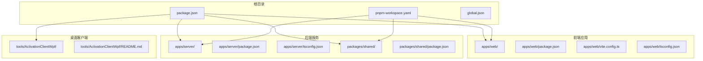
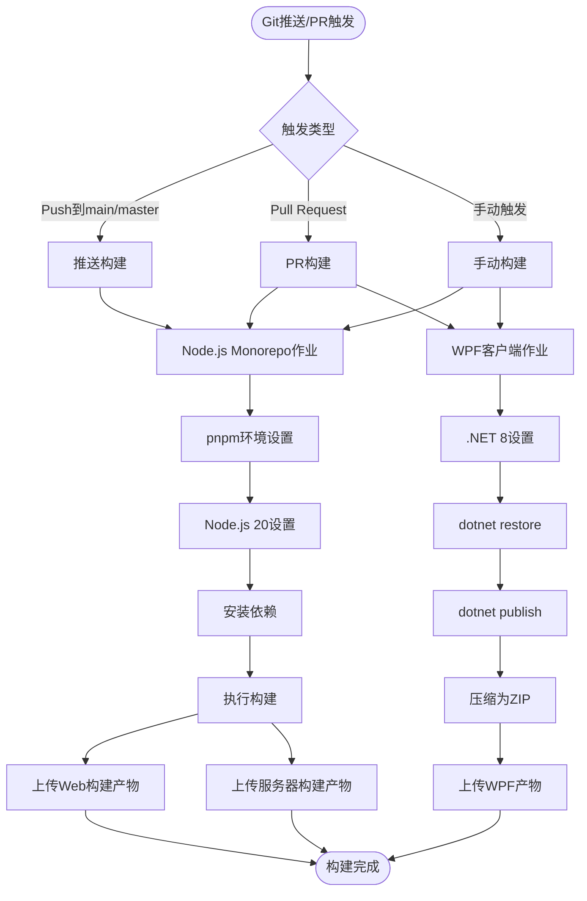
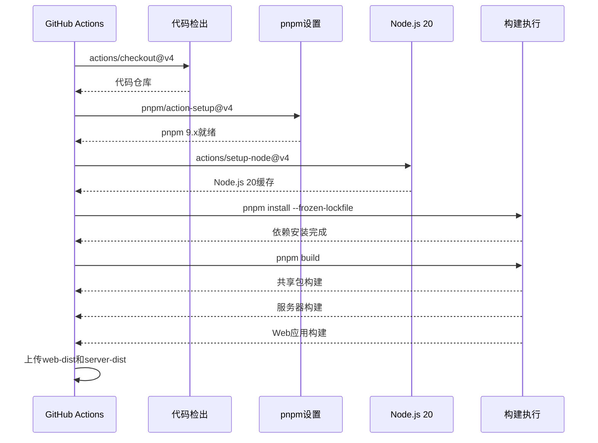
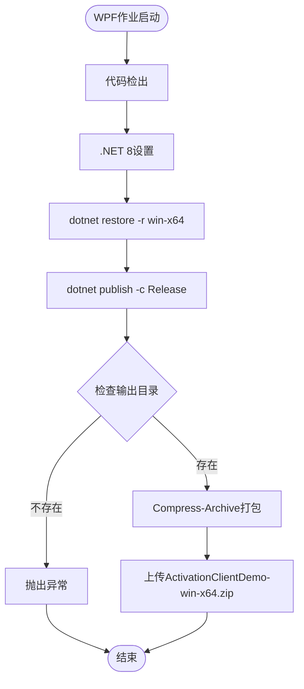
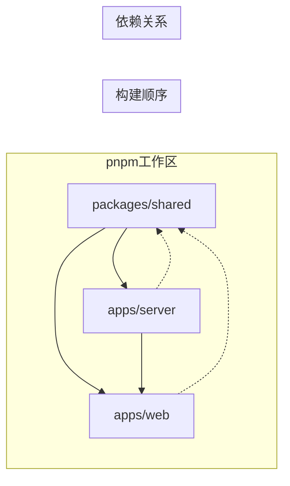
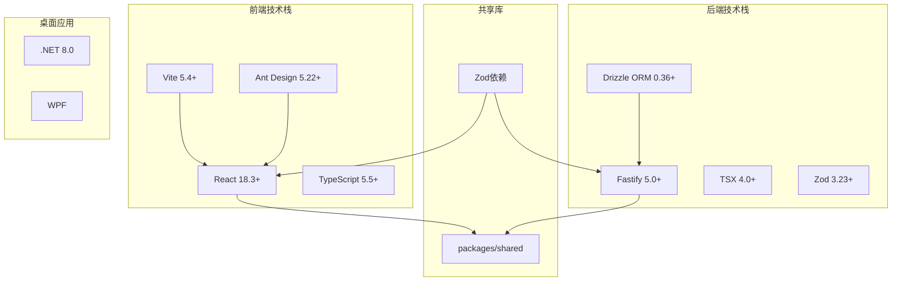

# CI/CD流水线

<cite>
**本文档引用的文件**
- [.github/workflows/build.yml](file://.github/workflows/build.yml)
- [package.json](file://package.json)
- [pnpm-workspace.yaml](file://pnpm-workspace.yaml)
- [global.json](file://global.json)
- [apps/web/package.json](file://apps/web/package.json)
- [apps/web/vite.config.ts](file://apps/web/vite.config.ts)
- [apps/web/tsconfig.json](file://apps/web/tsconfig.json)
- [apps/server/package.json](file://apps/server/package.json)
- [apps/server/tsconfig.json](file://apps/server/tsconfig.json)
- [packages/shared/package.json](file://packages/shared/package.json)
- [apps/server/src/index.ts](file://apps/server/src/index.ts)
- [tools/ActivationClientWpf/README.md](file://tools/ActivationClientWpf/README.md)
</cite>

## 目录
1. [简介](#简介)
2. [项目结构](#项目结构)
3. [核心组件](#核心组件)
4. [架构概览](#架构概览)
5. [详细组件分析](#详细组件分析)
6. [依赖关系分析](#依赖关系分析)
7. [性能考虑](#性能考虑)
8. [故障排除指南](#故障排除指南)
9. [结论](#结论)
10. [附录](#附录)

## 简介

ZBH2平台是一个基于Node.js和.NET 8的现代化软件资产管理平台，采用Monorepo架构组织代码。本CI/CD流水线文档详细介绍了GitHub Actions工作流的完整配置，包括Node.js版本矩阵、构建步骤和测试流程。该流水线支持自动化构建前端Web应用、后端API编译和WPF激活客户端的Windows特定构建。

## 项目结构

ZBH2项目采用Monorepo架构，主要包含以下核心模块：

**图表来源**
- [package.json:1-20](file://package.json#L1-L20)
- [pnpm-workspace.yaml:1-5](file://pnpm-workspace.yaml#L1-L5)

**章节来源**
- [package.json:1-20](file://package.json#L1-L20)
- [pnpm-workspace.yaml:1-5](file://pnpm-workspace.yaml#L1-L5)

## 核心组件

### GitHub Actions工作流配置

当前的CI/CD流水线配置位于`.github/workflows/build.yml`，包含两个主要作业：

1. **Node.js Monorepo构建作业**：处理共享包、Web应用和服务器的构建
2. **WPF激活客户端作业**：专门处理Windows桌面应用的构建和打包

### 构建环境配置

- **Node.js版本**：使用Node.js 20 LTS版本
- **包管理器**：pnpm 9.x，启用缓存优化
- **.NET SDK**：.NET 8.0.x用于WPF客户端构建
- **并发控制**：启用工作流级并发控制，避免资源竞争

**章节来源**
- [.github/workflows/build.yml:1-87](file://.github/workflows/build.yml#L1-L87)

## 架构概览

**图表来源**
- [.github/workflows/build.yml:3-87](file://.github/workflows/build.yml#L3-L87)

## 详细组件分析

### Node.js Monorepo构建作业

该作业负责处理整个Monorepo的构建流程，采用并行构建策略以提高效率。

#### 构建流程详解

**图表来源**
- [.github/workflows/build.yml:14-51](file://.github/workflows/build.yml#L14-L51)
- [package.json:8](file://package.json#L8)

#### 构建产物管理

- **Web应用产物**：上传到`web-dist`工件，路径为`apps/web/dist`
- **服务器产物**：上传到`server-dist`工件，路径为`apps/server/dist`
- **自动验证**：使用`if-no-files-found: error`确保产物存在

**章节来源**
- [.github/workflows/build.yml:14-51](file://.github/workflows/build.yml#L14-L51)
- [package.json:8](file://package.json#L8)

### WPF激活客户端构建作业

该作业专门处理Windows桌面应用的构建，使用.NET 8 SDK进行自包含部署。

#### Windows特定构建流程

**图表来源**
- [.github/workflows/build.yml:53-87](file://.github/workflows/build.yml#L53-L87)

#### 构建配置细节

- **目标平台**：win-x64（Windows 10/11 x64）
- **部署模式**：自包含（Self-contained）
- **输出格式**：ZIP压缩包便于分发
- **版本管理**：使用`global.json`指定.NET SDK版本

**章节来源**
- [.github/workflows/build.yml:53-87](file://.github/workflows/build.yml#L53-L87)
- [global.json:1-7](file://global.json#L1-L7)
- [tools/ActivationClientWpf/README.md:1-35](file://tools/ActivationClientWpf/README.md#L1-L35)

### Monorepo构建策略

#### 包管理配置

**图表来源**
- [pnpm-workspace.yaml:1-5](file://pnpm-workspace.yaml#L1-L5)
- [apps/web/package.json:19](file://apps/web/package.json#L19)
- [apps/server/package.json:26](file://apps/server/package.json#L26)

#### 构建脚本协调

- **根级构建命令**：`pnpm build`按顺序构建所有包
- **并行执行**：利用pnpm的并行能力加速构建
- **类型定义**：共享包提供TypeScript类型定义供其他包使用

**章节来源**
- [pnpm-workspace.yaml:1-5](file://pnpm-workspace.yaml#L1-L5)
- [package.json:8](file://package.json#L8)

## 依赖关系分析

### 技术栈依赖图

**图表来源**
- [apps/web/package.json:11-27](file://apps/web/package.json#L11-L27)
- [apps/server/package.json:14-35](file://apps/server/package.json#L14-L35)
- [packages/shared/package.json:17-22](file://packages/shared/package.json#L17-L22)

### 构建工具链

| 组件 | 版本 | 用途 | 配置位置 |
|------|------|------|----------|
| Node.js | 20.x | JavaScript运行时 | `.github/workflows/build.yml` |
| pnpm | 9.x | 包管理器 | `.github/workflows/build.yml` |
| TypeScript | 5.5+ | 类型检查 | 各包tsconfig.json |
| Vite | 5.4+ | 前端构建 | `apps/web/vite.config.ts` |
| Fastify | 5.0+ | Web框架 | `apps/server/package.json` |
| .NET SDK | 8.0.x | WPF构建 | `global.json` |

**章节来源**
- [apps/web/package.json:11-27](file://apps/web/package.json#L11-L27)
- [apps/server/package.json:14-35](file://apps/server/package.json#L14-L35)
- [global.json:1-7](file://global.json#L1-7)

## 性能考虑

### 构建性能优化

1. **缓存策略**
   - Node.js版本缓存：`actions/setup-node@v4`的cache选项
   - pnpm包缓存：通过`cache: "pnpm"`启用
   - 并发构建：pnpm的并行执行能力

2. **资源管理**
   - 工作流并发控制：避免同时运行多个大型构建
   - 条件触发：仅在main/master分支触发完整构建
   - 资源隔离：不同作业在独立环境中运行

3. **构建时间优化**
   - 增量构建：pnpm的增量构建能力
   - 依赖复用：工作区内的依赖共享
   - 并行执行：多包并行构建

## 故障排除指南

### 常见问题及解决方案

#### 1. Node.js版本兼容性问题

**症状**：构建失败，提示Node.js版本不兼容
**原因**：本地开发环境与CI环境Node.js版本不一致
**解决方案**：
- 在根目录`package.json`中设置最低Node.js版本要求
- 确保`.github/workflows/build.yml`中的Node.js版本与项目要求匹配

#### 2. pnpm依赖安装失败

**症状**：`pnpm install --frozen-lockfile`失败
**可能原因**：
- `pnpm-lock.yaml`文件损坏
- 网络连接问题
- 缓存冲突

**解决步骤**：
1. 检查`pnpm-lock.yaml`文件完整性
2. 清理GitHub Actions缓存
3. 重新生成锁文件

#### 3. WPF构建失败

**症状**：WPF作业在非Windows环境中失败
**原因**：WPF需要Windows环境才能编译
**解决方案**：
- 确保使用`windows-latest`运行器
- 验证.NET 8 SDK正确安装
- 检查`global.json`中的SDK版本

#### 4. 构建产物缺失

**症状**：上传工件步骤失败
**可能原因**：
- 构建未生成预期输出
- 输出路径配置错误
- 构建脚本执行失败

**排查步骤**：
1. 检查构建日志中的错误信息
2. 验证输出目录结构
3. 确认构建脚本正确执行

#### 5. 并发冲突问题

**症状**：多个工作流同时运行导致资源竞争
**解决方案**：
- 利用现有的并发控制配置
- 避免在同一时间触发多个构建
- 监控系统资源使用情况

**章节来源**
- [.github/workflows/build.yml:10-12](file://.github/workflows/build.yml#L10-L12)
- [package.json:13-15](file://package.json#L13-L15)

## 结论

ZBH2平台的CI/CD流水线设计合理，充分利用了GitHub Actions的功能特性。通过Monorepo架构和并行构建策略，实现了高效的自动化构建流程。当前配置支持：

1. **完整的构建覆盖**：前端、后端和桌面应用的全面支持
2. **环境一致性**：标准化的构建环境配置
3. **产物管理**：完善的构建产物收集和存储
4. **故障处理**：内置的错误检测和报告机制

建议的改进方向：
- 添加单元测试和集成测试作业
- 实施代码质量检查和安全扫描
- 配置分支保护规则
- 建立版本标签和发布流程

## 附录

### 最佳实践建议

#### 1. 代码质量检查
- 添加ESLint和Prettier配置
- 实施TypeScript类型检查
- 集成代码覆盖率报告

#### 2. 安全扫描
- 使用GitHub Security Advisory
- 集成依赖漏洞扫描
- 实施密码和敏感信息检测

#### 3. 依赖更新
- 设置依赖自动更新机器人
- 定期审查第三方依赖
- 实施安全补丁管理

#### 4. 分支保护配置
- 要求状态检查通过
- 实施代码审查流程
- 配置强制合并规则

#### 5. 手动触发配置
- 为每个作业添加`workflow_dispatch`触发器
- 支持选择性构建特定包
- 提供参数化构建选项