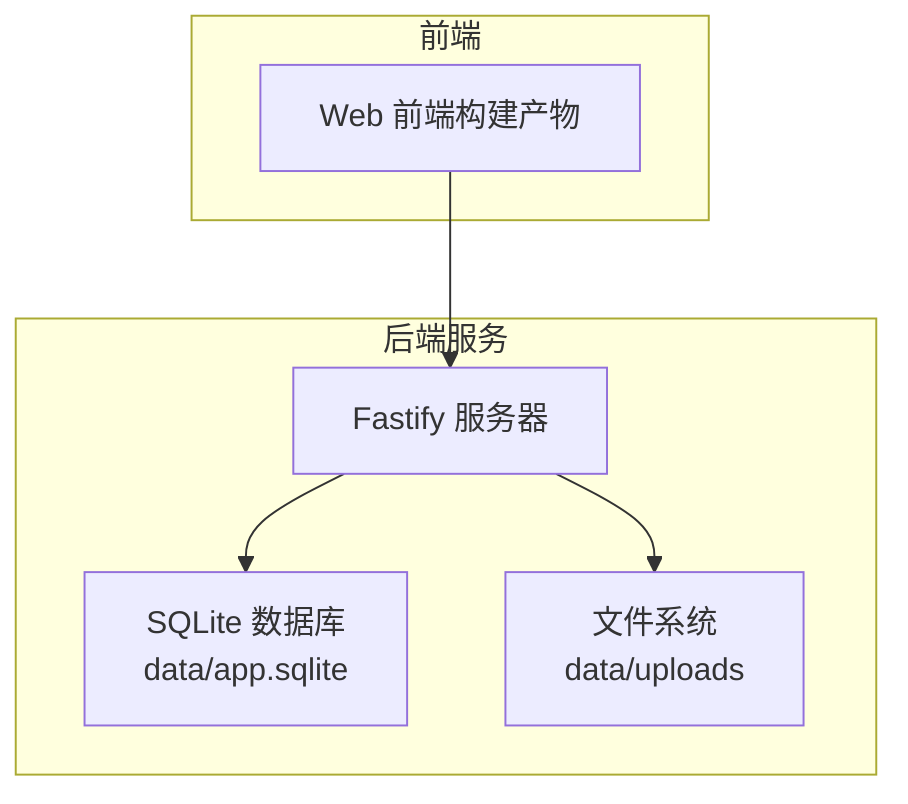
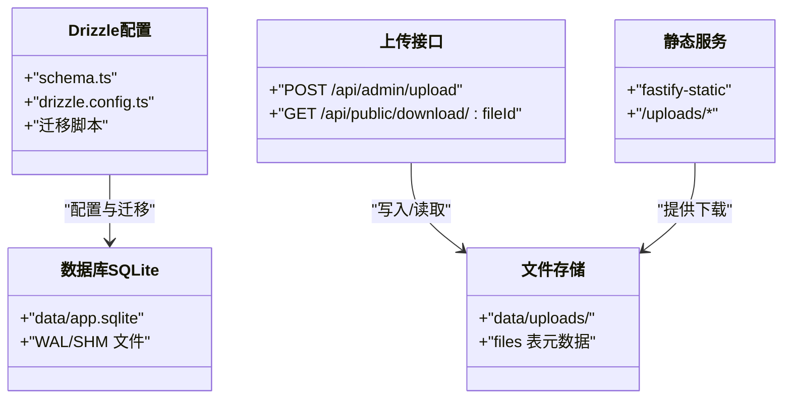
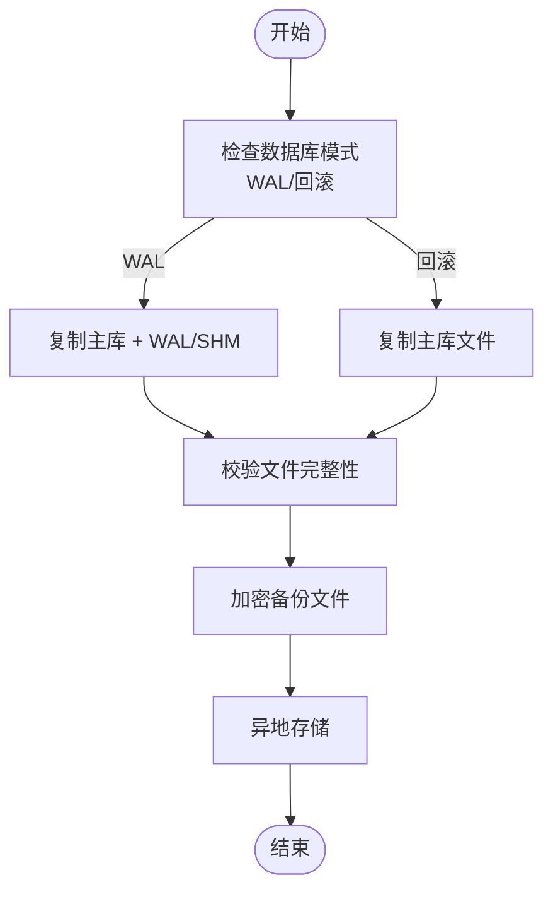
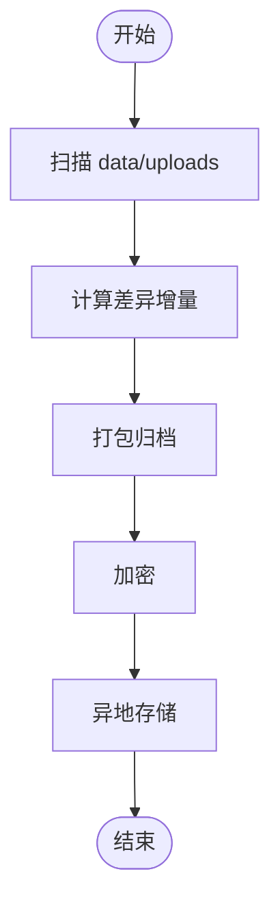
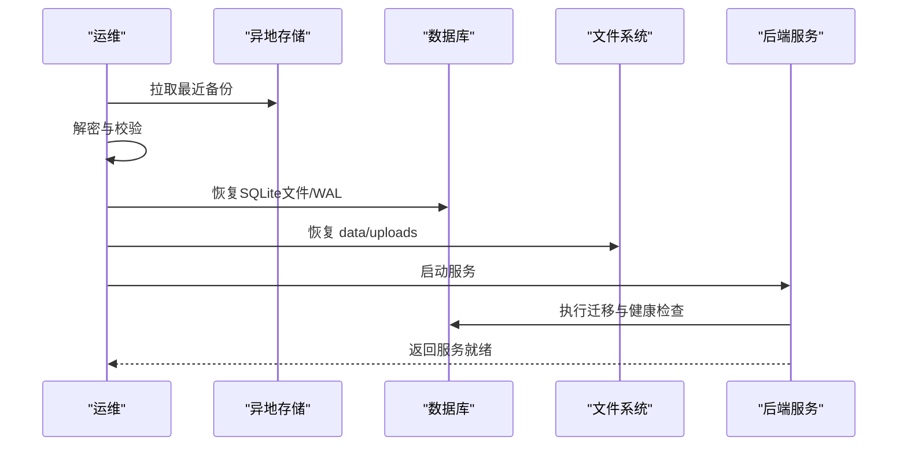
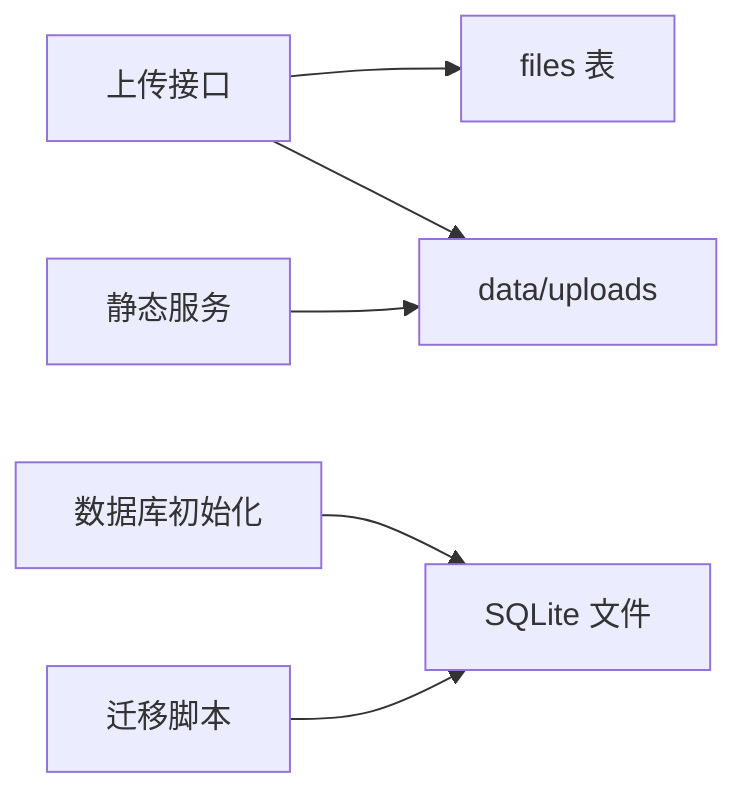

# 备份与恢复

<cite>
**本文引用的文件**
- [apps/server/package.json](file://apps/server/package.json)
- [apps/server/drizzle.config.ts](file://apps/server/drizzle.config.ts)
- [apps/server/src/db/index.ts](file://apps/server/src/db/index.ts)
- [apps/server/src/db/migrate.ts](file://apps/server/src/db/migrate.ts)
- [apps/server/src/db/schema.ts](file://apps/server/src/db/schema.ts)
- [apps/server/src/db/seed.ts](file://apps/server/src/db/seed.ts)
- [apps/server/src/db/seed-demo.ts](file://apps/server/src/db/seed-demo.ts)
- [apps/server/src/routes/upload.ts](file://apps/server/src/routes/upload.ts)
- [apps/server/src/routes/assets.ts](file://apps/server/src/routes/assets.ts)
- [apps/server/src/index.ts](file://apps/server/src/index.ts)
- [README.md](file://README.md)
- [.github/workflows/build.yml](file://.github/workflows/build.yml)
</cite>

## 目录
1. [简介](#简介)
2. [项目结构](#项目结构)
3. [核心组件](#核心组件)
4. [架构总览](#架构总览)
5. [详细组件分析](#详细组件分析)
6. [依赖分析](#依赖分析)
7. [性能考虑](#性能考虑)
8. [故障排查指南](#故障排查指南)
9. [结论](#结论)
10. [附录](#附录)

## 简介
本指南面向ZBH2平台，提供一套完整的数据备份与恢复策略，覆盖数据库（SQLite）、上传文件与静态资源、以及灾难恢复与监控告警。文档基于仓库现有实现，明确备份范围、备份方法、恢复流程、验证与测试、安全与异地备份建议，并给出可操作的实施步骤。

## 项目结构
ZBH2后端采用Fastify + Drizzle ORM + better-sqlite3，数据库为SQLite；上传文件存储在本地文件系统。关键数据位置如下：
- SQLite数据库文件：data/app.sqlite（及其WAL相关文件）
- 上传文件目录：data/uploads
- Web静态资源：由后端fastify-static托管，位于data/uploads目录下

图表来源
- [apps/server/src/index.ts:24-35](file://apps/server/src/index.ts#L24-L35)
- [apps/server/src/routes/upload.ts:11-12](file://apps/server/src/routes/upload.ts#L11-L12)
- [README.md:104-111](file://README.md#L104-L111)

章节来源
- [apps/server/src/index.ts:24-35](file://apps/server/src/index.ts#L24-L35)
- [apps/server/src/routes/upload.ts:11-12](file://apps/server/src/routes/upload.ts#L11-L12)
- [README.md:104-111](file://README.md#L104-L111)

## 核心组件
- 数据库层：SQLite（better-sqlite3）+ Drizzle ORM，迁移与快照位于drizzle目录
- 文件存储：上传接口将文件写入data/uploads，同时记录元数据到files表
- 静态资源：通过fastify-static直接提供data/uploads下的文件
- 环境变量：DATABASE_URL控制数据库文件路径，默认指向data/app.sqlite

章节来源
- [apps/server/package.json:14-27](file://apps/server/package.json#L14-L27)
- [apps/server/drizzle.config.ts:3-10](file://apps/server/drizzle.config.ts#L3-L10)
- [apps/server/src/db/index.ts:7-14](file://apps/server/src/db/index.ts#L7-L14)
- [apps/server/src/db/schema.ts:26-35](file://apps/server/src/db/schema.ts#L26-L35)
- [apps/server/src/routes/upload.ts:11-12](file://apps/server/src/routes/upload.ts#L11-L12)
- [apps/server/src/index.ts:35](file://apps/server/src/index.ts#L35)

## 架构总览
下图展示备份与恢复涉及的关键对象与关系：

图表来源
- [apps/server/drizzle.config.ts:3-10](file://apps/server/drizzle.config.ts#L3-L10)
- [apps/server/src/db/schema.ts:26-35](file://apps/server/src/db/schema.ts#L26-L35)
- [apps/server/src/routes/upload.ts:14-61](file://apps/server/src/routes/upload.ts#L14-L61)
- [apps/server/src/index.ts:35](file://apps/server/src/index.ts#L35)

## 详细组件分析

### 数据库备份策略
- 备份对象
  - SQLite主库文件：data/app.sqlite
  - WAL相关文件：data/app.sqlite-shm、data/app.sqlite-wal（若启用WAL）
- 备份时机
  - 全量备份：每周日凌晨执行一次
  - 增量备份：每日凌晨执行一次（基于WAL日志滚动）
- 备份方法
  - 方法A：停止服务后复制SQLite文件（最简单可靠）
  - 方法B：在WAL模式下，复制主库文件与WAL文件，确保一致性
  - 方法C：使用SQLite在线备份API（生产环境建议结合事务）
- 验证流程
  - 恢复到临时目录后，启动服务，执行数据库健康检查与关键查询
  - 校验迁移脚本可正常执行
- 安全与异地
  - 备份文件加密（建议AES-256）并异地存储（云归档/冷存储）

图表来源
- [apps/server/src/db/index.ts:10-12](file://apps/server/src/db/index.ts#L10-L12)
- [apps/server/src/db/migrate.ts:14-15](file://apps/server/src/db/migrate.ts#L14-L15)
- [README.md:104-111](file://README.md#L104-L111)

章节来源
- [apps/server/src/db/index.ts:10-12](file://apps/server/src/db/index.ts#L10-L12)
- [apps/server/src/db/migrate.ts:14-15](file://apps/server/src/db/migrate.ts#L14-L15)
- [README.md:104-111](file://README.md#L104-L111)

### 文件存储备份策略
- 备份对象
  - data/uploads目录下的所有文件
  - 数据库files表记录的文件元数据（用于恢复一致性校验）
- 备份时机
  - 全量备份：每周日凌晨
  - 增量备份：每日凌晨（基于文件变更时间）
- 备份方法
  - 使用rsync/robocopy进行差异备份
  - 结合数据库快照，确保文件与元数据一致
- 验证流程
  - 恢复到临时目录后，校验文件数量与哈希（files表hash字段）
  - 通过下载接口验证文件可正常访问

图表来源
- [apps/server/src/routes/upload.ts:11-12](file://apps/server/src/routes/upload.ts#L11-L12)
- [apps/server/src/db/schema.ts:26-35](file://apps/server/src/db/schema.ts#L26-L35)

章节来源
- [apps/server/src/routes/upload.ts:11-12](file://apps/server/src/routes/upload.ts#L11-L12)
- [apps/server/src/db/schema.ts:26-35](file://apps/server/src/db/schema.ts#L26-L35)

### 静态资源备份策略
- 静态资源即上传文件，遵循文件存储备份策略
- 若存在额外静态资源（如Web构建产物），需将其纳入备份范围

章节来源
- [apps/server/src/index.ts:35](file://apps/server/src/index.ts#L35)

### 备份数据加密与安全存储
- 加密算法：AES-256-GCM
- 密钥管理：HSM/密钥管理服务；避免将密钥与备份文件同库存放
- 存储介质：本地磁盘（热备）+ 云归档（冷备）+ 异地灾备
- 访问控制：最小权限原则，仅授权运维账号访问

章节来源
- [README.md:104-111](file://README.md#L104-L111)

### 灾难恢复计划
- 恢复目标
  - RTO：≤4小时（含数据恢复与服务启动）
  - RPO：≤1天（全量+每日增量）
- 恢复流程
  - 步骤1：从异地存储拉取最近备份
  - 步骤2：解密并校验完整性
  - 步骤3：恢复数据库（必要时回放WAL）
  - 步骤4：恢复文件存储
  - 步骤5：启动服务并执行健康检查
  - 步骤6：验证关键业务接口（登录、上传、下载、报表等）

图表来源
- [apps/server/src/db/migrate.ts:14-15](file://apps/server/src/db/migrate.ts#L14-L15)
- [apps/server/src/index.ts:29-54](file://apps/server/src/index.ts#L29-L54)

章节来源
- [apps/server/src/db/migrate.ts:14-15](file://apps/server/src/db/migrate.ts#L14-L15)
- [apps/server/src/index.ts:29-54](file://apps/server/src/index.ts#L29-L54)

### 恢复流程详细步骤
- 数据库恢复
  - 停止服务
  - 将data/app.sqlite与WAL文件恢复到原位
  - 启动服务，执行迁移脚本
  - 校验关键表数据与索引
- 文件存储恢复
  - 恢复data/uploads目录
  - 校验files表与实际文件一致性（哈希比对）
- 服务验证
  - 登录与鉴权
  - 上传与下载
  - 报表与监控接口

章节来源
- [apps/server/src/db/migrate.ts:14-15](file://apps/server/src/db/migrate.ts#L14-L15)
- [apps/server/src/routes/upload.ts:39-48](file://apps/server/src/routes/upload.ts#L39-L48)
- [apps/server/src/index.ts:29-54](file://apps/server/src/index.ts#L29-L54)

### 备份验证与测试恢复
- 验证清单
  - 数据库：迁移脚本执行成功、关键查询返回预期结果
  - 文件：数量一致、哈希一致、下载可访问
  - 服务：静态资源可访问、上传/下载接口正常
- 测试恢复
  - 在隔离环境中执行完整恢复流程
  - 记录RTO/RPO指标并形成报告

章节来源
- [apps/server/src/db/schema.ts:26-35](file://apps/server/src/db/schema.ts#L26-L35)
- [apps/server/src/routes/upload.ts:51-61](file://apps/server/src/routes/upload.ts#L51-L61)

### 备份监控与告警
- 监控指标
  - 备份任务执行状态
  - 备份文件大小与增长趋势
  - 校验与加密成功率
- 告警策略
  - 失败立即短信/邮件通知
  - 连续失败≥2次触发升级告警
- 工具建议
  - cron + shell脚本 + 日志采集
  - 与现有监控系统（如Prometheus/Grafana）集成

章节来源
- [.github/workflows/build.yml:14-51](file://.github/workflows/build.yml#L14-L51)

## 依赖分析
- 组件耦合
  - 上传接口依赖文件系统与数据库
  - 静态服务依赖文件系统
  - 数据库初始化与迁移依赖SQLite文件路径
- 外部依赖
  - better-sqlite3、Drizzle ORM、fastify-static

图表来源
- [apps/server/src/routes/upload.ts:14-61](file://apps/server/src/routes/upload.ts#L14-L61)
- [apps/server/src/index.ts:35](file://apps/server/src/index.ts#L35)
- [apps/server/src/db/index.ts:7-14](file://apps/server/src/db/index.ts#L7-L14)
- [apps/server/src/db/migrate.ts:14-15](file://apps/server/src/db/migrate.ts#L14-L15)

章节来源
- [apps/server/src/routes/upload.ts:14-61](file://apps/server/src/routes/upload.ts#L14-L61)
- [apps/server/src/index.ts:35](file://apps/server/src/index.ts#L35)
- [apps/server/src/db/index.ts:7-14](file://apps/server/src/db/index.ts#L7-L14)
- [apps/server/src/db/migrate.ts:14-15](file://apps/server/src/db/migrate.ts#L14-L15)

## 性能考虑
- 备份窗口：在业务低峰时段执行（如凌晨）
- 增量备份：利用WAL与文件差异减少IO
- 并行策略：数据库与文件存储可并行备份
- 存储带宽：异地传输建议分批与限速

## 故障排查指南
- 常见问题
  - 上传失败：检查data/uploads目录权限与磁盘空间
  - 下载404：确认files表记录与实际文件一致
  - 数据库迁移失败：确认SQLite文件可写、WAL文件完整
- 快速恢复
  - 使用最近一次全量备份回滚
  - 逐项验证服务接口

章节来源
- [apps/server/src/routes/upload.ts:17-18](file://apps/server/src/routes/upload.ts#L17-L18)
- [apps/server/src/routes/upload.ts:53-56](file://apps/server/src/routes/upload.ts#L53-L56)
- [apps/server/src/db/migrate.ts:14-15](file://apps/server/src/db/migrate.ts#L14-L15)

## 结论
本策略以“3-2-1”原则为核心，结合ZBH2现有架构，提供可落地的备份与恢复方案。通过全量+增量、数据库+WAL+文件存储的组合，配合加密与异地存储，可有效降低RPO/RTO风险，并通过验证与测试保障可用性。

## 附录
- 环境变量与默认路径
  - DATABASE_URL：默认指向data/app.sqlite
  - PORT：默认7500
- 数据库种子与示例数据
  - seed与seed-demo用于初始化演示数据，备份时建议包含

章节来源
- [README.md:99-103](file://README.md#L99-L103)
- [apps/server/src/db/seed.ts:5-18](file://apps/server/src/db/seed.ts#L5-L18)
- [apps/server/src/db/seed-demo.ts:4-82](file://apps/server/src/db/seed-demo.ts#L4-L82)