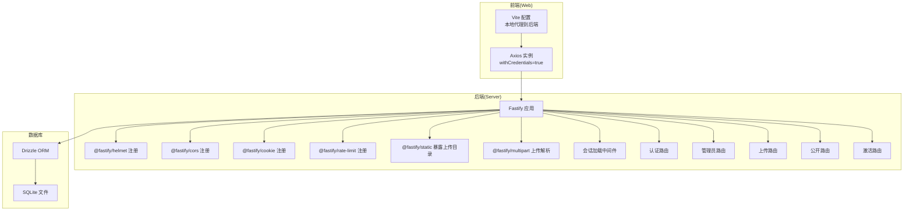
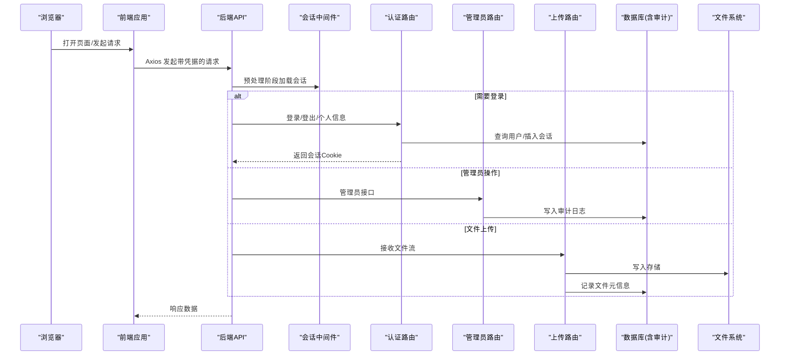
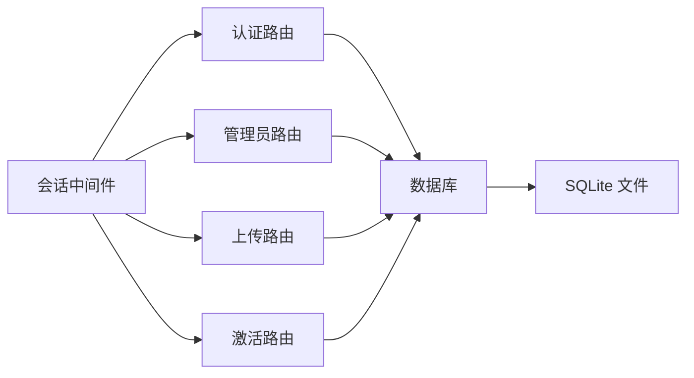
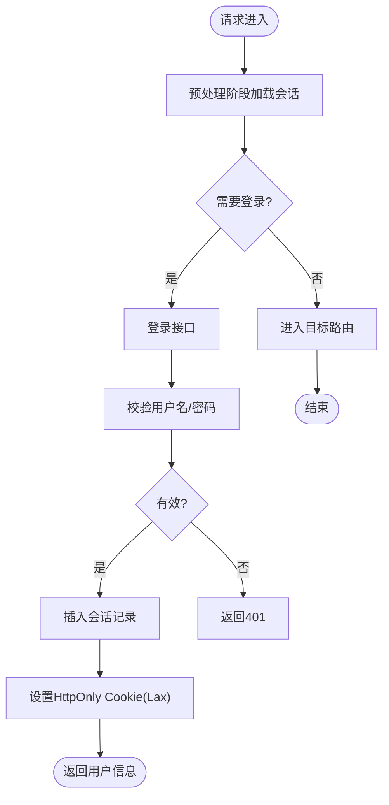

# 安全加固

<cite>
**本文引用的文件**
- [apps/server/src/index.ts](file://apps/server/src/index.ts)
- [apps/server/src/middleware/auth.ts](file://apps/server/src/middleware/auth.ts)
- [apps/server/src/middleware/audit.ts](file://apps/server/src/middleware/audit.ts)
- [apps/server/src/routes/auth.ts](file://apps/server/src/routes/auth.ts)
- [apps/server/src/routes/admin.ts](file://apps/server/src/routes/admin.ts)
- [apps/server/src/routes/upload.ts](file://apps/server/src/routes/upload.ts)
- [apps/server/src/routes/public.ts](file://apps/server/src/routes/public.ts)
- [apps/server/src/routes/activation.ts](file://apps/server/src/routes/activation.ts)
- [apps/server/src/db/index.ts](file://apps/server/src/db/index.ts)
- [apps/server/src/db/schema.ts](file://apps/server/src/db/schema.ts)
- [packages/shared/src/schemas.ts](file://packages/shared/src/schemas.ts)
- [apps/web/src/lib/api.ts](file://apps/web/src/lib/api.ts)
- [apps/web/vite.config.ts](file://apps/web/vite.config.ts)
</cite>

## 目录
1. [引言](#引言)
2. [项目结构](#项目结构)
3. [核心组件](#核心组件)
4. [架构总览](#架构总览)
5. [详细组件分析](#详细组件分析)
6. [依赖关系分析](#依赖关系分析)
7. [性能与安全权衡](#性能与安全权衡)
8. [故障排查指南](#故障排查指南)
9. [结论](#结论)
10. [附录](#附录)

## 引言
本指南面向ZBH2平台的安全加固工作，聚焦应用层、数据库层、文件上传、网络层以及访问控制等关键领域，结合现有代码实现，提出可落地的安全配置建议与最佳实践，帮助提升系统的整体安全性与合规性。

## 项目结构
后端基于Fastify框架，采用中间件加载会话、注册路由模块；前端使用Vite+React，通过代理访问后端API；数据库采用SQLite并通过Drizzle ORM进行建模与迁移。

图表来源
- [apps/server/src/index.ts:27-54](file://apps/server/src/index.ts#L27-L54)
- [apps/web/vite.config.ts:6-12](file://apps/web/vite.config.ts#L6-L12)
- [apps/web/src/lib/api.ts:3](file://apps/web/src/lib/api.ts#L3)

章节来源
- [apps/server/src/index.ts:27-54](file://apps/server/src/index.ts#L27-L54)
- [apps/web/vite.config.ts:6-12](file://apps/web/vite.config.ts#L6-L12)
- [apps/web/src/lib/api.ts:3](file://apps/web/src/lib/api.ts#L3)

## 核心组件
- 会话与认证：基于Cookie存储会话标识，服务端维护会话表并校验有效期与用户状态。
- 访问控制：通过中间件实现普通用户与管理员的分级授权。
- 审计日志：统一记录用户行为、目标对象与结果。
- 数据验证：共享Schema用于输入校验，减少脏数据进入数据库。
- 文件上传：支持流式写入、哈希计算与数据库记录，但缺少类型与恶意文件检测。
- 公开接口：提供无需登录即可访问的内容查询能力。

章节来源
- [apps/server/src/middleware/auth.ts:17-55](file://apps/server/src/middleware/auth.ts#L17-L55)
- [apps/server/src/middleware/audit.ts:3-27](file://apps/server/src/middleware/audit.ts#L3-L27)
- [packages/shared/src/schemas.ts:3-51](file://packages/shared/src/schemas.ts#L3-L51)
- [apps/server/src/routes/upload.ts:14-62](file://apps/server/src/routes/upload.ts#L14-L62)
- [apps/server/src/routes/public.ts:5-51](file://apps/server/src/routes/public.ts#L5-L51)

## 架构总览
下图展示从浏览器到后端、再到数据库与静态资源的整体交互路径，并标注安全相关组件的职责边界。

图表来源
- [apps/server/src/index.ts:37-49](file://apps/server/src/index.ts#L37-L49)
- [apps/server/src/middleware/auth.ts:17-40](file://apps/server/src/middleware/auth.ts#L17-L40)
- [apps/server/src/routes/auth.ts:9-50](file://apps/server/src/routes/auth.ts#L9-L50)
- [apps/server/src/routes/admin.ts:15-278](file://apps/server/src/routes/admin.ts#L15-L278)
- [apps/server/src/routes/upload.ts:14-62](file://apps/server/src/routes/upload.ts#L14-L62)
- [apps/server/src/db/schema.ts:301-314](file://apps/server/src/db/schema.ts#L301-L314)

## 详细组件分析

### 应用层安全配置（CORS、CSRF、XSS）
- CORS策略
  - 当前已注册CORS中间件并允许凭证传递，Origin由请求动态决定。
  - 建议：在生产环境固定可信域名，避免通配符Origin；对敏感接口启用更严格的来源白名单。
- CSRF防护
  - 当前未见显式的CSRF令牌机制或双重提交Cookie模式。
  - 建议：引入CSRF中间件或在关键写操作中要求自定义头部校验；对GET/HEAD等只读请求保持宽松，仅对POST/PUT/DELETE启用严格校验。
- XSS防护
  - 当前未启用默认的CSP策略（Helmet已注册但禁用了内容安全策略）。
  - 建议：启用CSP，限制脚本来源与内联执行；对富文本输出进行HTML转义或使用白名单过滤库。

章节来源
- [apps/server/src/index.ts:30-31](file://apps/server/src/index.ts#L30-L31)
- [apps/server/src/index.ts:29-30](file://apps/server/src/index.ts#L29-L30)

### 会话安全（HttpOnly、Secure、SameSite）
- 当前登录接口设置Cookie为HttpOnly与Lax，有效期7天。
- 建议：在HTTPS环境下追加Secure标志；根据业务场景选择Strict或Lax；对敏感操作可考虑短期会话或二次验证。

章节来源
- [apps/server/src/routes/auth.ts:26-31](file://apps/server/src/routes/auth.ts#L26-L31)

### 数据库安全（SQL注入防护、敏感数据加密）
- SQL注入防护
  - 使用Drizzle ORM进行参数化查询，避免字符串拼接，降低注入风险。
- 敏感数据保护
  - 用户密码采用Argon2哈希存储；建议对数据库连接与文件系统访问控制进行最小权限配置；对审计日志中的敏感字段进行脱敏处理。
- 数据库配置
  - 启用外键约束与WAL模式，有助于一致性与并发控制。

章节来源
- [apps/server/src/db/index.ts:10-14](file://apps/server/src/db/index.ts#L10-L14)
- [apps/server/src/routes/auth.ts:19](file://apps/server/src/routes/auth.ts#L19)
- [apps/server/src/db/schema.ts:301-314](file://apps/server/src/db/schema.ts#L301-L314)

### 文件上传安全（类型验证、恶意文件检测）
- 现状
  - 支持流式接收文件、计算SHA256、记录原始名、MIME与大小；未做类型白名单与恶意文件检测。
- 建议
  - 引入MIME白名单与扩展名白名单；对文件头进行二进制校验；限制最大文件大小；对上传目录设置不可执行权限；对下载路径进行访问控制与路径规范化。

章节来源
- [apps/server/src/routes/upload.ts:14-62](file://apps/server/src/routes/upload.ts#L14-L62)

### 网络层安全（防火墙、IP白名单、DDoS）
- 当前中间件包含速率限制（每分钟最多200次），可缓解部分DDoS与暴力破解。
- 建议
  - 结合反向代理或WAF设置IP白名单/黑名单；对登录接口单独收紧速率限制；启用CDN与DDoS清洗服务；对静态资源开启缓存与压缩。

章节来源
- [apps/server/src/index.ts:34](file://apps/server/src/index.ts#L34)

### 审计与漏洞扫描（安全审计、定期评估、补丁管理）
- 审计日志
  - 统一记录用户、动作、目标、结果、IP与UA，便于追踪与取证。
- 建议
  - 对高危操作增加二次确认与审批流程；定期导出审计日志并进行离线备份；建立漏洞扫描与依赖更新机制（如Renovate）。

章节来源
- [apps/server/src/middleware/audit.ts:3-27](file://apps/server/src/middleware/audit.ts#L3-L27)
- [apps/server/src/db/schema.ts:301-314](file://apps/server/src/db/schema.ts#L301-L314)

### 访问控制与权限管理（RBAC）
- 角色模型
  - 用户角色包含admin与user两类，登录成功后在请求上下文中携带。
- 权限控制
  - 提供requireAuth与requireAdmin中间件，分别用于登录态校验与管理员校验。
- 建议
  - 将权限细化到资源级（如某条记录的读写），并在路由层统一接入；对每个写操作记录审计日志。

章节来源
- [apps/server/src/middleware/auth.ts:5-9](file://apps/server/src/middleware/auth.ts#L5-L9)
- [apps/server/src/middleware/auth.ts:42-55](file://apps/server/src/middleware/auth.ts#L42-L55)
- [apps/server/src/routes/admin.ts:15-16](file://apps/server/src/routes/admin.ts#L15-L16)

### 输入验证与数据模型
- 输入验证
  - 使用共享Schema对登录、创建用户、软件分类等进行参数校验。
- 数据模型
  - 通过Drizzle Schema定义实体关系，确保字段约束与枚举值一致。

章节来源
- [packages/shared/src/schemas.ts:3-51](file://packages/shared/src/schemas.ts#L3-L51)
- [apps/server/src/db/schema.ts:3-17](file://apps/server/src/db/schema.ts#L3-L17)

### 前端交互与跨域
- 前端Axios实例启用withCredentials，确保Cookie随请求发送。
- Vite开发服务器通过代理将/api转发至后端端口，便于本地联调。

章节来源
- [apps/web/src/lib/api.ts:3](file://apps/web/src/lib/api.ts#L3)
- [apps/web/vite.config.ts:8-10](file://apps/web/vite.config.ts#L8-L10)

## 依赖关系分析
- 中间件耦合
  - 会话中间件在预处理阶段被全局注册，所有路由均可访问会话用户信息。
- 路由分层
  - 认证、公开、管理员、上传、激活等路由按功能拆分，职责清晰。
- 外部依赖
  - 依赖@fastify/*系列插件与axios、zod、argon2、drizzle-orm等。

图表来源
- [apps/server/src/index.ts:37-49](file://apps/server/src/index.ts#L37-L49)
- [apps/server/src/middleware/auth.ts:17-40](file://apps/server/src/middleware/auth.ts#L17-L40)
- [apps/server/src/db/index.ts:14](file://apps/server/src/db/index.ts#L14)

章节来源
- [apps/server/src/index.ts:37-49](file://apps/server/src/index.ts#L37-L49)

## 性能与安全权衡
- 速率限制与并发
  - 适度的速率限制可防止滥用，但需避免影响正常用户体验；建议对不同端点差异化配置。
- 静态资源与缓存
  - 通过静态文件服务暴露上传目录时，应确保路径安全与访问控制，避免直接URL猜测导致未授权访问。
- 日志与审计
  - 审计日志写入数据库可能带来写放大，建议异步落盘或队列化处理。

[本节为通用建议，不直接分析具体文件]

## 故障排查指南
- 登录失败
  - 检查用户名是否存在且状态为活跃；核对密码哈希验证是否通过；确认Cookie是否正确设置。
- 会话丢失
  - 检查Cookie的路径、域、HttpOnly、SameSite与有效期；确认会话表中是否存在未过期记录。
- 上传异常
  - 检查文件流写入是否完成、哈希计算是否正确、数据库记录是否插入；确认上传目录权限与磁盘空间。
- 审计缺失
  - 确认审计函数调用链路与数据库写入逻辑；检查审计表字段是否完整。

章节来源
- [apps/server/src/routes/auth.ts:15-32](file://apps/server/src/routes/auth.ts#L15-L32)
- [apps/server/src/middleware/auth.ts:17-40](file://apps/server/src/middleware/auth.ts#L17-L40)
- [apps/server/src/routes/upload.ts:39-48](file://apps/server/src/routes/upload.ts#L39-L48)
- [apps/server/src/middleware/audit.ts:14-26](file://apps/server/src/middleware/audit.ts#L14-L26)

## 结论
ZBH2已在会话管理、输入验证、审计日志与数据库约束方面具备良好基础。为进一步提升安全性，建议补充CSRF防护、CSP策略、文件类型与恶意文件检测、严格的来源白名单、速率限制细化与补丁管理流程，并在管理员路由上强化资源级权限控制与审计覆盖。

[本节为总结性内容，不直接分析具体文件]

## 附录

### 关键流程图：登录与会话加载

图表来源
- [apps/server/src/middleware/auth.ts:17-40](file://apps/server/src/middleware/auth.ts#L17-L40)
- [apps/server/src/routes/auth.ts:9-33](file://apps/server/src/routes/auth.ts#L9-L33)