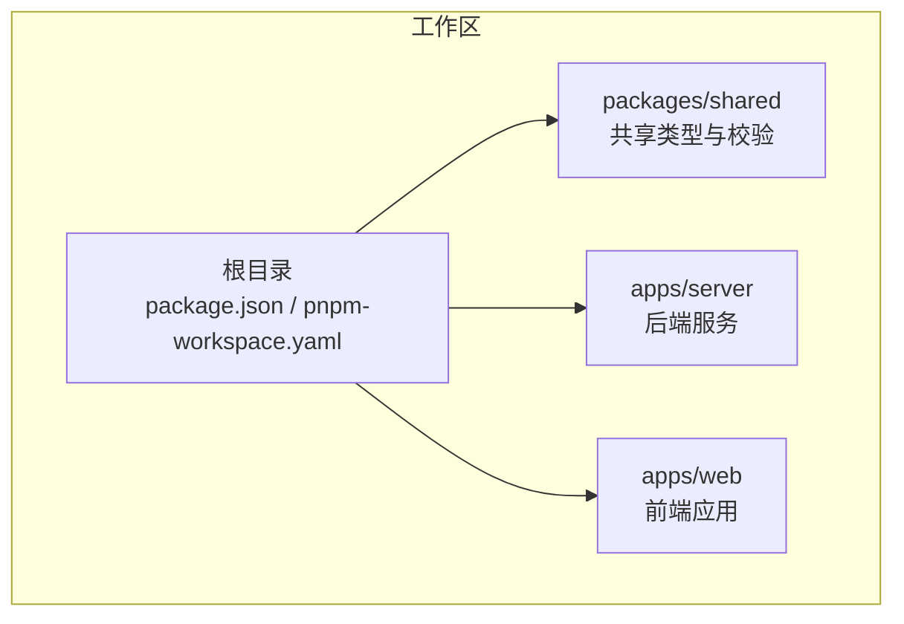
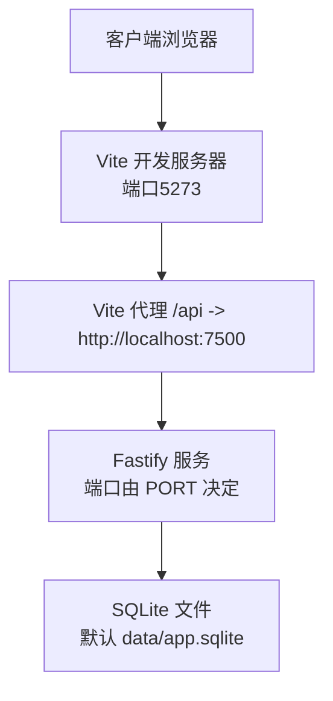
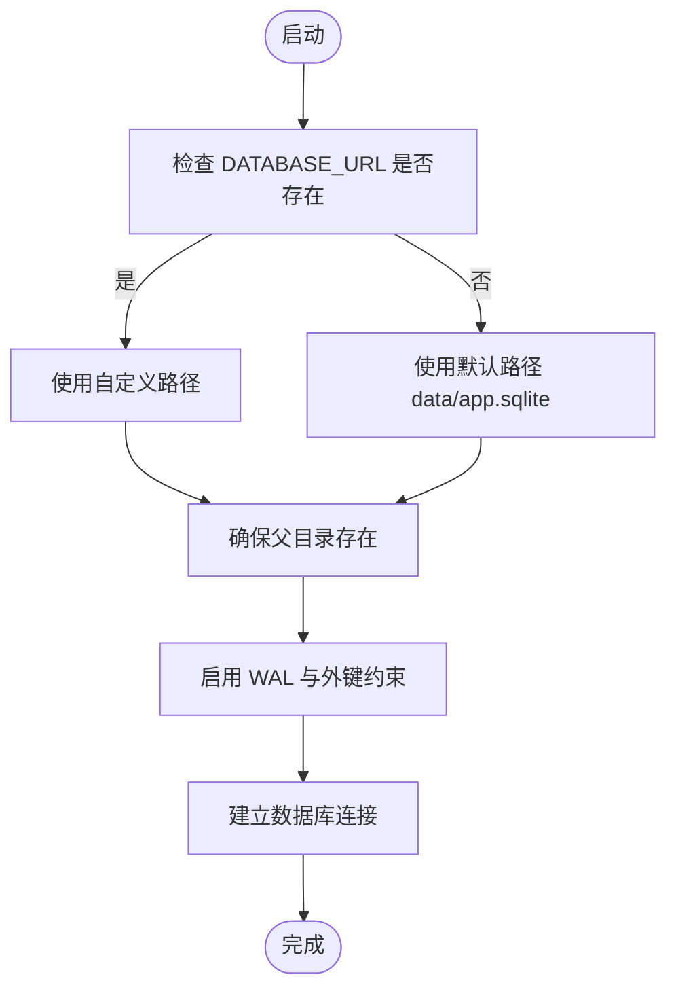
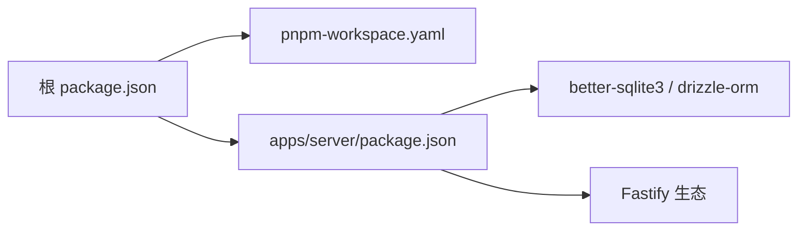

# 环境配置

<cite>
**本文引用的文件**
- [package.json](file://package.json)
- [global.json](file://global.json)
- [pnpm-workspace.yaml](file://pnpm-workspace.yaml)
- [apps/server/package.json](file://apps/server/package.json)
- [apps/server/src/index.ts](file://apps/server/src/index.ts)
- [apps/server/src/db/index.ts](file://apps/server/src/db/index.ts)
- [apps/server/drizzle.config.ts](file://apps/server/drizzle.config.ts)
- [apps/server/src/db/schema.ts](file://apps/server/src/db/schema.ts)
- [apps/server/src/middleware/auth.ts](file://apps/server/src/middleware/auth.ts)
- [apps/server/src/routes/auth.ts](file://apps/server/src/routes/auth.ts)
- [apps/web/vite.config.ts](file://apps/web/vite.config.ts)
- [.gitignore](file://.gitignore)
</cite>

## 目录
1. [简介](#简介)
2. [项目结构](#项目结构)
3. [核心组件](#核心组件)
4. [架构总览](#架构总览)
5. [详细组件分析](#详细组件分析)
6. [依赖关系分析](#依赖关系分析)
7. [性能考虑](#性能考虑)
8. [故障排查指南](#故障排查指南)
9. [结论](#结论)
10. [附录](#附录)

## 简介
本指南面向ZBH2平台的环境配置与部署，覆盖生产环境系统要求（Node.js版本、包管理器版本）、环境变量配置（端口、数据库URL、会话与安全参数）、不同部署场景的配置模板（开发、测试、生产）、SQLite数据库的配置与优化建议（文件权限、存储路径、性能调优）、网络配置与防火墙策略，以及环境变量最佳实践与安全建议。

## 项目结构
ZBH2采用多包工作区结构，后端服务位于apps/server，前端位于apps/web，共享类型与校验逻辑在packages/shared中。根目录通过pnpm进行统一管理，并在package.json中声明Node.js最低版本要求。



**图表来源**
- [package.json:1-20](file://package.json#L1-L20)
- [pnpm-workspace.yaml:1-5](file://pnpm-workspace.yaml#L1-L5)

**章节来源**
- [package.json:1-20](file://package.json#L1-L20)
- [pnpm-workspace.yaml:1-5](file://pnpm-workspace.yaml#L1-L5)

## 核心组件
- 后端服务（Fastify）：负责HTTP路由注册、认证中间件、静态资源服务、速率限制与安全头等。
- 数据层（Drizzle ORM + better-sqlite3）：使用SQLite作为默认数据库，支持迁移与种子数据。
- 前端应用（Vite + React）：本地开发代理到后端7500端口，构建产物用于生产部署。

**章节来源**
- [apps/server/src/index.ts:1-60](file://apps/server/src/index.ts#L1-L60)
- [apps/server/src/db/index.ts:1-16](file://apps/server/src/db/index.ts#L1-L16)
- [apps/web/vite.config.ts:1-13](file://apps/web/vite.config.ts#L1-L13)

## 架构总览
后端启动时加载安全中间件、CORS、Cookie、限流与静态资源；注册各业务路由；监听环境变量PORT或默认端口；上传文件目录位于data/uploads。Drizzle配置从环境变量读取数据库URL，未指定时默认使用data目录下的SQLite文件。



**图表来源**
- [apps/web/vite.config.ts:6-11](file://apps/web/vite.config.ts#L6-L11)
- [apps/server/src/index.ts:51-53](file://apps/server/src/index.ts#L51-L53)
- [apps/server/src/db/index.ts:7-8](file://apps/server/src/db/index.ts#L7-L8)

## 详细组件分析

### 系统与运行时要求
- Node.js版本：根package.json声明最低版本为18及以上。
- 包管理器：pnpm工作区，仅构建特定原生依赖以确保跨平台兼容性。
- .NET SDK：global.json声明SDK版本，主要用于其他工具链（如激活客户端），与Web/Server运行无直接依赖。

**章节来源**
- [package.json:13-15](file://package.json#L13-L15)
- [pnpm-workspace.yaml:1-5](file://pnpm-workspace.yaml#L1-L5)
- [global.json:1-7](file://global.json#L1-L7)

### 环境变量配置
- 端口（PORT）
  - 默认值：7500
  - 作用：后端监听端口
  - 参考：[apps/server/src/index.ts:51-53](file://apps/server/src/index.ts#L51-L53)
- 数据库URL（DATABASE_URL）
  - 默认值：相对路径data/app.sqlite
  - 作用：Drizzle连接字符串，可指向任意SQLite文件路径
  - 参考：[apps/server/drizzle.config.ts:7-9](file://apps/server/drizzle.config.ts#L7-L9)，[apps/server/src/db/index.ts:7-8](file://apps/server/src/db/index.ts#L7-L8)
- 会话与安全参数
  - Cookie名称：sid
  - 安全属性：httpOnly、SameSite=Lax、maxAge=7天
  - 会话有效期：登录后生成sid并写入Cookie，同时在数据库插入一条带过期时间的记录
  - 参考：[apps/server/src/routes/auth.ts:23-32](file://apps/server/src/routes/auth.ts#L23-L32)，[apps/server/src/middleware/auth.ts:17-40](file://apps/server/src/middleware/auth.ts#L17-L40)

**章节来源**
- [apps/server/src/index.ts:51-53](file://apps/server/src/index.ts#L51-L53)
- [apps/server/drizzle.config.ts:7-9](file://apps/server/drizzle.config.ts#L7-L9)
- [apps/server/src/db/index.ts:7-8](file://apps/server/src/db/index.ts#L7-L8)
- [apps/server/src/routes/auth.ts:23-32](file://apps/server/src/routes/auth.ts#L23-L32)
- [apps/server/src/middleware/auth.ts:17-40](file://apps/server/src/middleware/auth.ts#L17-L40)

### 部署场景配置模板
以下为常见部署场景的环境变量示例，请根据实际环境调整：

- 开发环境
  - PORT=7500
  - DATABASE_URL=相对路径或绝对路径（例如 ./data/dev.sqlite）
  - 前端开发服务器端口：5273（已内置代理到后端7500）
  - 参考：[apps/web/vite.config.ts:6-11](file://apps/web/vite.config.ts#L6-L11)，[apps/server/src/index.ts:51-53](file://apps/server/src/index.ts#L51-L53)
- 测试环境
  - PORT=7501
  - DATABASE_URL=./data/test.sqlite
  - 可启用更严格的日志与审计
- 生产环境
  - PORT=80 或 443（反向代理暴露）
  - DATABASE_URL=/var/lib/zbh2/data/prod.sqlite（需具备写权限）
  - Cookie安全：建议在反向代理层开启HTTPS与Secure标志（本项目未强制要求Secure，但生产应配合TLS）
  - 参考：[apps/server/src/routes/auth.ts:26-31](file://apps/server/src/routes/auth.ts#L26-L31)

**章节来源**
- [apps/web/vite.config.ts:6-11](file://apps/web/vite.config.ts#L6-L11)
- [apps/server/src/index.ts:51-53](file://apps/server/src/index.ts#L51-L53)
- [apps/server/src/routes/auth.ts:26-31](file://apps/server/src/routes/auth.ts#L26-L31)

### SQLite数据库配置与优化
- 存储路径
  - 默认：data/app.sqlite（相对路径）
  - 可通过DATABASE_URL自定义路径（绝对或相对）
  - 参考：[apps/server/drizzle.config.ts:7-9](file://apps/server/drizzle.config.ts#L7-L9)，[apps/server/src/db/index.ts:7-8](file://apps/server/src/db/index.ts#L7-L8)
- 文件权限
  - 生产环境建议将数据库文件置于独立目录（如/var/lib/zbh2/data/），并赋予运行账户读写权限
  - .gitignore已忽略data目录与SQLite文件，避免误提交
  - 参考：[.gitignore:3-6](file://.gitignore#L3-L6)
- 性能调优
  - 已启用WAL模式与外键约束，有助于并发读写与数据一致性
  - 参考：[apps/server/src/db/index.ts:11-12](file://apps/server/src/db/index.ts#L11-L12)
- 迁移与种子
  - 使用Drizzle Kit生成迁移脚本，执行迁移与种子数据
  - 参考：[apps/server/package.json:10-11](file://apps/server/package.json#L10-L11)



**图表来源**
- [apps/server/drizzle.config.ts:7-9](file://apps/server/drizzle.config.ts#L7-L9)
- [apps/server/src/db/index.ts:7-12](file://apps/server/src/db/index.ts#L7-L12)

**章节来源**
- [apps/server/drizzle.config.ts:7-9](file://apps/server/drizzle.config.ts#L7-L9)
- [apps/server/src/db/index.ts:7-12](file://apps/server/src/db/index.ts#L7-L12)
- [.gitignore:3-6](file://.gitignore#L3-L6)
- [apps/server/package.json:10-11](file://apps/server/package.json#L10-L11)

### 网络配置与防火墙
- 后端监听地址
  - 绑定0.0.0.0，允许外部访问
  - 参考：[apps/server/src/index.ts:52](file://apps/server/src/index.ts#L52)
- 端口开放
  - 默认7500；生产环境建议通过反向代理暴露80/443
  - 前端开发默认5273，代理到后端7500
  - 参考：[apps/web/vite.config.ts:6-11](file://apps/web/vite.config.ts#L6-L11)，[apps/server/src/index.ts:51-53](file://apps/server/src/index.ts#L51-L53)
- 防火墙策略
  - 仅开放反向代理端口（80/443），后端进程仅监听内网或受控接口
  - 上传目录对外通过静态路由暴露，注意控制访问与清理策略

**章节来源**
- [apps/server/src/index.ts:51-53](file://apps/server/src/index.ts#L51-L53)
- [apps/web/vite.config.ts:6-11](file://apps/web/vite.config.ts#L6-L11)

### 认证流程与会话
```mermaid
sequenceDiagram
participant C as "客户端"
participant S as "后端服务"
participant D as "SQLite 数据库"
C->>S : "POST /api/auth/login"
S->>D : "查询用户并校验密码"
D-->>S : "返回用户信息"
S->>D : "插入新会话记录sid, 过期时间"
S-->>C : "Set-Cookie : sid=httpOnly;SameSite=Lax;maxAge=604800"
C->>S : "后续请求携带 sid"
S->>D : "校验会话与用户状态"
D-->>S : "返回有效会话用户"
S-->>C : "继续处理业务请求"
```

**图表来源**
- [apps/server/src/routes/auth.ts:9-33](file://apps/server/src/routes/auth.ts#L9-L33)
- [apps/server/src/middleware/auth.ts:17-40](file://apps/server/src/middleware/auth.ts#L17-L40)

**章节来源**
- [apps/server/src/routes/auth.ts:9-33](file://apps/server/src/routes/auth.ts#L9-L33)
- [apps/server/src/middleware/auth.ts:17-40](file://apps/server/src/middleware/auth.ts#L17-L40)

## 依赖关系分析
- 工作区与包管理
  - 根package.json声明Node引擎与pnpm策略
  - pnpm-workspace.yaml定义工作区范围与原生依赖批准列表
- 后端依赖
  - Fastify生态：cookie、cors、helmet、multipart、rate-limit、static
  - 数据库：better-sqlite3 + drizzle-orm
  - 参考：[apps/server/package.json:14-35](file://apps/server/package.json#L14-L35)



**图表来源**
- [package.json:1-20](file://package.json#L1-L20)
- [pnpm-workspace.yaml:1-5](file://pnpm-workspace.yaml#L1-L5)
- [apps/server/package.json:14-35](file://apps/server/package.json#L14-L35)

**章节来源**
- [package.json:1-20](file://package.json#L1-L20)
- [pnpm-workspace.yaml:1-5](file://pnpm-workspace.yaml#L1-L5)
- [apps/server/package.json:14-35](file://apps/server/package.json#L14-L35)

## 性能考虑
- SQLite模式
  - 已启用WAL与外键，适合中小规模并发读写
  - 参考：[apps/server/src/db/index.ts:11-12](file://apps/server/src/db/index.ts#L11-L12)
- 上传文件
  - 通过静态路由暴露，建议限制文件大小与类型，定期清理
  - 参考：[apps/server/src/index.ts:35](file://apps/server/src/index.ts#L35)
- 速率限制
  - 默认每分钟最多200次请求，可根据业务调整
  - 参考：[apps/server/src/index.ts:34](file://apps/server/src/index.ts#L34)

**章节来源**
- [apps/server/src/db/index.ts:11-12](file://apps/server/src/db/index.ts#L11-L12)
- [apps/server/src/index.ts:34-35](file://apps/server/src/index.ts#L34-L35)

## 故障排查指南
- 端口占用
  - 检查PORT是否被占用，或是否正确传递给容器/进程
  - 参考：[apps/server/src/index.ts:51-53](file://apps/server/src/index.ts#L51-L53)
- 数据库连接失败
  - 确认DATABASE_URL指向的文件存在且可写
  - 参考：[apps/server/drizzle.config.ts:7-9](file://apps/server/drizzle.config.ts#L7-L9)，[apps/server/src/db/index.ts:7-8](file://apps/server/src/db/index.ts#L7-L8)
- 会话无效
  - 检查Cookie是否携带sid，确认会话未过期且用户状态为active
  - 参考：[apps/server/src/middleware/auth.ts:17-40](file://apps/server/src/middleware/auth.ts#L17-L40)
- 上传失败
  - 检查data/uploads目录权限与磁盘空间
  - 参考：[apps/server/src/index.ts:24-25](file://apps/server/src/index.ts#L24-L25)

**章节来源**
- [apps/server/src/index.ts:51-53](file://apps/server/src/index.ts#L51-L53)
- [apps/server/drizzle.config.ts:7-9](file://apps/server/drizzle.config.ts#L7-L9)
- [apps/server/src/db/index.ts:7-8](file://apps/server/src/db/index.ts#L7-L8)
- [apps/server/src/middleware/auth.ts:17-40](file://apps/server/src/middleware/auth.ts#L17-L40)
- [apps/server/src/index.ts:24-25](file://apps/server/src/index.ts#L24-L25)

## 结论
ZBH2平台的环境配置以简洁明确为核心：通过环境变量控制端口与数据库路径，结合SQLite与Drizzle实现快速开发与部署；借助Fastify中间件体系保障安全与稳定性。生产部署建议配合反向代理与TLS，严格控制数据库文件权限与备份策略，并按需调整速率限制与上传策略。

## 附录

### 环境变量清单与建议
- PORT
  - 类型：整数
  - 默认：7500
  - 建议：生产使用80/443，后端监听0.0.0.0
- DATABASE_URL
  - 类型：SQLite文件路径
  - 默认：data/app.sqlite
  - 建议：生产使用绝对路径与专用目录，确保进程用户可写
- Cookie与会话
  - sid：httpOnly + SameSite=Lax + maxAge=7天
  - 建议：配合TLS启用Secure标志（可在反向代理层实现）

**章节来源**
- [apps/server/src/index.ts:51-53](file://apps/server/src/index.ts#L51-L53)
- [apps/server/drizzle.config.ts:7-9](file://apps/server/drizzle.config.ts#L7-L9)
- [apps/server/src/routes/auth.ts:26-31](file://apps/server/src/routes/auth.ts#L26-L31)