# 生产部署

<cite>
**本文引用的文件**   
- [README.md](file://README.md)
- [package.json](file://package.json)
- [.github/workflows/build.yml](file://.github/workflows/build.yml)
- [apps/server/package.json](file://apps/server/package.json)
- [apps/web/package.json](file://apps/web/package.json)
- [apps/server/src/index.ts](file://apps/server/src/index.ts)
- [apps/server/src/db/migrate.ts](file://apps/server/src/db/migrate.ts)
- [apps/server/drizzle.config.ts](file://apps/server/drizzle.config.ts)
- [apps/server/src/db/schema.ts](file://apps/server/src/db/schema.ts)
- [apps/server/src/middleware/auth.ts](file://apps/server/src/middleware/auth.ts)
- [apps/web/vite.config.ts](file://apps/web/vite.config.ts)
</cite>

## 目录
1. [简介](#简介)
2. [项目结构](#项目结构)
3. [核心组件](#核心组件)
4. [架构总览](#架构总览)
5. [详细组件分析](#详细组件分析)
6. [依赖关系分析](#依赖关系分析)
7. [性能考量](#性能考量)
8. [故障排查指南](#故障排查指南)
9. [结论](#结论)
10. [附录](#附录)

## 简介
本指南面向ZBH2平台的生产环境部署，覆盖从环境准备、依赖安装、数据库初始化，到多场景部署方案（传统服务器、云平台、容器化）、负载均衡与反向代理、进程管理与服务守护、域名与HTTPS配置、部署脚本与自动化工具、以及热更新与零停机策略。内容以仓库现有实现为依据，确保可操作性与一致性。

## 项目结构
ZBH2采用monorepo结构，包含后端Fastify服务、前端React应用、共享包与CI工作流。生产部署的关键产物来自CI构建流程，产出后端与前端的构建产物，供反向代理或容器运行时使用。

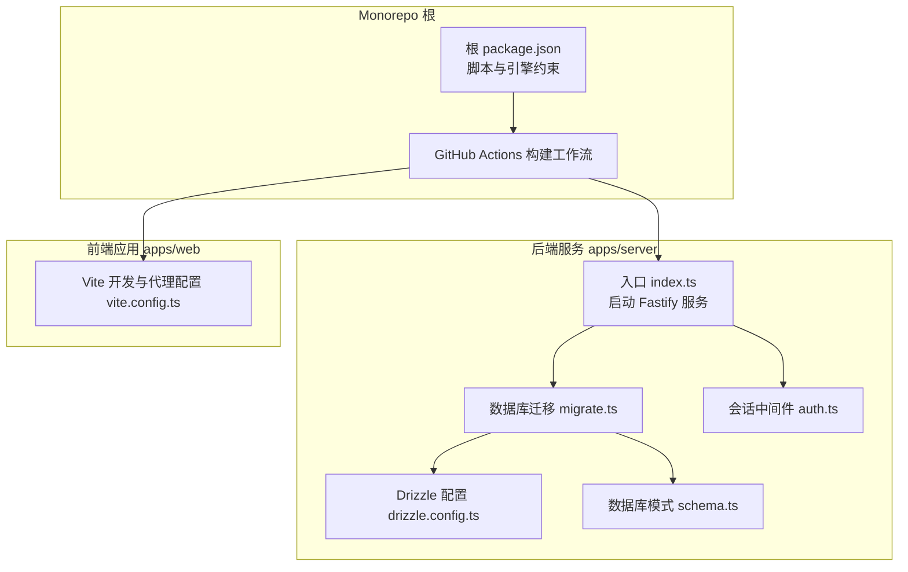

**图示来源**
- [README.md:47-68](file://README.md#L47-L68)
- [package.json:1-20](file://package.json#L1-L20)
- [.github/workflows/build.yml:14-52](file://.github/workflows/build.yml#L14-L52)
- [apps/server/src/index.ts:1-60](file://apps/server/src/index.ts#L1-L60)
- [apps/server/src/db/migrate.ts:1-18](file://apps/server/src/db/migrate.ts#L1-L18)
- [apps/server/drizzle.config.ts:1-11](file://apps/server/drizzle.config.ts#L1-L11)
- [apps/server/src/db/schema.ts:1-330](file://apps/server/src/db/schema.ts#L1-L330)
- [apps/server/src/middleware/auth.ts:1-56](file://apps/server/src/middleware/auth.ts#L1-L56)
- [apps/web/vite.config.ts:1-13](file://apps/web/vite.config.ts#L1-L13)

**章节来源**
- [README.md:47-68](file://README.md#L47-L68)
- [package.json:1-20](file://package.json#L1-L20)
- [.github/workflows/build.yml:14-52](file://.github/workflows/build.yml#L14-L52)

## 核心组件
- 后端服务（Fastify）
  - 监听端口与主机、注册安全与静态资源插件、挂载路由模块、启动日志输出。
  - 环境变量端口与数据库URL控制运行参数。
- 数据库与迁移
  - Drizzle配置指向SQLite文件路径；迁移脚本确保WAL模式与外键开启，并执行迁移。
- 认证与会话
  - 基于Cookie的会话加载与鉴权中间件，提供登录态校验与管理员权限校验。
- 前端构建与代理
  - Vite开发代理将/api请求转发至后端；生产构建产物用于静态托管。

**章节来源**
- [apps/server/src/index.ts:27-54](file://apps/server/src/index.ts#L27-L54)
- [apps/server/src/db/migrate.ts:7-15](file://apps/server/src/db/migrate.ts#L7-L15)
- [apps/server/drizzle.config.ts:3-9](file://apps/server/drizzle.config.ts#L3-L9)
- [apps/server/src/middleware/auth.ts:17-40](file://apps/server/src/middleware/auth.ts#L17-L40)
- [apps/web/vite.config.ts:6-11](file://apps/web/vite.config.ts#L6-L11)

## 架构总览
生产部署建议采用“反向代理 + 应用服务”的分离架构：Nginx/Apache作为反向代理与静态资源服务，后端Fastify提供API与静态文件服务，前端构建产物由反向代理托管。

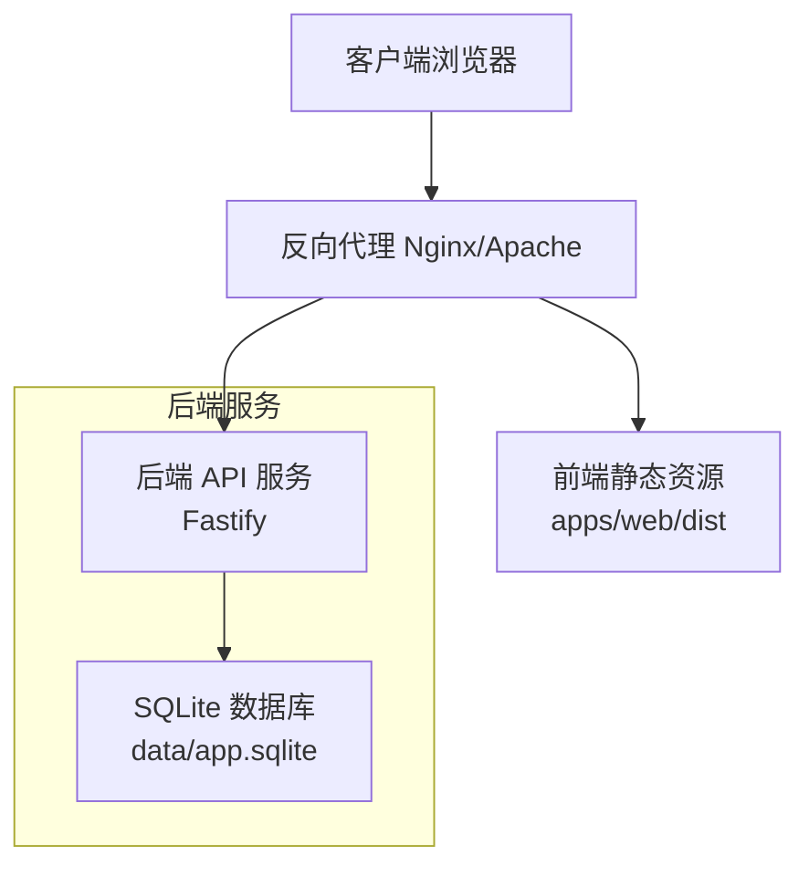

[此图为概念性架构示意，不对应具体源码文件，故无图示来源]

## 详细组件分析

### 部署前准备
- 环境要求
  - Node.js版本与包管理器约束见根与各子包脚本与引擎字段。
- 依赖安装
  - 使用包管理器安装依赖，确保二进制依赖正确编译。
- 数据库初始化
  - 执行数据库迁移脚本，确保SQLite文件存在且WAL模式与外键约束生效。
  - 首次部署后建议执行种子脚本初始化演示数据。

**章节来源**
- [README.md:7-24](file://README.md#L7-L24)
- [package.json:13-18](file://package.json#L13-L18)
- [apps/server/package.json:6-12](file://apps/server/package.json#L6-L12)
- [apps/server/src/db/migrate.ts:7-15](file://apps/server/src/db/migrate.ts#L7-L15)

### 多种部署方式

#### 传统服务器部署
- 产物获取
  - 通过CI构建产物或本地构建获取后端与前端构建产物。
- 服务启动
  - 后端通过Node启动入口文件；前端构建产物交由反向代理托管。
- 文件与目录
  - 上传文件目录与SQLite数据库文件位于data/目录，需持久化与备份。

```mermaid
flowchart TD
Start(["开始"]) --> GetArtifacts["获取构建产物<br/>后端与前端"]
GetArtifacts --> PrepareEnv["准备运行环境<br/>安装依赖、设置环境变量"]
PrepareEnv --> InitDB["初始化数据库<br/>执行迁移"]
InitDB --> StartApp["启动后端服务"]
StartApp --> ServeWeb["托管前端静态资源"]
ServeWeb --> Done(["完成"])
```

[此图为概念性流程示意，不对应具体源码文件，故无图示来源]

**章节来源**
- [.github/workflows/build.yml:36-51](file://.github/workflows/build.yml#L36-L51)
- [apps/server/src/index.ts:51-53](file://apps/server/src/index.ts#L51-L53)
- [README.md:104-111](file://README.md#L104-L111)

#### 云平台部署
- 选择云厂商提供的容器或虚拟机服务，按传统服务器部署步骤准备与启动。
- 将data/目录映射为持久化存储，确保数据库与上传文件不丢失。

[本节为通用实践说明，不直接分析具体文件，故无章节来源]

#### 容器化部署
- 构建镜像
  - 基于Node基础镜像，复制依赖与构建产物，暴露端口，设置工作目录与命令。
- 卷挂载
  - 将data/目录映射为持久卷，避免容器重启导致数据丢失。
- 健康检查
  - 配置HTTP健康检查，探测后端服务可用性。

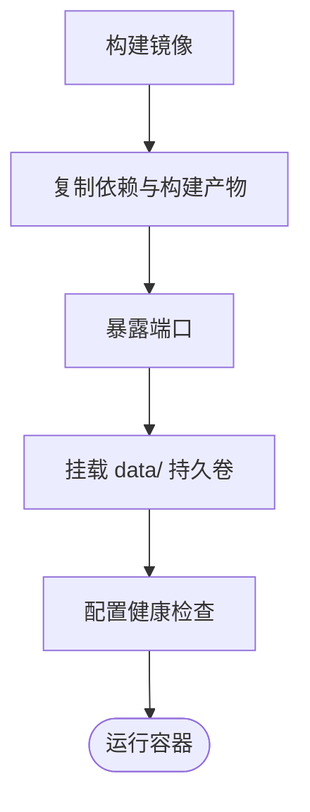

[此图为概念性流程示意，不对应具体源码文件，故无图示来源]

### 负载均衡与反向代理

#### Nginx 配置要点
- 反向代理
  - 将/api前缀转发至后端Fastify服务。
- 静态资源
  - 托管apps/web/dist目录，提供前端静态文件。
- 上传文件
  - 将/uploads前缀映射到后端静态文件根目录，便于直接访问上传文件。
- 缓存与压缩
  - 对静态资源启用缓存与Gzip/Br压缩，提升性能。

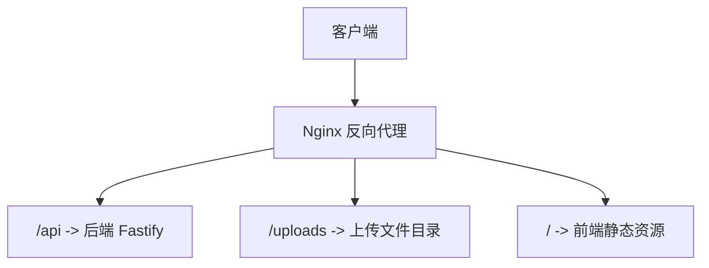

[此图为概念性配置示意，不对应具体源码文件，故无图示来源]

#### Apache 配置要点
- 使用mod_proxy与mod_proxy_http将/api转发至后端。
- 使用Alias或DocumentRoot托管前端静态资源。
- 使用Alias映射/uploads到后端静态文件根目录。

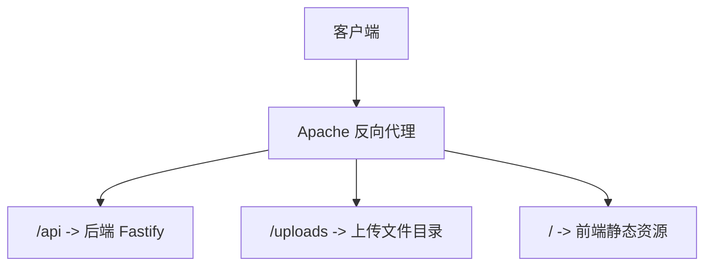

[此图为概念性配置示意，不对应具体源码文件，故无图示来源]

### 进程管理与服务守护

#### PM2
- 启动后端服务
  - 使用PM2启动后端入口文件，设置名称、日志与重启策略。
- 前端静态托管
  - 使用PM2托管前端静态资源（如通过Nginx），或直接在Nginx中托管。
- 自动重启与监控
  - 配置进程监控与自动重启，结合日志轮转。

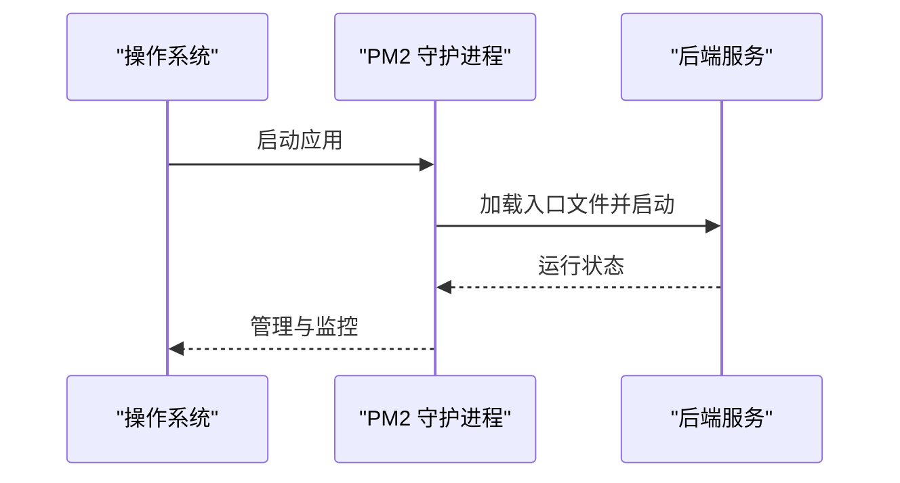

[此图为概念性流程示意，不对应具体源码文件，故无图示来源]

#### systemd
- 创建服务单元
  - 设置User、WorkingDirectory、ExecStart、Restart等参数。
- 开机自启
  - 启用服务单元，确保系统重启后自动启动。
- 日志与监控
  - 使用journalctl查看日志，结合外部监控工具。

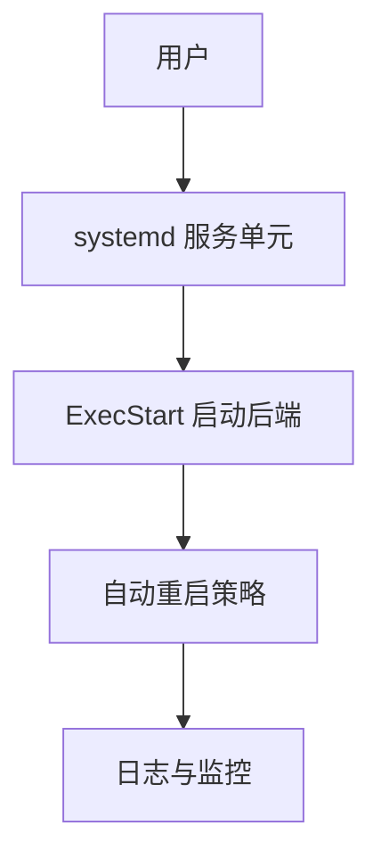

[此图为概念性流程示意，不对应具体源码文件，故无图示来源]

### 域名配置、SSL证书与HTTPS
- 域名解析
  - 将域名A/AAAA记录指向服务器IP。
- 反向代理HTTPS
  - 在Nginx/Apache中配置SSL证书与私钥，启用HTTPS，强制跳转至HTTPS。
- 证书自动化
  - 使用ACME协议（如Certbot）自动签发与续期证书。

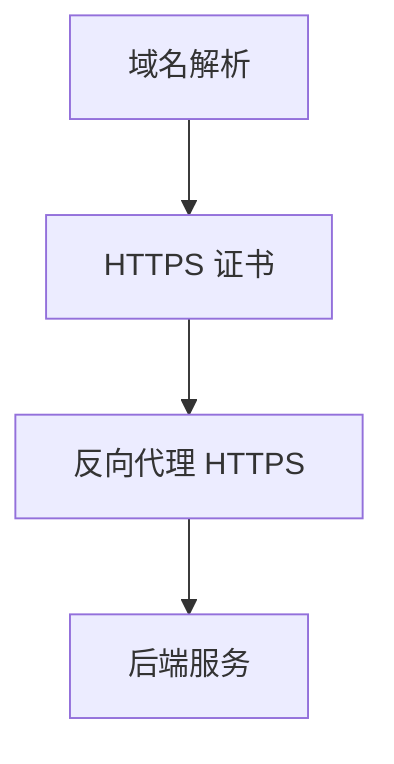

[此图为概念性流程示意，不对应具体源码文件，故无图示来源]

### 部署脚本与自动化工具
- CI构建产物
  - GitHub Actions在主分支推送与PR时自动构建并上传web-dist与server-dist。
- 本地构建
  - 使用根脚本一键构建共享包、后端与前端。
- 自动化部署
  - 结合CI/CD流水线，自动拉取构建产物并部署到目标环境。

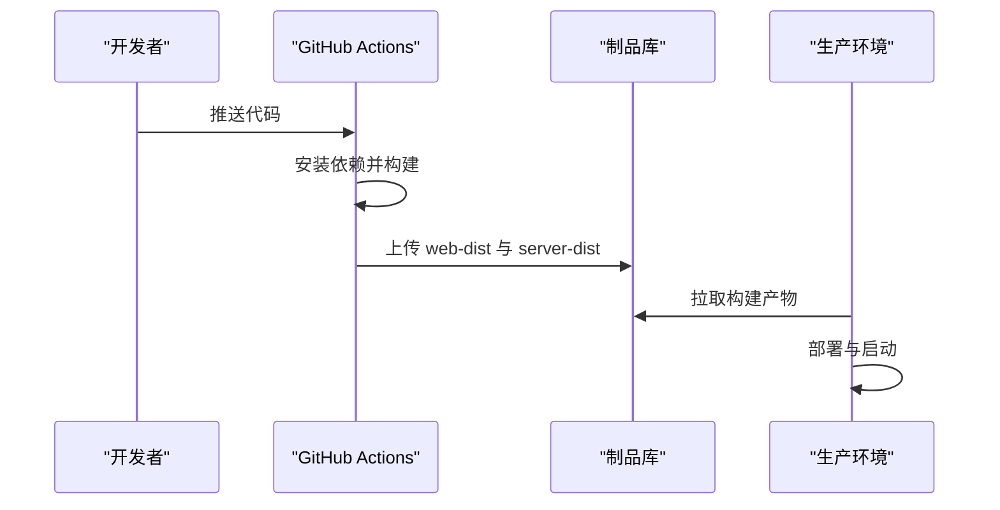

**图示来源**
- [.github/workflows/build.yml:14-52](file://.github/workflows/build.yml#L14-L52)
- [package.json:4-11](file://package.json#L4-L11)

**章节来源**
- [.github/workflows/build.yml:14-52](file://.github/workflows/build.yml#L14-L52)
- [package.json:4-11](file://package.json#L4-L11)

### 热更新与零停机部署
- 热更新策略
  - 利用反向代理的平滑切换能力，先停止旧实例，再启动新实例，最后切换流量。
- 零停机部署
  - 使用多实例并行部署，逐步替换实例，确保服务始终可用。
- 数据与文件
  - 确保data/目录持久化，避免迁移与文件丢失影响部署。

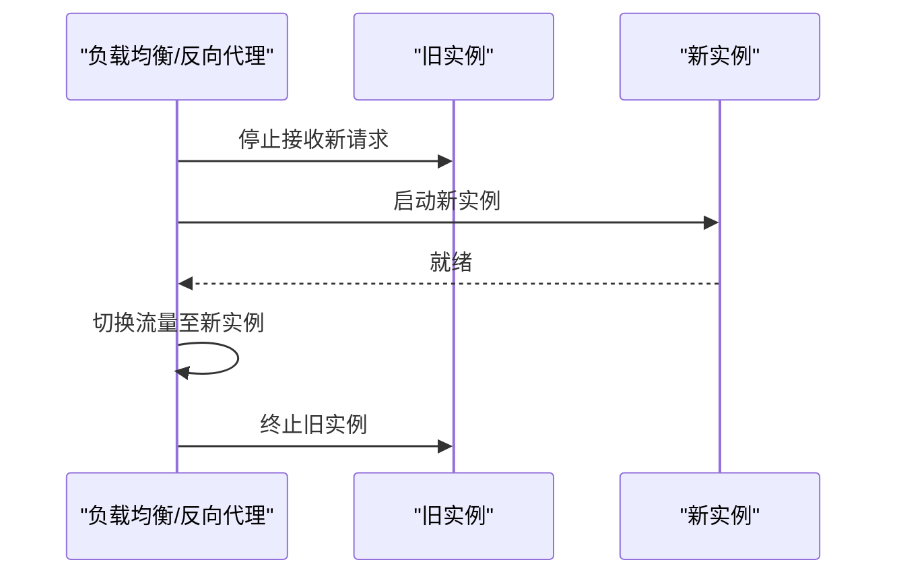

[此图为概念性流程示意，不对应具体源码文件，故无图示来源]

## 依赖关系分析

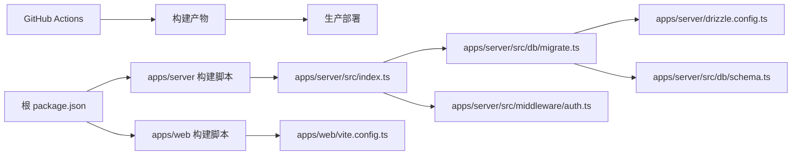

**图示来源**
- [package.json:4-11](file://package.json#L4-L11)
- [.github/workflows/build.yml:36-51](file://.github/workflows/build.yml#L36-L51)
- [apps/server/src/index.ts:1-60](file://apps/server/src/index.ts#L1-L60)
- [apps/server/src/db/migrate.ts:1-18](file://apps/server/src/db/migrate.ts#L1-L18)
- [apps/server/drizzle.config.ts:1-11](file://apps/server/drizzle.config.ts#L1-L11)
- [apps/server/src/db/schema.ts:1-330](file://apps/server/src/db/schema.ts#L1-L330)
- [apps/server/src/middleware/auth.ts:1-56](file://apps/server/src/middleware/auth.ts#L1-L56)
- [apps/web/vite.config.ts:1-13](file://apps/web/vite.config.ts#L1-L13)

**章节来源**
- [package.json:4-11](file://package.json#L4-L11)
- [.github/workflows/build.yml:36-51](file://.github/workflows/build.yml#L36-L51)

## 性能考量
- 反向代理优化
  - 启用Gzip/Br压缩、静态资源缓存、连接复用与超时配置。
- 后端优化
  - 合理设置速率限制、文件大小限制与静态资源前缀，避免过大请求占用带宽。
- 数据库优化
  - 使用WAL模式与外键约束，确保并发写入与数据一致性。

**章节来源**
- [apps/server/src/index.ts:30-35](file://apps/server/src/index.ts#L30-L35)
- [apps/server/src/db/migrate.ts:10-12](file://apps/server/src/db/migrate.ts#L10-L12)

## 故障排查指南
- 启动失败
  - 检查端口占用与权限，确认环境变量端口与数据库URL正确。
- 数据库问题
  - 确认SQLite文件存在且具备读写权限，迁移脚本执行成功。
- 会话与认证
  - 检查Cookie是否正确设置与过期时间，会话未过期且用户状态为激活。
- 静态资源与上传文件
  - 确认上传目录存在且权限正确，反向代理映射正确。

**章节来源**
- [apps/server/src/index.ts:51-53](file://apps/server/src/index.ts#L51-L53)
- [apps/server/src/db/migrate.ts:7-15](file://apps/server/src/db/migrate.ts#L7-L15)
- [apps/server/src/middleware/auth.ts:17-40](file://apps/server/src/middleware/auth.ts#L17-L40)

## 结论
本指南基于仓库现有实现，提供了从环境准备、数据库初始化到多场景部署、反向代理、进程守护、域名与HTTPS、自动化与热更新的完整实践路径。建议在生产环境中结合自身基础设施与安全策略进行细化与加固。

## 附录
- 环境变量
  - PORT：后端监听端口，默认7500。
  - DATABASE_URL：SQLite文件路径，默认指向data/app.sqlite。
- 数据备份
  - 同步备份data/app.sqlite与data/uploads/目录。

**章节来源**
- [README.md:97-111](file://README.md#L97-L111)