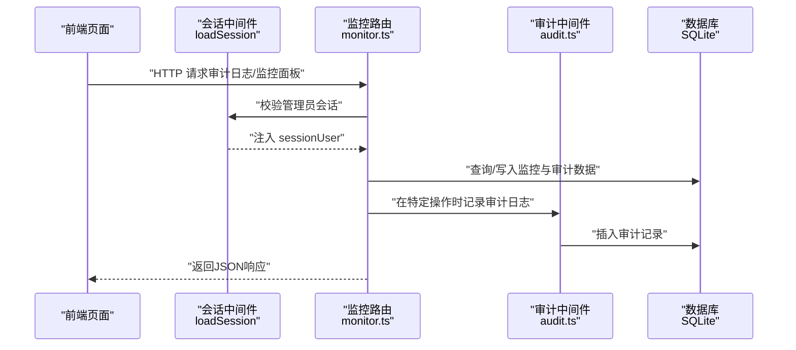
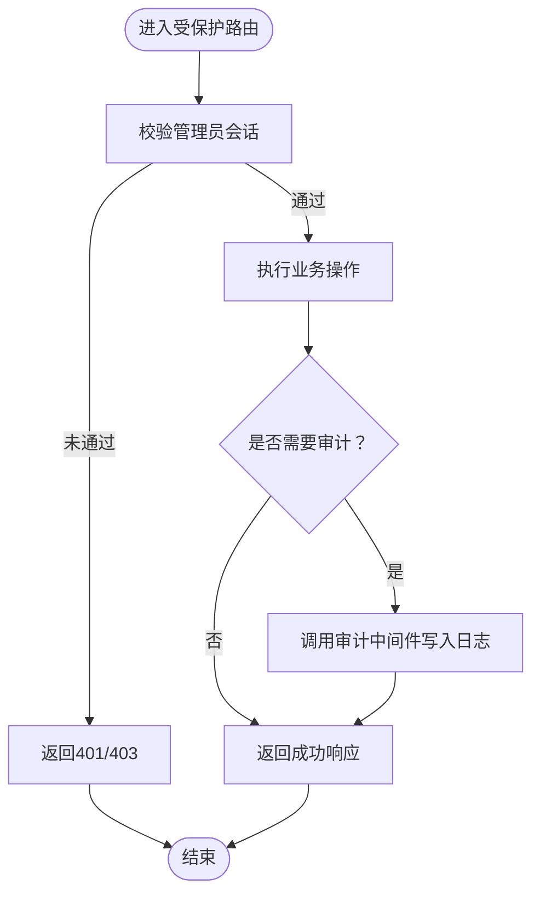
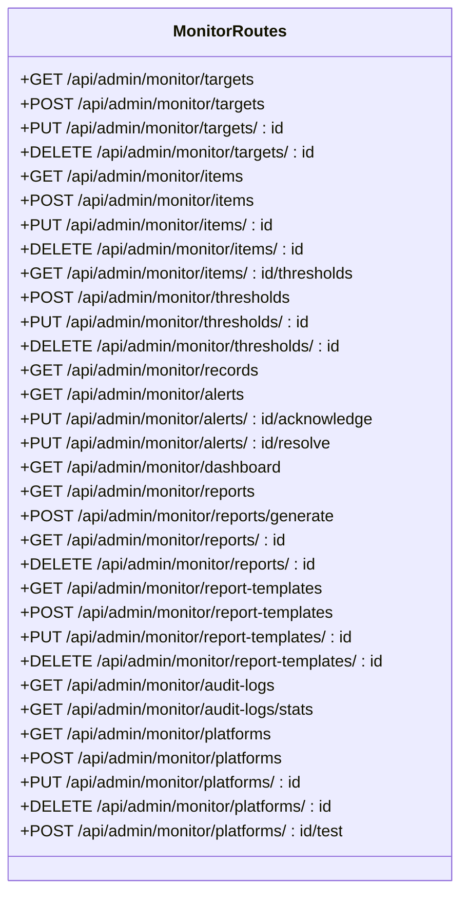
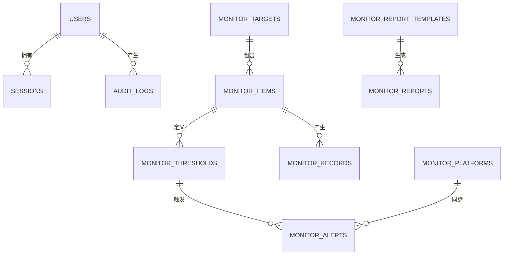
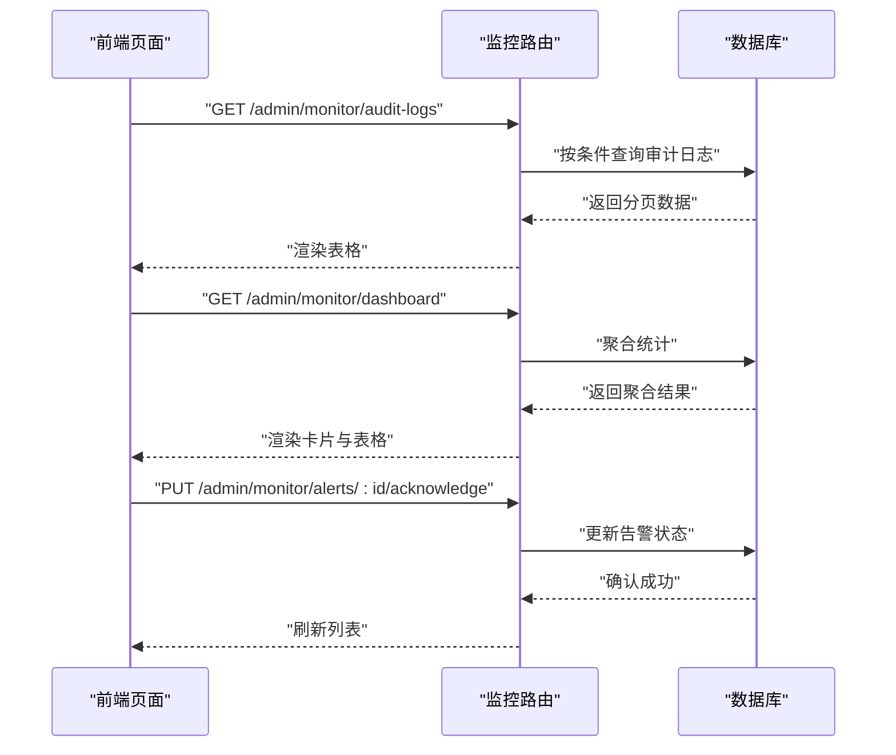
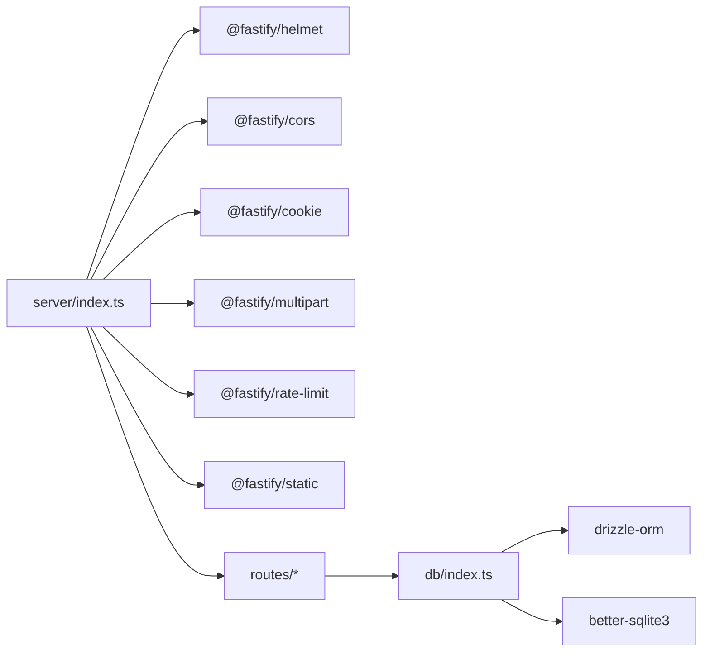

# 监控与日志

<cite>
**本文引用的文件**
- [apps/server/src/index.ts](file://apps/server/src/index.ts)
- [apps/server/src/middleware/audit.ts](file://apps/server/src/middleware/audit.ts)
- [apps/server/src/middleware/auth.ts](file://apps/server/src/middleware/auth.ts)
- [apps/server/src/routes/monitor.ts](file://apps/server/src/routes/monitor.ts)
- [apps/server/src/db/schema.ts](file://apps/server/src/db/schema.ts)
- [apps/server/src/db/index.ts](file://apps/server/src/db/index.ts)
- [apps/server/drizzle.config.ts](file://apps/server/drizzle.config.ts)
- [apps/server/package.json](file://apps/server/package.json)
- [apps/web/src/pages/admin/AuditLogs.tsx](file://apps/web/src/pages/admin/AuditLogs.tsx)
- [apps/web/src/pages/admin/MonitorDashboard.tsx](file://apps/web/src/pages/admin/MonitorDashboard.tsx)
- [apps/web/src/pages/admin/MonitorAlerts.tsx](file://apps/web/src/pages/admin/MonitorAlerts.tsx)
- [apps/web/package.json](file://apps/web/package.json)
</cite>

## 目录
1. [简介](#简介)
2. [项目结构](#项目结构)
3. [核心组件](#核心组件)
4. [架构总览](#架构总览)
5. [详细组件分析](#详细组件分析)
6. [依赖分析](#依赖分析)
7. [性能考虑](#性能考虑)
8. [故障排查指南](#故障排查指南)
9. [结论](#结论)
10. [附录](#附录)

## 简介
本指南面向ZBH2平台的运维与开发团队，提供一套完整的监控与日志系统配置方案。内容覆盖应用级监控指标（请求响应时间、错误率、并发数、资源使用）、审计日志配置与管理、日志聚合与分析（ELK Stack集成思路）、性能监控工具（APM）选型与使用、告警规则与通知机制、日志轮转与归档策略、以及实时监控面板的搭建与可视化配置。

## 项目结构
ZBH2采用前后端分离架构：前端Web应用基于React + Ant Design，后端服务基于Fastify + Drizzle ORM + Better-SQLite3。监控与日志功能主要集中在后端的监控路由模块与审计中间件，并通过SQLite数据库持久化。

```mermaid
graph TB
subgraph "前端 Web 应用"
W_Audit["审计日志页面<br/>AuditLogs.tsx"]
W_Dash["监控总览面板<br/>MonitorDashboard.tsx"]
W_Alerts["告警中心面板<br/>MonitorAlerts.tsx"]
end
subgraph "后端服务"
S_Index["入口与中间件注册<br/>index.ts"]
S_Monitor["监控路由模块<br/>routes/monitor.ts"]
S_Audit["审计日志中间件<br/>middleware/audit.ts"]
S_DB["数据库与Schema<br/>db/index.ts + schema.ts"]
end
W_Audit --> |HTTP 请求| S_Index
W_Dash --> |HTTP 请求| S_Index
W_Alerts --> |HTTP 请求| S_Index
S_Index --> |注册| S_Monitor
S_Index --> |注册| S_Audit
S_Monitor --> |读写| S_DB
S_Audit --> |写入| S_DB
```

**图表来源**
- [apps/server/src/index.ts:27-54](file://apps/server/src/index.ts#L27-L54)
- [apps/server/src/routes/monitor.ts:13-595](file://apps/server/src/routes/monitor.ts#L13-L595)
- [apps/server/src/middleware/audit.ts:1-28](file://apps/server/src/middleware/audit.ts#L1-L28)
- [apps/server/src/db/index.ts:1-16](file://apps/server/src/db/index.ts#L1-L16)
- [apps/server/src/db/schema.ts:216-330](file://apps/server/src/db/schema.ts#L216-L330)

**章节来源**
- [apps/server/src/index.ts:1-60](file://apps/server/src/index.ts#L1-L60)
- [apps/web/src/pages/admin/AuditLogs.tsx:1-102](file://apps/web/src/pages/admin/AuditLogs.tsx#L1-L102)
- [apps/web/src/pages/admin/MonitorDashboard.tsx:1-100](file://apps/web/src/pages/admin/MonitorDashboard.tsx#L1-L100)
- [apps/web/src/pages/admin/MonitorAlerts.tsx:1-91](file://apps/web/src/pages/admin/MonitorAlerts.tsx#L1-L91)

## 核心组件
- 审计日志中间件：统一记录用户操作、系统事件与安全相关行为，支持结果标记与扩展详情字段。
- 监控路由模块：提供监控目标、监控项、阈值、记录、告警、报表、平台接入等全链路管理接口。
- 数据层：基于Better-SQLite3与Drizzle ORM，定义监控与审计相关表结构，支持SQLite WAL模式与外键约束。
- 前端监控面板：提供审计日志查询、监控总览统计、告警列表与处理状态变更。

**章节来源**
- [apps/server/src/middleware/audit.ts:1-28](file://apps/server/src/middleware/audit.ts#L1-L28)
- [apps/server/src/routes/monitor.ts:13-595](file://apps/server/src/routes/monitor.ts#L13-L595)
- [apps/server/src/db/schema.ts:216-330](file://apps/server/src/db/schema.ts#L216-L330)
- [apps/web/src/pages/admin/AuditLogs.tsx:1-102](file://apps/web/src/pages/admin/AuditLogs.tsx#L1-L102)
- [apps/web/src/pages/admin/MonitorDashboard.tsx:1-100](file://apps/web/src/pages/admin/MonitorDashboard.tsx#L1-L100)
- [apps/web/src/pages/admin/MonitorAlerts.tsx:1-91](file://apps/web/src/pages/admin/MonitorAlerts.tsx#L1-L91)

## 架构总览
下图展示从客户端到后端服务再到数据库的监控与日志数据流，以及关键中间件与路由的作用。

**图表来源**
- [apps/server/src/index.ts:37-49](file://apps/server/src/index.ts#L37-L49)
- [apps/server/src/middleware/auth.ts:17-40](file://apps/server/src/middleware/auth.ts#L17-L40)
- [apps/server/src/routes/monitor.ts:49-58](file://apps/server/src/routes/monitor.ts#L49-L58)
- [apps/server/src/middleware/audit.ts:14-26](file://apps/server/src/middleware/audit.ts#L14-L26)
- [apps/server/src/db/index.ts:10-14](file://apps/server/src/db/index.ts#L10-L14)

## 详细组件分析

### 审计日志中间件
- 职责：在关键业务操作后统一记录审计日志，包含用户标识、操作动作、目标类型/名称、IP/User-Agent、结果与扩展详情。
- 数据模型：审计日志表包含用户关联、动作枚举、目标类型枚举、结果枚举、时间戳等字段。
- 使用场景：用户登录/登出、监控目标/项/阈值/平台的增删改查、报表生成等。

**图表来源**
- [apps/server/src/middleware/auth.ts:48-55](file://apps/server/src/middleware/auth.ts#L48-L55)
- [apps/server/src/middleware/audit.ts:3-26](file://apps/server/src/middleware/audit.ts#L3-L26)
- [apps/server/src/routes/monitor.ts:49-58](file://apps/server/src/routes/monitor.ts#L49-L58)

**章节来源**
- [apps/server/src/middleware/audit.ts:1-28](file://apps/server/src/middleware/audit.ts#L1-L28)
- [apps/server/src/db/schema.ts:301-314](file://apps/server/src/db/schema.ts#L301-L314)
- [apps/server/src/routes/monitor.ts:49-58](file://apps/server/src/routes/monitor.ts#L49-L58)

### 监控路由模块
- 功能范围：监控目标管理、监控项管理、阈值规则、监控记录、告警管理、仪表盘聚合、报表与模板、平台接入测试。
- 权限控制：所有监控相关接口均要求管理员会话。
- 数据聚合：仪表盘接口对目标状态与告警按状态/级别进行聚合统计；报表接口按时间窗口汇总指标统计。
- 审计联动：新增/修改/删除监控对象时触发审计日志记录。

**图表来源**
- [apps/server/src/routes/monitor.ts:13-595](file://apps/server/src/routes/monitor.ts#L13-L595)

**章节来源**
- [apps/server/src/routes/monitor.ts:13-595](file://apps/server/src/routes/monitor.ts#L13-L595)

### 数据模型与持久化
- 数据库：Better-SQLite3 + Drizzle ORM，启用WAL模式与外键约束，提升并发与一致性。
- 关键表：
  - monitor_targets：监控目标（设备/系统/数据库/服务）
  - monitor_items：监控项（指标键、单位、采集间隔、方法）
  - monitor_thresholds：阈值规则（级别、运算符、阈值、持续时间、通知消息）
  - monitor_records：监控记录（值、状态、采集时间）
  - monitor_alerts：告警（级别、值、消息、状态、确认/解决信息）
  - monitor_report_templates：报表模板
  - monitor_reports：报表
  - audit_logs：审计日志
  - monitor_platforms：平台接入（webhook/API/agent）

**图表来源**
- [apps/server/src/db/schema.ts:216-330](file://apps/server/src/db/schema.ts#L216-L330)

**章节来源**
- [apps/server/src/db/index.ts:1-16](file://apps/server/src/db/index.ts#L1-L16)
- [apps/server/src/db/schema.ts:216-330](file://apps/server/src/db/schema.ts#L216-L330)

### 前端监控面板
- 审计日志页面：支持按用户名、操作类型、目标类型、时间范围筛选，分页展示审计记录。
- 监控总览面板：展示目标总数、在线数、告警数、今日采集记录，以及最近告警与目标状态概览。
- 告警中心面板：支持按级别与状态过滤，提供“确认/解决”操作按钮。

**图表来源**
- [apps/web/src/pages/admin/AuditLogs.tsx:36-54](file://apps/web/src/pages/admin/AuditLogs.tsx#L36-L54)
- [apps/web/src/pages/admin/MonitorDashboard.tsx:19-27](file://apps/web/src/pages/admin/MonitorDashboard.tsx#L19-L27)
- [apps/web/src/pages/admin/MonitorAlerts.tsx:37-47](file://apps/web/src/pages/admin/MonitorAlerts.tsx#L37-L47)
- [apps/server/src/routes/monitor.ts:456-487](file://apps/server/src/routes/monitor.ts#L456-L487)
- [apps/server/src/routes/monitor.ts:291-319](file://apps/server/src/routes/monitor.ts#L291-L319)
- [apps/server/src/routes/monitor.ts:264-288](file://apps/server/src/routes/monitor.ts#L264-L288)

**章节来源**
- [apps/web/src/pages/admin/AuditLogs.tsx:1-102](file://apps/web/src/pages/admin/AuditLogs.tsx#L1-L102)
- [apps/web/src/pages/admin/MonitorDashboard.tsx:1-100](file://apps/web/src/pages/admin/MonitorDashboard.tsx#L1-L100)
- [apps/web/src/pages/admin/MonitorAlerts.tsx:1-91](file://apps/web/src/pages/admin/MonitorAlerts.tsx#L1-L91)

## 依赖分析
- 中间件与插件：Helmet、CORS、Cookie、Multipart、Rate Limit、静态文件服务。
- 数据访问：Drizzle ORM + Better-SQLite3，SQLite路径由环境变量控制，自动创建目录。
- 前端依赖：Ant Design、Axios、React Router等，用于构建监控与审计界面。

**图表来源**
- [apps/server/src/index.ts:27-35](file://apps/server/src/index.ts#L27-L35)
- [apps/server/src/db/index.ts:1-16](file://apps/server/src/db/index.ts#L1-L16)
- [apps/server/package.json:14-28](file://apps/server/package.json#L14-L28)

**章节来源**
- [apps/server/src/index.ts:1-60](file://apps/server/src/index.ts#L1-L60)
- [apps/server/package.json:14-37](file://apps/server/package.json#L14-L37)
- [apps/web/package.json:11-20](file://apps/web/package.json#L11-L20)

## 性能考虑
- 请求速率限制：默认每分钟最多200次请求，可根据生产环境调整。
- 数据库并发：SQLite启用WAL模式，适合中低并发场景；若需高并发，建议迁移到PostgreSQL并配合连接池。
- 监控数据量：记录与报表接口支持分页与时间过滤，避免一次性加载大量历史数据。
- 前端渲染：表格列宽固定与横向滚动，减少DOM复杂度；分页与按需加载可降低首屏压力。

**章节来源**
- [apps/server/src/index.ts:34](file://apps/server/src/index.ts#L34)
- [apps/server/src/db/index.ts:11-12](file://apps/server/src/db/index.ts#L11-L12)
- [apps/server/src/routes/monitor.ts:7-11](file://apps/server/src/routes/monitor.ts#L7-L11)
- [apps/web/src/pages/admin/AuditLogs.tsx:76-78](file://apps/web/src/pages/admin/AuditLogs.tsx#L76-L78)

## 故障排查指南
- 审计日志为空或缺失
  - 检查是否在对应业务操作后调用了审计中间件。
  - 确认管理员会话是否正确注入到请求上下文。
  - 核对数据库连接与表结构是否一致。
- 监控告警不触发
  - 检查监控项是否启用、采集间隔是否合理。
  - 校验阈值规则的运算符与阈值设置。
  - 确认监控记录是否按时写入且状态字段正确。
- 前端无法加载数据
  - 检查后端路由是否注册成功。
  - 确认CORS与Cookie配置允许前端域名访问。
  - 查看浏览器网络面板与后端日志中的错误信息。

**章节来源**
- [apps/server/src/middleware/audit.ts:14-26](file://apps/server/src/middleware/audit.ts#L14-L26)
- [apps/server/src/middleware/auth.ts:17-40](file://apps/server/src/middleware/auth.ts#L17-L40)
- [apps/server/src/routes/monitor.ts:167-214](file://apps/server/src/routes/monitor.ts#L167-L214)
- [apps/server/src/db/schema.ts:256-277](file://apps/server/src/db/schema.ts#L256-L277)

## 结论
ZBH2平台已具备完善的监控与审计能力：后端提供统一的监控与审计接口、数据库层面的结构化存储、前端直观的可视化面板。结合速率限制与SQLite WAL模式，可在中小规模部署中获得稳定表现。对于更高并发与更复杂的日志分析需求，建议引入APM工具与ELK Stack，并制定日志轮转与归档策略以保障长期运行的稳定性。

## 附录

### 应用级监控指标配置建议
- 请求响应时间
  - 后端：利用Fastify内置日志记录请求耗时；可扩展自定义指标埋点。
  - 前端：使用浏览器性能API与网络面板统计关键页面加载时间。
- 错误率
  - 后端：统计HTTP 5xx与业务错误响应；结合审计日志的结果字段进行聚合。
  - 前端：捕获JS异常与网络错误，上报至集中式APM。
- 并发数
  - 后端：通过速率限制与连接池参数控制；观察队列等待与超时。
  - 前端：统计同时活跃请求数量与页面渲染并发。
- 资源使用情况
  - 后端：监控进程CPU、内存、文件句柄与数据库连接数；必要时迁移至PostgreSQL。
  - 前端：监控主线程阻塞与大对象内存占用。

### 审计日志配置与管理
- 字段说明
  - 用户标识：userId/username
  - 操作动作：login/logout/create/update/delete/view/export/config
  - 目标类型：user/software/document/activation/asset/ticket/saas/faq/system/database/device/monitor
  - 结果：success/failure
  - 扩展详情：JSON字符串，记录操作细节
- 查询与统计
  - 支持按用户、动作、目标类型、时间段过滤
  - 提供按动作与目标类型的统计聚合

**章节来源**
- [apps/server/src/db/schema.ts:301-314](file://apps/server/src/db/schema.ts#L301-L314)
- [apps/server/src/routes/monitor.ts:456-487](file://apps/server/src/routes/monitor.ts#L456-L487)

### 日志聚合与分析（ELK Stack 集成思路）
- 数据采集
  - 后端：将Fastify日志输出到标准输出或文件，由Logstash/Fluent Bit/Beats收集。
  - 前端：通过浏览器性能API与错误上报SDK发送到日志后端。
- 存储与索引
  - Elasticsearch：建立索引模板，映射审计日志与监控记录字段。
  - Kibana：创建仪表板，展示请求趋势、错误分布、告警状态与目标健康度。
- 实时性
  - 利用Kafka/Redis作为缓冲，实现低延迟日志流转。

[本节为概念性指导，无需代码来源]

### 性能监控工具（APM）选型与使用
- 推荐工具
  - Node侧：DataDog APM、New Relic、Sentry（含性能监控）、AppDynamics。
  - 前端：Sentry Frontend、Google Analytics 4（GA4）、自研埋点。
- 配置要点
  - 启用事务采样与错误采样，避免高基数标签导致成本过高。
  - 对关键路由与数据库查询打点，关注慢查询与异常堆栈。
  - 将审计日志与APM指标关联，便于定位问题根因。

[本节为概念性指导，无需代码来源]

### 告警规则设置、阈值与通知
- 规则设计
  - 基于监控项阈值：超过阈值触发告警；支持持续时间（如连续3分钟）避免抖动。
  - 告警级别：warning/critical；状态：pending/acknowledged/resolved。
- 通知渠道
  - webhook：对接企业微信/钉钉/Slack等。
  - 邮件/短信：适用于紧急级别。
- 处理流程
  - 自动确认/解决：对可恢复的临时异常设置自动解决。
  - 人工介入：对涉及数据一致性与安全的告警要求人工确认。

**章节来源**
- [apps/server/src/db/schema.ts:243-254](file://apps/server/src/db/schema.ts#L243-L254)
- [apps/server/src/db/schema.ts:264-277](file://apps/server/src/db/schema.ts#L264-L277)
- [apps/server/src/routes/monitor.ts:264-288](file://apps/server/src/routes/monitor.ts#L264-L288)

### 日志轮转与归档策略、存储与清理
- 轮转
  - 使用logrotate或容器日志驱动自带轮转，按大小或时间切分。
- 归档
  - 将历史日志压缩归档至对象存储（S3/MinIO），保留7/30/90天策略。
- 清理
  - 设置保留期限与配额上限，定期清理过期归档。
- 成本优化
  - 冷热分层：近期热数据驻留本地，远期冷数据下沉至低成本存储。

[本节为概念性指导，无需代码来源]

### 实时监控面板搭建与可视化
- 数据源
  - 后端接口：/admin/monitor/dashboard、/admin/monitor/alerts、/admin/monitor/audit-logs。
- 可视化维度
  - 总览卡片：目标总数、在线数、告警数、今日采集记录。
  - 表格：最近告警、目标状态、审计日志明细。
  - 图表：告警趋势、阈值命中率、响应时间分布。
- 交互
  - 分页与筛选；状态变更（确认/解决）直接在面板完成。

**章节来源**
- [apps/web/src/pages/admin/MonitorDashboard.tsx:15-99](file://apps/web/src/pages/admin/MonitorDashboard.tsx#L15-L99)
- [apps/web/src/pages/admin/MonitorAlerts.tsx:13-91](file://apps/web/src/pages/admin/MonitorAlerts.tsx#L13-L91)
- [apps/web/src/pages/admin/AuditLogs.tsx:28-102](file://apps/web/src/pages/admin/AuditLogs.tsx#L28-L102)