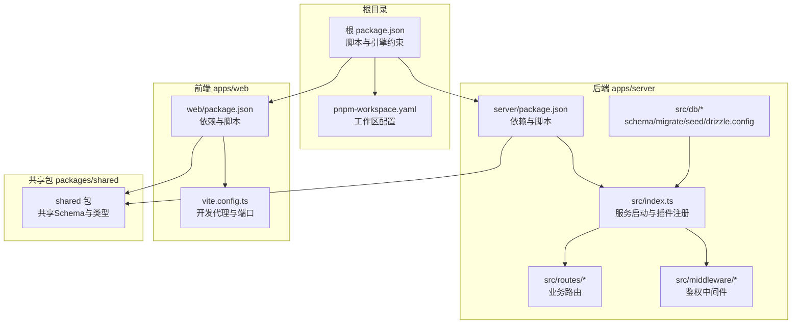
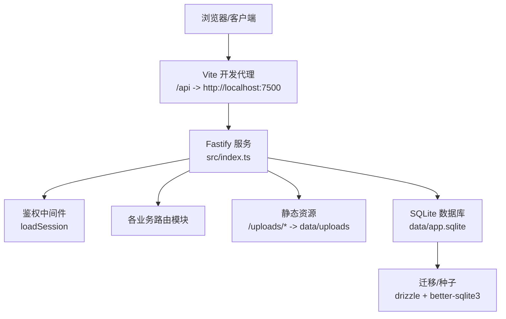
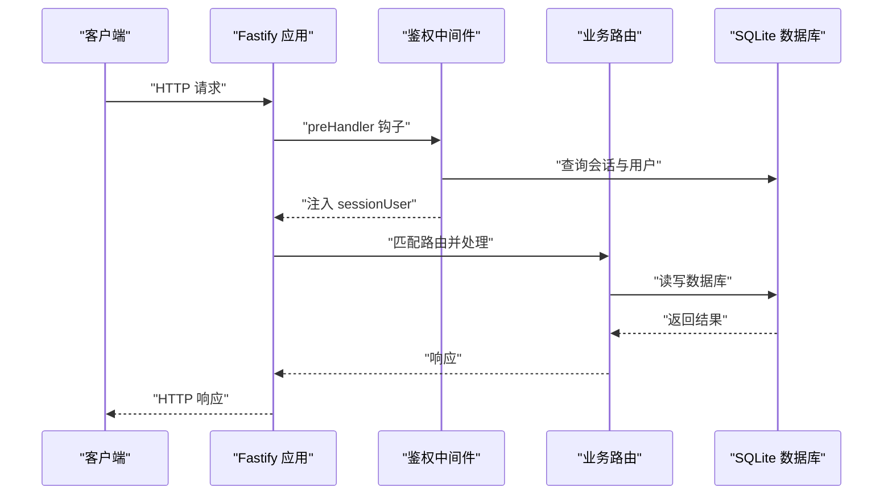
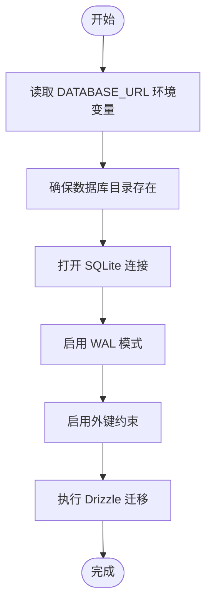
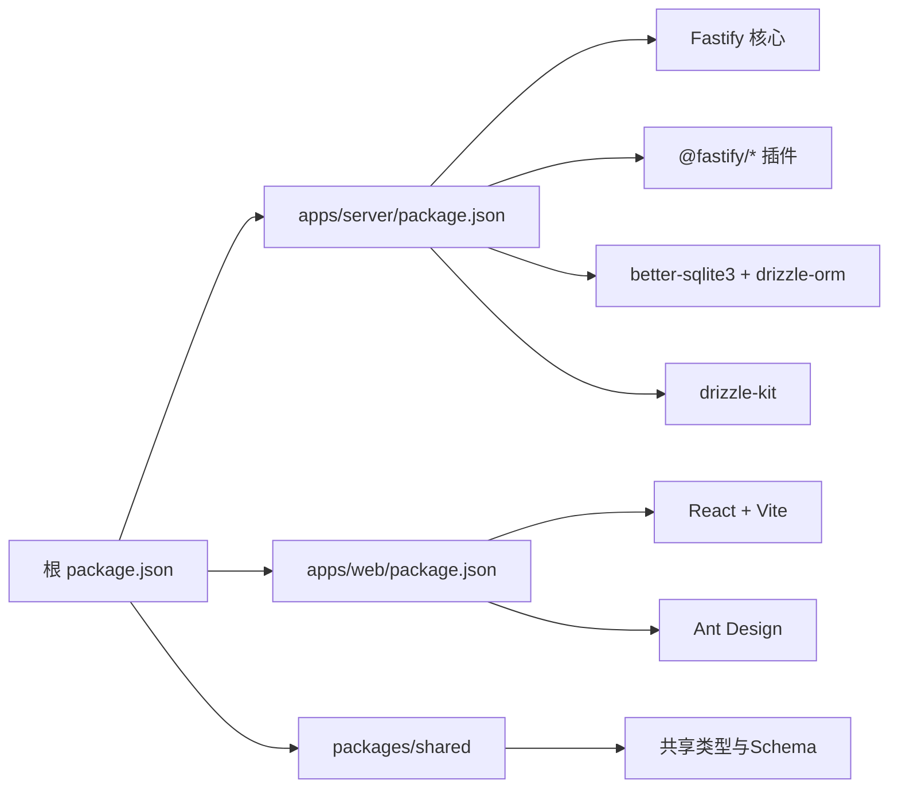

# 部署与运维

<cite>
**本文引用的文件**
- [README.md](file://README.md)
- [.github/workflows/build.yml](file://.github/workflows/build.yml)
- [package.json](file://package.json)
- [pnpm-workspace.yaml](file://pnpm-workspace.yaml)
- [apps/server/package.json](file://apps/server/package.json)
- [apps/web/package.json](file://apps/web/package.json)
- [apps/server/src/index.ts](file://apps/server/src/index.ts)
- [apps/server/src/db/schema.ts](file://apps/server/src/db/schema.ts)
- [apps/server/src/db/migrate.ts](file://apps/server/src/db/migrate.ts)
- [apps/server/src/db/seed.ts](file://apps/server/src/db/seed.ts)
- [apps/server/drizzle.config.ts](file://apps/server/drizzle.config.ts)
- [apps/web/vite.config.ts](file://apps/web/vite.config.ts)
- [apps/server/src/middleware/auth.ts](file://apps/server/src/middleware/auth.ts)
- [apps/server/src/routes/auth.ts](file://apps/server/src/routes/auth.ts)
- [apps/server/src/routes/public.ts](file://apps/server/src/routes/public.ts)
</cite>

## 目录
1. [简介](#简介)
2. [项目结构](#项目结构)
3. [核心组件](#核心组件)
4. [架构总览](#架构总览)
5. [详细组件分析](#详细组件分析)
6. [依赖关系分析](#依赖关系分析)
7. [性能考量](#性能考量)
8. [故障排除指南](#故障排除指南)
9. [结论](#结论)
10. [附录](#附录)

## 简介
本指南面向ZBH2平台的生产部署与运维，覆盖环境准备、数据库配置、CI/CD流程、容器化与编排、高可用与负载均衡、监控与日志、备份与恢复、安全加固、版本升级与迁移、故障排除与应急响应等全链路内容。平台采用Monorepo结构，后端基于Fastify + Drizzle ORM + SQLite，前端基于React + Vite，通过pnpm工作区进行统一管理。

## 项目结构
- 根目录提供monorepo脚本与引擎约束，定义了开发与构建命令入口。
- apps/server：后端API服务，包含数据库schema、迁移、种子、中间件与路由模块。
- apps/web：前端门户与管理后台，使用Vite代理转发到后端API。
- packages/shared：前后端共享的Zod Schema与类型定义。
- tools/ActivationClientWpf：Windows WPF激活客户端演示工程（用于CI产出）。
- data/：SQLite数据库与上传文件目录（不在仓库中，需备份）。

图表来源
- [package.json:1-20](file://package.json#L1-L20)
- [pnpm-workspace.yaml:1-5](file://pnpm-workspace.yaml#L1-L5)
- [apps/server/package.json:1-37](file://apps/server/package.json#L1-L37)
- [apps/web/package.json:1-29](file://apps/web/package.json#L1-L29)
- [apps/server/src/index.ts:1-60](file://apps/server/src/index.ts#L1-L60)
- [apps/server/src/db/schema.ts:1-330](file://apps/server/src/db/schema.ts#L1-L330)
- [apps/web/vite.config.ts:1-13](file://apps/web/vite.config.ts#L1-L13)

章节来源
- [README.md:47-68](file://README.md#L47-L68)
- [package.json:1-20](file://package.json#L1-L20)
- [pnpm-workspace.yaml:1-5](file://pnpm-workspace.yaml#L1-L5)

## 核心组件
- 服务启动与中间件
  - 启动入口注册安全、跨域、Cookie、分片上传、限流与静态资源服务，并挂载鉴权中间件与全部路由。
  - 上传目录位于服务进程相对路径下的data/uploads，首次请求会自动创建。
- 数据库与迁移
  - 使用SQLite（better-sqlite3），Drizzle ORM负责schema定义与迁移。
  - 迁移脚本根据环境变量DATABASE_URL定位数据库文件，默认位于data/app.sqlite。
  - 提供种子脚本初始化管理员账户与基础数据。
- 前端开发代理
  - Vite开发服务器将/api前缀代理到后端7500端口，便于前后端联调。
- CI/CD
  - GitHub Actions在push与PR触发，执行Node.js与WPF构建，上传web与server构建产物及Windows激活客户端压缩包。

章节来源
- [apps/server/src/index.ts:1-60](file://apps/server/src/index.ts#L1-L60)
- [apps/server/src/db/migrate.ts:1-18](file://apps/server/src/db/migrate.ts#L1-L18)
- [apps/server/drizzle.config.ts:1-11](file://apps/server/drizzle.config.ts#L1-L11)
- [apps/server/src/db/seed.ts:1-98](file://apps/server/src/db/seed.ts#L1-L98)
- [apps/web/vite.config.ts:1-13](file://apps/web/vite.config.ts#L1-L13)
- [.github/workflows/build.yml:1-87](file://.github/workflows/build.yml#L1-L87)

## 架构总览
后端采用模块化路由组织，中间件统一处理会话加载；前端通过Vite代理访问后端API；数据库为本地SQLite文件，迁移与种子在部署阶段执行。

图表来源
- [apps/web/vite.config.ts:1-13](file://apps/web/vite.config.ts#L1-L13)
- [apps/server/src/index.ts:1-60](file://apps/server/src/index.ts#L1-L60)
- [apps/server/src/db/migrate.ts:1-18](file://apps/server/src/db/migrate.ts#L1-L18)

## 详细组件分析

### 服务启动与路由装配
- 安全与防护：启用Helmet（CSP关闭以适配静态资源）、CORS允许凭证与任意源。
- 会话与鉴权：Cookie会话sid，配合中间件加载用户信息；提供requireAuth/requireAdmin保护路由。
- 上传与静态：multipart限制单文件大小；/uploads前缀映射到data/uploads目录。
- 路由注册：按功能拆分auth、public、admin、upload、activation、tickets、assets、saas、reports、ai-faq、monitor等模块。

图表来源
- [apps/server/src/index.ts:1-60](file://apps/server/src/index.ts#L1-L60)
- [apps/server/src/middleware/auth.ts:1-56](file://apps/server/src/middleware/auth.ts#L1-L56)
- [apps/server/src/routes/auth.ts:1-51](file://apps/server/src/routes/auth.ts#L1-L51)

章节来源
- [apps/server/src/index.ts:1-60](file://apps/server/src/index.ts#L1-L60)
- [apps/server/src/middleware/auth.ts:1-56](file://apps/server/src/middleware/auth.ts#L1-L56)
- [apps/server/src/routes/auth.ts:1-51](file://apps/server/src/routes/auth.ts#L1-L51)

### 数据库与迁移流程
- schema定义：涵盖用户、会话、软件、帮助、激活、工单、资产、SaaS、FAQ、监控、审计等表。
- 迁移配置：drizzle.config.ts指定schema路径、输出目录与SQLite URL（优先使用环境变量）。
- 迁移执行：migrate.ts创建目录、开启WAL与外键校验、执行迁移。
- 种子数据：seed.ts初始化admin用户、软件/帮助分类、激活产品、FAQ与资产分类。

图表来源
- [apps/server/drizzle.config.ts:1-11](file://apps/server/drizzle.config.ts#L1-L11)
- [apps/server/src/db/migrate.ts:1-18](file://apps/server/src/db/migrate.ts#L1-L18)
- [apps/server/src/db/schema.ts:1-330](file://apps/server/src/db/schema.ts#L1-L330)

章节来源
- [apps/server/drizzle.config.ts:1-11](file://apps/server/drizzle.config.ts#L1-L11)
- [apps/server/src/db/migrate.ts:1-18](file://apps/server/src/db/migrate.ts#L1-L18)
- [apps/server/src/db/seed.ts:1-98](file://apps/server/src/db/seed.ts#L1-L98)

### 前端开发与代理
- Vite开发服务器端口与代理配置，将/api请求转发到后端7500端口，便于本地联调。
- 生产构建产物输出至apps/web/dist，供后端静态服务托管。

章节来源
- [apps/web/vite.config.ts:1-13](file://apps/web/vite.config.ts#L1-L13)
- [.github/workflows/build.yml:39-44](file://.github/workflows/build.yml#L39-L44)

### 认证与会话
- 登录：校验用户名与密码，成功后生成会话sid并写入httpOnly Cookie，有效期7天。
- 退出：删除会话并清理Cookie。
- 当前实现为本地账号体系，后续可通过中间件扩展OIDC对接。

章节来源
- [apps/server/src/routes/auth.ts:1-51](file://apps/server/src/routes/auth.ts#L1-L51)
- [apps/server/src/middleware/auth.ts:1-56](file://apps/server/src/middleware/auth.ts#L1-L56)
- [README.md:113-121](file://README.md#L113-L121)

## 依赖关系分析
- Monorepo与包管理
  - 根package.json提供统一脚本，调用各子包构建与数据库任务。
  - pnpm-workspace.yaml声明apps与packages为工作区，仅构建特定原生依赖。
- 后端依赖
  - Fastify生态插件：cookie、cors、helmet、multipart、rate-limit、static。
  - 数据层：better-sqlite3 + drizzle-orm，配合drizzle-kit生成迁移。
- 前端依赖
  - React、Ant Design、React Router、Vite，开发代理指向后端7500端口。

图表来源
- [package.json:1-20](file://package.json#L1-L20)
- [pnpm-workspace.yaml:1-5](file://pnpm-workspace.yaml#L1-L5)
- [apps/server/package.json:1-37](file://apps/server/package.json#L1-L37)
- [apps/web/package.json:1-29](file://apps/web/package.json#L1-L29)

章节来源
- [package.json:1-20](file://package.json#L1-L20)
- [pnpm-workspace.yaml:1-5](file://pnpm-workspace.yaml#L1-L5)
- [apps/server/package.json:1-37](file://apps/server/package.json#L1-L37)
- [apps/web/package.json:1-29](file://apps/web/package.json#L1-L29)

## 性能考量
- 限流与安全
  - 默认每分钟最多200请求，建议在生产环境结合Nginx/反向代理进一步细化策略。
  - Helmet关闭CSP以适配静态资源，生产建议按站点域名收紧策略。
- 数据库
  - 迁移脚本启用WAL与外键，有助于并发与一致性；注意SQLite在高并发写入场景的局限性。
- 上传与静态
  - 上传目录为本地文件系统，建议在容器化部署时挂载持久化卷或对象存储网关。

章节来源
- [apps/server/src/index.ts:33-34](file://apps/server/src/index.ts#L33-L34)
- [apps/server/src/db/migrate.ts:10-12](file://apps/server/src/db/migrate.ts#L10-L12)

## 故障排除指南
- 启动失败
  - 检查端口占用与权限，确认环境变量PORT与DATABASE_URL正确。
  - 查看数据库目录是否可写，必要时手动创建data与data/uploads目录。
- 登录异常
  - 确认数据库已迁移与种子初始化，检查admin用户是否存在且状态为active。
  - 若会话Cookie未生效，检查CORS与SameSite设置，确认浏览器允许第三方Cookie。
- 上传失败
  - 检查multipart文件大小限制与磁盘空间，确认data/uploads目录权限。
- CI构建失败
  - 确认Node.js与pnpm版本满足根引擎要求，依赖安装使用frozen-lockfile。
  - Windows WPF构建需.NET 8.0与win-x64运行时。

章节来源
- [apps/server/src/index.ts:24-25](file://apps/server/src/index.ts#L24-L25)
- [apps/server/src/routes/auth.ts:15-22](file://apps/server/src/routes/auth.ts#L15-L22)
- [apps/server/src/db/migrate.ts:7-8](file://apps/server/src/db/migrate.ts#L7-L8)
- [.github/workflows/build.yml:27-31](file://.github/workflows/build.yml#L27-L31)

## 结论
ZBH2平台采用轻量级技术栈与Monorepo结构，具备清晰的开发与部署边界。生产部署建议结合反向代理与容器编排实现高可用，配合完善的备份与监控体系保障稳定运行。

## 附录

### A. 生产环境部署配置清单
- 系统要求
  - 操作系统：Linux/Windows（推荐Linux）
  - 运行时：Node.js >= 18，pnpm >= 8
- 环境变量
  - PORT：服务监听端口（默认7500）
  - DATABASE_URL：SQLite文件绝对路径或相对路径（建议绝对路径）
- 目录与权限
  - data/：存放app.sqlite与uploads/，需具备读写权限
- 依赖安装与构建
  - 安装依赖：pnpm install（使用frozen-lockfile）
  - 构建：pnpm build
  - 数据库：pnpm db:migrate 与 pnpm db:seed

章节来源
- [README.md:97-103](file://README.md#L97-L103)
- [README.md:104-112](file://README.md#L104-L112)
- [package.json:13-18](file://package.json#L13-L18)

### B. CI/CD 流程与自动化
- 触发条件
  - 推送main/master分支或发起PR时自动运行
- 作业
  - Node.js (shared + server + web)：安装依赖、构建、上传web-dist与server-dist制品
  - WPF 演示激活客户端：在Windows runner上编译并打包为zip，供发布使用
- 并发与缓存
  - 使用concurrency组避免冲突，启用pnpm缓存加速

章节来源
- [.github/workflows/build.yml:1-87](file://.github/workflows/build.yml#L1-L87)

### C. Docker 容器化与编排（建议方案）
- 镜像构建
  - 多阶段构建：基础镜像安装Node.js与pnpm，复制依赖与源码，执行install与build
  - 运行镜像：仅包含运行时依赖，拷贝apps/web/dist与apps/server/dist
- 容器编排
  - 使用Nginx作为反向代理与静态资源服务，映射PORT端口
  - 将data/目录挂载为持久化卷，确保数据库与上传文件不丢失
  - 可选：将uploads/通过对象存储网关替代本地文件系统
- 健康检查
  - Nginx或后端提供/health端点，结合K8s/Compose健康检查

[本节为概念性建议，不直接对应具体源文件]

### D. 负载均衡与高可用
- 多实例部署
  - 使用Nginx/HAProxy做四层/七层负载均衡，健康检查后端实例
  - 所有实例共享同一数据库与上传存储（或通过对象存储网关）
- 会话与状态
  - 当前会话存储于数据库，适合多实例；若改为内存会话需引入共享缓存

[本节为概念性建议，不直接对应具体源文件]

### E. 监控与日志
- 日志
  - 后端启用logger，建议接入集中式日志（如ELK/Fluentd/Loki）
- 指标
  - 可通过Nginx/应用埋点采集QPS、响应时间、错误率
- 告警
  - 基于Prometheus/Grafana或云监控平台设置阈值告警

[本节为概念性建议，不直接对应具体源文件]

### F. 备份与恢复
- 备份范围
  - data/app.sqlite（数据库文件）
  - data/uploads/（上传文件）
- 备份策略
  - 建议每日增量+每周全量，加密传输与存储
- 恢复流程
  - 停止服务 -> 恢复文件 -> pnpm db:migrate（如需）-> 启动服务

章节来源
- [README.md:104-112](file://README.md#L104-L112)

### G. 安全加固
- 防火墙与网络
  - 仅开放反向代理端口，内网访问数据库与上传目录
- HTTPS与证书
  - 反向代理启用TLS，使用Let’s Encrypt或企业证书
- 访问控制
  - 强制HTTPS、严格CORS、Cookie SameSite=Lax/Strict（视业务调整）、速率限制
- 身份认证
  - 当前为本地账号体系，建议后续对接OIDC

章节来源
- [apps/server/src/index.ts:30-35](file://apps/server/src/index.ts#L30-L35)
- [README.md:113-121](file://README.md#L113-L121)

### H. 版本升级与迁移
- 升级步骤
  - 备份 -> 拉取新版本 -> pnpm install -> pnpm db:migrate -> pnpm build -> 启动服务
- 兼容性检查
  - 关注schema变更与迁移脚本，确保无破坏性修改
- 回滚策略
  - 保留上一版本制品，回退数据库迁移并恢复备份

章节来源
- [apps/server/src/db/migrate.ts:14-15](file://apps/server/src/db/migrate.ts#L14-L15)
- [apps/server/drizzle.config.ts:7-9](file://apps/server/drizzle.config.ts#L7-L9)

### I. 应急响应计划
- 停机应急
  - 快速回滚至上一稳定版本，恢复备份
- 数据库异常
  - 检查WAL与外键状态，必要时重建数据库并重新迁移
- 上传异常
  - 检查磁盘空间与权限，切换到对象存储网关

章节来源
- [apps/server/src/db/migrate.ts:10-12](file://apps/server/src/db/migrate.ts#L10-L12)
- [apps/server/src/index.ts:24-25](file://apps/server/src/index.ts#L24-L25)