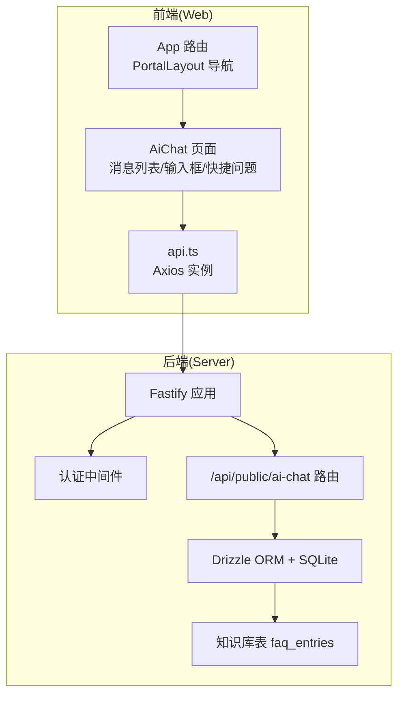
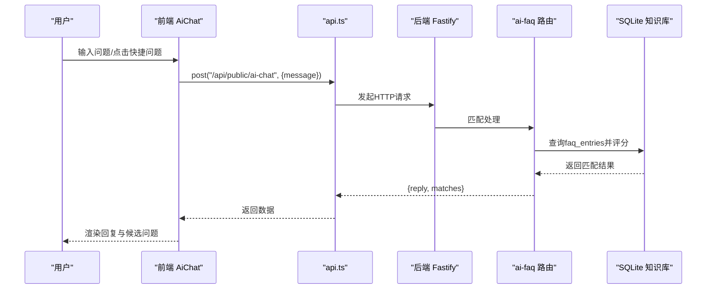
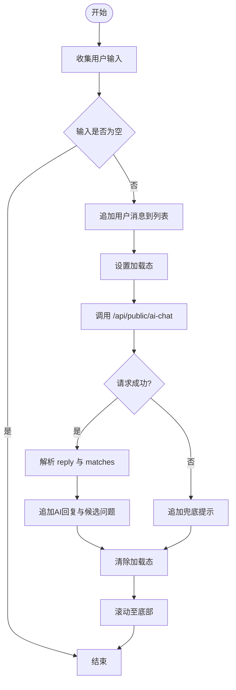
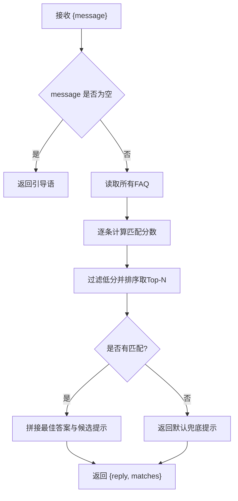
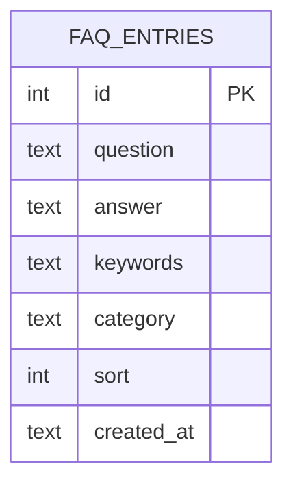
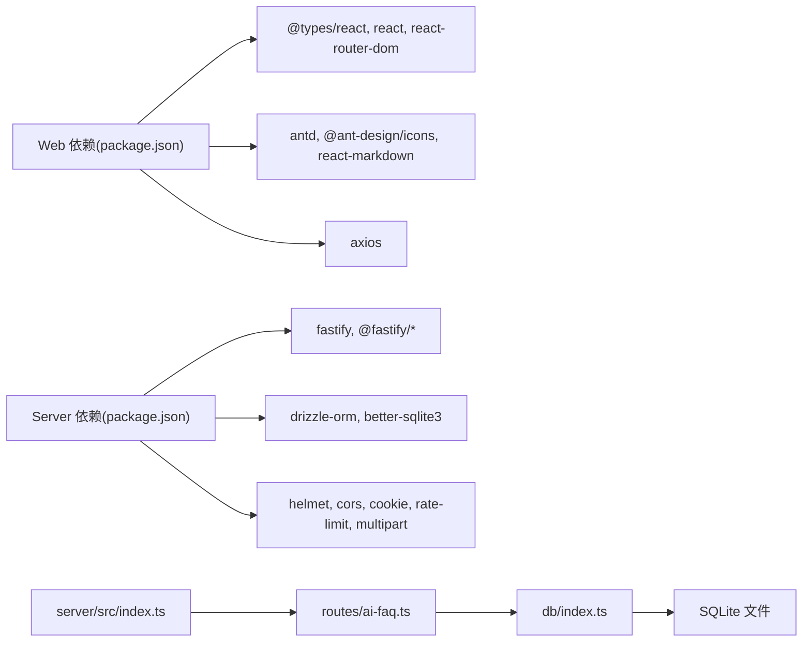

# AI智能客服

<cite>
**本文引用的文件**
- [apps/web/src/pages/AiChat.tsx](file://apps/web/src/pages/AiChat.tsx)
- [apps/web/src/lib/api.ts](file://apps/web/src/lib/api.ts)
- [apps/web/src/App.tsx](file://apps/web/src/App.tsx)
- [apps/web/src/layouts/PortalLayout.tsx](file://apps/web/src/layouts/PortalLayout.tsx)
- [apps/server/src/routes/ai-faq.ts](file://apps/server/src/routes/ai-faq.ts)
- [apps/server/src/db/schema.ts](file://apps/server/src/db/schema.ts)
- [apps/server/src/db/index.ts](file://apps/server/src/db/index.ts)
- [apps/server/src/middleware/auth.ts](file://apps/server/src/middleware/auth.ts)
- [apps/server/src/index.ts](file://apps/server/src/index.ts)
</cite>

## 目录
1. [简介](#简介)
2. [项目结构](#项目结构)
3. [核心组件](#核心组件)
4. [架构总览](#架构总览)
5. [详细组件分析](#详细组件分析)
6. [依赖关系分析](#依赖关系分析)
7. [性能考虑](#性能考虑)
8. [故障排查指南](#故障排查指南)
9. [结论](#结论)
10. [附录](#附录)

## 简介
本文件面向ZBH2平台的AI智能客服功能，系统性阐述其集成架构、前端聊天界面设计、消息处理流程、会话状态管理、错误处理策略以及用户隐私与对话记录的安全存储方案。当前实现采用“FAQ匹配+人工回复”的轻量级AI客服模式：前端发起请求，后端基于本地SQLite知识库进行关键词匹配与相似度评分，返回最佳答案及候选问题，不涉及外部大模型API。

## 项目结构
AI智能客服由前后端两部分组成：
- 前端（React + Ant Design）：负责聊天界面渲染、用户输入收集、消息展示与交互。
- 后端（Fastify + Drizzle ORM + better-sqlite3）：提供REST接口，对接SQLite知识库，执行FAQ匹配逻辑。

图表来源
- [apps/web/src/pages/AiChat.tsx:1-116](file://apps/web/src/pages/AiChat.tsx#L1-L116)
- [apps/web/src/lib/api.ts:1-16](file://apps/web/src/lib/api.ts#L1-L16)
- [apps/web/src/App.tsx:1-80](file://apps/web/src/App.tsx#L1-L80)
- [apps/server/src/index.ts:1-60](file://apps/server/src/index.ts#L1-L60)
- [apps/server/src/middleware/auth.ts:1-56](file://apps/server/src/middleware/auth.ts#L1-L56)
- [apps/server/src/routes/ai-faq.ts:1-100](file://apps/server/src/routes/ai-faq.ts#L1-L100)
- [apps/server/src/db/schema.ts:205-214](file://apps/server/src/db/schema.ts#L205-L214)
- [apps/server/src/db/index.ts:1-16](file://apps/server/src/db/index.ts#L1-L16)

章节来源
- [apps/web/src/pages/AiChat.tsx:1-116](file://apps/web/src/pages/AiChat.tsx#L1-L116)
- [apps/server/src/routes/ai-faq.ts:1-100](file://apps/server/src/routes/ai-faq.ts#L1-L100)
- [apps/server/src/db/schema.ts:205-214](file://apps/server/src/db/schema.ts#L205-L214)
- [apps/server/src/db/index.ts:1-16](file://apps/server/src/db/index.ts#L1-L16)
- [apps/server/src/middleware/auth.ts:1-56](file://apps/server/src/middleware/auth.ts#L1-L56)
- [apps/server/src/index.ts:1-60](file://apps/server/src/index.ts#L1-L60)
- [apps/web/src/App.tsx:1-80](file://apps/web/src/App.tsx#L1-L80)
- [apps/web/src/layouts/PortalLayout.tsx:1-76](file://apps/web/src/layouts/PortalLayout.tsx#L1-L76)

## 核心组件
- 前端聊天页面（AiChat）
  - 状态：消息数组、输入文本、加载态、滚动锚点
  - 功能：发送消息、快捷问题触发、Markdown渲染、候选问题点击
- 前端API封装（api.ts）
  - Axios实例，统一基础路径与凭证携带
- 后端路由（/api/public/ai-chat）
  - 接收用户消息，执行关键词匹配与评分，返回最佳答案与候选
- 数据库Schema（faq_entries）
  - 存储问题、答案、关键词、分类、排序等字段

章节来源
- [apps/web/src/pages/AiChat.tsx:9-49](file://apps/web/src/pages/AiChat.tsx#L9-L49)
- [apps/web/src/lib/api.ts:1-16](file://apps/web/src/lib/api.ts#L1-L16)
- [apps/server/src/routes/ai-faq.ts:42-98](file://apps/server/src/routes/ai-faq.ts#L42-L98)
- [apps/server/src/db/schema.ts:205-214](file://apps/server/src/db/schema.ts#L205-L214)

## 架构总览
AI智能客服采用“前端直连后端接口”的轻量架构，无第三方大模型API接入。后端通过SQLite知识库完成FAQ匹配，返回结构化的回复与候选问题，前端负责渲染与交互。

图表来源
- [apps/web/src/pages/AiChat.tsx:33-49](file://apps/web/src/pages/AiChat.tsx#L33-L49)
- [apps/web/src/lib/api.ts:1-16](file://apps/web/src/lib/api.ts#L1-L16)
- [apps/server/src/routes/ai-faq.ts:42-98](file://apps/server/src/routes/ai-faq.ts#L42-L98)
- [apps/server/src/db/schema.ts:205-214](file://apps/server/src/db/schema.ts#L205-L214)

## 详细组件分析

### 前端聊天界面（AiChat）
- 界面元素
  - 消息气泡：区分用户与AI，支持Markdown渲染
  - 快捷问题标签：一键触发常见问题
  - 文本域与发送按钮：支持回车发送
  - 加载指示：AI思考中提示
- 状态管理
  - messages：按时间顺序累积消息
  - input：当前输入文本
  - loading：请求中状态
  - bottomRef：自动滚动到底部
- 交互逻辑
  - 用户输入校验与清空
  - 发送成功后追加AI回复与候选问题
  - 错误时兜底提示
  - 支持从候选问题直接继续对话

图表来源
- [apps/web/src/pages/AiChat.tsx:33-49](file://apps/web/src/pages/AiChat.tsx#L33-L49)

章节来源
- [apps/web/src/pages/AiChat.tsx:1-116](file://apps/web/src/pages/AiChat.tsx#L1-L116)

### 前端API封装（api.ts）
- 统一基础路径为“/api”，启用withCredentials以携带Cookie
- 全局响应拦截器：处理401等错误（当前用于公共页跳转控制）

章节来源
- [apps/web/src/lib/api.ts:1-16](file://apps/web/src/lib/api.ts#L1-L16)

### 后端路由与知识库匹配（/api/public/ai-chat）
- 请求体：message（必填）
- 处理流程
  - 输入校验与空值处理
  - 读取全部FAQ条目
  - 关键词匹配与评分（包含精确子串、关键词重叠、字符重叠、单词重叠等维度）
  - 过滤低分项并取Top-N作为候选
  - 生成回复文本（含多候选提示）
  - 返回reply与matches（id、question、category）
- 安全与访问控制
  - 当前为公开接口，无需登录
  - 可结合认证中间件扩展为登录后专属

图表来源
- [apps/server/src/routes/ai-faq.ts:42-98](file://apps/server/src/routes/ai-faq.ts#L42-L98)

章节来源
- [apps/server/src/routes/ai-faq.ts:42-98](file://apps/server/src/routes/ai-faq.ts#L42-L98)

### 数据模型（faq_entries）
- 字段：id、question、answer、keywords、category、sort、createdAt
- 作用：承载AI客服的知识库内容，支撑匹配算法

图表来源
- [apps/server/src/db/schema.ts:205-214](file://apps/server/src/db/schema.ts#L205-L214)

章节来源
- [apps/server/src/db/schema.ts:205-214](file://apps/server/src/db/schema.ts#L205-L214)

### 会话状态管理与上下文维护
- 前端会话
  - 使用React状态messages累积消息，形成上下文
  - 通过候选问题可直接继续对话，实现上下文延续
- 后端会话
  - 当前公开接口未绑定用户会话
  - 可通过认证中间件扩展，将用户ID与消息持久化，实现跨页面/跨会话的上下文恢复

章节来源
- [apps/web/src/pages/AiChat.tsx:23-49](file://apps/web/src/pages/AiChat.tsx#L23-L49)
- [apps/server/src/middleware/auth.ts:17-40](file://apps/server/src/middleware/auth.ts#L17-L40)

### 错误处理机制
- 前端
  - 请求异常时追加兜底提示，避免界面空白
  - 加载态确保交互反馈一致
- 后端
  - 输入校验与空消息处理
  - 无匹配时返回默认提示
- 网络异常与服务不可用
  - 建议在前端增加超时与重试策略
  - 后端可引入限流与健康检查，保障稳定性

章节来源
- [apps/web/src/pages/AiChat.tsx:40-48](file://apps/web/src/pages/AiChat.tsx#L40-L48)
- [apps/server/src/routes/ai-faq.ts:45-47](file://apps/server/src/routes/ai-faq.ts#L45-L47)

### 用户隐私保护与对话记录安全
- 当前实现
  - 公开接口，未记录用户身份与对话历史
  - 仅在前端内存中维护消息列表
- 建议改进
  - 引入登录态与会话绑定，将消息持久化至数据库
  - 对敏感信息进行脱敏与加密存储
  - 明确隐私政策与数据保留期限

章节来源
- [apps/server/src/middleware/auth.ts:17-40](file://apps/server/src/middleware/auth.ts#L17-L40)
- [apps/server/src/db/schema.ts:205-214](file://apps/server/src/db/schema.ts#L205-L214)

## 依赖关系分析
- 前端依赖
  - React生态：React、React Router、Ant Design、React Markdown
  - 网络：Axios
- 后端依赖
  - Web框架：Fastify
  - 数据库：better-sqlite3 + Drizzle ORM
  - 中间件：CORS、Helmet、Cookie、限流、静态资源
- 路由注册
  - /api/public/ai-chat 在主应用启动时注册

图表来源
- [apps/web/package.json:1-29](file://apps/web/package.json#L1-L29)
- [apps/server/package.json:1-37](file://apps/server/package.json#L1-L37)
- [apps/server/src/index.ts:1-60](file://apps/server/src/index.ts#L1-L60)
- [apps/server/src/routes/ai-faq.ts:1-100](file://apps/server/src/routes/ai-faq.ts#L1-L100)
- [apps/server/src/db/index.ts:1-16](file://apps/server/src/db/index.ts#L1-L16)

章节来源
- [apps/web/package.json:1-29](file://apps/web/package.json#L1-L29)
- [apps/server/package.json:1-37](file://apps/server/package.json#L1-L37)
- [apps/server/src/index.ts:1-60](file://apps/server/src/index.ts#L1-L60)

## 性能考虑
- 匹配复杂度
  - 当前实现对所有FAQ进行线性扫描与评分，时间复杂度近似O(N×M)，其中N为FAQ数量，M为查询词特征数
  - 建议：对keywords与question建立索引，或采用倒排索引/向量检索优化
- 前端渲染
  - Markdown渲染与大量消息列表可能影响滚动性能，建议虚拟列表化
- 后端吞吐
  - 限流与并发控制已内置，建议配合缓存与CDN提升静态资源响应

## 故障排查指南
- 无法打开智能客服页面
  - 检查路由与布局：确认/App路由与PortalLayout菜单项存在
- 发送消息无响应
  - 检查前端API基础路径与后端路由是否一致
  - 查看浏览器Network面板与后端日志
- 回答不准确或无结果
  - 检查知识库数据是否完整，关键词是否覆盖常见问法
  - 调整评分阈值与Top-N数量
- 登录态导致接口异常
  - 若改为登录后接口，需确保Cookie与会话有效

章节来源
- [apps/web/src/App.tsx:40-52](file://apps/web/src/App.tsx#L40-L52)
- [apps/web/src/layouts/PortalLayout.tsx:25-32](file://apps/web/src/layouts/PortalLayout.tsx#L25-L32)
- [apps/web/src/lib/api.ts:3](file://apps/web/src/lib/api.ts#L3)
- [apps/server/src/routes/ai-faq.ts:42-98](file://apps/server/src/routes/ai-faq.ts#L42-L98)

## 结论
当前AI智能客服以“本地FAQ匹配”为核心，具备快速部署、低延迟与可控成本的优势。若未来需要更强的语义理解能力，可在现有架构上平滑扩展：引入外部LLM服务、构建上下文记忆与多轮对话、增强安全与审计能力，并完善用户隐私保护与数据治理。

## 附录
- 快捷问题示例（前端硬编码）
  - Windows激活失败怎么办？
  - 如何下载正版软件？
  - 忘记登录密码怎么办？
  - 电脑蓝屏怎么处理？
  - 如何申请云服务账号？

章节来源
- [apps/web/src/pages/AiChat.tsx:15-21](file://apps/web/src/pages/AiChat.tsx#L15-L21)