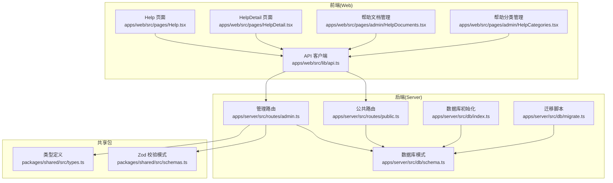
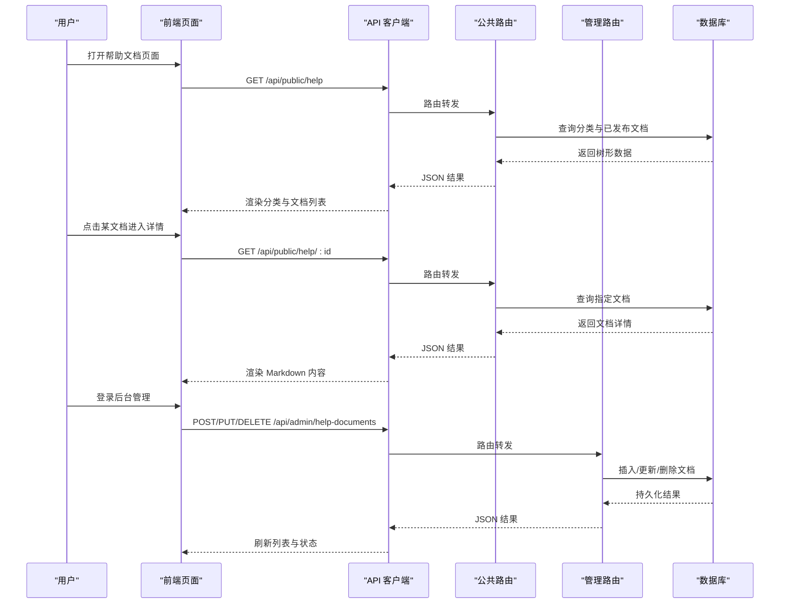
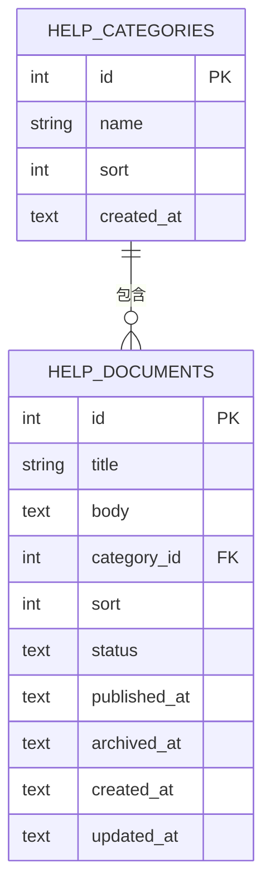
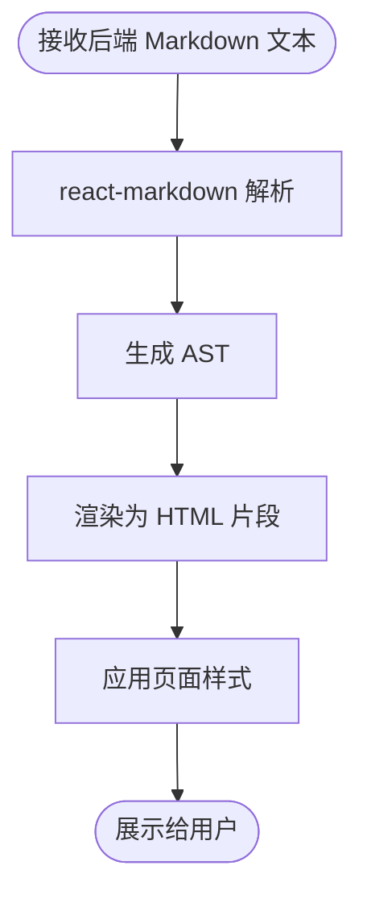
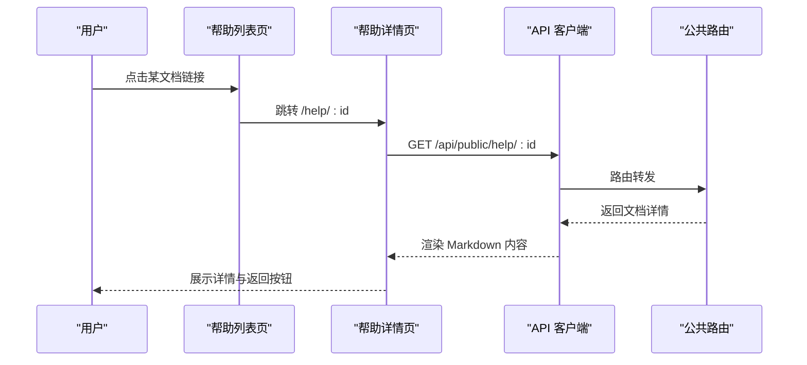
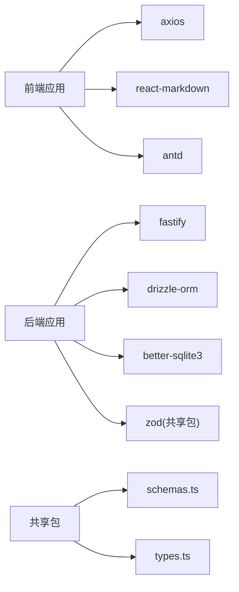

# 帮助文档系统

<cite>
**本文档引用的文件**
- [apps/web/src/pages/Help.tsx](file://apps/web/src/pages/Help.tsx)
- [apps/web/src/pages/HelpDetail.tsx](file://apps/web/src/pages/HelpDetail.tsx)
- [apps/web/src/pages/admin/HelpCategories.tsx](file://apps/web/src/pages/admin/HelpCategories.tsx)
- [apps/web/src/pages/admin/HelpDocuments.tsx](file://apps/web/src/pages/admin/HelpDocuments.tsx)
- [apps/web/src/lib/api.ts](file://apps/web/src/lib/api.ts)
- [apps/server/src/routes/public.ts](file://apps/server/src/routes/public.ts)
- [apps/server/src/routes/admin.ts](file://apps/server/src/routes/admin.ts)
- [apps/server/src/db/schema.ts](file://apps/server/src/db/schema.ts)
- [apps/server/src/db/index.ts](file://apps/server/src/db/index.ts)
- [apps/server/src/db/migrate.ts](file://apps/server/src/db/migrate.ts)
- [packages/shared/src/schemas.ts](file://packages/shared/src/schemas.ts)
- [packages/shared/src/types.ts](file://packages/shared/src/types.ts)
- [apps/web/src/pages/Home.tsx](file://apps/web/src/pages/Home.tsx)
</cite>

## 目录
1. [简介](#简介)
2. [项目结构](#项目结构)
3. [核心组件](#核心组件)
4. [架构总览](#架构总览)
5. [详细组件分析](#详细组件分析)
6. [依赖关系分析](#依赖关系分析)
7. [性能考虑](#性能考虑)
8. [故障排除指南](#故障排除指南)
9. [结论](#结论)
10. [附录](#附录)

## 简介
本文件为 ZBH2 帮助文档系统的功能文档，围绕以下目标展开：
- 分类管理架构：分类层级设计与文档索引机制
- Markdown 文档渲染：语法解析、样式定制与代码高亮
- 搜索与标签：实现原理与扩展建议
- 文档详情页：目录导航、相关文档推荐与评论系统
- 编辑器集成与版本管理：编辑器集成方式与版本控制机制
- 访问统计与用户反馈：访问统计与用户反馈收集功能

本系统采用前后端分离架构，前端基于 React + Ant Design，后端基于 Fastify + Drizzle ORM，数据库使用 SQLite，并通过 Drizzle Migrator 进行迁移管理。

## 项目结构
系统主要由三部分组成：
- Web 前端（apps/web）：负责用户界面与交互，包括帮助文档列表、详情页、后台管理等
- 服务器端（apps/server）：提供公共接口与管理接口，处理业务逻辑与数据持久化
- 共享包（packages/shared）：定义前后端共用的数据模型与校验规则

**图表来源**
- [apps/web/src/pages/Help.tsx:1-61](file://apps/web/src/pages/Help.tsx#L1-L61)
- [apps/web/src/pages/HelpDetail.tsx:1-38](file://apps/web/src/pages/HelpDetail.tsx#L1-L38)
- [apps/web/src/pages/admin/HelpDocuments.tsx:1-112](file://apps/web/src/pages/admin/HelpDocuments.tsx#L1-L112)
- [apps/web/src/pages/admin/HelpCategories.tsx:1-70](file://apps/web/src/pages/admin/HelpCategories.tsx#L1-L70)
- [apps/web/src/lib/api.ts:1-16](file://apps/web/src/lib/api.ts#L1-L16)
- [apps/server/src/routes/public.ts:1-52](file://apps/server/src/routes/public.ts#L1-L52)
- [apps/server/src/routes/admin.ts:1-279](file://apps/server/src/routes/admin.ts#L1-L279)
- [apps/server/src/db/schema.ts:1-330](file://apps/server/src/db/schema.ts#L1-L330)
- [apps/server/src/db/index.ts:1-16](file://apps/server/src/db/index.ts#L1-L16)
- [apps/server/src/db/migrate.ts:1-18](file://apps/server/src/db/migrate.ts#L1-L18)
- [packages/shared/src/schemas.ts:1-51](file://packages/shared/src/schemas.ts#L1-L51)
- [packages/shared/src/types.ts:1-18](file://packages/shared/src/types.ts#L1-L18)

**章节来源**
- [apps/web/src/pages/Help.tsx:1-61](file://apps/web/src/pages/Help.tsx#L1-L61)
- [apps/web/src/pages/HelpDetail.tsx:1-38](file://apps/web/src/pages/HelpDetail.tsx#L1-L38)
- [apps/web/src/pages/admin/HelpDocuments.tsx:1-112](file://apps/web/src/pages/admin/HelpDocuments.tsx#L1-L112)
- [apps/web/src/pages/admin/HelpCategories.tsx:1-70](file://apps/web/src/pages/admin/HelpCategories.tsx#L1-L70)
- [apps/web/src/lib/api.ts:1-16](file://apps/web/src/lib/api.ts#L1-L16)
- [apps/server/src/routes/public.ts:1-52](file://apps/server/src/routes/public.ts#L1-L52)
- [apps/server/src/routes/admin.ts:1-279](file://apps/server/src/routes/admin.ts#L1-L279)
- [apps/server/src/db/schema.ts:1-330](file://apps/server/src/db/schema.ts#L1-L330)
- [apps/server/src/db/index.ts:1-16](file://apps/server/src/db/index.ts#L1-L16)
- [apps/server/src/db/migrate.ts:1-18](file://apps/server/src/db/migrate.ts#L1-L18)
- [packages/shared/src/schemas.ts:1-51](file://packages/shared/src/schemas.ts#L1-L51)
- [packages/shared/src/types.ts:1-18](file://packages/shared/src/types.ts#L1-L18)

## 核心组件
- 帮助文档列表页：展示分类与文档列表，支持折叠查看与跳转详情
- 帮助文档详情页：渲染 Markdown 内容，提供返回列表的导航
- 帮助文档管理（后台）：支持新增、编辑、删除、发布/回收状态切换
- 帮助分类管理（后台）：支持分类的增删改与排序
- API 客户端：统一的请求封装，自动处理认证态与错误
- 公共路由：提供公开的分类与文档查询接口
- 管理路由：提供后台的分类与文档 CRUD、状态变更与分页查询
- 数据库模式：定义 help_categories 与 help_documents 表结构及关联关系
- 共享校验与类型：前后端一致的表单校验与类型约束

**章节来源**
- [apps/web/src/pages/Help.tsx:1-61](file://apps/web/src/pages/Help.tsx#L1-L61)
- [apps/web/src/pages/HelpDetail.tsx:1-38](file://apps/web/src/pages/HelpDetail.tsx#L1-L38)
- [apps/web/src/pages/admin/HelpDocuments.tsx:1-112](file://apps/web/src/pages/admin/HelpDocuments.tsx#L1-L112)
- [apps/web/src/pages/admin/HelpCategories.tsx:1-70](file://apps/web/src/pages/admin/HelpCategories.tsx#L1-L70)
- [apps/web/src/lib/api.ts:1-16](file://apps/web/src/lib/api.ts#L1-L16)
- [apps/server/src/routes/public.ts:26-44](file://apps/server/src/routes/public.ts#L26-L44)
- [apps/server/src/routes/admin.ts:102-134](file://apps/server/src/routes/admin.ts#L102-L134)
- [apps/server/src/db/schema.ts:51-69](file://apps/server/src/db/schema.ts#L51-L69)
- [packages/shared/src/schemas.ts:19-39](file://packages/shared/src/schemas.ts#L19-L39)
- [packages/shared/src/types.ts:1-18](file://packages/shared/src/types.ts#L1-L18)

## 架构总览
系统采用“前端页面 + 后端 API + 数据库”的三层架构：
- 前端页面通过 API 客户端调用后端接口，分别提供公共浏览与后台管理能力
- 后端使用 Drizzle ORM 对 SQLite 进行读写，配合 Drizzle Migrator 进行结构演进
- 共享包提供前后端一致的校验与类型定义，确保数据一致性

**图表来源**
- [apps/web/src/lib/api.ts:1-16](file://apps/web/src/lib/api.ts#L1-L16)
- [apps/server/src/routes/public.ts:26-44](file://apps/server/src/routes/public.ts#L26-L44)
- [apps/server/src/routes/admin.ts:102-134](file://apps/server/src/routes/admin.ts#L102-L134)
- [apps/server/src/db/index.ts:1-16](file://apps/server/src/db/index.ts#L1-L16)

## 详细组件分析

### 分类管理架构与文档索引机制
- 分类与文档的树形结构：后端在查询时将分类与其下的文档进行聚合，形成“分类 -> 文档列表”的结构，便于前端直接渲染
- 文档状态过滤：公共接口仅返回状态为“已发布”的文档，后台管理接口则返回全部状态以便进行发布/回收操作
- 排序字段：分类与文档均提供 sort 字段，用于控制显示顺序
- 关联关系：help_documents 的 categoryId 外键指向 help_categories 的 id，保证分类与文档的一致性

**图表来源**
- [apps/server/src/db/schema.ts:51-69](file://apps/server/src/db/schema.ts#L51-L69)

**章节来源**
- [apps/server/src/routes/public.ts:26-44](file://apps/server/src/routes/public.ts#L26-L44)
- [apps/server/src/routes/admin.ts:102-134](file://apps/server/src/routes/admin.ts#L102-L134)
- [apps/server/src/db/schema.ts:51-69](file://apps/server/src/db/schema.ts#L51-L69)

### Markdown 文档渲染实现
- 渲染引擎：前端使用 react-markdown 将后端返回的 Markdown 文本渲染为 HTML
- 样式定制：通过卡片容器与标题样式实现统一视觉风格；行高与颜色在页面内进行局部定制
- 代码高亮：当前仓库未引入专门的代码高亮插件；如需高亮，可在 react-markdown 中接入 rehype 插件链以实现语法高亮

**图表来源**
- [apps/web/src/pages/HelpDetail.tsx:29-31](file://apps/web/src/pages/HelpDetail.tsx#L29-L31)

**章节来源**
- [apps/web/src/pages/HelpDetail.tsx:1-38](file://apps/web/src/pages/HelpDetail.tsx#L1-L38)

### 搜索与标签功能
- 当前实现：前端未实现文档搜索与标签筛选功能
- 实现建议：
  - 搜索：在公共路由中增加模糊匹配查询，或引入全文检索（如 SQLiteFTS）
  - 标签：在 help_documents 表中新增 tags 字段或独立标签表，后端提供按标签过滤接口，前端提供筛选器
  - 状态过滤：可扩展为多条件过滤（分类、状态、关键词）

[本节为概念性建议，不直接分析具体文件，故不附“章节来源”]

### 文档详情页面设计
- 导航：详情页提供返回列表的按钮，保持良好的页面流转
- 目录导航：当前未实现自动生成目录；可基于 react-markdown 的 heading 标签生成目录
- 相关文档推荐：可基于分类或关键词相似度进行推荐
- 评论系统：当前未实现评论功能；可新增评论表与接口，支持嵌套回复与审核

**图表来源**
- [apps/web/src/pages/Help.tsx:48-50](file://apps/web/src/pages/Help.tsx#L48-L50)
- [apps/web/src/pages/HelpDetail.tsx:16-18](file://apps/web/src/pages/HelpDetail.tsx#L16-L18)
- [apps/web/src/lib/api.ts:1-16](file://apps/web/src/lib/api.ts#L1-L16)
- [apps/server/src/routes/public.ts:37-44](file://apps/server/src/routes/public.ts#L37-L44)

**章节来源**
- [apps/web/src/pages/Help.tsx:1-61](file://apps/web/src/pages/Help.tsx#L1-L61)
- [apps/web/src/pages/HelpDetail.tsx:1-38](file://apps/web/src/pages/HelpDetail.tsx#L1-L38)

### 编辑器集成与版本管理
- 编辑器集成：后台管理页面使用 Ant Design 表单与文本域输入 Markdown；可替换为富文本编辑器（如 TinyMCE、Draft.js）或 Markdown 编辑器（如 React-Markdown-Editor），以提升写作体验
- 版本管理：当前未实现版本控制；可在 help_documents 表中增加版本号字段与历史记录表，记录每次修改的差异与作者

**章节来源**
- [apps/web/src/pages/admin/HelpDocuments.tsx:87-107](file://apps/web/src/pages/admin/HelpDocuments.tsx#L87-L107)
- [apps/server/src/routes/admin.ts:108-128](file://apps/server/src/routes/admin.ts#L108-L128)

### 访问统计与用户反馈
- 访问统计：当前未实现文档访问统计；可在后端新增访问日志表与接口，记录文档浏览次数、时间分布与来源
- 用户反馈：当前未实现反馈收集；可新增反馈表与接口，支持评分、评论与问题上报

[本节为概念性建议，不直接分析具体文件，故不附“章节来源”]

## 依赖关系分析
- 前端依赖：
  - axios：HTTP 请求客户端
  - react-markdown：Markdown 渲染
  - antd：UI 组件库
- 后端依赖：
  - fastify：Web 框架
  - drizzle-orm + better-sqlite3：ORM 与 SQLite 驱动
  - zod：数据校验（共享包）
- 共享包：
  - schemas.ts：Zod 校验模式
  - types.ts：通用类型定义

**图表来源**
- [apps/web/src/lib/api.ts:1-16](file://apps/web/src/lib/api.ts#L1-L16)
- [apps/web/src/pages/HelpDetail.tsx:5-5](file://apps/web/src/pages/HelpDetail.tsx#L5-L5)
- [apps/server/src/routes/admin.ts:1-14](file://apps/server/src/routes/admin.ts#L1-L14)
- [packages/shared/src/schemas.ts:1-51](file://packages/shared/src/schemas.ts#L1-L51)
- [packages/shared/src/types.ts:1-18](file://packages/shared/src/types.ts#L1-L18)

**章节来源**
- [apps/web/src/lib/api.ts:1-16](file://apps/web/src/lib/api.ts#L1-L16)
- [apps/server/src/routes/admin.ts:1-14](file://apps/server/src/routes/admin.ts#L1-L14)
- [packages/shared/src/schemas.ts:1-51](file://packages/shared/src/schemas.ts#L1-L51)
- [packages/shared/src/types.ts:1-18](file://packages/shared/src/types.ts#L1-L18)

## 性能考虑
- 数据库优化：
  - 使用 WAL 模式与外键约束，提升并发与一致性
  - 为常用查询字段（如 categoryId、status、sort）建立索引，减少查询成本
- 前端优化：
  - 列表懒加载与分页，避免一次性渲染大量文档
  - Markdown 渲染缓存，减少重复解析
- 后端优化：
  - 使用事务批量插入/更新，降低 I/O 开销
  - 对热点接口进行缓存（如分类树），减少数据库压力

**章节来源**
- [apps/server/src/db/index.ts:10-12](file://apps/server/src/db/index.ts#L10-L12)
- [apps/server/src/db/schema.ts:51-69](file://apps/server/src/db/schema.ts#L51-L69)

## 故障排除指南
- 404 文档：当请求的文档不存在或状态非“已发布”时，公共路由会返回错误响应
- 权限问题：管理接口需要管理员权限，若未登录或权限不足，将无法访问
- 数据校验失败：管理接口对输入进行严格校验，若格式不符会返回错误信息
- 数据库迁移：首次运行或结构变更后需执行迁移脚本，确保表结构正确

**章节来源**
- [apps/server/src/routes/public.ts:37-44](file://apps/server/src/routes/public.ts#L37-L44)
- [apps/server/src/routes/admin.ts:16-16](file://apps/server/src/routes/admin.ts#L16-L16)
- [apps/server/src/db/migrate.ts:1-18](file://apps/server/src/db/migrate.ts#L1-L18)

## 结论
本帮助文档系统以清晰的分类与状态管理为核心，结合简洁的 Markdown 渲染与后台管理能力，满足了基础的文档浏览与维护需求。未来可在搜索与标签、目录导航、评论系统、访问统计与版本管理等方面进一步增强，以提升用户体验与管理效率。

## 附录
- 数据库初始化与迁移：通过 Drizzle 初始化 SQLite 并应用迁移脚本
- 共享校验与类型：前后端一致的表单校验与类型约束，确保数据一致性

**章节来源**
- [apps/server/src/db/index.ts:1-16](file://apps/server/src/db/index.ts#L1-L16)
- [apps/server/src/db/migrate.ts:1-18](file://apps/server/src/db/migrate.ts#L1-L18)
- [packages/shared/src/schemas.ts:19-39](file://packages/shared/src/schemas.ts#L19-L39)
- [packages/shared/src/types.ts:1-18](file://packages/shared/src/types.ts#L1-L18)