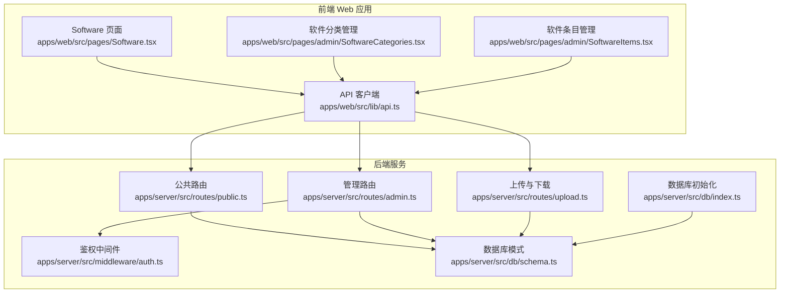
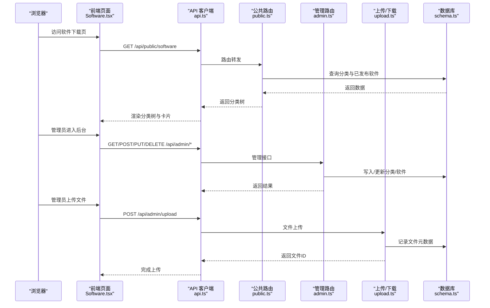
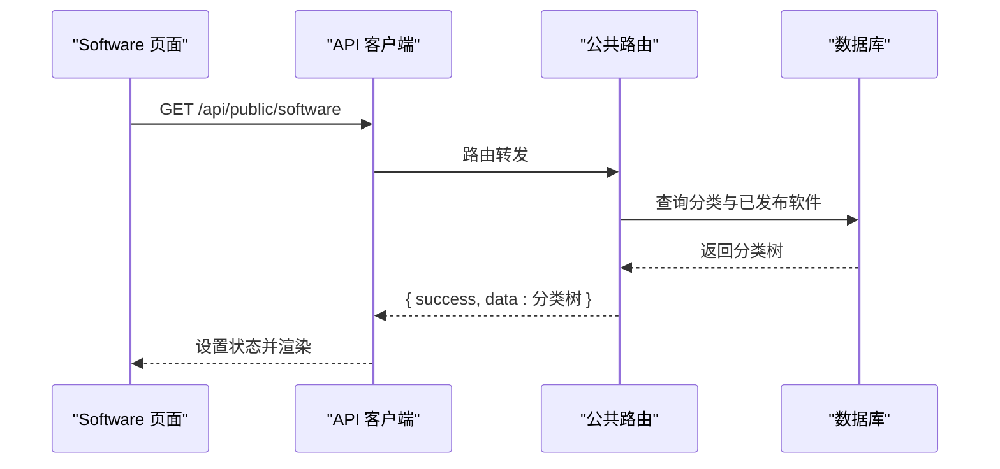
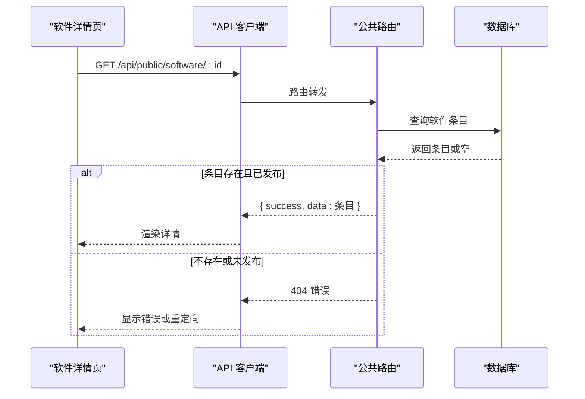
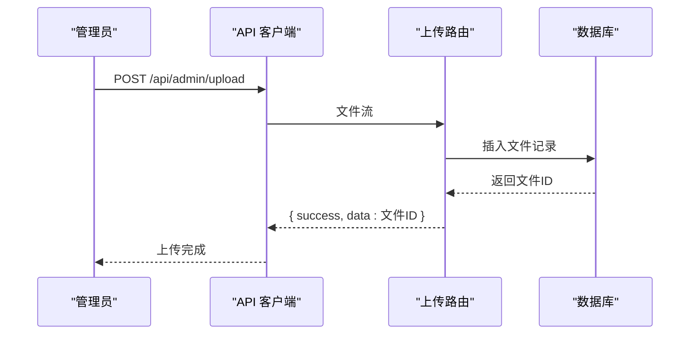
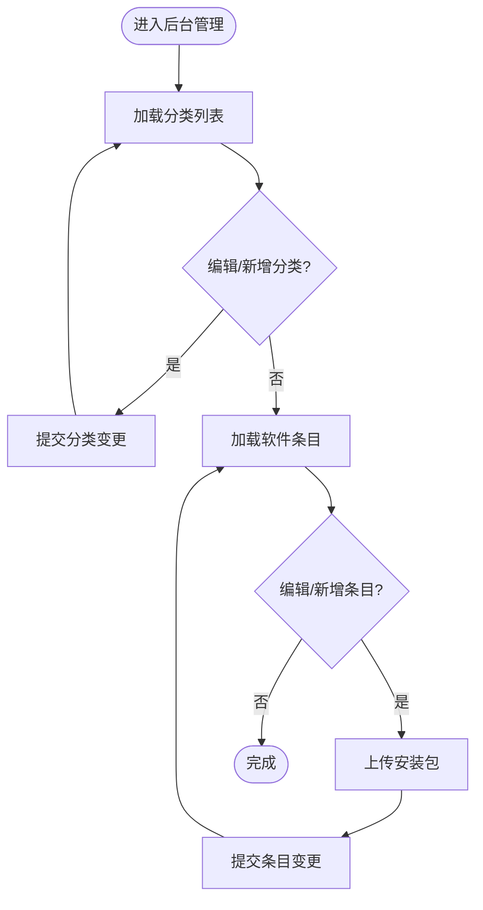
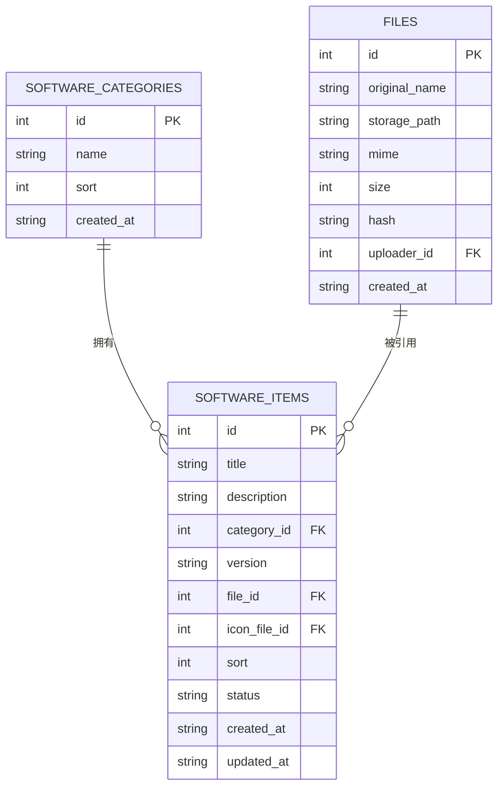

# 软件下载系统

<cite>
**本文档引用的文件**
- [apps/web/src/pages/Software.tsx](file://apps/web/src/pages/Software.tsx)
- [apps/web/src/pages/admin/SoftwareCategories.tsx](file://apps/web/src/pages/admin/SoftwareCategories.tsx)
- [apps/web/src/pages/admin/SoftwareItems.tsx](file://apps/web/src/pages/admin/SoftwareItems.tsx)
- [apps/server/src/routes/public.ts](file://apps/server/src/routes/public.ts)
- [apps/server/src/routes/admin.ts](file://apps/server/src/routes/admin.ts)
- [apps/server/src/routes/upload.ts](file://apps/server/src/routes/upload.ts)
- [apps/server/src/db/schema.ts](file://apps/server/src/db/schema.ts)
- [apps/server/src/middleware/auth.ts](file://apps/server/src/middleware/auth.ts)
- [apps/web/src/lib/api.ts](file://apps/web/src/lib/api.ts)
- [apps/server/src/db/index.ts](file://apps/server/src/db/index.ts)
- [packages/shared/src/types.ts](file://packages/shared/src/types.ts)
</cite>

## 目录
1. [简介](#简介)
2. [项目结构](#项目结构)
3. [核心组件](#核心组件)
4. [架构总览](#架构总览)
5. [详细组件分析](#详细组件分析)
6. [依赖关系分析](#依赖关系分析)
7. [性能考虑](#性能考虑)
8. [故障排除指南](#故障排除指南)
9. [结论](#结论)

## 简介
本系统为ZBH2软件下载平台，提供以下能力：
- 软件分类浏览：以树形结构展示分类与软件条目，并支持按分类折叠查看
- 搜索与筛选：前端可基于关键词与状态进行筛选（当前实现以分类为主）
- 软件详情：公开接口返回软件条目详情（含版本、描述等）
- 下载安全与权限：通过后端鉴权与文件存储实现安全下载
- 分类管理后台：管理员可维护软件分类与软件条目，支持文件上传与状态管理
- 实时更新：后台变更通过REST接口即时生效

## 项目结构
系统采用前后端分离架构：
- 前端Web应用（React + Ant Design）位于 apps/web
- 后端服务（Fastify + Drizzle ORM + SQLite）位于 apps/server
- 共享类型定义位于 packages/shared

**图表来源**
- [apps/web/src/pages/Software.tsx:1-71](file://apps/web/src/pages/Software.tsx#L1-L71)
- [apps/web/src/pages/admin/SoftwareCategories.tsx:1-70](file://apps/web/src/pages/admin/SoftwareCategories.tsx#L1-L70)
- [apps/web/src/pages/admin/SoftwareItems.tsx:1-118](file://apps/web/src/pages/admin/SoftwareItems.tsx#L1-L118)
- [apps/web/src/lib/api.ts:1-16](file://apps/web/src/lib/api.ts#L1-L16)
- [apps/server/src/routes/public.ts:1-52](file://apps/server/src/routes/public.ts#L1-L52)
- [apps/server/src/routes/admin.ts:1-279](file://apps/server/src/routes/admin.ts#L1-L279)
- [apps/server/src/routes/upload.ts:1-63](file://apps/server/src/routes/upload.ts#L1-L63)
- [apps/server/src/middleware/auth.ts:1-56](file://apps/server/src/middleware/auth.ts#L1-L56)
- [apps/server/src/db/index.ts:1-16](file://apps/server/src/db/index.ts#L1-L16)
- [apps/server/src/db/schema.ts:1-330](file://apps/server/src/db/schema.ts#L1-L330)

**章节来源**
- [apps/web/src/pages/Software.tsx:1-71](file://apps/web/src/pages/Software.tsx#L1-L71)
- [apps/web/src/pages/admin/SoftwareCategories.tsx:1-70](file://apps/web/src/pages/admin/SoftwareCategories.tsx#L1-L70)
- [apps/web/src/pages/admin/SoftwareItems.tsx:1-118](file://apps/web/src/pages/admin/SoftwareItems.tsx#L1-L118)
- [apps/web/src/lib/api.ts:1-16](file://apps/web/src/lib/api.ts#L1-L16)
- [apps/server/src/routes/public.ts:1-52](file://apps/server/src/routes/public.ts#L1-L52)
- [apps/server/src/routes/admin.ts:1-279](file://apps/server/src/routes/admin.ts#L1-L279)
- [apps/server/src/routes/upload.ts:1-63](file://apps/server/src/routes/upload.ts#L1-L63)
- [apps/server/src/middleware/auth.ts:1-56](file://apps/server/src/middleware/auth.ts#L1-L56)
- [apps/server/src/db/index.ts:1-16](file://apps/server/src/db/index.ts#L1-L16)
- [apps/server/src/db/schema.ts:1-330](file://apps/server/src/db/schema.ts#L1-L330)

## 核心组件
- 软件分类浏览页面：负责拉取分类树与软件条目，渲染折叠面板与卡片列表
- 管理后台（分类管理）：提供分类增删改查与排序
- 管理后台（软件条目管理）：提供软件条目增删改查、状态管理、文件上传
- 公共路由：提供分类树与软件详情的公开查询
- 管理路由：提供分类与软件条目的管理接口
- 上传与下载：处理文件上传、存储与安全下载
- 鉴权中间件：会话加载、登录校验与管理员权限控制
- 数据库模式：定义软件分类、软件条目、文件等表结构

**章节来源**
- [apps/web/src/pages/Software.tsx:1-71](file://apps/web/src/pages/Software.tsx#L1-L71)
- [apps/web/src/pages/admin/SoftwareCategories.tsx:1-70](file://apps/web/src/pages/admin/SoftwareCategories.tsx#L1-L70)
- [apps/web/src/pages/admin/SoftwareItems.tsx:1-118](file://apps/web/src/pages/admin/SoftwareItems.tsx#L1-L118)
- [apps/server/src/routes/public.ts:1-52](file://apps/server/src/routes/public.ts#L1-L52)
- [apps/server/src/routes/admin.ts:1-279](file://apps/server/src/routes/admin.ts#L1-L279)
- [apps/server/src/routes/upload.ts:1-63](file://apps/server/src/routes/upload.ts#L1-L63)
- [apps/server/src/middleware/auth.ts:1-56](file://apps/server/src/middleware/auth.ts#L1-L56)
- [apps/server/src/db/schema.ts:19-49](file://apps/server/src/db/schema.ts#L19-L49)

## 架构总览
系统采用“前端页面 + 后端API + 数据库”的三层架构。前端通过统一的API客户端访问后端，后端使用Drizzle ORM访问SQLite数据库。

**图表来源**
- [apps/web/src/pages/Software.tsx:23-31](file://apps/web/src/pages/Software.tsx#L23-L31)
- [apps/web/src/lib/api.ts:1-16](file://apps/web/src/lib/api.ts#L1-L16)
- [apps/server/src/routes/public.ts:7-15](file://apps/server/src/routes/public.ts#L7-L15)
- [apps/server/src/routes/admin.ts:18-73](file://apps/server/src/routes/admin.ts#L18-L73)
- [apps/server/src/routes/upload.ts:14-49](file://apps/server/src/routes/upload.ts#L14-L49)
- [apps/server/src/db/schema.ts:26-49](file://apps/server/src/db/schema.ts#L26-L49)

## 详细组件分析

### 软件分类浏览功能
- 功能概述
  - 前端在挂载时调用公共接口获取分类树
  - 分类树由分类与对应软件条目组成，软件条目仅展示已发布状态
  - 使用折叠面板展示分类，每个分类内以卡片形式展示软件条目
  - 条目包含标题、版本标签、简要描述与下载按钮（若存在文件ID）

- 关键流程
  - 加载数据：调用 GET /api/public/software
  - 渲染：遍历分类与条目，渲染卡片与下载按钮
  - 下载：点击按钮跳转到 /api/public/download/{fileId}

**图表来源**
- [apps/web/src/pages/Software.tsx:23-31](file://apps/web/src/pages/Software.tsx#L23-L31)
- [apps/server/src/routes/public.ts:7-15](file://apps/server/src/routes/public.ts#L7-L15)

**章节来源**
- [apps/web/src/pages/Software.tsx:1-71](file://apps/web/src/pages/Software.tsx#L1-L71)
- [apps/server/src/routes/public.ts:1-52](file://apps/server/src/routes/public.ts#L1-L52)

### 软件搜索与筛选机制
- 当前实现
  - 前端未实现关键词搜索与多条件过滤
  - 分类树仅按分类与条目排序字段展示
- 可扩展建议
  - 在公共路由中增加查询参数（如关键词、分类ID、状态）
  - 前端添加搜索框与筛选器，调用带参数的接口
  - 后端根据参数动态过滤软件条目

**章节来源**
- [apps/server/src/routes/public.ts:7-15](file://apps/server/src/routes/public.ts#L7-L15)
- [apps/web/src/pages/Software.tsx:23-31](file://apps/web/src/pages/Software.tsx#L23-L31)

### 软件详情页面设计
- 接口定义
  - GET /api/public/software/{id} 返回指定软件条目
  - 仅当条目存在且状态为已发布时返回数据，否则返回404
- 页面设计要点
  - 展示标题、版本、描述、图标（如配置了图标文件ID）
  - 提供下载按钮，指向安全下载接口
  - 对于未发布的条目，前端应避免直接访问详情页或提示不可用

**图表来源**
- [apps/server/src/routes/public.ts:17-24](file://apps/server/src/routes/public.ts#L17-L24)

**章节来源**
- [apps/server/src/routes/public.ts:17-24](file://apps/server/src/routes/public.ts#L17-L24)

### 软件文件下载安全机制与权限控制
- 安全下载流程
  - 文件上传：管理员通过 /api/admin/upload 上传，后端写入数据库记录并落盘
  - 文件下载：公开接口 /api/public/download/{fileId} 根据文件ID读取元数据并返回文件流
  - 下载响应设置正确的 Content-Disposition 与 MIME 类型
- 权限控制
  - 上传接口受管理员权限保护（requireAdmin）
  - 下载接口为公开接口，但仅返回数据库中存在的文件记录
  - 建议可在下载接口增加访问审计与配额限制

**图表来源**
- [apps/server/src/routes/upload.ts:14-49](file://apps/server/src/routes/upload.ts#L14-L49)
- [apps/server/src/middleware/auth.ts:48-55](file://apps/server/src/middleware/auth.ts#L48-L55)

**章节来源**
- [apps/server/src/routes/upload.ts:1-63](file://apps/server/src/routes/upload.ts#L1-L63)
- [apps/server/src/middleware/auth.ts:1-56](file://apps/server/src/middleware/auth.ts#L1-L56)

### 软件分类管理后台集成与实时更新
- 分类管理
  - 列表：GET /api/admin/software-categories
  - 新增/修改/删除：POST/PUT/DELETE /api/admin/software-categories/:id
  - 支持排序字段，按 sort 升序排列
- 软件条目管理
  - 列表：GET /api/admin/software-items
  - 新增/修改/删除：POST/PUT/DELETE /api/admin/software-items/:id
  - 支持状态（草稿/已发布）、版本号、排序、分类关联、文件上传
  - 文件上传通过 /api/admin/upload 获取文件ID后写入软件条目
- 实时更新
  - 后台变更后，前端重新拉取数据即可看到最新结果
  - 分类树与软件列表均按排序字段升序展示

**图表来源**
- [apps/web/src/pages/admin/SoftwareCategories.tsx:12-28](file://apps/web/src/pages/admin/SoftwareCategories.tsx#L12-L28)
- [apps/web/src/pages/admin/SoftwareItems.tsx:13-53](file://apps/web/src/pages/admin/SoftwareItems.tsx#L13-L53)
- [apps/server/src/routes/admin.ts:18-73](file://apps/server/src/routes/admin.ts#L18-L73)
- [apps/server/src/routes/upload.ts:14-49](file://apps/server/src/routes/upload.ts#L14-L49)

**章节来源**
- [apps/web/src/pages/admin/SoftwareCategories.tsx:1-70](file://apps/web/src/pages/admin/SoftwareCategories.tsx#L1-L70)
- [apps/web/src/pages/admin/SoftwareItems.tsx:1-118](file://apps/web/src/pages/admin/SoftwareItems.tsx#L1-L118)
- [apps/server/src/routes/admin.ts:1-279](file://apps/server/src/routes/admin.ts#L1-L279)
- [apps/server/src/routes/upload.ts:1-63](file://apps/server/src/routes/upload.ts#L1-L63)

### 用户反馈与评价系统
- 当前仓库未发现专门的“用户反馈与评价”模块
- 若需集成，建议：
  - 新增评价表（关联软件条目与用户）
  - 提供评价提交接口与审核流程
  - 在软件详情页展示评价列表与评分统计
- 本节为概念性建议，不对应具体源码文件

## 依赖关系分析

**图表来源**
- [apps/server/src/db/schema.ts:19-49](file://apps/server/src/db/schema.ts#L19-L49)

**章节来源**
- [apps/server/src/db/schema.ts:1-330](file://apps/server/src/db/schema.ts#L1-L330)

## 性能考虑
- 数据库优化
  - 使用SQLite WAL模式提升并发读写性能
  - 合理使用索引（当前主要按 sort 字段排序）
- 接口优化
  - 分类树查询一次性返回，避免多次往返
  - 文件下载采用静态文件发送，减少内存占用
- 前端优化
  - 分类面板默认展开所有分类，减少用户交互成本
  - 列表分页（软件条目管理）建议在大数据量时启用

**章节来源**
- [apps/server/src/db/index.ts:10-12](file://apps/server/src/db/index.ts#L10-L12)
- [apps/web/src/pages/admin/SoftwareItems.tsx:66-66](file://apps/web/src/pages/admin/SoftwareItems.tsx#L66-L66)

## 故障排除指南
- 无法加载软件分类树
  - 检查公共接口 /api/public/software 是否可达
  - 确认数据库中存在分类与已发布软件
- 下载失败
  - 检查文件ID是否存在且文件已上传
  - 确认上传目录权限与文件路径正确
- 管理员权限不足
  - 确认登录用户角色为管理员
  - 检查会话是否有效且未过期

**章节来源**
- [apps/server/src/routes/public.ts:7-15](file://apps/server/src/routes/public.ts#L7-L15)
- [apps/server/src/routes/upload.ts:50-61](file://apps/server/src/routes/upload.ts#L50-L61)
- [apps/server/src/middleware/auth.ts:48-55](file://apps/server/src/middleware/auth.ts#L48-L55)

## 结论
本系统提供了完整的软件下载平台基础能力：分类浏览、详情展示、安全下载与后台管理。当前实现以分类树为核心，搜索与评价功能尚未实现，后续可按需扩展。整体架构清晰、职责明确，具备良好的可维护性与扩展性。