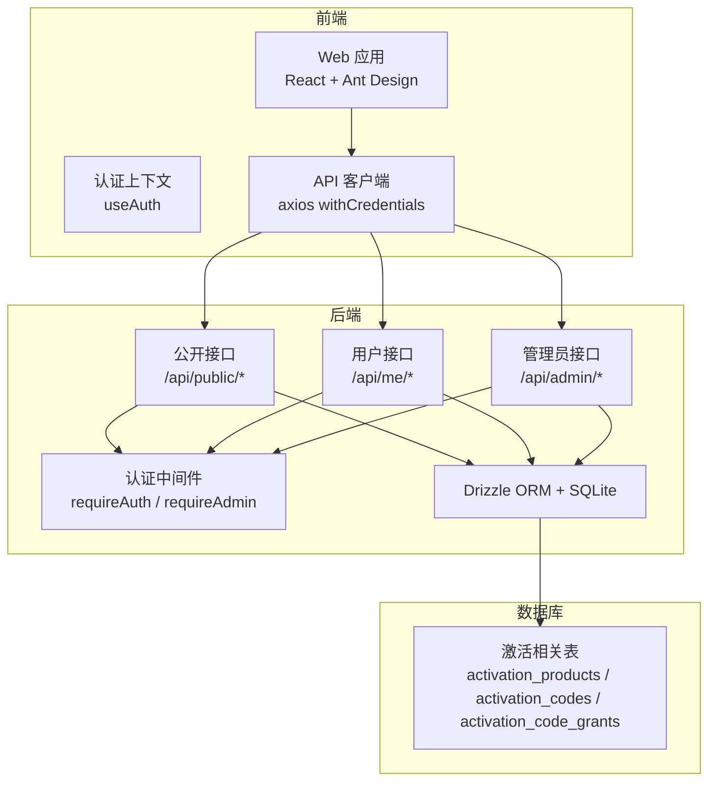
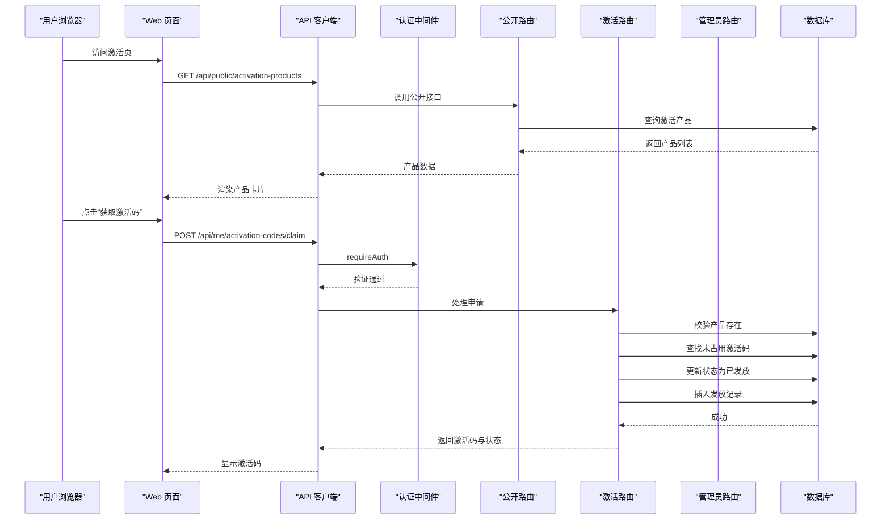
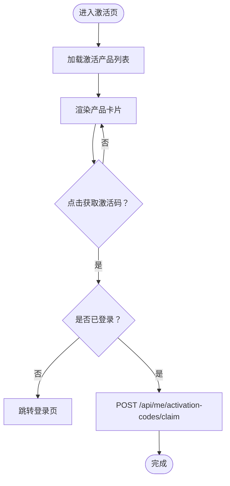
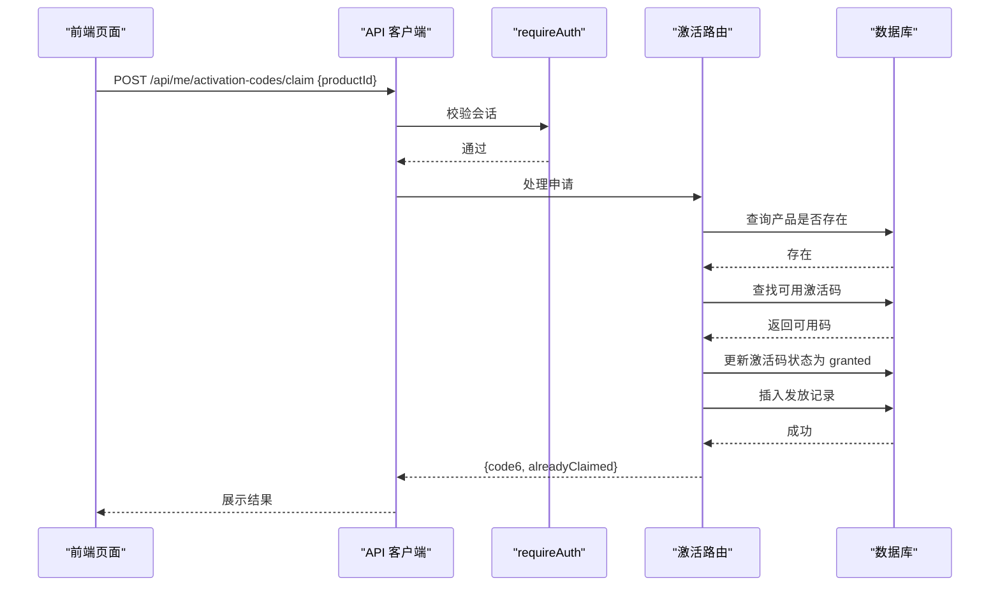
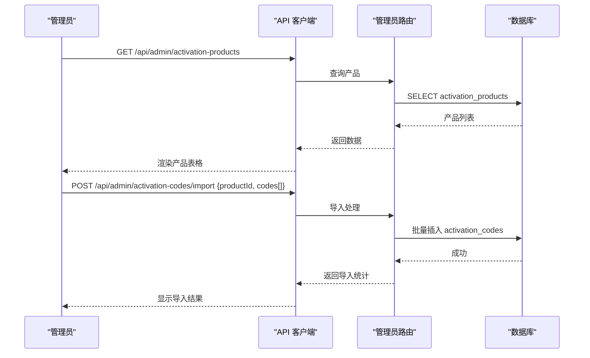
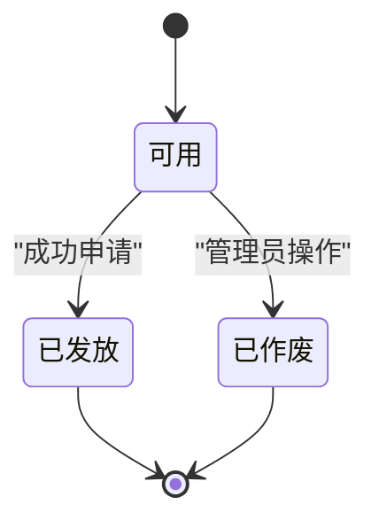
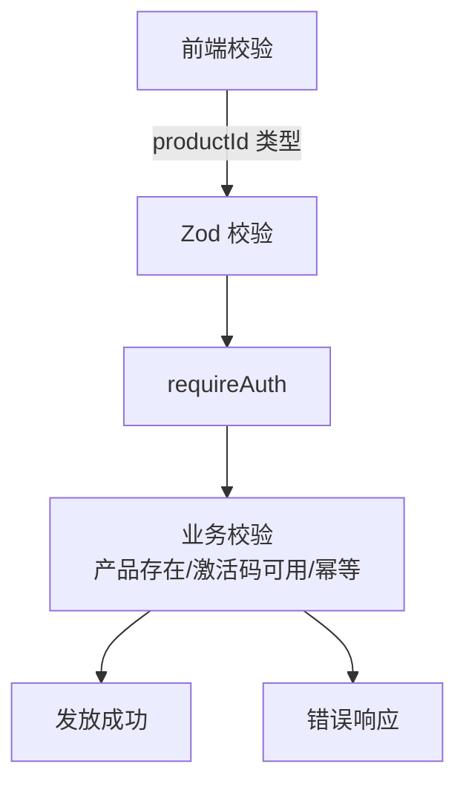
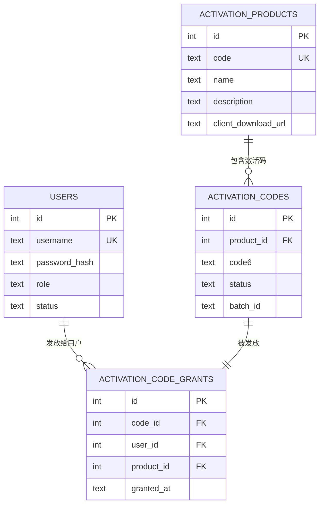

# 软件激活系统

<cite>
**本文档引用的文件**
- [apps/server/src/routes/activation.ts](file://apps/server/src/routes/activation.ts)
- [apps/server/src/routes/public.ts](file://apps/server/src/routes/public.ts)
- [apps/server/src/routes/admin.ts](file://apps/server/src/routes/admin.ts)
- [apps/server/src/middleware/auth.ts](file://apps/server/src/middleware/auth.ts)
- [apps/server/src/db/schema.ts](file://apps/server/src/db/schema.ts)
- [apps/web/src/pages/Activation.tsx](file://apps/web/src/pages/Activation.tsx)
- [apps/web/src/pages/MyCodes.tsx](file://apps/web/src/pages/MyCodes.tsx)
- [apps/web/src/pages/admin/ActivationProducts.tsx](file://apps/web/src/pages/admin/ActivationProducts.tsx)
- [apps/web/src/pages/admin/ActivationCodes.tsx](file://apps/web/src/pages/admin/ActivationCodes.tsx)
- [apps/web/src/lib/api.ts](file://apps/web/src/lib/api.ts)
- [apps/web/src/lib/auth.tsx](file://apps/web/src/lib/auth.tsx)
- [packages/shared/src/schemas.ts](file://packages/shared/src/schemas.ts)
- [tools/ActivationClientWpf/README.md](file://tools/ActivationClientWpf/README.md)
- [apps/server/drizzle/0000_absurd_liz_osborn.sql](file://apps/server/drizzle/0000_absurd_liz_osborn.sql)
- [apps/server/drizzle/0001_zippy_shadowcat.sql](file://apps/server/drizzle/0001_zippy_shadowcat.sql)
- [apps/server/drizzle/0002_special_medusa.sql](file://apps/server/drizzle/0002_special_medusa.sql)
</cite>

## 目录
1. [简介](#简介)
2. [项目结构](#项目结构)
3. [核心组件](#核心组件)
4. [架构总览](#架构总览)
5. [详细组件分析](#详细组件分析)
6. [依赖关系分析](#依赖关系分析)
7. [性能考虑](#性能考虑)
8. [故障排除指南](#故障排除指南)
9. [结论](#结论)
10. [附录](#附录)

## 简介
本系统为 ZBH2 提供软件激活能力，支持产品分类与版本信息展示、激活码申请与发放、激活码管理与审计、以及前端校验与后端验证的完整闭环。系统采用前后端分离架构：前端基于 React + Ant Design，后端基于 Fastify + Drizzle ORM + SQLite，通过标准化 API 实现用户认证、激活码发放与管理。

## 项目结构
系统主要由以下模块组成：
- 前端 Web 应用：负责用户界面、产品展示、激活码申请、我的激活码查看等
- 后端 Server：提供认证中间件、公开接口、用户专属接口、管理员接口
- 数据库 Schema：定义激活产品、激活码、发放记录等核心数据模型
- 共享包：统一的数据校验 Schema（Zod）
- 激活客户端工具：WPF 演示程序，用于模拟激活流程

**图表来源**
- [apps/web/src/pages/Activation.tsx:24-98](file://apps/web/src/pages/Activation.tsx#L24-L98)
- [apps/web/src/lib/api.ts:1-16](file://apps/web/src/lib/api.ts#L1-L16)
- [apps/server/src/routes/public.ts:46-51](file://apps/server/src/routes/public.ts#L46-L51)
- [apps/server/src/routes/activation.ts:7-95](file://apps/server/src/routes/activation.ts#L7-L95)
- [apps/server/src/routes/admin.ts:136-279](file://apps/server/src/routes/admin.ts#L136-L279)
- [apps/server/src/middleware/auth.ts:42-56](file://apps/server/src/middleware/auth.ts#L42-L56)
- [apps/server/src/db/schema.ts:71-96](file://apps/server/src/db/schema.ts#L71-L96)

**章节来源**
- [apps/web/src/pages/Activation.tsx:1-98](file://apps/web/src/pages/Activation.tsx#L1-L98)
- [apps/web/src/lib/api.ts:1-16](file://apps/web/src/lib/api.ts#L1-L16)
- [apps/server/src/routes/public.ts:1-52](file://apps/server/src/routes/public.ts#L1-L52)
- [apps/server/src/routes/activation.ts:1-95](file://apps/server/src/routes/activation.ts#L1-L95)
- [apps/server/src/routes/admin.ts:1-279](file://apps/server/src/routes/admin.ts#L1-L279)
- [apps/server/src/middleware/auth.ts:1-56](file://apps/server/src/middleware/auth.ts#L1-L56)
- [apps/server/src/db/schema.ts:1-330](file://apps/server/src/db/schema.ts#L1-L330)

## 核心组件
- 激活产品管理：管理员维护产品编码、名称、描述及客户端下载链接
- 激活码管理：管理员批量导入激活码，设置产品归属与批次标识
- 激活码发放：用户登录后按产品申请激活码，系统保证幂等性与唯一性
- 我的激活码：用户查看已发放的激活码及其领取时间
- 认证与授权：基于 Cookie 的会话认证，区分普通用户与管理员
- 数据校验：共享 Schema 统一前后端输入校验

**章节来源**
- [apps/server/src/routes/admin.ts:136-197](file://apps/server/src/routes/admin.ts#L136-L197)
- [apps/server/src/routes/activation.ts:7-95](file://apps/server/src/routes/activation.ts#L7-L95)
- [apps/web/src/pages/MyCodes.tsx:1-49](file://apps/web/src/pages/MyCodes.tsx#L1-L49)
- [apps/web/src/lib/auth.tsx:1-55](file://apps/web/src/lib/auth.tsx#L1-L55)
- [packages/shared/src/schemas.ts:41-51](file://packages/shared/src/schemas.ts#L41-L51)

## 架构总览
系统采用分层架构：
- 表现层：Web 页面与组件
- 接口层：Fastify 路由与中间件
- 业务层：激活码申请、发放、查询逻辑
- 数据层：SQLite + Drizzle ORM

**图表来源**
- [apps/web/src/pages/Activation.tsx:31-46](file://apps/web/src/pages/Activation.tsx#L31-L46)
- [apps/server/src/routes/public.ts:46-51](file://apps/server/src/routes/public.ts#L46-L51)
- [apps/server/src/routes/activation.ts:8-75](file://apps/server/src/routes/activation.ts#L8-L75)
- [apps/server/src/middleware/auth.ts:42-46](file://apps/server/src/middleware/auth.ts#L42-L46)

## 详细组件分析

### 激活产品展示与选择机制
- 产品分类与版本信息：公开接口返回激活产品列表，前端以卡片形式展示，包含图标、名称、描述与客户端下载链接
- 产品选择：用户点击“获取激活码”触发申请流程，需先登录
- 前端实现要点：使用 Axios 客户端发起请求，withCredentials 保持会话；登录态缺失时跳转至登录页

**图表来源**
- [apps/web/src/pages/Activation.tsx:31-46](file://apps/web/src/pages/Activation.tsx#L31-L46)
- [apps/server/src/routes/public.ts:46-51](file://apps/server/src/routes/public.ts#L46-L51)

**章节来源**
- [apps/web/src/pages/Activation.tsx:24-98](file://apps/web/src/pages/Activation.tsx#L24-L98)
- [apps/server/src/routes/public.ts:46-51](file://apps/server/src/routes/public.ts#L46-L51)

### 激活码申请流程（用户认证、产品选择、验证码生成）
- 用户认证：所有用户专属接口均受 requireAuth 中间件保护，未登录返回 401
- 产品选择：前端传入 productId，后端使用 Zod 校验
- 验放机制：
  - 幂等检查：同一用户对同一产品只允许一次有效发放
  - 可用性检查：从 activation_codes 中查找 status=available 的 6 位激活码
  - 原子更新：同时更新激活码状态与插入发放记录
- 返回结果：包含 code6 与 alreadyClaimed 标志

**图表来源**
- [apps/server/src/routes/activation.ts:8-75](file://apps/server/src/routes/activation.ts#L8-L75)
- [apps/server/src/middleware/auth.ts:42-46](file://apps/server/src/middleware/auth.ts#L42-L46)
- [packages/shared/src/schemas.ts:48-51](file://packages/shared/src/schemas.ts#L48-L51)

**章节来源**
- [apps/server/src/routes/activation.ts:7-95](file://apps/server/src/routes/activation.ts#L7-L95)
- [packages/shared/src/schemas.ts:48-51](file://packages/shared/src/schemas.ts#L48-L51)
- [apps/server/src/middleware/auth.ts:42-46](file://apps/server/src/middleware/auth.ts#L42-L46)

### 激活码管理功能（查看、下载、使用状态跟踪）
- 我的激活码：用户专属接口返回该用户的所有发放记录，包含产品名、激活码、领取时间
- 管理员视角：
  - 激活产品管理：增删改查激活产品，支持设置客户端下载链接
  - 激活码管理：分页列出激活码，支持按产品筛选，显示状态与批次
  - 批量导入：管理员可按产品导入多条 6 位激活码，系统自动去空格并过滤长度不符项

**图表来源**
- [apps/web/src/pages/admin/ActivationProducts.tsx:11-27](file://apps/web/src/pages/admin/ActivationProducts.tsx#L11-L27)
- [apps/web/src/pages/admin/ActivationCodes.tsx:18-43](file://apps/web/src/pages/admin/ActivationCodes.tsx#L18-L43)
- [apps/server/src/routes/admin.ts:136-197](file://apps/server/src/routes/admin.ts#L136-L197)

**章节来源**
- [apps/web/src/pages/MyCodes.tsx:1-49](file://apps/web/src/pages/MyCodes.tsx#L1-L49)
- [apps/web/src/pages/admin/ActivationProducts.tsx:1-66](file://apps/web/src/pages/admin/ActivationProducts.tsx#L1-L66)
- [apps/web/src/pages/admin/ActivationCodes.tsx:1-74](file://apps/web/src/pages/admin/ActivationCodes.tsx#L1-L74)
- [apps/server/src/routes/admin.ts:136-197](file://apps/server/src/routes/admin.ts#L136-L197)

### 激活码验证与生命周期管理
- 生命周期：
  - available：初始可用状态
  - granted：已被某用户成功领取
  - revoked：被管理员作废（当前管理端未直接暴露作废接口，但数据模型支持）
- 安全防护：
  - 幂等性：同一用户对同一产品仅能成功领取一次
  - 可用性：仅发放 status=available 的激活码
  - 审计：发放记录包含发放时间，便于追踪

**图表来源**
- [apps/server/src/db/schema.ts:81-88](file://apps/server/src/db/schema.ts#L81-L88)
- [apps/server/src/routes/activation.ts:44-75](file://apps/server/src/routes/activation.ts#L44-L75)

**章节来源**
- [apps/server/src/db/schema.ts:81-96](file://apps/server/src/db/schema.ts#L81-L96)
- [apps/server/src/routes/activation.ts:22-75](file://apps/server/src/routes/activation.ts#L22-L75)

### 前端校验与后端验证机制
- 前端校验：
  - 产品列表加载：GET /api/public/activation-products
  - 申请激活码：POST /api/me/activation-codes/claim，传入 productId
  - 登录态检测：未登录时跳转登录页
- 后端验证：
  - requireAuth：确保会话有效且用户状态正常
  - Zod 校验：productId 必须为正整数
  - 业务校验：产品存在、激活码可用、幂等检查

**图表来源**
- [apps/web/src/pages/Activation.tsx:35-46](file://apps/web/src/pages/Activation.tsx#L35-L46)
- [apps/server/src/middleware/auth.ts:42-46](file://apps/server/src/middleware/auth.ts#L42-L46)
- [packages/shared/src/schemas.ts:48-51](file://packages/shared/src/schemas.ts#L48-L51)
- [apps/server/src/routes/activation.ts:8-20](file://apps/server/src/routes/activation.ts#L8-L20)

**章节来源**
- [apps/web/src/pages/Activation.tsx:31-46](file://apps/web/src/pages/Activation.tsx#L31-L46)
- [apps/web/src/lib/auth.tsx:24-33](file://apps/web/src/lib/auth.tsx#L24-L33)
- [apps/server/src/middleware/auth.ts:42-46](file://apps/server/src/middleware/auth.ts#L42-L46)
- [packages/shared/src/schemas.ts:48-51](file://packages/shared/src/schemas.ts#L48-L51)

### 错误处理与重试机制
- 常见错误场景：
  - 未登录：401，前端提示并跳转登录
  - 产品不存在：404，提示错误
  - 无可用激活码：409，提示联系管理员
  - 参数无效：400，提示提供有效的产品 ID
- 重试建议：
  - 网络抖动：前端可增加简单指数退避重试
  - 无可用激活码：提示稍后再试或联系管理员
  - 幂等重复申请：前端应避免重复提交，后端已保证幂等

**章节来源**
- [apps/server/src/routes/activation.ts:10-12](file://apps/server/src/routes/activation.ts#L10-L12)
- [apps/server/src/routes/activation.ts:18-20](file://apps/server/src/routes/activation.ts#L18-L20)
- [apps/server/src/routes/activation.ts:55-57](file://apps/server/src/routes/activation.ts#L55-L57)

### 激活客户端工具（演示用途）
- 工具说明：WPF 演示程序，模拟「先登录 → 再激活」流程，不进行真实服务器校验与系统激活
- 使用场景：本地调试、流程演示、UI/UX 验证
- 注意事项：与实际激活服务解耦，仅作界面反馈

**章节来源**
- [tools/ActivationClientWpf/README.md:1-35](file://tools/ActivationClientWpf/README.md#L1-L35)

## 依赖关系分析

**图表来源**
- [apps/server/src/db/schema.ts:3-10](file://apps/server/src/db/schema.ts#L3-L10)
- [apps/server/src/db/schema.ts:71-96](file://apps/server/src/db/schema.ts#L71-L96)

**章节来源**
- [apps/server/src/db/schema.ts:71-96](file://apps/server/src/db/schema.ts#L71-L96)
- [apps/server/drizzle/0000_absurd_liz_osborn.sql:1-108](file://apps/server/drizzle/0000_absurd_liz_osborn.sql#L1-L108)
- [apps/server/drizzle/0001_zippy_shadowcat.sql:1-132](file://apps/server/drizzle/0001_zippy_shadowcat.sql#L1-L132)
- [apps/server/drizzle/0002_special_medusa.sql:1-125](file://apps/server/drizzle/0002_special_medusa.sql#L1-L125)

## 性能考虑
- 数据库索引：激活产品 code 唯一索引，激活码主键与状态索引，提升查询效率
- 分页与限制：管理员接口支持分页与最大页大小限制，避免一次性返回过多数据
- 幂等与原子性：发放流程在单事务内完成，减少并发冲突
- 前端缓存：产品列表可短期缓存，减少重复请求

## 故障排除指南
- 无法获取激活码
  - 检查登录状态与会话有效性
  - 确认产品 ID 正确且产品存在
  - 管理员确认是否有可用激活码
- 重复申请无效果
  - 系统已保证幂等，同一用户对同一产品仅能成功领取一次
- 导入激活码失败
  - 确认激活码为 6 位字符，产品 ID 正确
  - 检查导入格式（每行一个）

**章节来源**
- [apps/server/src/routes/activation.ts:22-42](file://apps/server/src/routes/activation.ts#L22-L42)
- [apps/server/src/routes/admin.ts:178-197](file://apps/server/src/routes/admin.ts#L178-L197)

## 结论
本激活系统通过清晰的前后端职责划分与完善的数据库设计，实现了从产品管理到激活码发放与审计的完整闭环。系统具备良好的扩展性与安全性，支持管理员批量导入与用户幂等申请，满足日常激活场景需求。

## 附录
- 数据库初始化脚本：包含激活相关表结构与约束
- 共享 Schema：统一前后端输入校验规则

**章节来源**
- [apps/server/drizzle/0000_absurd_liz_osborn.sql:1-108](file://apps/server/drizzle/0000_absurd_liz_osborn.sql#L1-L108)
- [packages/shared/src/schemas.ts:41-51](file://packages/shared/src/schemas.ts#L41-L51)