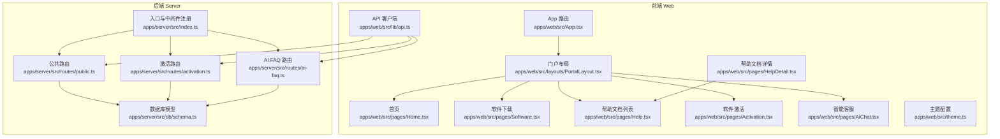
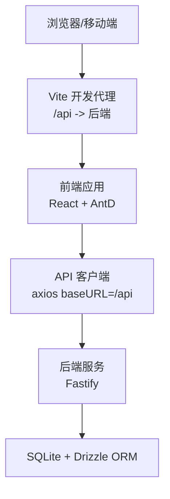
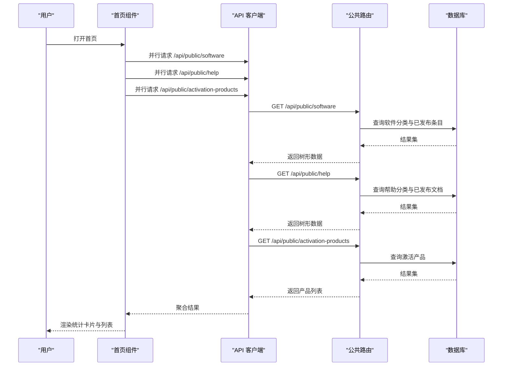
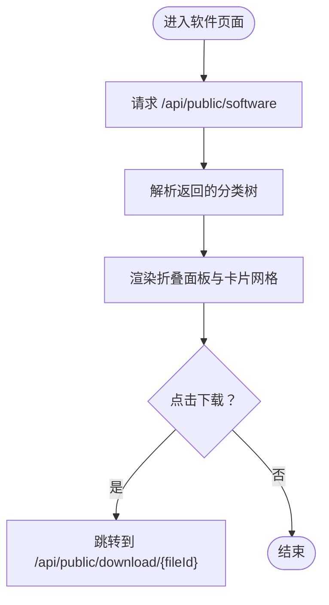
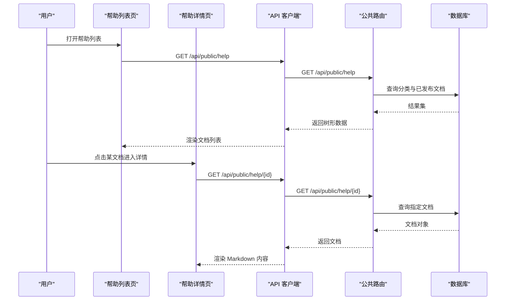
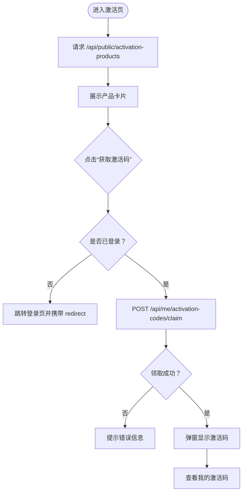
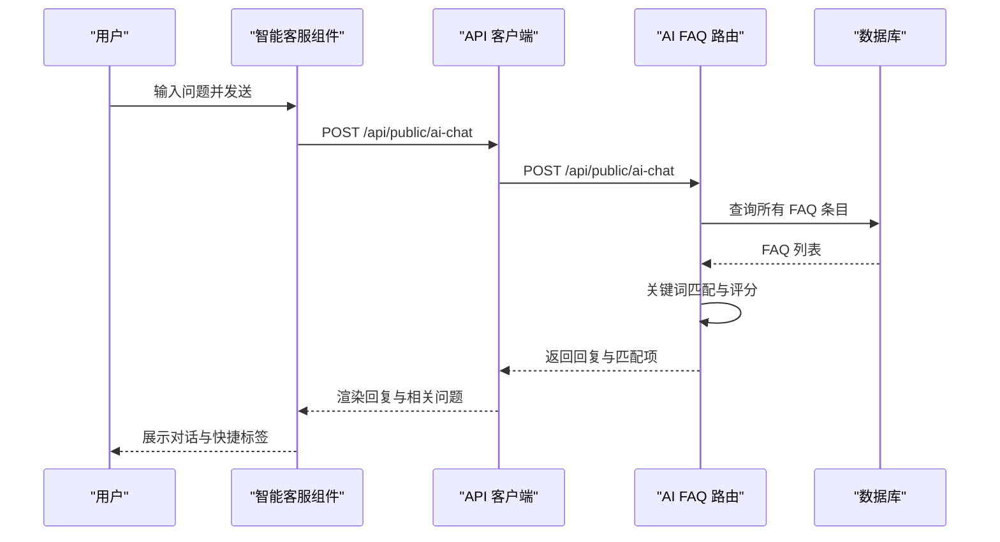
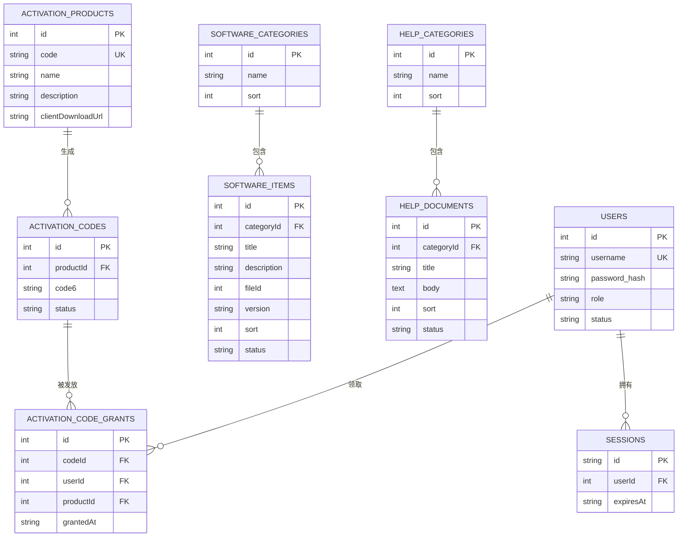
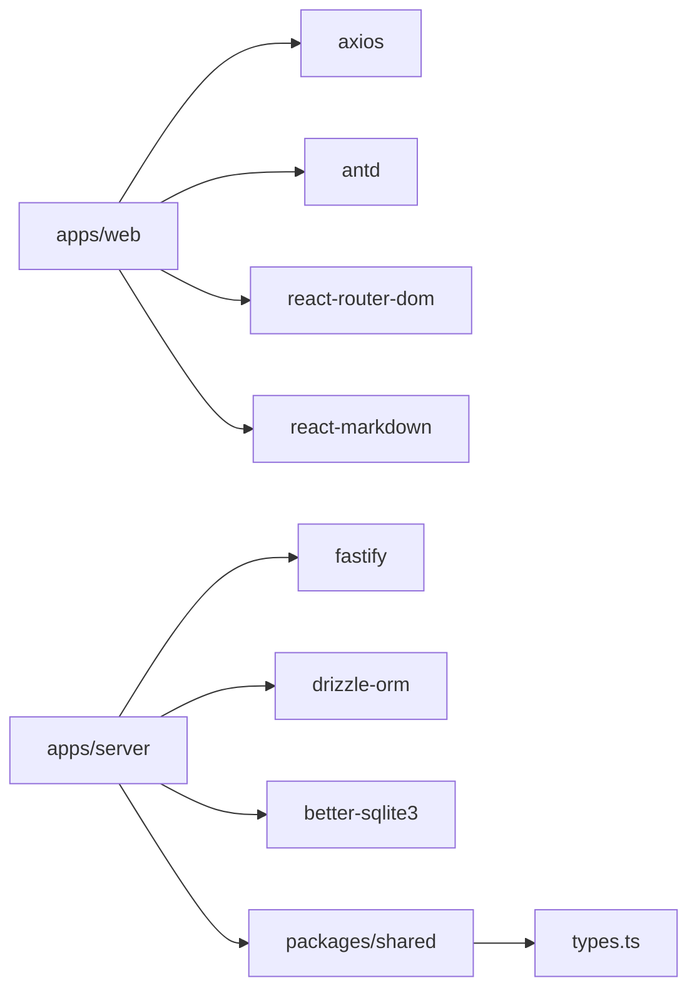

# 门户系统

<cite>
**本文引用的文件**
- [README.md](file://README.md)
- [apps/web/src/App.tsx](file://apps/web/src/App.tsx)
- [apps/web/src/main.tsx](file://apps/web/src/main.tsx)
- [apps/web/src/layouts/PortalLayout.tsx](file://apps/web/src/layouts/PortalLayout.tsx)
- [apps/web/src/pages/Home.tsx](file://apps/web/src/pages/Home.tsx)
- [apps/web/src/pages/Software.tsx](file://apps/web/src/pages/Software.tsx)
- [apps/web/src/pages/Help.tsx](file://apps/web/src/pages/Help.tsx)
- [apps/web/src/pages/HelpDetail.tsx](file://apps/web/src/pages/HelpDetail.tsx)
- [apps/web/src/pages/Activation.tsx](file://apps/web/src/pages/Activation.tsx)
- [apps/web/src/pages/AiChat.tsx](file://apps/web/src/pages/AiChat.tsx)
- [apps/web/src/lib/api.ts](file://apps/web/src/lib/api.ts)
- [apps/web/src/theme.ts](file://apps/web/src/theme.ts)
- [apps/server/src/index.ts](file://apps/server/src/index.ts)
- [apps/server/src/routes/public.ts](file://apps/server/src/routes/public.ts)
- [apps/server/src/routes/activation.ts](file://apps/server/src/routes/activation.ts)
- [apps/server/src/routes/ai-faq.ts](file://apps/server/src/routes/ai-faq.ts)
- [apps/server/src/db/schema.ts](file://apps/server/src/db/schema.ts)
- [packages/shared/src/types.ts](file://packages/shared/src/types.ts)
</cite>

## 目录
1. [简介](#简介)
2. [项目结构](#项目结构)
3. [核心组件](#核心组件)
4. [架构总览](#架构总览)
5. [详细组件分析](#详细组件分析)
6. [依赖关系分析](#依赖关系分析)
7. [性能考虑](#性能考虑)
8. [故障排查指南](#故障排查指南)
9. [结论](#结论)
10. [附录](#附录)

## 简介
本文件为 ZBH2 门户系统的功能文档，面向匿名用户与管理员两类角色，覆盖以下匿名可见功能模块：
- 首页概览：聚合统计、热门软件、最新文档
- 软件下载：按分类浏览已发布的正版软件，支持直接下载
- 帮助文档：按分类浏览帮助文档（Markdown 渲染）
- AI 智能客服：问答匹配与常见问题引导

同时，文档详细说明软件分类与搜索能力、帮助文档系统架构（分类与 Markdown 渲染）、软件激活流程（从激活产品查看到激活码获取）、AI 智能客服的集成与交互模式，并给出用户界面设计原则、响应式布局与用户体验优化建议，以及与后端服务的通信机制与错误处理策略。

## 项目结构
- 前端（React + Vite）位于 apps/web，采用 Ant Design 5 与响应式布局，通过 axios 发起 /api 前缀请求并与后端交互。
- 后端（Fastify）位于 apps/server，提供公共接口与鉴权中间件，数据持久化使用 SQLite + Drizzle ORM。
- 共享包 packages/shared 提供前后端共用的类型与校验模型。

**图表来源**
- [apps/web/src/App.tsx:1-80](file://apps/web/src/App.tsx#L1-L80)
- [apps/web/src/layouts/PortalLayout.tsx:1-76](file://apps/web/src/layouts/PortalLayout.tsx#L1-L76)
- [apps/web/src/pages/Home.tsx:1-165](file://apps/web/src/pages/Home.tsx#L1-L165)
- [apps/web/src/pages/Software.tsx:1-71](file://apps/web/src/pages/Software.tsx#L1-L71)
- [apps/web/src/pages/Help.tsx:1-61](file://apps/web/src/pages/Help.tsx#L1-L61)
- [apps/web/src/pages/HelpDetail.tsx:1-38](file://apps/web/src/pages/HelpDetail.tsx#L1-L38)
- [apps/web/src/pages/Activation.tsx:1-98](file://apps/web/src/pages/Activation.tsx#L1-L98)
- [apps/web/src/pages/AiChat.tsx:1-116](file://apps/web/src/pages/AiChat.tsx#L1-L116)
- [apps/web/src/lib/api.ts:1-16](file://apps/web/src/lib/api.ts#L1-L16)
- [apps/web/src/theme.ts:1-23](file://apps/web/src/theme.ts#L1-L23)
- [apps/server/src/index.ts:1-60](file://apps/server/src/index.ts#L1-L60)
- [apps/server/src/routes/public.ts:1-52](file://apps/server/src/routes/public.ts#L1-L52)
- [apps/server/src/routes/activation.ts:1-95](file://apps/server/src/routes/activation.ts#L1-L95)
- [apps/server/src/routes/ai-faq.ts:1-100](file://apps/server/src/routes/ai-faq.ts#L1-L100)
- [apps/server/src/db/schema.ts:1-330](file://apps/server/src/db/schema.ts#L1-L330)

**章节来源**
- [README.md:47-68](file://README.md#L47-L68)
- [apps/web/src/main.tsx:1-22](file://apps/web/src/main.tsx#L1-L22)

## 核心组件
- 门户布局与导航：提供顶部导航菜单、登录/登出与管理入口，支持响应式布局与图标菜单项。
- 首页概览：并行拉取软件、帮助、激活产品统计数据，展示热门软件与最新文档列表。
- 软件下载：按分类折叠展示软件条目，支持版本标签与下载按钮。
- 帮助文档：按分类折叠展示文档列表，详情页使用 ReactMarkdown 渲染 Markdown 内容。
- 软件激活：列出激活产品，登录后可领取 6 位激活码并查看历史领取记录。
- AI 智能客服：支持输入框发送问题、快捷问题标签、滚动到底部、加载态与常见问题推荐。
- API 客户端：统一 baseURL 为 /api，withCredentials 开启跨域 Cookie，拦截器处理 401 行为。
- 主题配置：Ant Design 主题定制，统一配色与组件风格。

**章节来源**
- [apps/web/src/layouts/PortalLayout.tsx:20-76](file://apps/web/src/layouts/PortalLayout.tsx#L20-L76)
- [apps/web/src/pages/Home.tsx:30-165](file://apps/web/src/pages/Home.tsx#L30-L165)
- [apps/web/src/pages/Software.tsx:23-71](file://apps/web/src/pages/Software.tsx#L23-L71)
- [apps/web/src/pages/Help.tsx:21-61](file://apps/web/src/pages/Help.tsx#L21-L61)
- [apps/web/src/pages/HelpDetail.tsx:10-38](file://apps/web/src/pages/HelpDetail.tsx#L10-L38)
- [apps/web/src/pages/Activation.tsx:24-98](file://apps/web/src/pages/Activation.tsx#L24-L98)
- [apps/web/src/pages/AiChat.tsx:23-116](file://apps/web/src/pages/AiChat.tsx#L23-L116)
- [apps/web/src/lib/api.ts:1-16](file://apps/web/src/lib/api.ts#L1-L16)
- [apps/web/src/theme.ts:1-23](file://apps/web/src/theme.ts#L1-L23)

## 架构总览
系统采用前后端分离架构，前端通过 /api 前缀调用后端接口，后端基于 Fastify 注册路由与中间件，使用 Drizzle ORM 访问 SQLite 数据库。公共接口无需登录即可访问，部分激活与 AI 路由受鉴权保护。

**图表来源**
- [apps/web/src/lib/api.ts:1-16](file://apps/web/src/lib/api.ts#L1-L16)
- [apps/server/src/index.ts:27-54](file://apps/server/src/index.ts#L27-L54)

**章节来源**
- [apps/server/src/index.ts:1-60](file://apps/server/src/index.ts#L1-L60)

## 详细组件分析

### 首页概览（Home）
- 功能要点
  - 并行请求：软件分类树、帮助分类树、激活产品列表
  - 统计卡片：统计正版软件数量、帮助文档数量、激活服务数量
  - 热门软件：平铺展示若干软件条目，带版本标签与下载链接
  - 最新文档：点击跳转到文档详情
- 性能与体验
  - 使用 Spin 显示加载态
  - 列表项点击跳转至对应页面，提升导航效率

**图表来源**
- [apps/web/src/pages/Home.tsx:37-57](file://apps/web/src/pages/Home.tsx#L37-L57)
- [apps/server/src/routes/public.ts:7-15](file://apps/server/src/routes/public.ts#L7-L15)
- [apps/server/src/routes/public.ts:26-35](file://apps/server/src/routes/public.ts#L26-L35)
- [apps/server/src/routes/public.ts:46-50](file://apps/server/src/routes/public.ts#L46-L50)

**章节来源**
- [apps/web/src/pages/Home.tsx:30-165](file://apps/web/src/pages/Home.tsx#L30-L165)
- [apps/server/src/routes/public.ts:1-52](file://apps/server/src/routes/public.ts#L1-L52)

### 软件下载（Software）
- 功能要点
  - 按分类折叠展示软件条目
  - 支持版本标签与描述
  - 下载按钮直链到后端文件下载接口
- 数据结构
  - 分类实体包含 items 数组
  - 条目包含标题、描述、版本、文件 ID

**图表来源**
- [apps/web/src/pages/Software.tsx:23-71](file://apps/web/src/pages/Software.tsx#L23-L71)
- [apps/server/src/routes/public.ts:7-15](file://apps/server/src/routes/public.ts#L7-L15)

**章节来源**
- [apps/web/src/pages/Software.tsx:1-71](file://apps/web/src/pages/Software.tsx#L1-L71)
- [apps/server/src/routes/public.ts:1-52](file://apps/server/src/routes/public.ts#L1-L52)

### 帮助文档（Help 与 HelpDetail）
- 功能要点
  - 列表页：按分类折叠展示文档标题
  - 详情页：使用 ReactMarkdown 渲染 Markdown 内容
- 数据结构
  - 分类实体包含 documents 数组
  - 文档包含标题、正文、状态等

**图表来源**
- [apps/web/src/pages/Help.tsx:21-61](file://apps/web/src/pages/Help.tsx#L21-L61)
- [apps/web/src/pages/HelpDetail.tsx:10-38](file://apps/web/src/pages/HelpDetail.tsx#L10-L38)
- [apps/server/src/routes/public.ts:26-44](file://apps/server/src/routes/public.ts#L26-L44)

**章节来源**
- [apps/web/src/pages/Help.tsx:1-61](file://apps/web/src/pages/Help.tsx#L1-L61)
- [apps/web/src/pages/HelpDetail.tsx:1-38](file://apps/web/src/pages/HelpDetail.tsx#L1-L38)
- [apps/server/src/routes/public.ts:1-52](file://apps/server/src/routes/public.ts#L1-L52)

### 软件激活（Activation）
- 功能要点
  - 展示激活产品（图标、名称、描述、客户端下载地址）
  - 登录后可领取 6 位激活码，重复领取返回已领取状态
  - 弹窗显示激活码，支持查看历史领取记录
- 流程图

**图表来源**
- [apps/web/src/pages/Activation.tsx:24-98](file://apps/web/src/pages/Activation.tsx#L24-L98)
- [apps/server/src/routes/activation.ts:8-75](file://apps/server/src/routes/activation.ts#L8-L75)

**章节来源**
- [apps/web/src/pages/Activation.tsx:1-98](file://apps/web/src/pages/Activation.tsx#L1-L98)
- [apps/server/src/routes/activation.ts:1-95](file://apps/server/src/routes/activation.ts#L1-L95)

### AI 智能客服（AiChat）
- 功能要点
  - 输入框发送消息，支持回车发送
  - 快捷问题标签一键提问
  - 服务端基于 FAQ 关键词进行相似度评分匹配，返回最佳答案与相关问题
  - 滚动到底部，加载态提示
- 交互序列

**图表来源**
- [apps/web/src/pages/AiChat.tsx:23-116](file://apps/web/src/pages/AiChat.tsx#L23-L116)
- [apps/server/src/routes/ai-faq.ts:42-98](file://apps/server/src/routes/ai-faq.ts#L42-L98)

**章节来源**
- [apps/web/src/pages/AiChat.tsx:1-116](file://apps/web/src/pages/AiChat.tsx#L1-L116)
- [apps/server/src/routes/ai-faq.ts:1-100](file://apps/server/src/routes/ai-faq.ts#L1-L100)

### 数据模型与关系
- 关键实体
  - 软件分类与软件条目：一对多关系，条目有发布状态
  - 帮助分类与帮助文档：一对多关系，文档有发布/归档状态
  - 激活产品、激活码、激活码发放记录：产品与码一对多，码与发放记录一对一
  - 用户与会话：用户可有多个会话
- 关系图

**图表来源**
- [apps/server/src/db/schema.ts:3-330](file://apps/server/src/db/schema.ts#L3-L330)

**章节来源**
- [apps/server/src/db/schema.ts:1-330](file://apps/server/src/db/schema.ts#L1-L330)

## 依赖关系分析
- 前端依赖
  - React、React Router、Ant Design、Axios、React Markdown
  - 通过 Vite 开发服务器代理 /api 到后端
- 后端依赖
  - Fastify、@fastify/cookie、@fastify/cors、@fastify/helmet、@fastify/multipart、@fastify/rate-limit、@fastify/static
  - Drizzle ORM + better-sqlite3
- 共享类型
  - UserRole、ContentStatus、ActivationCodeStatus、ApiResponse、分页响应等

**图表来源**
- [apps/web/package.json:11-20](file://apps/web/package.json#L11-L20)
- [apps/server/package.json:14-27](file://apps/server/package.json#L14-L27)
- [packages/shared/src/types.ts:1-18](file://packages/shared/src/types.ts#L1-L18)

**章节来源**
- [apps/web/package.json:1-29](file://apps/web/package.json#L1-L29)
- [apps/server/package.json:1-37](file://apps/server/package.json#L1-L37)
- [packages/shared/src/types.ts:1-18](file://packages/shared/src/types.ts#L1-L18)

## 性能考虑
- 前端
  - 首页并行请求减少等待时间
  - 列表懒加载与折叠面板降低初始渲染压力
  - Markdown 渲染在详情页按需触发
- 后端
  - 速率限制与 CORS 配置保障安全与稳定性
  - 文件静态服务直接暴露上传目录，避免额外拷贝
- 数据库
  - 使用 Drizzle ORM 进行高效查询与连接复用

[本节为通用性能建议，不直接分析具体文件]

## 故障排查指南
- 401 未授权
  - 前端 axios 拦截器对 401 不做自动重定向（仅非登录页），确保登录后再操作受保护资源
- 激活码领取失败
  - 检查用户是否登录、产品是否存在、是否仍有可用激活码
  - 若已存在有效发放记录，将返回已领取状态
- 帮助文档 404
  - 文档需处于已发布状态且存在
- AI 客服无匹配
  - 适当调整关键词或查看相关问题列表

**章节来源**
- [apps/web/src/lib/api.ts:5-13](file://apps/web/src/lib/api.ts#L5-L13)
- [apps/server/src/routes/activation.ts:8-75](file://apps/server/src/routes/activation.ts#L8-L75)
- [apps/server/src/routes/public.ts:17-24](file://apps/server/src/routes/public.ts#L17-L24)
- [apps/server/src/routes/public.ts:37-44](file://apps/server/src/routes/public.ts#L37-L44)
- [apps/server/src/routes/ai-faq.ts:42-98](file://apps/server/src/routes/ai-faq.ts#L42-L98)

## 结论
本门户系统以清晰的前后端分层与简洁的数据模型支撑匿名用户的核心功能：软件下载、帮助文档浏览与 AI 智能客服。通过分类与发布状态控制内容可见性，结合响应式 UI 与主题定制，提供良好的用户体验。激活流程在鉴权保护下实现幂等领取与历史记录追踪，满足正版化管理需求。

## 附录

### 匿名用户可见功能清单
- 首页概览：统计、热门软件、最新文档
- 软件下载：按分类浏览与下载
- 帮助文档：按分类浏览与 Markdown 渲染
- AI 智能客服：问答与常见问题引导

**章节来源**
- [README.md:70-86](file://README.md#L70-L86)

### 管理员后台功能（参考）
- 软件分类与条目管理、发布状态
- 帮助文档分类与文档生命周期管理
- 激活产品与激活码管理
- 用户与工单、资产、SaaS、监控、报表、审计日志等

**章节来源**
- [README.md:79-86](file://README.md#L79-L86)

### 用户界面设计原则与响应式布局
- 设计原则
  - 一致性：统一图标、颜色与字体
  - 可用性：清晰的导航、明确的操作反馈
  - 可访问性：足够的对比度与键盘导航支持
- 响应式布局
  - 使用 Ant Design 的栅格与卡片组件，适配不同屏幕尺寸
  - 列表与卡片在小屏设备上自动换行与缩放

**章节来源**
- [apps/web/src/theme.ts:1-23](file://apps/web/src/theme.ts#L1-L23)
- [apps/web/src/pages/Home.tsx:68-161](file://apps/web/src/pages/Home.tsx#L68-L161)
- [apps/web/src/pages/Software.tsx:34-70](file://apps/web/src/pages/Software.tsx#L34-L70)
- [apps/web/src/pages/Help.tsx:29-60](file://apps/web/src/pages/Help.tsx#L29-L60)

### 与后端服务通信机制与错误处理
- 通信机制
  - 前端 axios baseURL 设置为 /api，自动携带 Cookie
  - 后端注册 CORS、Cookie、限流与静态文件服务
- 错误处理
  - 401：拦截器不强制重定向，由页面逻辑处理登录态
  - 404/409：根据业务场景返回明确错误信息

**章节来源**
- [apps/web/src/lib/api.ts:1-16](file://apps/web/src/lib/api.ts#L1-L16)
- [apps/server/src/index.ts:27-54](file://apps/server/src/index.ts#L27-L54)

### API 调用示例（路径）
- 获取软件分类树
  - 方法：GET
  - 路径：/api/public/software
  - 来源：[apps/server/src/routes/public.ts:7-15](file://apps/server/src/routes/public.ts#L7-L15)
- 获取帮助分类树
  - 方法：GET
  - 路径：/api/public/help
  - 来源：[apps/server/src/routes/public.ts:26-35](file://apps/server/src/routes/public.ts#L26-L35)
- 获取帮助文档详情
  - 方法：GET
  - 路径：/api/public/help/{id}
  - 来源：[apps/server/src/routes/public.ts:37-44](file://apps/server/src/routes/public.ts#L37-L44)
- 获取激活产品列表
  - 方法：GET
  - 路径：/api/public/activation-products
  - 来源：[apps/server/src/routes/public.ts:46-50](file://apps/server/src/routes/public.ts#L46-L50)
- 领取激活码
  - 方法：POST
  - 路径：/api/me/activation-codes/claim
  - 负载：{ productId }
  - 来源：[apps/server/src/routes/activation.ts:8-75](file://apps/server/src/routes/activation.ts#L8-L75)
- 获取我的激活码历史
  - 方法：GET
  - 路径：/api/me/activation-codes
  - 来源：[apps/server/src/routes/activation.ts:77-94](file://apps/server/src/routes/activation.ts#L77-L94)
- AI 问答
  - 方法：POST
  - 路径：/api/public/ai-chat
  - 负载：{ message }
  - 来源：[apps/server/src/routes/ai-faq.ts:42-98](file://apps/server/src/routes/ai-faq.ts#L42-L98)