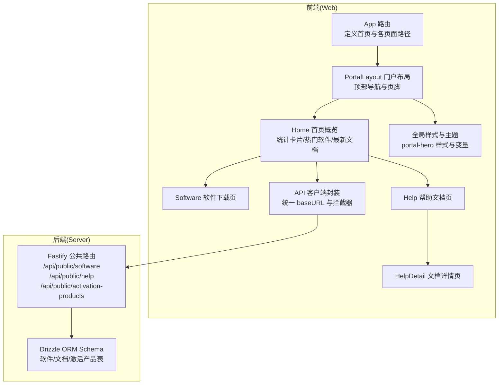
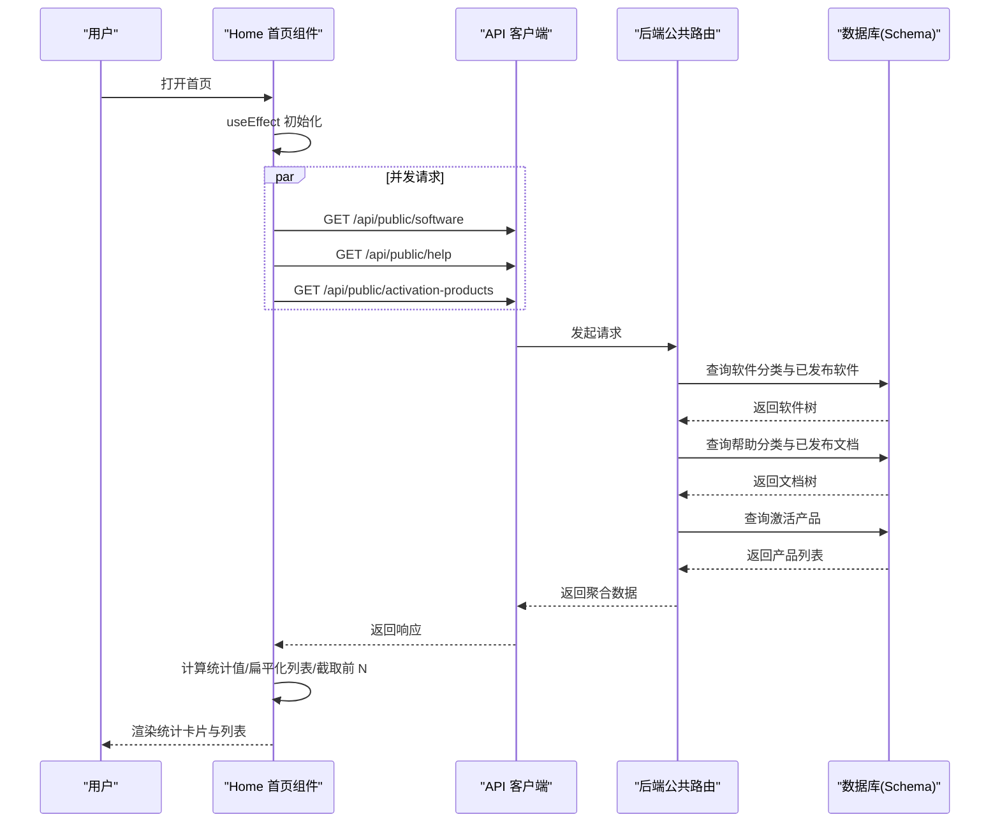
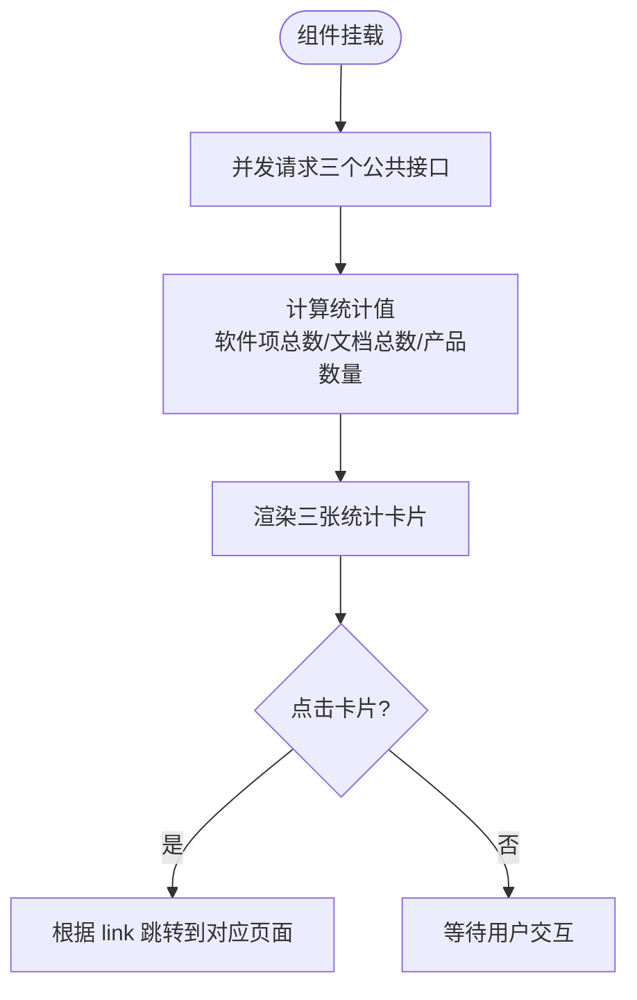
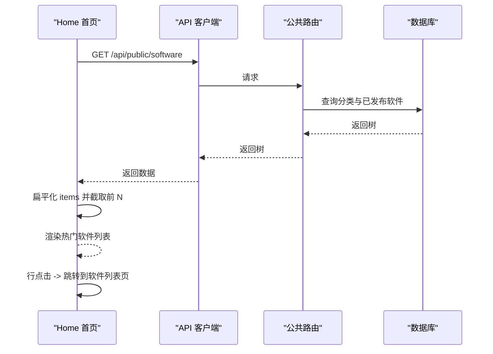
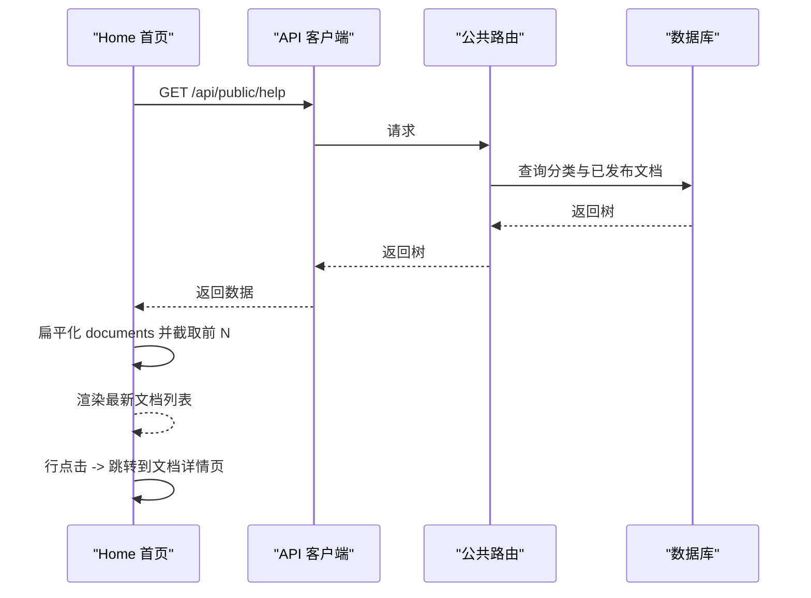
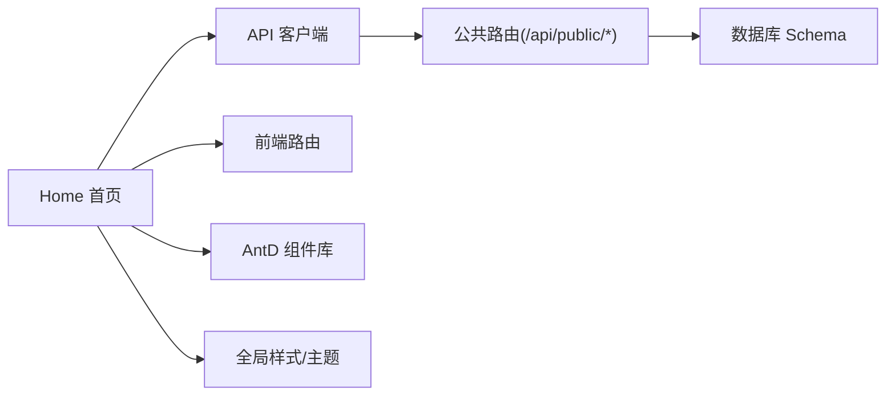

# 首页概览

<cite>
**本文引用的文件**
- [apps/web/src/pages/Home.tsx](file://apps/web/src/pages/Home.tsx)
- [apps/web/src/lib/api.ts](file://apps/web/src/lib/api.ts)
- [apps/server/src/routes/public.ts](file://apps/server/src/routes/public.ts)
- [apps/server/src/db/schema.ts](file://apps/server/src/db/schema.ts)
- [apps/web/src/App.tsx](file://apps/web/src/App.tsx)
- [apps/web/src/global.css](file://apps/web/src/global.css)
- [apps/web/src/pages/Software.tsx](file://apps/web/src/pages/Software.tsx)
- [apps/web/src/pages/Help.tsx](file://apps/web/src/pages/Help.tsx)
- [apps/web/src/pages/HelpDetail.tsx](file://apps/web/src/pages/HelpDetail.tsx)
- [apps/web/src/layouts/PortalLayout.tsx](file://apps/web/src/layouts/PortalLayout.tsx)
- [apps/web/src/theme.ts](file://apps/web/src/theme.ts)
</cite>

## 目录
1. [简介](#简介)
2. [项目结构](#项目结构)
3. [核心组件](#核心组件)
4. [架构总览](#架构总览)
5. [详细组件分析](#详细组件分析)
6. [依赖关系分析](#依赖关系分析)
7. [性能考虑](#性能考虑)
8. [故障排查指南](#故障排查指南)
9. [结论](#结论)
10. [附录：API 调用示例与响应式布局](#附录api-调用示例与响应式布局)

## 简介
本文件面向 ZBH2 的“首页概览”功能，系统性说明前端首页的整体布局设计、统计卡片展示（正版软件数量、帮助文档数量、激活服务数量）、英雄区域标题与副标题设计；并深入解析热门软件列表与最新文档列表的数据获取、状态管理与用户交互机制；最后给出统计卡片的点击跳转逻辑、颜色主题设计、API 调用示例以及响应式布局与用户体验优化策略。

## 项目结构
首页概览位于 Web 前端应用中，采用 React + Ant Design 构建，并通过 Axios 封装的 API 客户端访问后端公共接口。路由由前端路由统一管理，首页作为门户入口，承载统计卡片、热门软件与最新文档三大模块。

图表来源
- [apps/web/src/App.tsx:38-79](file://apps/web/src/App.tsx#L38-L79)
- [apps/web/src/layouts/PortalLayout.tsx:20-75](file://apps/web/src/layouts/PortalLayout.tsx#L20-L75)
- [apps/web/src/pages/Home.tsx:30-164](file://apps/web/src/pages/Home.tsx#L30-L164)
- [apps/web/src/lib/api.ts:1-16](file://apps/web/src/lib/api.ts#L1-L16)
- [apps/server/src/routes/public.ts:5-51](file://apps/server/src/routes/public.ts#L5-L51)
- [apps/server/src/db/schema.ts:19-79](file://apps/server/src/db/schema.ts#L19-L79)
- [apps/web/src/global.css:19-34](file://apps/web/src/global.css#L19-L34)

章节来源
- [apps/web/src/App.tsx:38-79](file://apps/web/src/App.tsx#L38-L79)
- [apps/web/src/layouts/PortalLayout.tsx:20-75](file://apps/web/src/layouts/PortalLayout.tsx#L20-L75)
- [apps/web/src/pages/Home.tsx:30-164](file://apps/web/src/pages/Home.tsx#L30-L164)
- [apps/web/src/lib/api.ts:1-16](file://apps/web/src/lib/api.ts#L1-L16)
- [apps/server/src/routes/public.ts:5-51](file://apps/server/src/routes/public.ts#L5-L51)
- [apps/server/src/db/schema.ts:19-79](file://apps/server/src/db/schema.ts#L19-L79)
- [apps/web/src/global.css:19-34](file://apps/web/src/global.css#L19-L34)

## 核心组件
- 首页容器组件负责：
  - 并发请求三个公共接口以获取统计信息与数据列表；
  - 计算统计卡片数值（软件项总数、文档总数）；
  - 展示英雄区域标题与副标题；
  - 渲染统计卡片、热门软件列表与最新文档列表；
  - 处理加载态与用户交互（点击跳转）。

- API 客户端：
  - 统一 baseURL 为 /api；
  - 保留凭证（withCredentials），便于会话认证；
  - 响应拦截器对 401 情况进行处理（非公开页面不强制重定向）。

- 全局样式与主题：
  - portal-hero 英雄区域使用渐变背景与居中排版；
  - 使用 CSS 变量统一主色与背景色；
  - Ant Design 主题配置覆盖主色、容器背景与布局组件样式。

章节来源
- [apps/web/src/pages/Home.tsx:30-164](file://apps/web/src/pages/Home.tsx#L30-L164)
- [apps/web/src/lib/api.ts:1-16](file://apps/web/src/lib/api.ts#L1-L16)
- [apps/web/src/global.css:19-34](file://apps/web/src/global.css#L19-L34)
- [apps/web/src/theme.ts:3-20](file://apps/web/src/theme.ts#L3-L20)

## 架构总览
首页概览的数据流从浏览器发起，经由前端 API 客户端，到达后端公共路由，再由 Drizzle ORM 查询数据库，最终返回聚合后的树形数据（分类包含子项或文档）。前端在首页组件中进行二次聚合与切片，渲染统计卡片与列表。

图表来源
- [apps/web/src/pages/Home.tsx:37-57](file://apps/web/src/pages/Home.tsx#L37-L57)
- [apps/web/src/lib/api.ts:3](file://apps/web/src/lib/api.ts#L3)
- [apps/server/src/routes/public.ts:7-14](file://apps/server/src/routes/public.ts#L7-L14)
- [apps/server/src/routes/public.ts:27-34](file://apps/server/src/routes/public.ts#L27-L34)
- [apps/server/src/routes/public.ts:47-50](file://apps/server/src/routes/public.ts#L47-L50)
- [apps/server/src/db/schema.ts:37-49](file://apps/server/src/db/schema.ts#L37-L49)
- [apps/server/src/db/schema.ts:58-69](file://apps/server/src/db/schema.ts#L58-L69)
- [apps/server/src/db/schema.ts:71-79](file://apps/server/src/db/schema.ts#L71-L79)

## 详细组件分析

### 首页整体布局与英雄区域
- 英雄区域包含主标题与副标题，使用 portal-hero 类实现居中、渐变背景与字号配色；
- 页面主体最大宽度约束与内边距控制内容密度；
- 整体采用 Ant Design 的 Card、List、Typography 等组件构建。

章节来源
- [apps/web/src/pages/Home.tsx:61-66](file://apps/web/src/pages/Home.tsx#L61-L66)
- [apps/web/src/global.css:19-34](file://apps/web/src/global.css#L19-L34)

### 统计卡片展示与点击跳转
- 卡片数据结构包含标题、图标、数值、链接与颜色；
- 首页并发请求三个接口，计算正版软件总数（软件分类下已发布软件项之和）、帮助文档总数（帮助分类下已发布文档之和）、激活产品数量；
- 卡片支持悬停与点击跳转，点击卡片进入对应列表页；
- 颜色主题与 Ant Design 主色一致，确保视觉统一。

图表来源
- [apps/web/src/pages/Home.tsx:37-57](file://apps/web/src/pages/Home.tsx#L37-L57)
- [apps/web/src/pages/Home.tsx:70-81](file://apps/web/src/pages/Home.tsx#L70-L81)

章节来源
- [apps/web/src/pages/Home.tsx:9-15](file://apps/web/src/pages/Home.tsx#L9-L15)
- [apps/web/src/pages/Home.tsx:47-51](file://apps/web/src/pages/Home.tsx#L47-L51)
- [apps/web/src/pages/Home.tsx:70-81](file://apps/web/src/pages/Home.tsx#L70-L81)

### 热门软件列表实现机制
- 数据来源：软件分类树的 items 字段；
- 列表渲染：使用 Ant Design List，逐项展示标题、版本标签与简要描述；
- 交互行为：整行可点击跳转至软件列表页；若存在文件则显示下载按钮（外部链接）；
- 数据处理：扁平化所有分类下的软件项，取前若干条展示。

图表来源
- [apps/web/src/pages/Home.tsx:52-56](file://apps/web/src/pages/Home.tsx#L52-L56)
- [apps/web/src/pages/Home.tsx:90-133](file://apps/web/src/pages/Home.tsx#L90-L133)
- [apps/web/src/pages/Software.tsx:23-31](file://apps/web/src/pages/Software.tsx#L23-L31)
- [apps/server/src/routes/public.ts:7-14](file://apps/server/src/routes/public.ts#L7-L14)
- [apps/server/src/db/schema.ts:37-49](file://apps/server/src/db/schema.ts#L37-L49)

章节来源
- [apps/web/src/pages/Home.tsx:52-56](file://apps/web/src/pages/Home.tsx#L52-L56)
- [apps/web/src/pages/Home.tsx:90-133](file://apps/web/src/pages/Home.tsx#L90-L133)
- [apps/web/src/pages/Software.tsx:23-31](file://apps/web/src/pages/Software.tsx#L23-L31)

### 最新文档列表实现机制
- 数据来源：帮助分类树的 documents 字段；
- 列表渲染：使用 Ant Design List，逐项展示文档标题；
- 交互行为：整行可点击跳转到文档详情页；
- 数据处理：扁平化所有分类下的文档，取前若干条展示。

图表来源
- [apps/web/src/pages/Home.tsx:54-56](file://apps/web/src/pages/Home.tsx#L54-L56)
- [apps/web/src/pages/Home.tsx:143-156](file://apps/web/src/pages/Home.tsx#L143-L156)
- [apps/web/src/pages/Help.tsx:21-27](file://apps/web/src/pages/Help.tsx#L21-L27)
- [apps/web/src/pages/HelpDetail.tsx:10-18](file://apps/web/src/pages/HelpDetail.tsx#L10-L18)
- [apps/server/src/routes/public.ts:27-34](file://apps/server/src/routes/public.ts#L27-L34)
- [apps/server/src/db/schema.ts:58-69](file://apps/server/src/db/schema.ts#L58-L69)

章节来源
- [apps/web/src/pages/Home.tsx:54-56](file://apps/web/src/pages/Home.tsx#L54-L56)
- [apps/web/src/pages/Home.tsx:143-156](file://apps/web/src/pages/Home.tsx#L143-L156)
- [apps/web/src/pages/Help.tsx:21-27](file://apps/web/src/pages/Help.tsx#L21-L27)
- [apps/web/src/pages/HelpDetail.tsx:10-18](file://apps/web/src/pages/HelpDetail.tsx#L10-L18)

### 颜色主题与视觉一致性
- 主色来自 Ant Design 主题配置与 CSS 变量，保证全局一致；
- 统计卡片使用独立色彩标识不同业务域；
- 英雄区域使用渐变背景，突出品牌与标题层级。

章节来源
- [apps/web/src/theme.ts:3-20](file://apps/web/src/theme.ts#L3-L20)
- [apps/web/src/global.css:1-6](file://apps/web/src/global.css#L1-L6)
- [apps/web/src/pages/Home.tsx:73](file://apps/web/src/pages/Home.tsx#L73)

## 依赖关系分析
- 首页组件依赖：
  - API 客户端：统一请求后端公共接口；
  - 路由：提供跳转能力（软件列表、帮助列表、激活页等）；
  - Ant Design 组件：Card、List、Typography、Button、Spin 等；
  - 全局样式与主题：portal-hero、CSS 变量与 AntD 主题。

- 后端依赖：
  - 公共路由：提供软件、帮助、激活产品的只读接口；
  - Drizzle ORM：基于 SQLite 的 schema 定义与查询。

图表来源
- [apps/web/src/pages/Home.tsx:30-164](file://apps/web/src/pages/Home.tsx#L30-L164)
- [apps/web/src/lib/api.ts:1-16](file://apps/web/src/lib/api.ts#L1-L16)
- [apps/web/src/App.tsx:38-79](file://apps/web/src/App.tsx#L38-L79)
- [apps/server/src/routes/public.ts:5-51](file://apps/server/src/routes/public.ts#L5-L51)
- [apps/server/src/db/schema.ts:19-79](file://apps/server/src/db/schema.ts#L19-L79)

章节来源
- [apps/web/src/pages/Home.tsx:30-164](file://apps/web/src/pages/Home.tsx#L30-L164)
- [apps/web/src/lib/api.ts:1-16](file://apps/web/src/lib/api.ts#L1-L16)
- [apps/web/src/App.tsx:38-79](file://apps/web/src/App.tsx#L38-L79)
- [apps/server/src/routes/public.ts:5-51](file://apps/server/src/routes/public.ts#L5-L51)
- [apps/server/src/db/schema.ts:19-79](file://apps/server/src/db/schema.ts#L19-L79)

## 性能考虑
- 并发请求：首页初始化时对三个接口使用并发请求，减少首屏等待时间；
- 数据裁剪：热门软件与最新文档仅取前若干条，降低 DOM 与渲染压力；
- 加载指示：使用 Spin 包裹，避免空白闪烁；
- 列表交互：列表项点击跳转使用轻量级事件，避免不必要的状态更新；
- 样式优化：使用 CSS 变量与 AntD 主题，减少重复样式与重绘。

[本节为通用性能建议，无需特定文件引用]

## 故障排查指南
- 接口 401 未登录：
  - API 客户端对 401 响应不做自动重定向（非公开页面），需检查登录状态与凭证传递；
- 文档/软件不存在：
  - 后端对未发布的条目返回 404，前端应提示或引导用户选择其他内容；
- 下载链接无效：
  - 确认软件项是否绑定文件 ID，且后端下载接口可用；
- 列表为空：
  - 检查数据库中是否存在已发布条目，或分类是否正确关联。

章节来源
- [apps/web/src/lib/api.ts:5-13](file://apps/web/src/lib/api.ts#L5-L13)
- [apps/server/src/routes/public.ts:17-24](file://apps/server/src/routes/public.ts#L17-L24)
- [apps/server/src/routes/public.ts:37-44](file://apps/server/src/routes/public.ts#L37-L44)

## 结论
首页概览通过简洁的统计卡片与精选列表，向用户快速传达平台核心能力：正版软件、帮助文档与激活服务。其设计遵循响应式与无障碍原则，结合 AntD 主题与全局样式，形成统一的视觉语言。数据层采用公共路由与树形结构，前端进行必要的聚合与切片，既保证了性能也提升了可维护性。

[本节为总结性内容，无需特定文件引用]

## 附录：API 调用示例与响应式布局

### API 调用示例
以下为获取首页所需数据的公共接口说明（请求均通过 /api 前缀）：

- 获取软件分类与已发布软件
  - 方法与路径：GET /api/public/software
  - 返回结构：包含软件分类数组，每个分类包含 items 子数组（已发布软件）
  - 用途：计算正版软件总数、生成热门软件列表
  - 参考实现位置：
    - [apps/server/src/routes/public.ts:7-14](file://apps/server/src/routes/public.ts#L7-L14)
    - [apps/server/src/db/schema.ts:37-49](file://apps/server/src/db/schema.ts#L37-L49)

- 获取帮助分类与已发布文档
  - 方法与路径：GET /api/public/help
  - 返回结构：包含帮助分类数组，每个分类包含 documents 子数组（已发布文档）
  - 用途：生成最新文档列表
  - 参考实现位置：
    - [apps/server/src/routes/public.ts:27-34](file://apps/server/src/routes/public.ts#L27-L34)
    - [apps/server/src/db/schema.ts:58-69](file://apps/server/src/db/schema.ts#L58-L69)

- 获取激活产品（公共列表）
  - 方法与路径：GET /api/public/activation-products
  - 返回结构：激活产品数组
  - 用途：计算激活服务数量
  - 参考实现位置：
    - [apps/server/src/routes/public.ts:47-50](file://apps/server/src/routes/public.ts#L47-L50)
    - [apps/server/src/db/schema.ts:71-79](file://apps/server/src/db/schema.ts#L71-L79)

- 获取单个软件详情（用于详情页）
  - 方法与路径：GET /api/public/software/:id
  - 返回结构：单个软件项对象
  - 参考实现位置：
    - [apps/server/src/routes/public.ts:17-24](file://apps/server/src/routes/public.ts#L17-L24)

- 获取单个帮助文档（用于详情页）
  - 方法与路径：GET /api/public/help/:id
  - 返回结构：单个文档对象
  - 参考实现位置：
    - [apps/server/src/routes/public.ts:37-44](file://apps/server/src/routes/public.ts#L37-L44)

### 响应式布局实现原理
- 首页统计卡片网格：
  - 使用 Ant Design 的 Row/Col，在小屏 xs=24、中屏 sm=8 的断点下自动换列，保证卡片在不同设备上均匀分布；
  - 卡片容器设置居中与最大宽度，避免超宽屏幕下内容过散；
- 热门软件与最新文档两列布局：
  - 在小屏下堆叠为单列，中屏及以上为左右两栏，提升信息密度与可读性；
- 英雄区域：
  - 使用 portal-hero 实现居中标题与副标题，配合 CSS 变量与字体大小，适配多设备显示；
- AntD 组件：
  - List、Card、Typography 等组件自带响应式属性，结合栅格系统达到一致的跨设备体验。

章节来源
- [apps/web/src/pages/Home.tsx:69-81](file://apps/web/src/pages/Home.tsx#L69-L81)
- [apps/web/src/pages/Home.tsx:83-159](file://apps/web/src/pages/Home.tsx#L83-L159)
- [apps/web/src/global.css:19-34](file://apps/web/src/global.css#L19-L34)