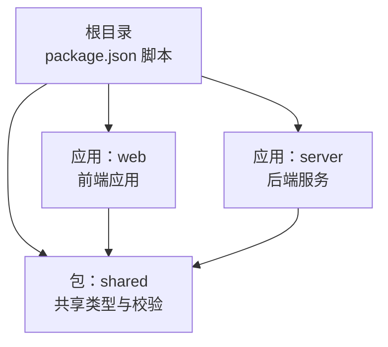
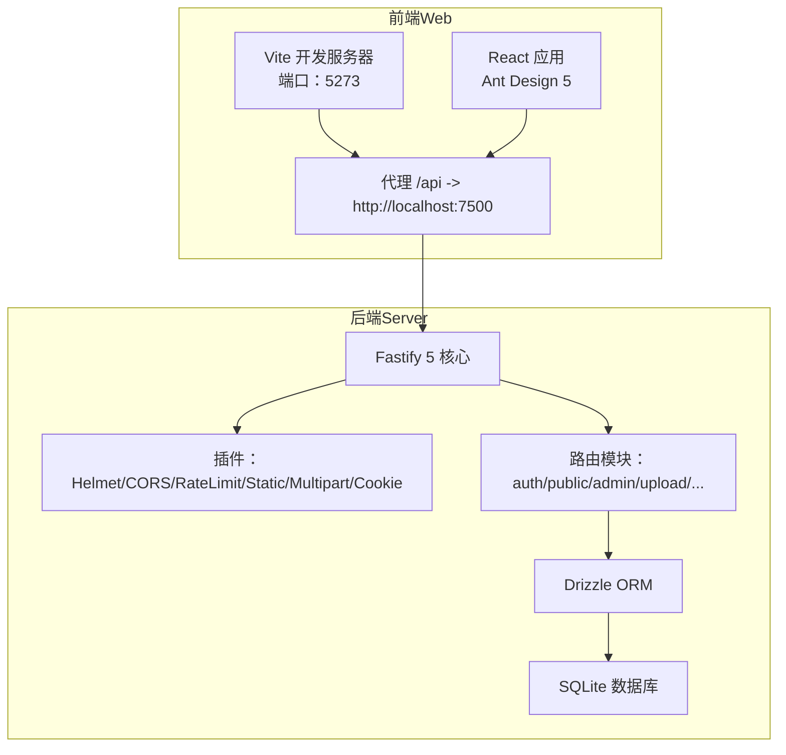
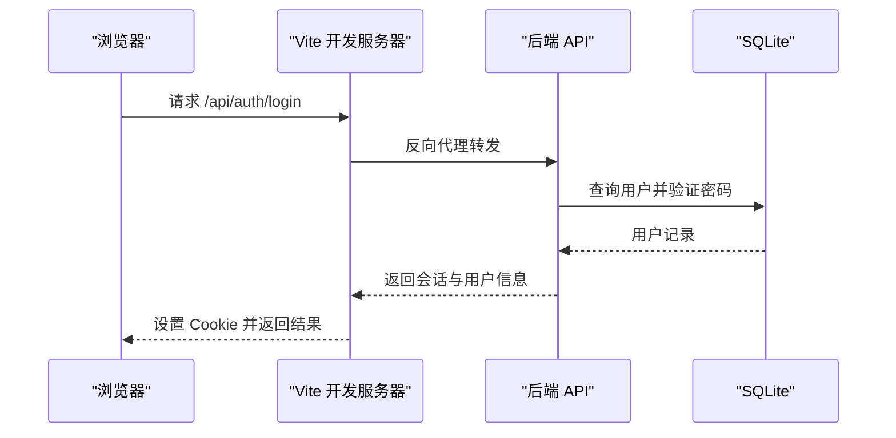
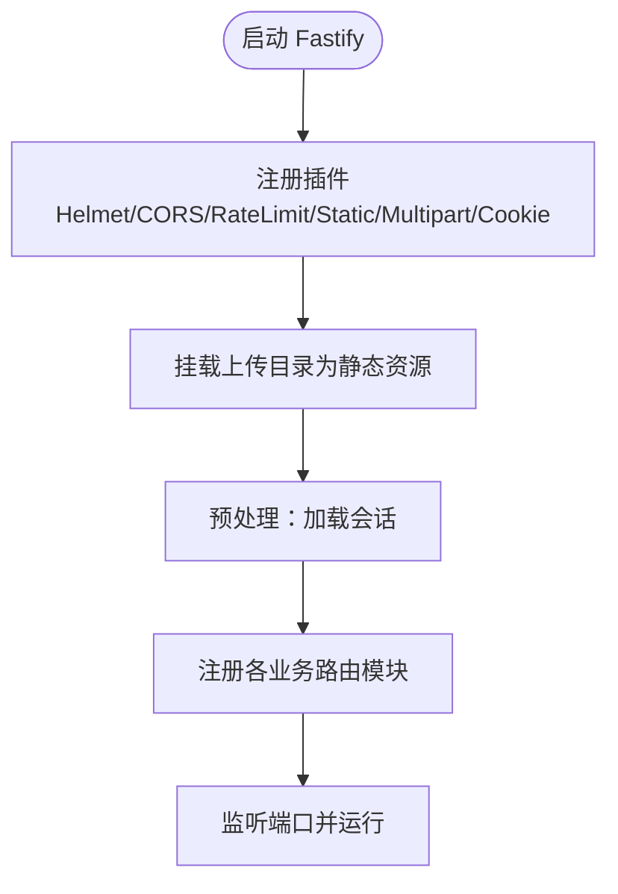
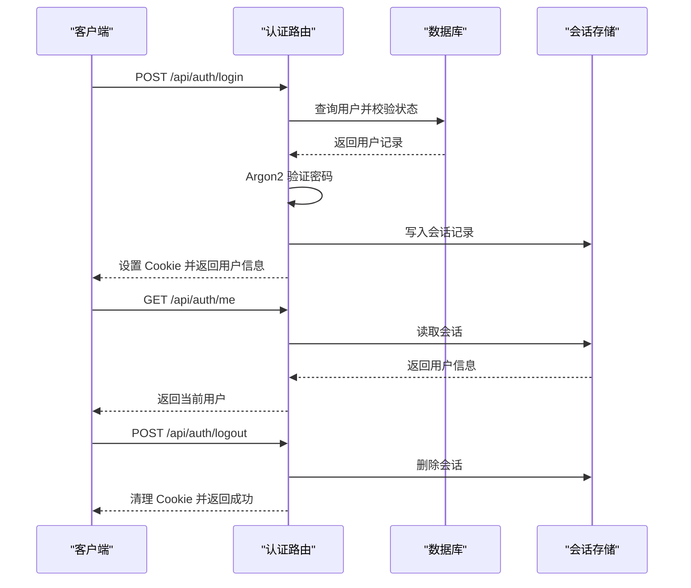
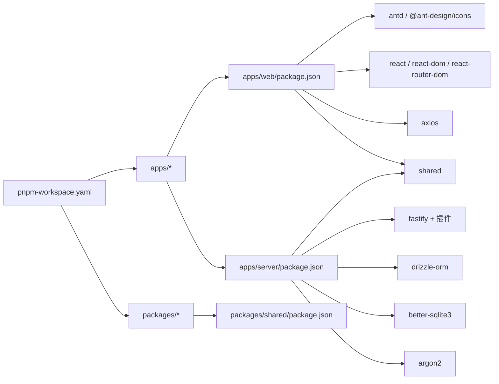

# 技术栈与架构图

<cite>
**本文引用的文件**
- [package.json](file://package.json)
- [pnpm-workspace.yaml](file://pnpm-workspace.yaml)
- [apps/web/package.json](file://apps/web/package.json)
- [apps/server/package.json](file://apps/server/package.json)
- [packages/shared/package.json](file://packages/shared/package.json)
- [apps/web/vite.config.ts](file://apps/web/vite.config.ts)
- [apps/server/src/index.ts](file://apps/server/src/index.ts)
- [apps/web/src/main.tsx](file://apps/web/src/main.tsx)
- [apps/web/src/App.tsx](file://apps/web/src/App.tsx)
- [apps/server/drizzle.config.ts](file://apps/server/drizzle.config.ts)
- [apps/server/src/db/schema.ts](file://apps/server/src/db/schema.ts)
- [apps/server/src/routes/auth.ts](file://apps/server/src/routes/auth.ts)
- [apps/web/src/lib/api.ts](file://apps/web/src/lib/api.ts)
- [apps/web/src/lib/auth.tsx](file://apps/web/src/lib/auth.tsx)
- [apps/web/src/theme.ts](file://apps/web/src/theme.ts)
</cite>

## 目录
1. [引言](#引言)
2. [项目结构](#项目结构)
3. [核心组件](#核心组件)
4. [架构总览](#架构总览)
5. [详细组件分析](#详细组件分析)
6. [依赖分析](#依赖分析)
7. [性能考虑](#性能考虑)
8. [故障排查指南](#故障排查指南)
9. [结论](#结论)
10. [附录](#附录)

## 引言
本文件面向ZBH2平台的技术栈与架构说明，围绕前端（React 18、Ant Design 5、Vite）、后端（Fastify 5、Drizzle ORM）、数据库（SQLite）以及Monorepo（pnpm工作空间）进行系统化梳理，并提供架构图与组件关系图，帮助开发者快速理解整体设计与实现要点。

## 项目结构
ZBH2采用Monorepo架构，使用pnpm工作空间统一管理多包。根目录通过脚本聚合开发与构建流程，子应用与共享包分别位于apps与packages目录下，形成清晰的职责边界与复用机制。

图表来源
- [package.json:1-20](file://package.json#L1-L20)
- [pnpm-workspace.yaml:1-5](file://pnpm-workspace.yaml#L1-L5)
- [apps/web/package.json:1-29](file://apps/web/package.json#L1-L29)
- [apps/server/package.json:1-37](file://apps/server/package.json#L1-L37)
- [packages/shared/package.json:1-24](file://packages/shared/package.json#L1-L24)

章节来源
- [package.json:1-20](file://package.json#L1-L20)
- [pnpm-workspace.yaml:1-5](file://pnpm-workspace.yaml#L1-L5)

## 核心组件
- 前端应用（web）
  - 框架：React 18
  - UI：Ant Design 5
  - 构建：Vite
  - 路由与状态：React Router DOM、Context Provider
  - 全局样式与主题：Ant Design 主题配置
- 后端服务（server）
  - Web框架：Fastify 5
  - 数据库：SQLite（Drizzle ORM + better-sqlite3）
  - 安全与中间件：Helmet、CORS、Cookie、限流、静态资源
  - 文件上传：multipart，最大500MB
  - 认证：Argon2加盐哈希、会话存储于SQLite
- 共享包（shared）
  - 类型与校验：Zod Schema（如登录校验）
  - 复用导出：TypeScript模块化导出

章节来源
- [apps/web/package.json:11-28](file://apps/web/package.json#L11-L28)
- [apps/server/package.json:14-36](file://apps/server/package.json#L14-L36)
- [packages/shared/package.json:17-23](file://packages/shared/package.json#L17-L23)

## 架构总览
系统采用前后端分离架构，前端通过Vite代理访问后端API；后端以Fastify为核心，注册多个插件与路由模块，统一处理认证、权限、文件上传与业务模块。数据库层使用SQLite，配合Drizzle ORM进行Schema定义与迁移。

图表来源
- [apps/web/vite.config.ts:4-12](file://apps/web/vite.config.ts#L4-L12)
- [apps/server/src/index.ts:27-54](file://apps/server/src/index.ts#L27-L54)
- [apps/server/drizzle.config.ts:3-10](file://apps/server/drizzle.config.ts#L3-L10)

章节来源
- [apps/web/vite.config.ts:1-13](file://apps/web/vite.config.ts#L1-L13)
- [apps/server/src/index.ts:1-60](file://apps/server/src/index.ts#L1-L60)

## 详细组件分析

### 前端应用（Web）
- 入口与主题
  - 入口文件初始化路由、国际化、主题与全局样式
  - Ant Design主题通过ConfigProvider注入
- 路由与布局
  - 使用React Router DOM组织页面级路由
  - PortalLayout与AdminLayout承载不同区域的页面集合
- API与认证
  - Axios实例以“/api”为前缀，启用withCredentials
  - 登录/登出/当前用户信息由AuthProvider驱动
- 构建与开发
  - Vite开发服务器默认端口5273，代理到后端7500端口

图表来源
- [apps/web/vite.config.ts:6-11](file://apps/web/vite.config.ts#L6-L11)
- [apps/web/src/lib/api.ts:3-16](file://apps/web/src/lib/api.ts#L3-L16)
- [apps/web/src/lib/auth.tsx:24-45](file://apps/web/src/lib/auth.tsx#L24-L45)
- [apps/server/src/routes/auth.ts:9-33](file://apps/server/src/routes/auth.ts#L9-L33)

章节来源
- [apps/web/src/main.tsx:1-22](file://apps/web/src/main.tsx#L1-L22)
- [apps/web/src/App.tsx:1-80](file://apps/web/src/App.tsx#L1-L80)
- [apps/web/src/theme.ts:1-23](file://apps/web/src/theme.ts#L1-L23)
- [apps/web/src/lib/api.ts:1-16](file://apps/web/src/lib/api.ts#L1-L16)
- [apps/web/src/lib/auth.tsx:1-55](file://apps/web/src/lib/auth.tsx#L1-L55)

### 后端服务（Server）
- 启动与中间件
  - 初始化Fastify，注册安全与网络相关插件
  - 静态资源暴露上传目录，支持文件下载
  - 会话加载中间件在每个请求前执行
- 路由模块
  - 分模块注册认证、公共、管理员、上传、激活码、工单、资产、SaaS、报表、AI问答、监控等路由
- 数据库与迁移
  - Drizzle配置指向SQLite，支持生成迁移与执行迁移
  - Schema定义覆盖用户、会话、软件、帮助、激活、工单、资产、SaaS、监控、审计等表

图表来源
- [apps/server/src/index.ts:27-54](file://apps/server/src/index.ts#L27-L54)

章节来源
- [apps/server/src/index.ts:1-60](file://apps/server/src/index.ts#L1-L60)
- [apps/server/drizzle.config.ts:1-11](file://apps/server/drizzle.config.ts#L1-L11)
- [apps/server/src/db/schema.ts:1-330](file://apps/server/src/db/schema.ts#L1-L330)

### 认证流程（登录/登出/当前用户）
- 登录
  - 前端提交用户名与密码，后端使用Zod校验
  - 查询用户并校验状态，使用Argon2验证密码
  - 创建会话并写入Cookie，返回用户信息
- 登出
  - 清理会话Cookie并删除对应会话记录
- 当前用户
  - 若无会话则返回空，否则返回用户信息

图表来源
- [apps/server/src/routes/auth.ts:9-50](file://apps/server/src/routes/auth.ts#L9-L50)
- [apps/web/src/lib/auth.tsx:24-45](file://apps/web/src/lib/auth.tsx#L24-L45)

章节来源
- [apps/server/src/routes/auth.ts:1-51](file://apps/server/src/routes/auth.ts#L1-L51)
- [apps/web/src/lib/auth.tsx:1-55](file://apps/web/src/lib/auth.tsx#L1-L55)

### 数据模型（部分）
以下为关键实体与关系的简化示意，涵盖用户、会话、软件、帮助、激活、工单、资产、SaaS、监控、审计等模块的核心字段与约束。

```mermaid
erDiagram
USERS {
int id PK
string username UK
string password_hash
string role
string status
datetime created_at
}
SESSIONS {
string id PK
int user_id FK
datetime expires_at
datetime created_at
}
SOFTWARE_CATEGORIES {
int id PK
string name
int sort
datetime created_at
}
FILES {
int id PK
string original_name
string storage_path
string mime
int size
string hash
int uploader_id
datetime created_at
}
SOFTWARE_ITEMS {
int id PK
string title
string description
int category_id FK
string version
int file_id FK
int icon_file_id FK
int sort
string status
datetime created_at
datetime updated_at
}
HELP_CATEGORIES {
int id PK
string name
int sort
datetime created_at
}
HELP_DOCUMENTS {
int id PK
string title
text body
int category_id FK
int sort
string status
datetime published_at
datetime archived_at
datetime created_at
datetime updated_at
}
ACTIVATION_PRODUCTS {
int id PK
string code UK
string name
string description
string client_download_url
int client_file_id FK
datetime created_at
}
ACTIVATION_CODES {
int id PK
int product_id FK
string code6
string status
string batch_id
datetime created_at
}
ACTIVATION_CODE_GRANTS {
int id PK
int code_id FK
int user_id FK
int product_id FK
datetime granted_at
}
TICKETS {
int id PK
string title
text description
string type
string priority
string status
int submitter_id FK
int assignee_id FK
datetime created_at
datetime updated_at
datetime resolved_at
}
TICKET_REPLIES {
int id PK
int ticket_id FK
int user_id FK
text content
datetime created_at
}
ASSET_CATEGORIES {
int id PK
string name
int sort
datetime created_at
}
ASSETS {
int id PK
string asset_code UK
string name
int category_id FK
string brand
string model
string serial_number
string status
int assignee_id FK
datetime purchase_date
int purchase_price
datetime warranty_expiry
string location
text notes
datetime created_at
datetime updated_at
}
ASSET_RECORDS {
int id PK
int asset_id FK
string action
int operator_id FK
int target_user_id FK
text notes
datetime created_at
}
ASSET_APPROVALS {
int id PK
int asset_id FK
string type
int requester_id FK
int approver_id FK
string status
string reason
string comment
datetime created_at
datetime updated_at
}
SAAS_SERVICES {
int id PK
string name
string code UK
string description
string status
datetime created_at
}
SAAS_PLANS {
int id PK
int service_id FK
string name
string description
int max_users
int price
int sort
datetime created_at
}
SAAS_ACCOUNTS {
int id PK
int service_id FK
int plan_id FK
int user_id FK
string account_name
string account_password
string status
datetime expires_at
datetime created_at
datetime updated_at
}
FAQ_ENTRIES {
int id PK
string question
text answer
string keywords
string category
int sort
datetime created_at
}
MONITOR_TARGETS {
int id PK
string name
string type
string host
int port
text description
string status
text config
datetime created_at
datetime updated_at
}
MONITOR_ITEMS {
int id PK
int target_id FK
string name
string key
string unit
string collect_method
int collect_interval
int enabled
datetime created_at
datetime updated_at
}
MONITOR_THRESHOLDS {
int id PK
int item_id FK
string level
string operator
float value
int duration
string action
text notify_message
int enabled
datetime created_at
datetime updated_at
}
MONITOR_RECORDS {
int id PK
int item_id FK
float value
string status
datetime collected_at
}
MONITOR_ALERTS {
int id PK
int item_id FK
int threshold_id FK
string level
float value
text message
string status
int acknowledged_by FK
datetime acknowledged_at
int resolved_by FK
datetime resolved_at
datetime created_at
}
MONITOR_REPORT_TEMPLATES {
int id PK
string name
text description
text config
int created_by FK
datetime created_at
datetime updated_at
}
MONITOR_REPORTS {
int id PK
string title
string type
datetime start_time
datetime end_time
text content
int template_id FK
int created_by FK
datetime created_at
datetime updated_at
}
AUDIT_LOGS {
int id PK
int user_id FK
string username
string action
string target_type
string target_id
string target_name
text detail
string ip_address
string user_agent
string result
datetime created_at
}
MONITOR_PLATFORMS {
int id PK
string name
string type
string endpoint
string api_key
string secret
text sync_config
string status
datetime last_sync_at
text description
datetime created_at
datetime updated_at
}
USERS ||--o{ SESSIONS : "拥有"
USERS ||--o{ SOFTWARE_ITEMS : "上传/关联"
USERS ||--o{ TICKETS : "提交/指派"
USERS ||--o{ TICKET_REPLIES : "回复"
USERS ||--o{ ASSETS : "经手/指派"
USERS ||--o{ ASSET_RECORDS : "操作"
USERS ||--o{ ASSET_APPROVALS : "审批/申请"
USERS ||--o{ SAAS_ACCOUNTS : "拥有"
USERS ||--o{ MONITOR_REPORT_TEMPLATES : "创建"
USERS ||--o{ MONITOR_REPORTS : "创建"
USERS ||--o{ AUDIT_LOGS : "产生"
SOFTWARE_CATEGORIES ||--o{ SOFTWARE_ITEMS : "包含"
FILES ||--o{ SOFTWARE_ITEMS : "图标/文件"
ACTIVATION_PRODUCTS ||--o{ ACTIVATION_CODES : "生成"
ACTIVATION_CODES ||--o{ ACTIVATION_CODE_GRANTS : "授权"
ACTIVATION_PRODUCTS ||--o{ ACTIVATION_CODE_GRANTS : "关联"
HELP_CATEGORIES ||--o{ HELP_DOCUMENTS : "包含"
ASSET_CATEGORIES ||--o{ ASSETS : "分类"
SAAS_SERVICES ||--o{ SAAS_PLANS : "提供"
SAAS_PLANS ||--o{ SAAS_ACCOUNTS : "绑定"
MONITOR_TARGETS ||--o{ MONITOR_ITEMS : "包含"
MONITOR_ITEMS ||--o{ MONITOR_THRESHOLDS : "设定阈值"
MONITOR_ITEMS ||--o{ MONITOR_RECORDS : "采集"
MONITOR_THRESHOLDS ||--o{ MONITOR_ALERTS : "触发告警"
MONITOR_REPORT_TEMPLATES ||--o{ MONITOR_REPORTS : "模板"
```

图表来源
- [apps/server/src/db/schema.ts:3-330](file://apps/server/src/db/schema.ts#L3-L330)

章节来源
- [apps/server/src/db/schema.ts:1-330](file://apps/server/src/db/schema.ts#L1-L330)

## 依赖分析
- Monorepo与工作空间
  - pnpm工作空间声明apps与packages，共享依赖与构建脚本
  - 根脚本通过过滤器并行启动前端与后端开发
- 包依赖
  - web依赖antd、react、axios、shared等
  - server依赖fastify全家桶、argon2、better-sqlite3、drizzle-orm、shared等
  - shared导出类型与校验，供前后端复用
- 外部集成点
  - Vite代理将/api转发至后端
  - 后端静态挂载上传目录，提供文件下载

图表来源
- [pnpm-workspace.yaml:1-5](file://pnpm-workspace.yaml#L1-L5)
- [apps/web/package.json:11-28](file://apps/web/package.json#L11-L28)
- [apps/server/package.json:14-36](file://apps/server/package.json#L14-L36)
- [packages/shared/package.json:6-13](file://packages/shared/package.json#L6-L13)

章节来源
- [pnpm-workspace.yaml:1-5](file://pnpm-workspace.yaml#L1-L5)
- [apps/web/package.json:1-29](file://apps/web/package.json#L1-L29)
- [apps/server/package.json:1-37](file://apps/server/package.json#L1-L37)
- [packages/shared/package.json:1-24](file://packages/shared/package.json#L1-L24)

## 性能考虑
- 前端
  - Vite按需打包与热更新，减少开发时等待
  - Ant Design按需引入与主题定制，避免冗余样式
- 后端
  - Fastify轻量内核与插件化，降低开销
  - 限流与CORS等安全插件在保障安全的同时控制资源占用
  - SQLite适合中小规模数据与单机部署，I/O瓶颈可通过索引与查询优化缓解
- 数据库
  - Drizzle ORM提供类型安全与迁移工具，建议结合索引与分页策略提升查询效率
- 文件上传
  - 限制单文件大小为500MB，建议对大文件采用分片上传与断点续传策略（可扩展）

## 故障排查指南
- 常见问题定位
  - 启动失败：检查端口占用（前端5273、后端7500），确认环境变量DATABASE_URL与上传目录权限
  - 认证异常：确认Cookie是否正确设置，会话是否过期，数据库中是否存在对应用户与会话
  - API 401：检查前端Axios拦截器逻辑与登录状态刷新
- 日志与调试
  - 后端开启日志，关注路由注册与插件加载阶段
  - 前端在AuthProvider中增加错误提示与重试逻辑
- 数据库迁移
  - 使用根脚本生成与执行迁移，确保schema与数据库一致

章节来源
- [apps/server/src/index.ts:27-54](file://apps/server/src/index.ts#L27-L54)
- [apps/web/src/lib/api.ts:5-13](file://apps/web/src/lib/api.ts#L5-L13)
- [apps/web/src/lib/auth.tsx:24-45](file://apps/web/src/lib/auth.tsx#L24-L45)

## 结论
ZBH2以pnpm工作空间实现Monorepo，前端采用React 18 + Ant Design 5 + Vite，后端基于Fastify 5与Drizzle ORM对接SQLite，形成高内聚、低耦合且易于扩展的架构。通过明确的路由模块划分与共享Schema，系统具备良好的可维护性与可演进性。建议在后续迭代中完善文件上传策略、监控指标与缓存层，进一步提升性能与可观测性。

## 附录
- 技术选型与替代方案
  - 前端：React 18 + Ant Design 5 + Vite
    - 替代：Next.js（SSR/ISR）、Solid.js（更小体积）、Tauri（桌面端）
  - 后端：Fastify 5 + Drizzle ORM + SQLite
    - 替代：Express/Koa + Sequelize/Prisma（PostgreSQL/MySQL），或NestJS（强约束）
  - 包管理：pnpm工作空间
    - 替代：yarn workspaces、Nx monorepo（工程化更强）
- 开发与构建命令
  - 开发：根脚本并行启动前端与后端
  - 构建：先构建shared，再构建server与web
  - 数据库：生成迁移、执行迁移、填充示例数据

章节来源
- [package.json:4-12](file://package.json#L4-L12)
- [apps/server/package.json:10-12](file://apps/server/package.json#L10-L12)