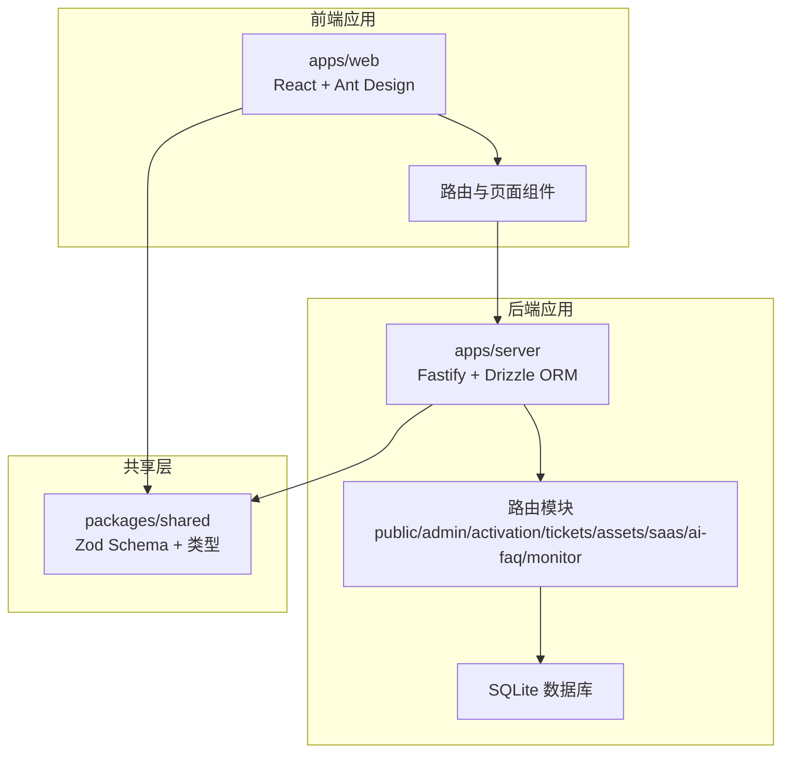
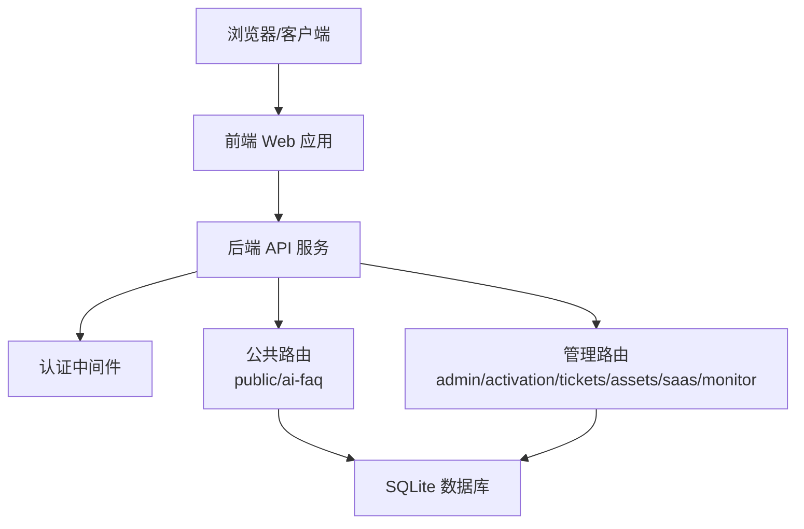
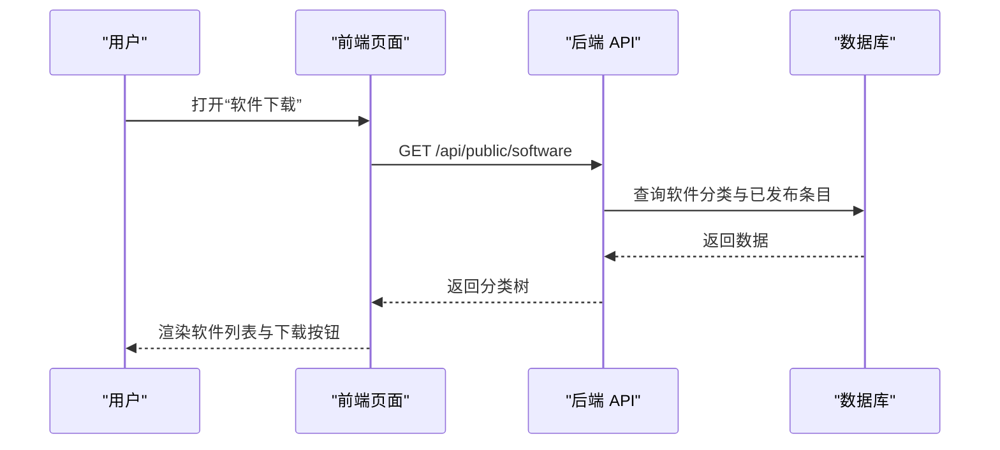
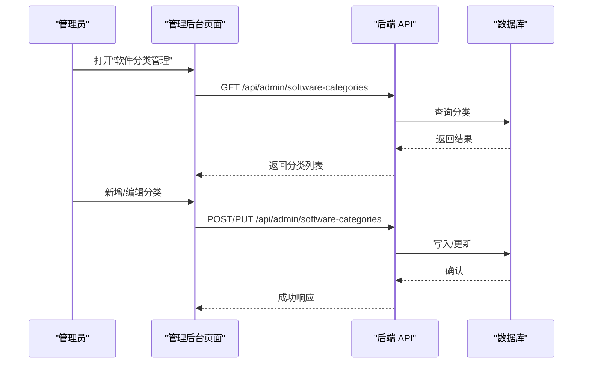
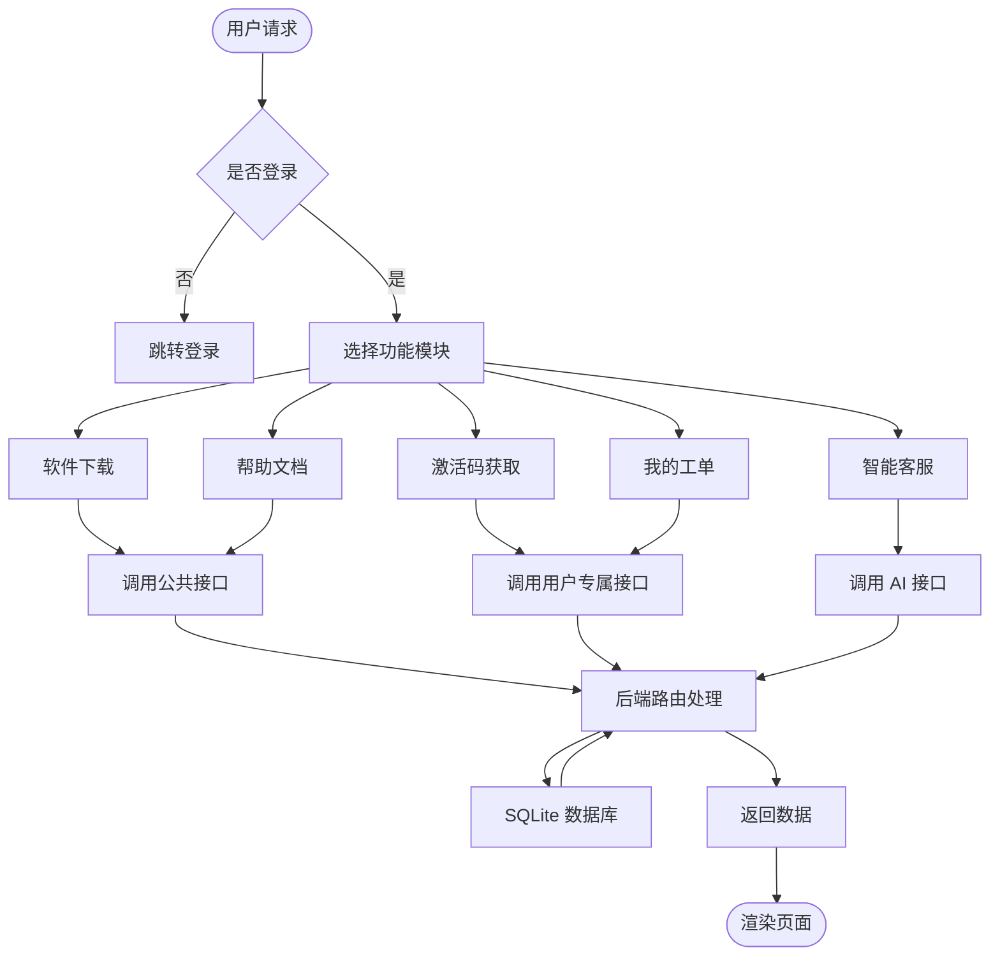
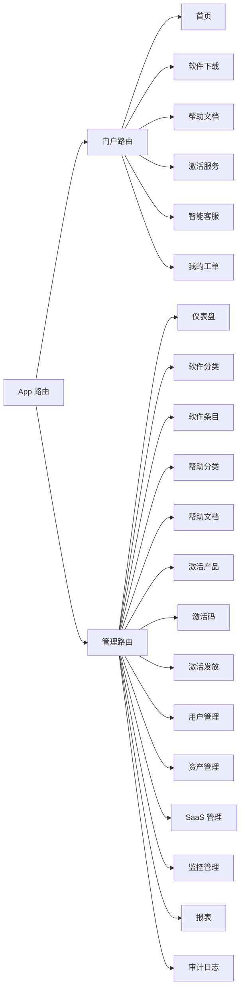

# 核心功能概览

<cite>
**本文档引用的文件**
- [README.md](file://README.md)
- [apps/server/src/index.ts](file://apps/server/src/index.ts)
- [apps/server/src/routes/public.ts](file://apps/server/src/routes/public.ts)
- [apps/server/src/routes/activation.ts](file://apps/server/src/routes/activation.ts)
- [apps/server/src/routes/admin.ts](file://apps/server/src/routes/admin.ts)
- [apps/server/src/routes/tickets.ts](file://apps/server/src/routes/tickets.ts)
- [apps/server/src/routes/assets.ts](file://apps/server/src/routes/assets.ts)
- [apps/server/src/routes/saas.ts](file://apps/server/src/routes/saas.ts)
- [apps/server/src/routes/ai-faq.ts](file://apps/server/src/routes/ai-faq.ts)
- [apps/server/src/routes/monitor.ts](file://apps/server/src/routes/monitor.ts)
- [apps/web/src/App.tsx](file://apps/web/src/App.tsx)
- [apps/web/src/pages/Home.tsx](file://apps/web/src/pages/Home.tsx)
- [apps/web/src/pages/Software.tsx](file://apps/web/src/pages/Software.tsx)
- [apps/web/src/pages/Help.tsx](file://apps/web/src/pages/Help.tsx)
- [apps/web/src/pages/Activation.tsx](file://apps/web/src/pages/Activation.tsx)
- [apps/web/src/pages/AiChat.tsx](file://apps/web/src/pages/AiChat.tsx)
- [apps/web/src/pages/Tickets.tsx](file://apps/web/src/pages/Tickets.tsx)
</cite>

## 目录
1. [简介](#简介)
2. [项目结构](#项目结构)
3. [核心组件](#核心组件)
4. [架构总览](#架构总览)
5. [详细组件分析](#详细组件分析)
6. [依赖关系分析](#依赖关系分析)
7. [性能考虑](#性能考虑)
8. [故障排查指南](#故障排查指南)
9. [结论](#结论)
10. [附录](#附录)

## 简介
本平台是一个基于 Node.js + React + SQLite 的正版化软件管理 B/S 平台，面向企业内部用户提供“软件下载、帮助文档、激活码发放、AI 智能客服”等门户能力，以及“软件管理、激活管理、工单系统、资产管理、SaaS 服务、监控系统”等管理后台能力。平台采用前后端分离架构，前端使用 React + Ant Design，后端使用 Fastify + Drizzle ORM，数据库为 SQLite，并通过 httpOnly Cookie 实现会话鉴权。

## 项目结构
- apps/server：后端 API 服务，包含路由注册、中间件、数据库访问与业务逻辑
- apps/web：前端门户与管理后台，包含页面组件、布局与 API 客户端
- packages/shared：前后端共享的 Zod Schema 与类型定义
- tools/ActivationClientWpf：Windows 平台演示激活客户端（WPF）

图表来源
- [apps/server/src/index.ts:11-49](file://apps/server/src/index.ts#L11-L49)
- [apps/web/src/App.tsx:38-79](file://apps/web/src/App.tsx#L38-L79)

章节来源
- [README.md:47-68](file://README.md#L47-L68)
- [apps/server/src/index.ts:11-49](file://apps/server/src/index.ts#L11-L49)
- [apps/web/src/App.tsx:38-79](file://apps/web/src/App.tsx#L38-L79)

## 核心组件
- 门户系统（匿名可浏览）
  - 首页统计概览、软件下载、帮助文档、激活服务、AI 智能客服、我的工单
- 管理后台（管理员登录）
  - 软件分类与条目管理、帮助文档分类与文档管理、激活产品与激活码管理、用户管理、文件管理、工单管理、资产管理、SaaS 服务与账户管理、监控平台与报表、审计日志

章节来源
- [README.md:70-86](file://README.md#L70-L86)
- [apps/server/src/routes/public.ts:5-51](file://apps/server/src/routes/public.ts#L5-L51)
- [apps/server/src/routes/admin.ts:15-279](file://apps/server/src/routes/admin.ts#L15-L279)
- [apps/server/src/routes/activation.ts:7-94](file://apps/server/src/routes/activation.ts#L7-L94)
- [apps/server/src/routes/tickets.ts:6-137](file://apps/server/src/routes/tickets.ts#L6-L137)
- [apps/server/src/routes/assets.ts:6-165](file://apps/server/src/routes/assets.ts#L6-L165)
- [apps/server/src/routes/saas.ts:14-160](file://apps/server/src/routes/saas.ts#L14-L160)
- [apps/server/src/routes/ai-faq.ts:6-100](file://apps/server/src/routes/ai-faq.ts#L6-L100)
- [apps/server/src/routes/monitor.ts:13-595](file://apps/server/src/routes/monitor.ts#L13-L595)

## 架构总览
后端通过路由模块化组织各功能域，前端通过路由映射到页面组件，两者通过 REST 接口交互。认证采用 session + httpOnly Cookie，速率限制与安全头由中间件统一处理。

图表来源
- [apps/server/src/index.ts:29-54](file://apps/server/src/index.ts#L29-L54)
- [apps/server/src/routes/public.ts:5-51](file://apps/server/src/routes/public.ts#L5-L51)
- [apps/server/src/routes/admin.ts:15-279](file://apps/server/src/routes/admin.ts#L15-L279)

## 详细组件分析

### 门户系统（Public）
- 软件下载
  - 核心价值：集中管理正版软件资源，按分类展示与下载
  - 使用场景：员工查找并下载所需软件
  - 实现方式：前端请求公共接口获取软件分类与条目树，渲染卡片式列表并提供下载链接
- 帮助文档
  - 核心价值：提供结构化的帮助内容，支持 Markdown 渲染
  - 使用场景：用户查阅使用说明与常见问题
  - 实现方式：前端请求公共接口获取分类与文档树，点击进入详情页
- 激活码获取
  - 核心价值：为指定产品发放一次性 6 位激活码，配套激活客户端
  - 使用场景：用户登录后获取激活码并完成软件激活
  - 实现方式：前端调用用户专属接口领取激活码，后端幂等检查与库存扣减
- AI 智能客服
  - 核心价值：基于 FAQ 的语义匹配，提供即时问答与相关问题推荐
  - 使用场景：快速自助解决问题，降低人工客服压力
  - 实现方式：前端提交问题，后端进行关键词与相似度评分匹配，返回最佳答案与候选问题
- 我的工单
  - 核心价值：用户自助提交与跟踪问题，提升服务效率
  - 使用场景：故障报修、需求建议、咨询提问
  - 实现方式：用户提交工单与回复，管理员查看与处理

图表来源
- [apps/server/src/routes/public.ts:7-15](file://apps/server/src/routes/public.ts#L7-L15)
- [apps/web/src/pages/Software.tsx:27-31](file://apps/web/src/pages/Software.tsx#L27-L31)

章节来源
- [apps/server/src/routes/public.ts:5-51](file://apps/server/src/routes/public.ts#L5-L51)
- [apps/web/src/pages/Home.tsx:37-57](file://apps/web/src/pages/Home.tsx#L37-L57)
- [apps/web/src/pages/Software.tsx:23-71](file://apps/web/src/pages/Software.tsx#L23-L71)
- [apps/web/src/pages/Help.tsx:21-61](file://apps/web/src/pages/Help.tsx#L21-L61)
- [apps/web/src/pages/Activation.tsx:24-98](file://apps/web/src/pages/Activation.tsx#L24-L98)
- [apps/server/src/routes/activation.ts:7-94](file://apps/server/src/routes/activation.ts#L7-L94)
- [apps/web/src/pages/AiChat.tsx:23-116](file://apps/web/src/pages/AiChat.tsx#L23-L116)
- [apps/server/src/routes/ai-faq.ts:42-98](file://apps/server/src/routes/ai-faq.ts#L42-L98)
- [apps/web/src/pages/Tickets.tsx:24-132](file://apps/web/src/pages/Tickets.tsx#L24-L132)
- [apps/server/src/routes/tickets.ts:7-137](file://apps/server/src/routes/tickets.ts#L7-L137)

### 管理后台（Admin）
- 软件管理
  - 功能：分类与条目的增删改查、排序、发布状态管理
  - 价值：统一软件资源目录，保障内容质量与可见性
- 帮助文档管理
  - 功能：分类与文档的增删改查、发布/回收生命周期管理
  - 价值：维护知识库，确保文档时效性与一致性
- 激活管理
  - 功能：激活产品管理、激活码批量导入、发放记录审计
  - 价值：规范激活流程，防止重复发放与滥用
- 用户管理
  - 功能：用户创建、角色分配、启用/禁用、密码重置
  - 价值：保障系统安全与权限控制
- 工单系统
  - 功能：工单列表、详情、状态变更、回复、管理员分配与处理
  - 价值：闭环问题处理流程，提升服务响应速度
- 资产管理
  - 功能：资产分类、资产 CRUD、出入库/维修/报废等操作记录、审批流、统计报表
  - 价值：可视化资产全生命周期，支撑财务与运维决策
- SaaS 服务
  - 功能：服务与套餐管理、账户开通/停用/重置密码、用户自助申请
  - 价值：统一云服务入口，自动化发放凭据
- 监控系统
  - 功能：监控目标/项/阈值管理、采集记录、告警、仪表盘、报告与模板、平台对接、审计日志
  - 价值：可观测性中枢，辅助运维与容量规划

图表来源
- [apps/server/src/routes/admin.ts:18-43](file://apps/server/src/routes/admin.ts#L18-L43)
- [apps/web/src/App.tsx:55-56](file://apps/web/src/App.tsx#L55-L56)

章节来源
- [apps/server/src/routes/admin.ts:15-279](file://apps/server/src/routes/admin.ts#L15-L279)
- [apps/server/src/routes/activation.ts:160-219](file://apps/server/src/routes/activation.ts#L160-L219)
- [apps/server/src/routes/tickets.ts:64-137](file://apps/server/src/routes/tickets.ts#L64-L137)
- [apps/server/src/routes/assets.ts:9-165](file://apps/server/src/routes/assets.ts#L9-L165)
- [apps/server/src/routes/saas.ts:14-160](file://apps/server/src/routes/saas.ts#L14-L160)
- [apps/server/src/routes/monitor.ts:13-595](file://apps/server/src/routes/monitor.ts#L13-L595)

### 功能关联与数据流转
- 门户与后台的数据边界清晰：公共接口仅返回已发布内容；管理接口仅对管理员开放
- 激活码流程：用户登录 → 选择产品 → 领取激活码 → 后端幂等校验 → 库存扣减 → 记录发放
- 工单流程：用户提交 → 管理员分配/处理 → 回复与状态变更 → 结案归档
- 监控流程：配置目标/项/阈值 → 采集数据 → 触发告警 → 管理员确认/解决 → 生成报告
- SaaS 流程：用户申请 → 系统生成凭据 → 发放给用户 → 管理员维护状态

图表来源
- [apps/server/src/routes/public.ts:5-51](file://apps/server/src/routes/public.ts#L5-L51)
- [apps/server/src/routes/activation.ts:7-94](file://apps/server/src/routes/activation.ts#L7-L94)
- [apps/server/src/routes/ai-faq.ts:42-98](file://apps/server/src/routes/ai-faq.ts#L42-L98)
- [apps/server/src/routes/tickets.ts:7-137](file://apps/server/src/routes/tickets.ts#L7-L137)

## 依赖关系分析
- 前端路由与页面组件一一对应，管理后台路由集中在 /admin 前缀下
- 后端路由模块按领域划分，公共与管理接口分离，便于权限控制与扩展
- 共享层提供统一的 Schema 与类型，保证前后端契约一致

图表来源
- [apps/web/src/App.tsx:38-79](file://apps/web/src/App.tsx#L38-L79)

章节来源
- [apps/web/src/App.tsx:38-79](file://apps/web/src/App.tsx#L38-L79)

## 性能考虑
- 速率限制：后端启用速率限制中间件，避免恶意刷接口
- 静态资源：上传文件通过静态服务暴露，支持大文件下载
- 分页与查询：管理后台多数列表接口支持分页与筛选，降低一次性数据传输
- 前端缓存：合理利用浏览器缓存与组件状态，减少重复请求
- 数据库优化：Drizzle ORM 提供类型安全的查询，建议为高频查询字段建立索引

## 故障排查指南
- 登录与权限
  - 症状：访问管理页面提示未授权
  - 处理：确认已登录且具备管理员角色；检查 Cookie 是否携带与有效
- 激活码领取
  - 症状：提示“暂无可用激活码”
  - 处理：确认产品存在可用库存；检查是否已重复领取；联系管理员导入更多激活码
- 工单提交
  - 症状：提交失败或无响应
  - 处理：检查必填字段；确认网络连通；查看浏览器控制台错误
- 监控告警
  - 症状：告警未触发或状态异常
  - 处理：检查监控目标/项/阈值配置；核对采集间隔与数据上报；查看最近记录与报告
- SaaS 账号
  - 症状：申请失败或凭据异常
  - 处理：确认用户存在且未重复申请；检查套餐与服务状态；必要时重置密码

章节来源
- [apps/server/src/routes/activation.ts:55-57](file://apps/server/src/routes/activation.ts#L55-L57)
- [apps/server/src/routes/tickets.ts:8-19](file://apps/server/src/routes/tickets.ts#L8-L19)
- [apps/server/src/routes/monitor.ts:264-288](file://apps/server/src/routes/monitor.ts#L264-L288)
- [apps/server/src/routes/saas.ts:132-146](file://apps/server/src/routes/saas.ts#L132-L146)

## 结论
本平台通过清晰的门户与管理后台划分，结合标准化的 API 设计与权限控制，实现了从内容管理到服务交付的完整闭环。建议在生产环境中完善 OIDC 对接、增强监控覆盖与告警策略，并持续优化用户体验与数据治理。

## 附录
- 快速开始与环境要求、默认管理员账号、CI 构建与备份策略详见项目自述文件
- 二期扩展计划（OIDC 对接）提供了明确的扩展点与演进方向

章节来源
- [README.md:12-121](file://README.md#L12-L121)