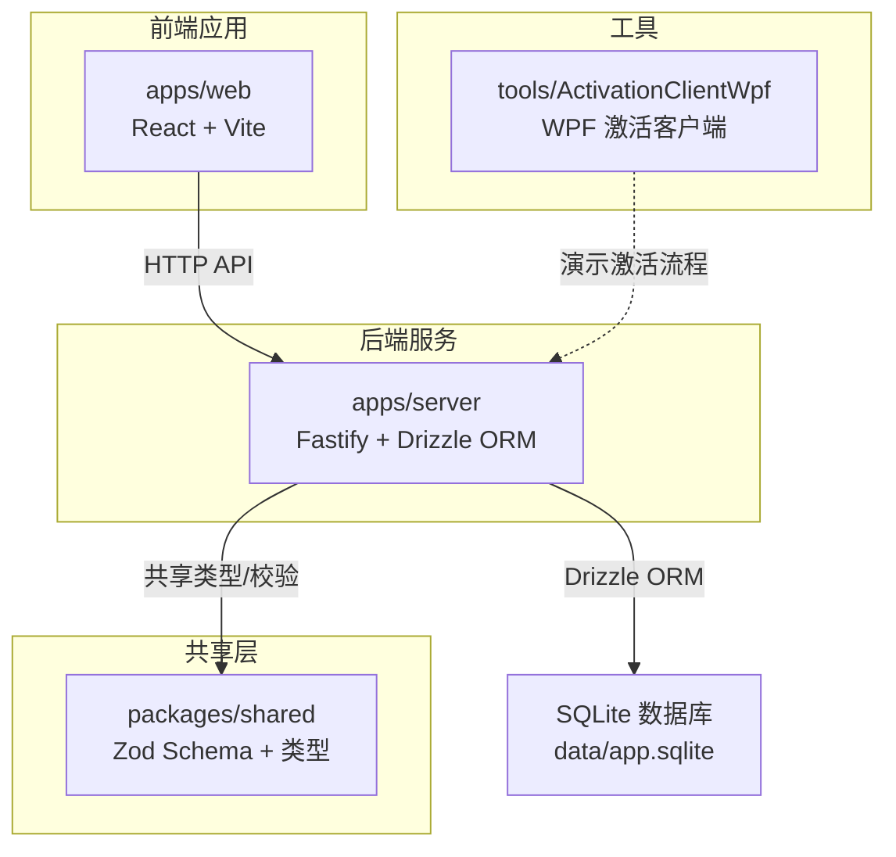
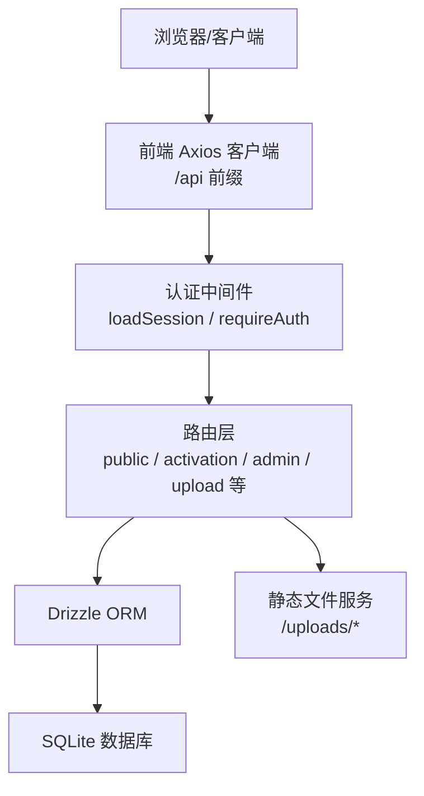
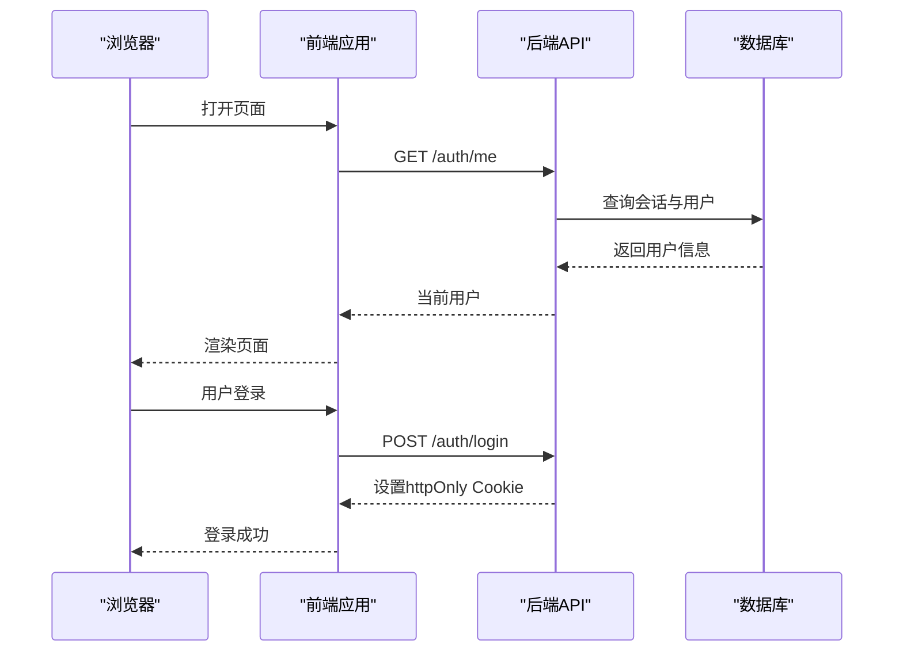
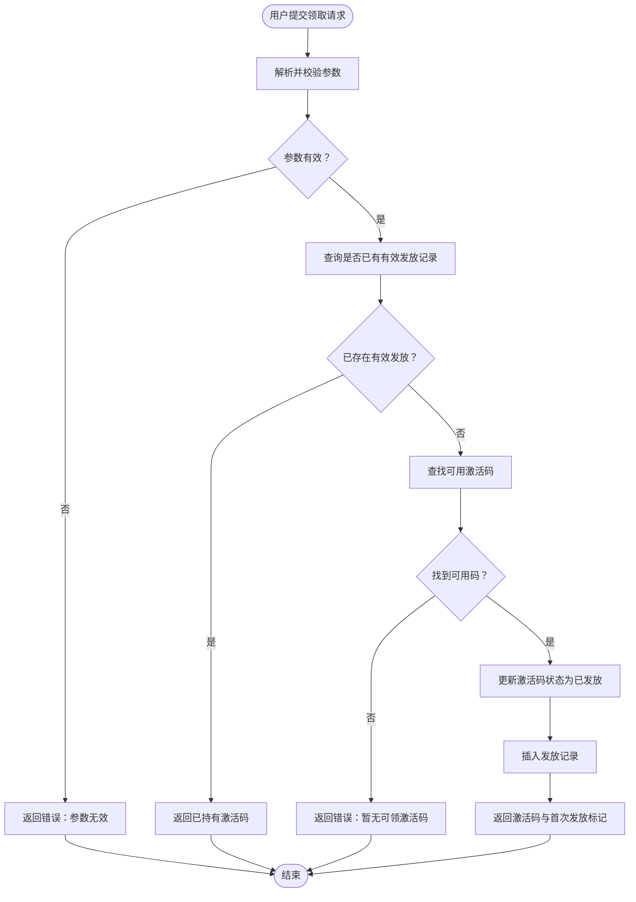
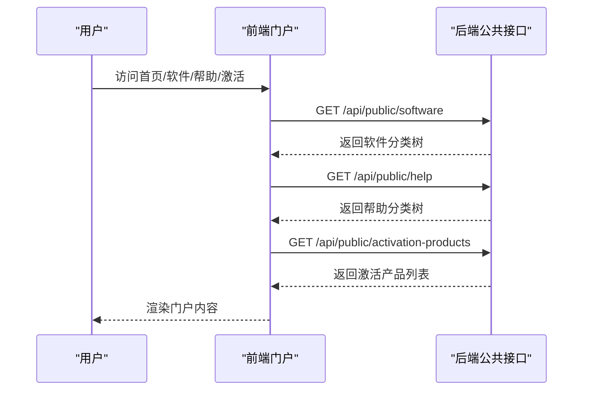
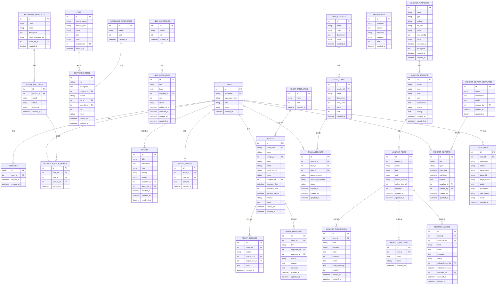
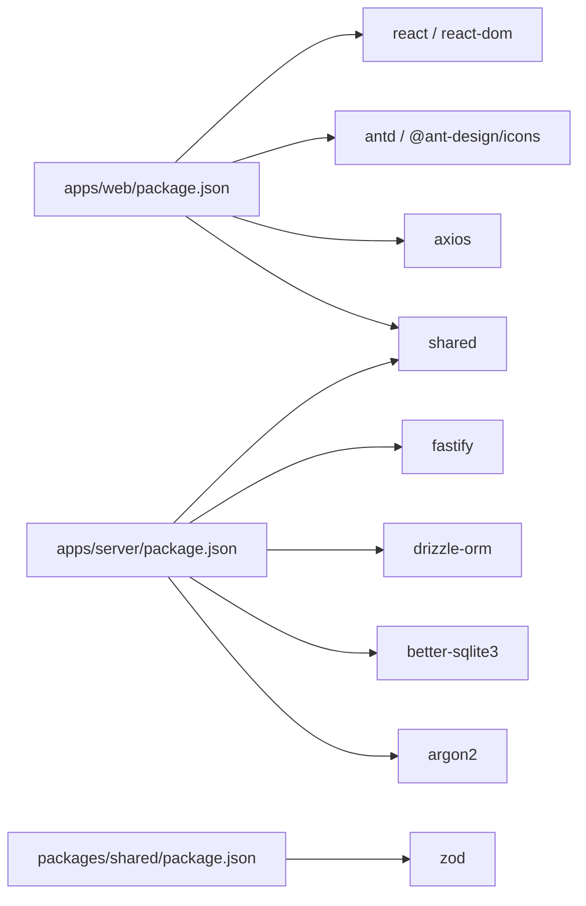

# 项目介绍与愿景

<cite>
**本文引用的文件**
- [README.md](file://README.md)
- [apps/server/src/index.ts](file://apps/server/src/index.ts)
- [apps/server/src/db/schema.ts](file://apps/server/src/db/schema.ts)
- [apps/server/src/middleware/auth.ts](file://apps/server/src/middleware/auth.ts)
- [apps/server/src/routes/public.ts](file://apps/server/src/routes/public.ts)
- [apps/server/src/routes/activation.ts](file://apps/server/src/routes/activation.ts)
- [apps/web/src/App.tsx](file://apps/web/src/App.tsx)
- [apps/web/src/pages/Home.tsx](file://apps/web/src/pages/Home.tsx)
- [apps/web/src/pages/Login.tsx](file://apps/web/src/pages/Login.tsx)
- [apps/web/src/lib/api.ts](file://apps/web/src/lib/api.ts)
- [apps/web/src/lib/auth.tsx](file://apps/web/src/lib/auth.tsx)
- [packages/shared/src/types.ts](file://packages/shared/src/types.ts)
- [apps/server/package.json](file://apps/server/package.json)
- [apps/web/package.json](file://apps/web/package.json)
- [packages/shared/package.json](file://packages/shared/package.json)
</cite>

## 目录
1. [引言](#引言)
2. [项目结构](#项目结构)
3. [核心组件](#核心组件)
4. [架构总览](#架构总览)
5. [详细组件分析](#详细组件分析)
6. [依赖关系分析](#依赖关系分析)
7. [性能考量](#性能考量)
8. [故障排查指南](#故障排查指南)
9. [结论](#结论)
10. [附录](#附录)

## 引言
ZBH2正版化软件管理平台是一个面向企业与组织的B/S正版软件管理与分发系统，以“正版化、安全性、易用性”为核心价值主张，致力于解决以下实际痛点：
- 软件资产混乱：缺乏统一的软件分类、版本与发布状态管理，导致员工难以快速找到合规软件。
- 激活流程繁琐：传统KMS/批量激活方式复杂、易出错，缺乏可视化的申请与发放记录。
- 文档分散：帮助文档未按主题归类，查找成本高，影响问题解决效率。
- 安全与审计缺失：缺少统一的登录鉴权、操作审计与访问控制，存在安全风险。
- 运维监控薄弱：对软件使用环境与系统健康度缺乏持续监控与预警。

平台通过前后端分离架构、SQLite轻量化数据库、标准化的API与直观的管理界面，为企业IT部门、软件分发机构、高校与政府单位等提供一站式的正版软件门户与后台管理能力。

## 项目结构
项目采用monorepo结构，分为前端应用、后端API、共享包与工具模块：
- apps/server：基于Fastify的后端API，提供认证、内容管理、激活服务、工单、资产管理、SaaS账户、监控与审计等功能。
- apps/web：基于React + Ant Design的前端门户与管理后台，覆盖软件下载、帮助文档、激活申请、管理后台等页面。
- packages/shared：前后端共享的Zod Schema与类型定义，确保数据契约一致。
- tools/ActivationClientWpf：Windows平台的演示激活客户端（WPF），用于配合激活码发放流程。

图表来源
- [apps/server/src/index.ts:1-60](file://apps/server/src/index.ts#L1-L60)
- [apps/web/src/App.tsx:1-80](file://apps/web/src/App.tsx#L1-L80)
- [packages/shared/src/types.ts:1-18](file://packages/shared/src/types.ts#L1-L18)

章节来源
- [README.md:47-68](file://README.md#L47-L68)
- [apps/server/src/index.ts:1-60](file://apps/server/src/index.ts#L1-L60)
- [apps/web/src/App.tsx:1-80](file://apps/web/src/App.tsx#L1-L80)
- [packages/shared/src/types.ts:1-18](file://packages/shared/src/types.ts#L1-L18)

## 核心组件
- 前端门户与管理后台
  - 门户：首页、软件列表、帮助文档、激活入口、我的激活码、工单、云服务、AI问答等页面。
  - 管理后台：软件分类与条目、帮助文档分类与文档、激活产品与激活码、用户管理、文件上传、资产管理、SaaS账户、报表、FAQ、监控仪表盘与告警、审计日志等。
- 后端API
  - 认证与会话：基于httpOnly Cookie的Session机制，支持登录、登出、会话加载与鉴权中间件。
  - 公共接口：软件与帮助文档的公开查询、激活产品列表。
  - 激活服务：激活码领取、发放记录、幂等处理与状态流转。
  - 管理接口：内容与资源的增删改查、发布/回收、批量导入与导出。
- 数据模型
  - 用户、会话、软件分类与条目、帮助分类与文档、激活产品与激活码、激活发放记录、工单与回复、数字资产管理、SaaS服务与账户、监控目标/指标/阈值/记录/告警/报表/平台、审计日志等。
- 共享类型与校验
  - 统一的用户角色、内容状态、激活码状态与响应结构，以及分页响应格式，保障前后端一致性。

章节来源
- [apps/web/src/App.tsx:1-80](file://apps/web/src/App.tsx#L1-L80)
- [apps/server/src/routes/public.ts:1-52](file://apps/server/src/routes/public.ts#L1-L52)
- [apps/server/src/routes/activation.ts:1-95](file://apps/server/src/routes/activation.ts#L1-L95)
- [apps/server/src/db/schema.ts:1-330](file://apps/server/src/db/schema.ts#L1-L330)
- [packages/shared/src/types.ts:1-18](file://packages/shared/src/types.ts#L1-L18)

## 架构总览
平台采用前后端分离架构，前端通过Axios发起带凭据的请求，后端使用Fastify注册中间件与路由，Drizzle ORM连接SQLite数据库。认证中间件在每次请求前加载会话，管理后台路由通过鉴权中间件保护敏感操作。

图表来源
- [apps/server/src/index.ts:1-60](file://apps/server/src/index.ts#L1-L60)
- [apps/server/src/middleware/auth.ts:1-56](file://apps/server/src/middleware/auth.ts#L1-L56)
- [apps/web/src/lib/api.ts:1-16](file://apps/web/src/lib/api.ts#L1-L16)

章节来源
- [apps/server/src/index.ts:1-60](file://apps/server/src/index.ts#L1-L60)
- [apps/server/src/middleware/auth.ts:1-56](file://apps/server/src/middleware/auth.ts#L1-L56)
- [apps/web/src/lib/api.ts:1-16](file://apps/web/src/lib/api.ts#L1-L16)

## 详细组件分析

### 认证与会话组件
- 会话加载：中间件从Cookie读取sid，查询有效期内且用户状态为“启用”的会话与用户，注入到请求上下文。
- 鉴权保护：requireAuth与requireAdmin分别用于登录态检查与管理员权限检查。
- 前端鉴权：Auth Provider在应用启动时刷新当前用户信息；登录/登出通过API完成；未登录时401拦截器避免非公开页面跳转。

图表来源
- [apps/server/src/middleware/auth.ts:17-46](file://apps/server/src/middleware/auth.ts#L17-L46)
- [apps/web/src/lib/auth.tsx:20-52](file://apps/web/src/lib/auth.tsx#L20-L52)
- [apps/web/src/pages/Login.tsx:1-47](file://apps/web/src/pages/Login.tsx#L1-L47)

章节来源
- [apps/server/src/middleware/auth.ts:1-56](file://apps/server/src/middleware/auth.ts#L1-L56)
- [apps/web/src/lib/auth.tsx:1-55](file://apps/web/src/lib/auth.tsx#L1-L55)
- [apps/web/src/pages/Login.tsx:1-47](file://apps/web/src/pages/Login.tsx#L1-L47)

### 激活服务组件
- 领取激活码：用户登录后提交产品ID，系统进行幂等检查（同一用户对同一产品仅允许一次有效发放），随后从可用状态的激活码中选取一条，更新为“已发放”，并写入发放记录。
- 我的激活码：列出当前用户的历史发放记录与对应产品信息。
- 安全与一致性：通过数据库事务与状态字段保证并发下的正确性；Zod校验确保输入参数合法。

图表来源
- [apps/server/src/routes/activation.ts:8-75](file://apps/server/src/routes/activation.ts#L8-L75)

章节来源
- [apps/server/src/routes/activation.ts:1-95](file://apps/server/src/routes/activation.ts#L1-L95)
- [apps/server/src/db/schema.ts:71-96](file://apps/server/src/db/schema.ts#L71-L96)

### 公共门户组件
- 软件门户：按分类聚合已发布软件条目，支持直接下载。
- 帮助文档：按分类聚合已发布文档，Markdown渲染展示。
- 激活产品：公开列出可申请的激活产品，引导用户登录后领取。

图表来源
- [apps/server/src/routes/public.ts:6-50](file://apps/server/src/routes/public.ts#L6-L50)
- [apps/web/src/pages/Home.tsx:30-57](file://apps/web/src/pages/Home.tsx#L30-L57)

章节来源
- [apps/server/src/routes/public.ts:1-52](file://apps/server/src/routes/public.ts#L1-L52)
- [apps/web/src/pages/Home.tsx:1-165](file://apps/web/src/pages/Home.tsx#L1-L165)

### 数据模型与关系
平台围绕“用户—会话—内容—激活—工单—资产—SaaS—监控—审计”构建核心数据域，通过外键与枚举字段保证数据一致性与可审计性。

图表来源
- [apps/server/src/db/schema.ts:1-330](file://apps/server/src/db/schema.ts#L1-L330)

章节来源
- [apps/server/src/db/schema.ts:1-330](file://apps/server/src/db/schema.ts#L1-L330)

## 依赖关系分析
- 技术栈
  - 前端：React 18、Ant Design 5、React Router 6、Vite
  - 后端：Fastify 5、Drizzle ORM、SQLite（better-sqlite3）、Argon2密码哈希
  - 构建：pnpm monorepo
- 关键依赖
  - @fastify/cookie、@fastify/cors、@fastify/helmet、@fastify/multipart、@fastify/rate-limit、@fastify/static
  - shared包提供Zod校验与类型，web包依赖shared与react生态
- 环境变量
  - PORT：后端监听端口
  - DATABASE_URL：SQLite文件路径

图表来源
- [apps/web/package.json:1-29](file://apps/web/package.json#L1-L29)
- [apps/server/package.json:1-37](file://apps/server/package.json#L1-L37)
- [packages/shared/package.json:1-24](file://packages/shared/package.json#L1-L24)

章节来源
- [apps/web/package.json:1-29](file://apps/web/package.json#L1-L29)
- [apps/server/package.json:1-37](file://apps/server/package.json#L1-L37)
- [packages/shared/package.json:1-24](file://packages/shared/package.json#L1-L24)
- [README.md:97-103](file://README.md#L97-L103)

## 性能考量
- 传输与安全
  - 使用Helmet禁用默认CSP以简化部署，建议生产环境按需开启CSP策略。
  - CORS启用凭证与跨域支持，确保前端代理与后端直连场景兼容。
  - 限流中间件限制每分钟请求次数，缓解暴力尝试与DDoS风险。
- 存储与IO
  - SQLite适合中小规模部署，注意磁盘IO与并发写入瓶颈；建议在高并发场景评估分片或迁移到更高性能数据库。
- 前端体验
  - 首屏聚合多个公共接口，减少往返；图片与文件采用CDN或静态服务托管，提升下载速度。
- 数据库优化
  - 为常用查询字段建立索引（如激活码状态、用户角色、内容状态等），避免全表扫描。
  - 合理使用分页与排序字段，避免大结果集排序。

## 故障排查指南
- 登录失败
  - 检查用户名/密码是否正确；确认用户状态为“启用”；查看401响应与前端消息提示。
- 无法领取激活码
  - 确认产品ID有效；检查是否存在可用激活码；幂等保护可能返回已持有激活码。
- 下载失败
  - 检查文件ID是否有效；确认文件存在且未被删除；确认静态服务已挂载/data/uploads。
- 权限不足
  - 管理后台需管理员角色；普通用户访问会被拒绝。
- 数据库异常
  - 确认SQLite文件路径与权限；检查迁移与种子脚本是否执行成功。

章节来源
- [apps/web/src/pages/Login.tsx:13-24](file://apps/web/src/pages/Login.tsx#L13-L24)
- [apps/server/src/routes/activation.ts:8-75](file://apps/server/src/routes/activation.ts#L8-L75)
- [apps/server/src/index.ts:35-35](file://apps/server/src/index.ts#L35-L35)
- [apps/server/src/middleware/auth.ts:42-55](file://apps/server/src/middleware/auth.ts#L42-L55)

## 结论
ZBH2正版化软件管理平台以“正版化、安全性、易用性”为宗旨，通过清晰的前后端分层、完善的认证与审计、可扩展的数据模型与管理功能，为企业提供从软件分发到激活、从文档到工单、从资产到监控的一体化解决方案。平台具备良好的可维护性与扩展性，适合在中小规模组织内快速落地，并为后续对接统一身份认证（OIDC）与更复杂的运维监控体系奠定基础。

## 附录
- 快速开始
  - 安装依赖、初始化数据库、启动开发服务器，访问前端门户与后端API。
- 默认管理员账号
  - 首次部署后请立即修改默认密码。
- 备份策略
  - 同步备份SQLite数据库文件与上传目录。

章节来源
- [README.md:12-38](file://README.md#L12-L38)
- [README.md:104-121](file://README.md#L104-L121)