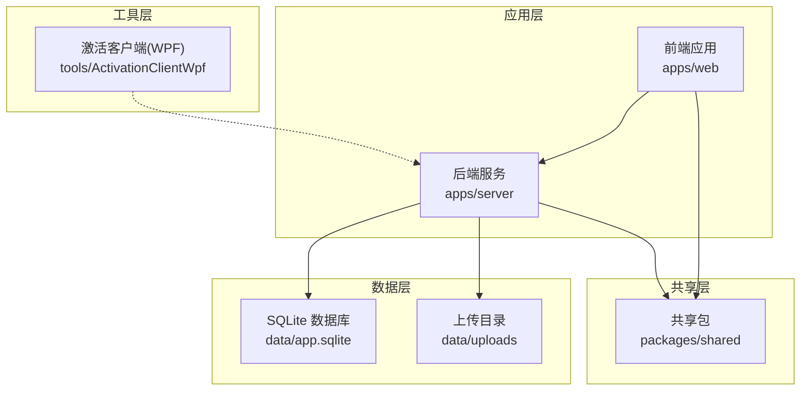
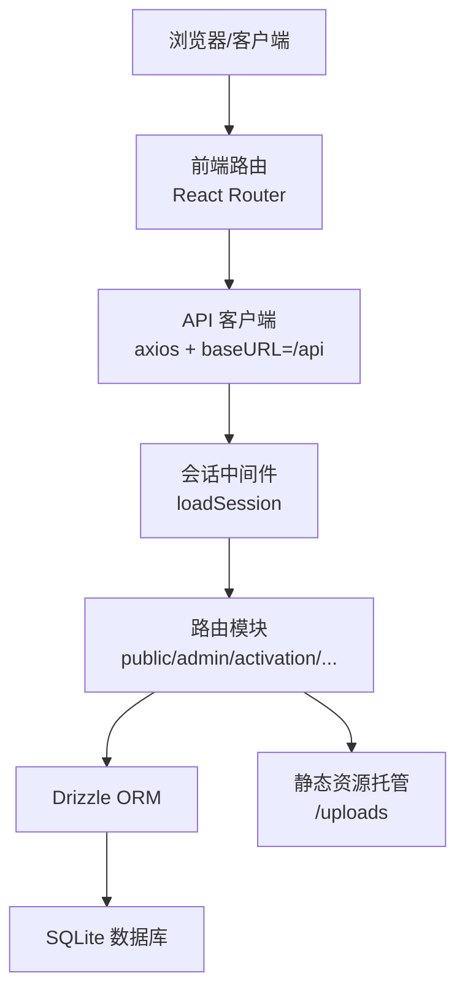
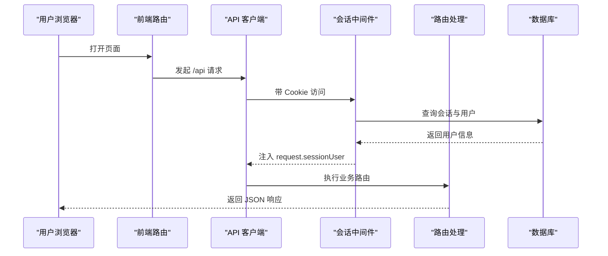
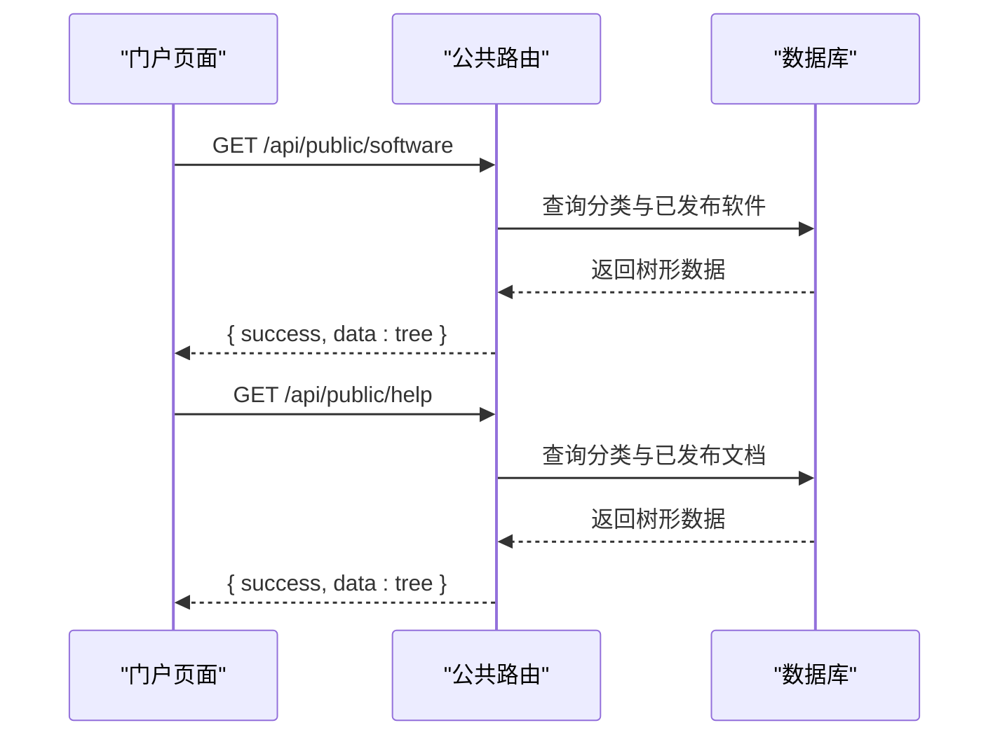
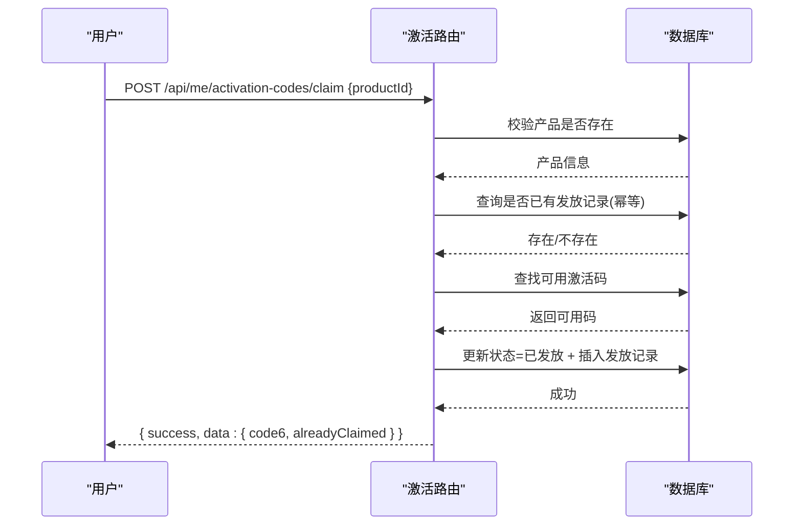
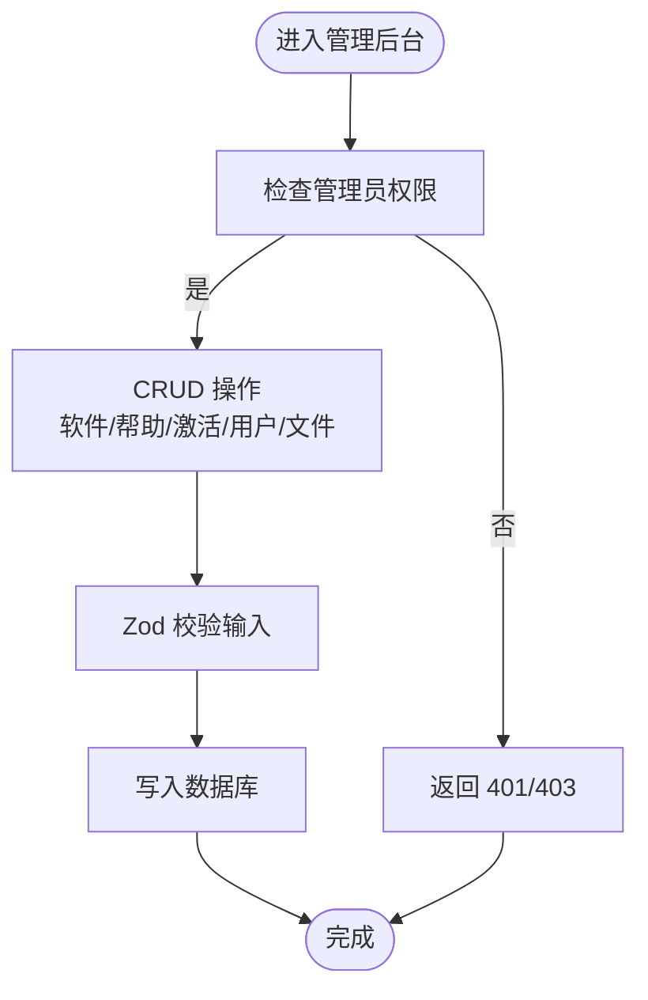
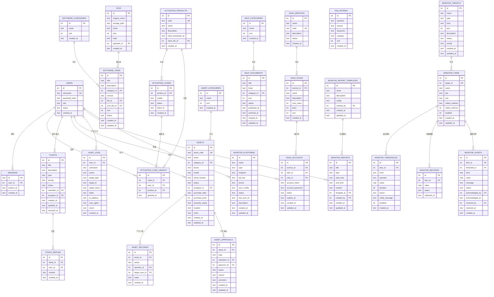
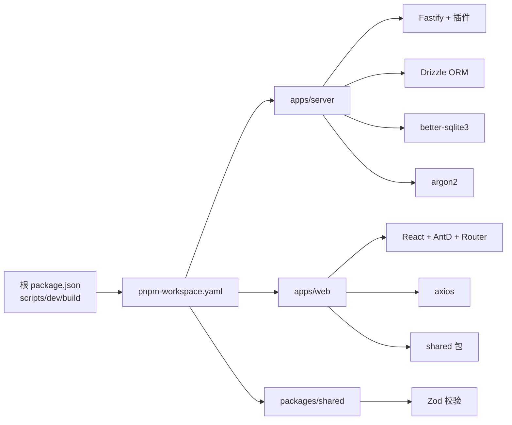

# 项目概述

<cite>
**本文档引用的文件**
- [README.md](file://README.md)
- [package.json](file://package.json)
- [pnpm-workspace.yaml](file://pnpm-workspace.yaml)
- [apps/server/package.json](file://apps/server/package.json)
- [apps/web/package.json](file://apps/web/package.json)
- [packages/shared/package.json](file://packages/shared/package.json)
- [apps/server/src/index.ts](file://apps/server/src/index.ts)
- [apps/web/src/App.tsx](file://apps/web/src/App.tsx)
- [apps/server/src/db/schema.ts](file://apps/server/src/db/schema.ts)
- [apps/web/src/main.tsx](file://apps/web/src/main.tsx)
- [packages/shared/src/types.ts](file://packages/shared/src/types.ts)
- [packages/shared/src/schemas.ts](file://packages/shared/src/schemas.ts)
- [apps/server/src/middleware/auth.ts](file://apps/server/src/middleware/auth.ts)
- [apps/server/src/routes/public.ts](file://apps/server/src/routes/public.ts)
- [apps/server/src/routes/admin.ts](file://apps/server/src/routes/admin.ts)
- [apps/server/src/routes/activation.ts](file://apps/server/src/routes/activation.ts)
- [apps/web/src/lib/api.ts](file://apps/web/src/lib/api.ts)
- [apps/web/src/lib/auth.tsx](file://apps/web/src/lib/auth.tsx)
</cite>

## 目录
1. [引言](#引言)
2. [项目结构](#项目结构)
3. [核心组件](#核心组件)
4. [架构总览](#架构总览)
5. [详细组件分析](#详细组件分析)
6. [依赖分析](#依赖分析)
7. [性能考虑](#性能考虑)
8. [故障排查指南](#故障排查指南)
9. [结论](#结论)
10. [附录](#附录)

## 引言
ZBH2正版化软件管理平台是一个面向组织内部正版化软件分发与管理的B/S系统，目标是通过标准化流程提升软件资产利用率与合规性。平台提供软件分类下载、帮助文档浏览、Windows/Office/WPS等产品的激活码发放，以及完善的管理后台，覆盖从内容发布到用户激活、工单处理、数字资产管理、SaaS服务管理、运维监控与审计日志的完整闭环。

平台的核心使命：
- 提供安全、便捷的软件分发渠道，降低合规风险
- 以“激活码”为核心凭证，实现软件使用权的可控发放与追踪
- 通过管理后台实现内容与资产的全生命周期管理
- 以Monorepo与前后端分离架构，确保开发效率与可维护性

## 项目结构
项目采用 pnpm workspaces 的 Monorepo 架构，将后端服务、前端门户、共享包与工具脚本进行统一管理，便于版本对齐与跨包复用。

- apps/server：基于 Fastify 的后端 API，负责业务逻辑、鉴权、数据库访问与静态资源托管
- apps/web：基于 React + Vite 的前端门户，提供用户界面与管理后台
- packages/shared：前后端共享的类型定义与 Zod 校验模式，保证接口一致性
- tools/ActivationClientWpf：Windows 平台的激活客户端演示工程（WPF）

图表来源
- [apps/server/src/index.ts:1-60](file://apps/server/src/index.ts#L1-L60)
- [apps/web/src/App.tsx:1-80](file://apps/web/src/App.tsx#L1-L80)
- [apps/server/src/db/schema.ts:1-330](file://apps/server/src/db/schema.ts#L1-L330)
- [README.md:47-68](file://README.md#L47-L68)

章节来源
- [README.md:47-68](file://README.md#L47-L68)
- [pnpm-workspace.yaml:1-5](file://pnpm-workspace.yaml#L1-L5)
- [package.json:1-20](file://package.json#L1-L20)

## 核心组件
- 前端门户与管理后台
  - 使用 React Router 实现多页面路由，区分门户布局与管理后台布局
  - 通过 API 客户端与鉴权上下文实现登录态管理与权限控制
- 后端 API 与中间件
  - 基于 Fastify 注册安全、跨域、限流、静态文件等插件
  - 通过会话中间件加载登录用户信息，提供通用鉴权钩子
- 数据层
  - 使用 Drizzle ORM + SQLite，定义涵盖软件、帮助、激活、工单、资产、SaaS、监控、审计等领域的完整模型
- 共享包
  - 统一导出类型与 Zod 校验模式，减少前后端重复校验成本

章节来源
- [apps/web/src/App.tsx:1-80](file://apps/web/src/App.tsx#L1-L80)
- [apps/web/src/main.tsx:1-22](file://apps/web/src/main.tsx#L1-L22)
- [apps/server/src/index.ts:1-60](file://apps/server/src/index.ts#L1-L60)
- [apps/server/src/middleware/auth.ts:1-56](file://apps/server/src/middleware/auth.ts#L1-L56)
- [apps/server/src/db/schema.ts:1-330](file://apps/server/src/db/schema.ts#L1-L330)
- [packages/shared/src/types.ts:1-18](file://packages/shared/src/types.ts#L1-L18)
- [packages/shared/src/schemas.ts:1-51](file://packages/shared/src/schemas.ts#L1-L51)

## 架构总览
平台采用“Monorepo + 前后端分离”的架构设计，前端通过代理访问后端 API，后端以模块化路由组织功能域，数据库采用 SQLite，满足中小规模部署与快速迭代的需求。

图表来源
- [apps/web/src/lib/api.ts:1-16](file://apps/web/src/lib/api.ts#L1-L16)
- [apps/web/src/lib/auth.tsx:1-55](file://apps/web/src/lib/auth.tsx#L1-L55)
- [apps/server/src/index.ts:1-60](file://apps/server/src/index.ts#L1-L60)
- [apps/server/src/middleware/auth.ts:1-56](file://apps/server/src/middleware/auth.ts#L1-L56)
- [apps/server/src/db/schema.ts:1-330](file://apps/server/src/db/schema.ts#L1-L330)

## 详细组件分析

### 前后端分离与代理机制
- 前端开发服务器通过代理将 /api 前缀请求转发至后端，避免跨域问题
- API 客户端统一设置 withCredentials，保障 Cookie 会话在同源策略下正常传递
- 登录态通过 httpOnly Cookie 会话维持，鉴权中间件在每次请求前加载用户信息

图表来源
- [apps/web/src/lib/api.ts:1-16](file://apps/web/src/lib/api.ts#L1-L16)
- [apps/web/src/lib/auth.tsx:1-55](file://apps/web/src/lib/auth.tsx#L1-L55)
- [apps/server/src/middleware/auth.ts:1-56](file://apps/server/src/middleware/auth.ts#L1-L56)
- [apps/server/src/index.ts:1-60](file://apps/server/src/index.ts#L1-L60)

章节来源
- [apps/web/src/lib/api.ts:1-16](file://apps/web/src/lib/api.ts#L1-L16)
- [apps/web/src/lib/auth.tsx:1-55](file://apps/web/src/lib/auth.tsx#L1-L55)
- [apps/server/src/middleware/auth.ts:1-56](file://apps/server/src/middleware/auth.ts#L1-L56)
- [apps/server/src/index.ts:1-60](file://apps/server/src/index.ts#L1-L60)

### 软件分发与帮助文档
- 门户侧提供软件分类与已发布软件列表、帮助文档分类与已发布文档详情
- 后端通过公共路由返回树形结构数据，前端渲染门户页面
- 支持 Markdown 文档渲染与文件下载

图表来源
- [apps/server/src/routes/public.ts:1-52](file://apps/server/src/routes/public.ts#L1-L52)
- [apps/server/src/db/schema.ts:19-69](file://apps/server/src/db/schema.ts#L19-L69)

章节来源
- [apps/server/src/routes/public.ts:1-52](file://apps/server/src/routes/public.ts#L1-L52)
- [apps/server/src/db/schema.ts:19-69](file://apps/server/src/db/schema.ts#L19-L69)

### 激活码发放与审计
- 用户登录后可申请指定产品的6位激活码，系统保证幂等性（同一用户对同一产品仅发放一次）
- 管理后台支持批量导入激活码、查询发放记录与审计日志
- 激活码状态包含“可用/已发放/已撤销”，支持按产品筛选与分页

图表来源
- [apps/server/src/routes/activation.ts:1-95](file://apps/server/src/routes/activation.ts#L1-L95)
- [apps/server/src/db/schema.ts:71-96](file://apps/server/src/db/schema.ts#L71-L96)

章节来源
- [apps/server/src/routes/activation.ts:1-95](file://apps/server/src/routes/activation.ts#L1-L95)
- [apps/server/src/db/schema.ts:71-96](file://apps/server/src/db/schema.ts#L71-L96)

### 管理后台与内容管理
- 管理后台路由受管理员鉴权保护，提供软件分类/条目、帮助分类/文档、激活产品/码、用户管理、文件列表等 CRUD 能力
- 使用 Zod 校验请求体，确保数据一致性与安全性
- 支持发布/回收生命周期管理与排序字段

图表来源
- [apps/server/src/routes/admin.ts:1-279](file://apps/server/src/routes/admin.ts#L1-L279)
- [packages/shared/src/schemas.ts:1-51](file://packages/shared/src/schemas.ts#L1-L51)
- [apps/server/src/middleware/auth.ts:42-55](file://apps/server/src/middleware/auth.ts#L42-L55)

章节来源
- [apps/server/src/routes/admin.ts:1-279](file://apps/server/src/routes/admin.ts#L1-L279)
- [packages/shared/src/schemas.ts:1-51](file://packages/shared/src/schemas.ts#L1-L51)
- [apps/server/src/middleware/auth.ts:42-55](file://apps/server/src/middleware/auth.ts#L42-L55)

### 数据模型与关系
平台的数据模型覆盖软件、帮助、激活、工单、资产、SaaS、监控、审计等多个领域，采用 SQLite 与 Drizzle ORM 进行建模与迁移管理。

图表来源
- [apps/server/src/db/schema.ts:1-330](file://apps/server/src/db/schema.ts#L1-L330)

章节来源
- [apps/server/src/db/schema.ts:1-330](file://apps/server/src/db/schema.ts#L1-L330)

## 依赖分析
- Monorepo 管理
  - pnpm workspaces 将 apps/* 与 packages/* 纳入工作区，统一脚本与构建流程
  - 通过 onlyBuiltDependencies 控制原生依赖的编译策略
- 技术栈依赖
  - 前端：React 18、Ant Design 5、React Router 6、Vite
  - 后端：Fastify 5、Drizzle ORM、better-sqlite3、argon2
  - 共享：Zod 类型校验，统一前后端契约

图表来源
- [package.json:1-20](file://package.json#L1-L20)
- [pnpm-workspace.yaml:1-5](file://pnpm-workspace.yaml#L1-L5)
- [apps/server/package.json:1-37](file://apps/server/package.json#L1-L37)
- [apps/web/package.json:1-29](file://apps/web/package.json#L1-L29)
- [packages/shared/package.json:1-24](file://packages/shared/package.json#L1-L24)

章节来源
- [package.json:1-20](file://package.json#L1-L20)
- [pnpm-workspace.yaml:1-5](file://pnpm-workspace.yaml#L1-L5)
- [apps/server/package.json:1-37](file://apps/server/package.json#L1-L37)
- [apps/web/package.json:1-29](file://apps/web/package.json#L1-L29)
- [packages/shared/package.json:1-24](file://packages/shared/package.json#L1-L24)

## 性能考虑
- 数据库与文件
  - SQLite 适合中小规模部署，建议结合只读副本与定期备份策略
  - 上传文件统一存放于 data/uploads，注意磁盘空间与访问权限
- 接口与缓存
  - 后端已启用限流与安全头，建议在生产环境配合反向代理与 CDN
  - 对热点内容（如软件列表、帮助文档）可在网关层引入缓存
- 前端体验
  - Vite 开发服务器热更新快速，生产构建建议开启压缩与分包策略
  - AntD 主题与国际化已配置，按需加载组件可进一步优化首屏

## 故障排查指南
- 启动失败
  - 确认 Node.js 版本与 pnpm 版本满足要求
  - 安装依赖后执行数据库迁移与种子数据初始化
- 登录与会话
  - 检查 Cookie 是否携带，确认会话中间件是否正确注册
  - 若出现 401/403，确认管理员权限与用户状态
- 激活码发放
  - 确认产品存在且有可用激活码；检查幂等逻辑是否命中已发放记录
- 数据库与文件
  - 确认 data 目录可写，数据库文件与上传目录均需备份

章节来源
- [README.md:7-46](file://README.md#L7-L46)
- [apps/server/src/middleware/auth.ts:17-55](file://apps/server/src/middleware/auth.ts#L17-L55)
- [apps/server/src/routes/activation.ts:8-75](file://apps/server/src/routes/activation.ts#L8-L75)
- [README.md:104-111](file://README.md#L104-L111)

## 结论
ZBH2正版化软件管理平台以清晰的功能边界与稳健的技术栈，实现了从软件分发、激活管理到工单与资产管理的全链路闭环。Monorepo 与前后端分离的设计提升了开发效率与可维护性，SQLite 的轻量化特性降低了部署门槛。未来可结合 OIDC 对接、缓存优化与可观测性增强，持续完善平台能力。

## 附录
- 快速开始与默认账号
  - 参考安装与启动步骤，首次部署后请立即修改默认管理员密码
- 二期扩展
  - 计划对接 OIDC，扩展点包括鉴权中间件、用户表字段与登录路由

章节来源
- [README.md:12-38](file://README.md#L12-L38)
- [README.md:113-121](file://README.md#L113-L121)